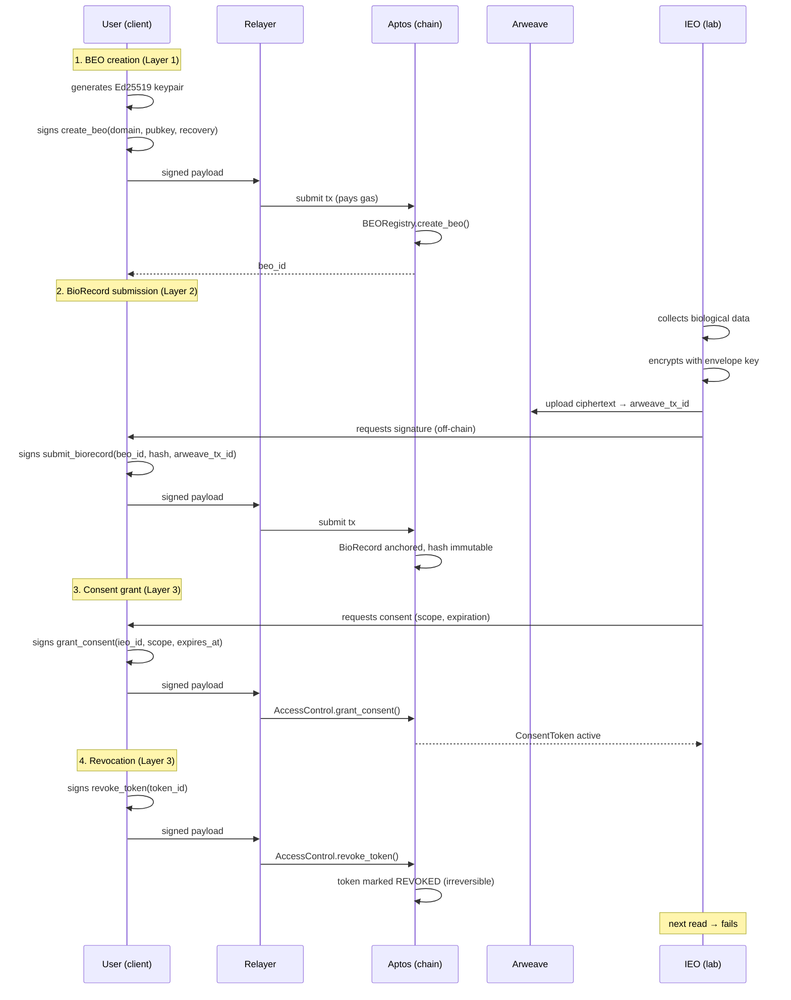

# Biological Sovereignty Protocol

## A Sovereignty Protocol for the Algorithmic Age

**Whitepaper v3.0**

Andre Ambrosio
Ambrosio Institute
May 2026

---

**Document hash (SHA-256):** *to be computed over the final consolidated artifact*
**DOI:** *registration pending with Zenodo / OpenAIRE*
**Author ORCID:** *issuance pending*
**Canonical version:** `https://biologicalsovereigntyprotocol.com/whitepaper` (English — default)
**Portuguese version:** `https://biologicalsovereigntyprotocol.com/pt/whitepaper`
**Source repository:** `github.com/Biological-Sovereignty-Protocol/bsp-spec`

---

## Abstract

Biological data is the last territory not yet colonized by the contemporary regime of personal sovereignty. While we discuss personal data rights, intellectual property, and behavioral privacy at length, the most intimate substrate — exams, sequences, physiological and phenotypic metrics — remains captured by a chain of intermediaries: hospitals, laboratories, insurers, wearable platforms, and medical AI providers. Each intermediary extracts value without proportional return to the individual who is, simultaneously, the source of the data, the subject of the data, and the largest potential beneficiary of its use.

This whitepaper presents the **Biological Sovereignty Protocol (BSP)**: a permissionless protocol that separates identity, data, and permission into three layers with isolated commitment boundaries. The identity layer (BEO — Biological Entity Owner) anchors sovereignty through Ed25519 and BLAKE3 cryptography on Aptos. The data layer extends verifiable permanence via Arweave with client-side AES-GCM encryption. The exchange layer instrumentalizes granular consent through revocable ConsentTokens, delegable AuthorityTokens, and cryptographic erasure as a compromise mechanism between on-chain immutability and the right to erasure guaranteed by the Brazilian General Data Protection Law (LGPD), GDPR, and PIPL.

The core innovations are three. **First:** *cryptographic erasure* — instead of attempting to delete immutable records, the protocol renders the data mathematically unrecoverable through irreversible destruction of envelope keys. **Second:** *multi-relayer ecosystem* — any entity may operate a relayer; the Ambrosio Institute operates only one of them, with no systemic privilege. **Third:** *stewardship model* — the Institute accepts an irrevocable fiduciary bond as mere administrator, instrumentalized via 2-of-3 multisig with 72-hour timelock, a six-phase BIP process, and a right to fork preserved by design.

The whitepaper addresses five audiences: researchers in health, longevity, and bioethics; clinical and laboratory institutions that need an interoperable layer; regulators seeking compatibility with data protection regimes; developers building the next generation of health applications; and individuals who recognize their own bodies as the last territory to be reclaimed.

The protocol is in active implementation. The BSP taxonomy (26 domains), the Move contracts, the TypeScript and Python SDKs, and the reference relayer operated by Ambrosio Company are in limited production. Scientific validation of AVA (Autonomous Virtual Anamnesis) — the proprietary algorithmic layer built on top of the protocol — follows a peer-reviewed schedule across four stages: retrospective validation, prospective validation, multi-cohort validation, and regulatory validation. This document describes the current state, honestly declares the remaining uncertainties, and invites public critique.

---

## Executive Summary

*For the reader with ten minutes.*

### The problem

There is an ontological mismatch between what biological data is and the legal-technological regime that treats it. Biological data is not an aggregable behavioral trace; it is **constitution** — the material inscription of what a body is, was, and tends to become. Treating it as informational commodity, as the contemporary regime does, is equivalent to treating land ownership with the same legal instrumentality as the lending of a tool. The category is wrong.

The practical consequence is a systemic informational asymmetry. Hospitals and laboratories hold proprietary copies of data they did not generate. Wearable platforms monetize physiological patterns without sharing value. Insurers price risk based on inferences about bodies whose owners have no access to the model. Medical AI is trained on databases in which the data subject is, at best, anonymous — and, at worst, traceable. The individual, both source and subject, occupies the position of least informational power in the chain.

### The solution

The **Biological Sovereignty Protocol** is a technical response to this problem. It is not a platform. It is not a product. It is not a token. It is an open three-layer specification:

1. **Identity (BEO).** Each individual holds a self-sovereign biological identity, anchored in an Ed25519 key pair generated client-side, registered on-chain (Aptos), with 2-of-3 guardian recovery and support for human-readable domains.

2. **Data (BioRecord).** Each biological record is encrypted client-side with AES-GCM, persisted on Arweave via a relayer, and anchored on-chain by a BLAKE3 hash. The BSP taxonomy organizes 26 domains — laboratory, genomic, phenotypic, physiological, environmental — into an interoperable structure.

3. **Exchange.** Any sharing occurs via ConsentToken — scope, intent, term, revocability. Delegations occur via AuthorityToken. Revocation is technically irreversible: cryptographic erasure destroys the envelope key, rendering the data mathematically unrecoverable even if the ciphertext remains in permanent storage.

### The six theses of the whitepaper

- **Part I — Philosophy.** Biological data is ontologically distinct. It is constitution, not trace. It demands technical sovereignty through inversion of informational asymmetry, not reformist privacy.

- **Part II — Protocol.** BSP separates identity, data, and permission into three layers with isolated commitment boundaries, anchoring integrity via Ed25519 and BLAKE3 on-chain (Aptos) and permanence via Arweave, with irreversible revocation and cryptographic erasure as the compromise between immutability and LGPD.

- **Part III — Economics.** Hybrid model with no token: institutional endowment capitalized by Ambrosio Company as perpetual base, complemented by premium subscription on the official relayer, contributions from the commercial arms (Health, AVA, SVA), and philanthropic grants. The protocol is free for the BEO; the relayer is a competitive commodity.

- **Part IV — Institution.** The Ambrosio Institute accepts an irrevocable fiduciary bond as steward — not beneficiary — instrumentalized via 2-of-3 multisig with 72-hour timelock, a six-phase BIP process, a technical committee with staggered terms, and a preserved right to fork.

- **Part V — Intelligence.** Sovereignty does not require open-sourcing AVA. It requires a right to exit, verifiable reproducibility, peer-reviewed validation, and free competition among algorithms. AVA is proprietary today because it sustains the research that makes the protocol trustworthy; it ceases to need to be so the moment trust becomes systemic.

- **Part VI — Horizon.** Biological sovereignty is a right, not a privilege — and rights require invisible, non-extractive infrastructure, just as GPL did for software, HTTP did for information, and TCP/IP did for connectivity.

### Invitation

Readers of this document are invited to three kinds of action. **Build** — implement relayers, SDKs, integrations, applications. **Adopt** — for individuals, create your first BEO; for institutions, integrate as an Information Exchange Operator. **Critique** — find errors, propose improvements through the BIP process, fork if you disagree. The protocol is an open work, in evolution, and the only wrong form of engagement is silence.

---

## Visual Executive Summary

### Three-layer architecture

```
  ┌──────────────────────────────────────────────────────────┐
  │                  EXCHANGE LAYER                           │
  │   ConsentToken · AuthorityToken · Revocation · Erasure   │
  └──────────────────────────────────────────────────────────┘
                              ▲
                              │
  ┌──────────────────────────────────────────────────────────┐
  │                    DATA LAYER                             │
  │     BioRecord · AES-GCM · Arweave · Hash · 26 domains    │
  └──────────────────────────────────────────────────────────┘
                              ▲
                              │
  ┌──────────────────────────────────────────────────────────┐
  │                  IDENTITY LAYER                           │
  │     BEO · Ed25519 · Aptos · Domain Registry · Recovery   │
  └──────────────────────────────────────────────────────────┘
```

### The five auditable promises

| # | Promise | Technical mechanism | Verifiable by |
|---|---------|---------------------|---------------|
| 1 | **Sovereignty by default** | Keys generated client-side; no server can produce a BEO without the holder's signature | Code inspection + on-chain transaction analysis |
| 2 | **Consent by signature** | Every exchange requires a signed ConsentToken; the signature is computational + intentional burden on the BEO | Public audit trail on the Exchange layer |
| 3 | **Permanence with erasability** | Ciphertext on Arweave (permanence); envelope key is deletable (erasure) | Public cryptographic erasure ceremony |
| 4 | **Permissionless creation** | Any individual creates a BEO without approval; any entity operates a relayer | Open repository + absence of gatekeeping |
| 5 | **Steward, not beneficiary** | Ambrosio Institute under 2-of-3 multisig with timelock; right to fork preserved | Public multisig + auditable BIP process |

---

## Table of Contents

### PART I — PHILOSOPHICAL FOUNDATIONS

- Chapter 1 — The Question of Sovereignty
- Chapter 2 — Biopower and the Algorithm
- Chapter 3 — The Civilizational Stakes
- Chapter 4 — First Principles

### PART II — THE PROTOCOL

- Chapter 1 — Architectural Vision
- Chapter 2 — Identity Layer (BEO)
- Chapter 3 — Data Layer (BioRecord)
- Chapter 4 — Exchange Layer
- Subsequent chapters — Cryptographic Erasure, Relayers, Multi-chain, Threat Models

### PART III — ECONOMICS (PROTOCOL SUSTAINABILITY)

- Chapter 1 — The Open Relayer Economy
- Chapter 2 — Sustainability of the Ambrosio Institute
- Chapter 3 — Institutional Incentives
- Chapter 4 — Long-Term Cost Analysis (10 years)
- Chapter 5 — Externalities and Public Goods

### PART IV — THE INSTITUTION (GOVERNANCE AND STEWARDSHIP)

- Chapter 1 — The Steward Doctrine
- Chapter 2 — BIP-0001: 2-of-3 Multisig with Timelock
- Chapter 3 — The BIP Process (Biological Improvement Proposal)
- Chapter 4 — The Scientific Technical Committee
- Chapter 5 — Succession, Continuity, and Conflicts

### PART V — INTELLIGENCE (AVA & SVA)

- Chapter 1 — The Thesis of the Proprietary Layer
- Chapter 2 — AVA Methodology
- Chapter 3 — Methodological Validation
- Chapter 4 — Public API and Reproducibility
- Chapter 5 — Sovereignty in the Algorithmic Age

### PART VI — THE HORIZON

- Chapter 1 — 5-Year Roadmap
- Chapter 2 — Three-Front Adoption Strategy
- Chapter 3 — Failure Modes and Mitigation
- Chapter 4 — The 10–50 Year Vision
- Chapter 5 — Call to Action

### CONCLUSION

### APPENDICES

- Appendix A — Complete BSP Taxonomy (26 domains)
- Appendix B — LGPD / GDPR / HIPAA Compliance
- Appendix C — Complete Glossary
- Appendix D — General Bibliography
- Appendix E — Implementation References

---

## About the Author

**Andre Ambrosio** is the founder of Ambrosio Company and architect of the Biological Sovereignty Protocol. He works at the intersection of longevity engineering, decentralized systems, and critical infrastructure for human health. He resides in Brazil. Alongside the BSP, he leads programs in functional supplementation, physiological monitoring hardware, and verifiably transparent medical AI systems.

The stated motivation for the BSP is simultaneously practical and civilizational: to ensure that the next generation — beginning with his own children — inherits biological data under sovereignty, not under capture. The institutional intent is long-term, multi-generational, and instrumentalized through an irrevocable fiduciary bond between the author and the protocol.

**Public contact:** via GitHub: github.com/Biological-Sovereignty-Protocol
**Reference BEO identity:** `bsp://andre.ambrosio` (to be published on the main network)

---

## How to Cite This Document

```
Ambrosio, A. (2026). Biological Sovereignty Protocol:
A Sovereignty Protocol for the Algorithmic Age.
Whitepaper v3.0. Ambrosio Institute.
https://biologicalsovereigntyprotocol.com/whitepaper
```

**BibTeX:**

```bibtex
@techreport{ambrosio2026bsp,
  author      = {Ambrosio, Andre},
  title       = {Biological Sovereignty Protocol: A Sovereignty Protocol for the Algorithmic Age},
  institution = {Ambrosio Institute},
  type        = {Whitepaper},
  number      = {v3.0},
  year        = {2026},
  month       = {5},
  url         = {https://biologicalsovereigntyprotocol.com/whitepaper}
}
```

---

## License

- **Text of this whitepaper:** Creative Commons Attribution-ShareAlike 4.0 International (CC BY-SA 4.0). Reproduction, translation, adaptation, and distribution are permitted, provided they are attributed to the author and kept under the same license.
- **Technical specification and reference implementations:** open-source licenses listed in Appendix E (predominantly MIT and Apache 2.0).
- **Circulation model:** analogous to that of the 2008 Bitcoin whitepaper — open knowledge, with no reservation of intellectual property over the core ideas. Forks, translations, and public critiques are explicitly encouraged.

---

## Legal Notice

This document is a technical-scientific and political-philosophical work. **It does not constitute medical, legal, or financial advice.**

- The BSP is a technical mechanism. Local regulatory compliance — LGPD, GDPR, HIPAA, PIPL, and applicable sectoral legislation — is the responsibility of the relayer operator, the integrating institution, and the individual BEO holder, as applicable.
- AVA and SVA are tools for analysis and decision support. **They do not replace medical diagnosis, prescription, or clinical intervention.** Any health decision derived from the use of such systems must be conducted by a qualified professional.
- Cryptographic encryption and key custody entail risks. Loss of keys without a configured recovery mechanism can result in permanent loss of access to data. The protocol provides mechanisms (2-of-3 recovery, ephemeral keys, AuthorityTokens) — their adoption is the BEO's responsibility.
- Financial projections, adoption schedules, and long-term scenarios reflect stated assumptions. Actual results may diverge.

---

## Introduction

There are moments when structural problems crystallize into narrow windows of decision. This is one of them.

Four processes converge, on a global scale, toward the same crossroads. **First:** the frontier of human longevity has shifted, for the first time in history, from a religious or philosophical theme to an engineering problem. The science of senescence, the molecular biology of aging, and preventive medicine advance at a pace that makes plausible — though not guaranteed — a clinically significant extension of healthy life expectancy within this century. **Second:** medical artificial intelligence has moved past the demonstration stage and into the implementation stage. Predictive models over physiological and phenotypic data now inform real clinical decisions, and that trend only deepens. **Third:** Web3 infrastructure has, after more than a decade of iteration, reached the maturity necessary to sustain decentralized identity protocols and permanent storage at scale. **Fourth:** the crises of privacy and data capture — Cambridge Analytica, systemic leaks at hospitals, scandals at wearable platforms — have produced, in public opinion and among legislators, an unprecedented sensitivity to the fragility of the current regime.

The intersection of these four processes defines the window. Without longevity advances, biological data would be just another category. Without medical AI, it would be data without systemic inference. Without mature Web3, sovereignty over it would be rhetoric without substrate. Without the privacy crisis, public and regulatory pressure would be missing. The four together make **now** a moment of decision.

The decision is simple and binary: biological data will be treated either as **private commodity** — captured, monetized, and resold by the next wave of platforms — or as **infrastructural right** — protected by verifiable code, governed by an auditable institution, and operated on a permissionless network. There is no relevant third path. Reformist regulatory attempts on top of the current regime merely administer the capture; they do not invert it. Inversion requires new infrastructure.

This whitepaper is the pragmatic attempt to instrumentalize the second choice.

### What to expect

The document is deliberately hybrid in tone. **Philosophical** in Part I, because a protocol without conceptual foundation is just software, and software lacking foundation surrenders to the first institutional or commercial wind that blows against it. **Technical** in Part II, because philosophical promises without verifiable mechanism are propaganda. **Economic** in Part III, because infrastructure that does not sustain itself dies, and silence about sustainability is the most common form of failure for decentralized protocols. **Institutional** in Part IV, because governance matters more than technology in the long run, and any project that promises "code is law" without instrumentalizing the containment of human power is repeating known mistakes. **Algorithmic** in Part V, because the age is algorithmic, and any sovereignty that stops at the data layer ignores the stage where effective capture happens. **Prospective** in Part VI, because adoption without an honest schedule is faith, not strategy.

### How to read

Sequential reading is the full form, but not the only legitimate one. Researchers in political philosophy and bioethics will find the substantive argument in Parts I and IV. Engineers and security auditors will find the concrete specification in Parts II and V and in Appendices A, C, and E. Regulators and compliance officers will find the legal analysis in Appendix B and in Part IV. Institutional operators — hospitals, laboratories, clinics, wearable manufacturers — will find the adoption thesis in Parts III and VI. Individuals seeking to understand why this matters to them will find the brief answer in the Executive Summary and the long answer in Part I.

### Invitation to critique

This whitepaper is not a finished work. It is a snapshot of v3.0 of an evolving protocol, written by an author who acknowledges the limits of his own judgment and the impossibility of foreseeing, alone, all the structural failures of a system of this ambition. Errors exist here. Gaps exist here. Assumptions that will age poorly exist here.

The institutional response to the recognition of this fallibility is not silence about the failures — it is process. The BIP process described in Part IV is the formal channel for critique. The right to fork described throughout the document is the informal channel. The bibliography in Appendix D is the foundation upon which any responsible critique must be built. And the author, as a declared steward and not as a beneficiary, is a stakeholder in receiving critique — not in silencing it.

Discussion forum: github.com/Biological-Sovereignty-Protocol/bsp-spec/discussions

Happy reading.

— *Andre Ambrosio*
*May 2026*
# Part I — Philosophical Foundations

> *"The body is the last territory over which there is still no peace agreement."*

---

## Chapter 1 — The Question of Sovereignty

### 1.1 A datum unlike the others

Every serious discussion of data begins with a confusion of categories. We treat as equivalent things that are profoundly unequal: a store's purchase history, a phone's location, a message conversation, a genome sequence. All of it is "data." All of it travels through the same cables, is stored on the same servers, governed by the same privacy policies drafted by lawyers no one reads. This indistinction is the source of nearly every error in what is discussed as digital sovereignty in the twenty-first century.

Biological data is not just one more category in this list. It is ontologically distinct. A purchase history is a trace — a record of what we did. Biological data is *constitution* — a record of what we are. The difference is not semantic; it is metaphysical. A person's genome was not *generated* by them through using a platform. It precedes them. They are the manifestation of it. When someone transfers a genome to a company, they are not ceding a product of their work or attention: they are ceding the mathematical formula of their own body, along with that of their parents, their children, and their unborn descendants.

Twentieth-century medicine and law never confronted this distinction in depth. They operated on a useful fiction: that clinical data belongs to the institution that generates it. The hospital performs the exam, "therefore" the exam belongs to the hospital, with obligations of professional secrecy and the patient's right of access as a regulatory concession. The logic is the same as that of the medieval scribe who held the deeds because he knew how to write. The problem of *storage* was solved; the problem of *ownership* never was.

The question this whitepaper confronts is simple and radical: **to whom does the biological data of a human being belong?** Not in the legal sense of current legislation — Brazil's LGPD, Europe's GDPR, and the United States' HIPAA all offer partial versions, and all confuse *right of access* with *ownership*. The question is prior. It is philosophical. Before we regulate, we need to understand what we are regulating.

### 1.2 Locke and the body as primary property

John Locke, in the *Second Treatise of Government* (1689), offers the indispensable starting point. For Locke, prior to any external property — land, tools, fruits of labor — there exists an originary property from which all others derive: the property each man has in his own person.

> "Though the Earth, and all inferior Creatures be common to all Men, yet every Man has a *Property* in his own *Person*. This no Body has any Right to but himself. The *Labour* of his Body, and the *Work* of his Hands, we may say, are properly his."[^1]

The passage is more subtle than it appears. Locke does not merely say that the body is property. He says that the body is *primary* property — the one that makes any other possible. When I mix my labor with the land, I transform common land into my property, but only because the labor was *already* mine, and the labor was mine because the body that produced it was mine. The entire liberal theory of property depends, at its root, on an axiom about the body.

If, then, the body is primary property, what is biological data if not the *digital representation* of that property? A person's genomic sequence is not a copy of their image or a trace of their behavior — it is the technical specification of the body itself. To treat it as the property of an institution is exactly the kind of inversion Locke fought: it is like saying the land belongs to the scribe who recorded the deed.

### 1.3 Nozick and the axiom of self-ownership

Robert Nozick, in *Anarchy, State, and Utopia* (1974), radicalizes Locke. For Nozick, self-ownership is not merely the basis of material property; it is the fundamental moral axiom from which all rights derive. Individuals, he writes, "have rights, and there are things no person or group may do to them (without violating their rights)."[^2]

Nozick draws a distinction that matters for us: between *ownership* and *use*. I can own something without using it, and I can use something without owning it. Ownership is the bundle of rights over a thing — the right to exclude, the right to transfer, the right to modify, the right to destroy. Use is just one of those rights. Contemporary medicine operates in a strange regime in which institutions hold near-unrestricted use rights over individuals' biological data, while the individuals themselves barely exercise any of the rights of full ownership. It is a phantom property, of which only the name remains.

The common objection to Nozick is that his notion of self-ownership leads to accepting morally distasteful things — sale of organs, contracts of servitude. I need not resolve that polemic here. It is enough to observe that the self-ownership argument *does not require* permission to sell; it requires only the recognition of title. I can own my body and still hold that certain alienations are morally barred — exactly as I own my vote and yet cannot sell it. Inalienability is a *mode* of property, not its negation.

This is the first principle of the BSP: biological data is inalienable-by-default. The individual is owner. They may release access. They may not, under any contractual circumstance, cede full property irrevocably. Every concession is, by construction, revocable. Ownership stays; use may circulate.

### 1.4 Property, control, legacy

Discussion of biological data is usually reduced to "privacy," and that is a mistake. Privacy is only one of three dimensions at stake. The other two are *control* and *legacy*, and none of the three reduces to the others.

**Property** is the metaphysical question: to whom does this belong? Without a clear answer, all other questions are ill-formed. If the data belongs to the institution, speaking of "patient consent" is courtesy, not right.

**Control** is the political question: who decides what is done with this, *now*? Even if we accept that the data belongs to the individual, control may be elsewhere. Banks hold others' money and control it for long periods under strict rules. Hospitals hold others' data and control it under loose rules. The difference is regulatory, not ontological.

**Legacy** is the temporal question: what happens to this when I die? This dimension is almost always ignored in debates about privacy, and it may be the most important. Biological data is not only yours — it contains information about your parents, siblings, and descendants. Your mortality does not end the value of the data. On the contrary: the value of a person's genomic and physiological time series only fully manifests *decades* later, when it becomes possible to compare trajectories, calibrate biological clocks, and train predictive models.

Who decides what happens to your data when you are no longer here? Today, in nearly every existing system, *no one decides* — the data sits frozen on a hospital server until it is dumped into a backup that no one consults again, or it is integrated into a corporate database whose policies you never read. Legacy is erased by omission. The BSP proposes that biological legacy, like patrimonial legacy, be an explicit decision of the holder, programmatically executable.

### 1.5 Paternalistic medicine and its limit

Twentieth-century medicine was built on an informational asymmetry: the doctor knows, the patient does not. This asymmetry justified a paternalism that, in its mild version, was care, and in its harsh version, was expropriation. Its legal consecration is the concept of the "medical record," a document that describes the patient but belongs to the institution.

Eric Topol, in *The Patient Will See You Now* (2015), narrates this inflection with clinical clarity.[^3] Topol — cardiologist, researcher, and one of the first to articulate what he called the "democratization of medicine" — shows that technology has already rendered obsolete the asymmetry that justified paternalism. The patient who measures her own ECG on a smartwatch, sequences her own genome by mail, and consults her own exam result before the doctor *already is* the holder of the information. The institutional structure has simply not caught up.

> "The future of medicine is the patient. Not as a passive recipient of care, but as an active subject of knowledge about their own body. Data-based medicine is, by its very nature, a medicine that returns to the patient what was always theirs — and what the prior technology forced to be provisionally delegated."[^3]

Topol's point is important: the informational asymmetry has been technically resolved. What remains is a *legal* and *infrastructural* asymmetry — there is no place, no way, no protocol where the individual deposits their own data under their own control. The BSP is a response to this vacuum.

---

## Chapter 2 — Biopower and the Algorithm

### 2.1 Foucault and the statistical management of life

Michel Foucault, in his lecture course *The Birth of Biopolitics* (1978–1979) at the Collège de France, and earlier in *Discipline and Punish* (1975), traces a genealogy that is indispensable for understanding what is at stake here. For Foucault, modern power is not principally the sovereign power to "make die and let live" — it is, on the contrary, the power to "make live and let die." It is a power exercised over life, over collective bodies, through their measurement, classification, and statistical management.[^4]

This *biopower* does not operate by direct prohibition. It operates by statistics and norms. It is not the king who decides who dies; it is the actuarial table that decides which bodies are healthy, which are deviant, which deserve investment, which are disposable. Biopower, in Foucault's formulation, is "the power that has taken hold of life as its explicit object."[^5]

There is an observation by Foucault worth recalling literally:

> "For the first time in history, no doubt, biological existence was reflected in political existence; the fact of living was no longer an inaccessible substrate that only emerged from time to time, amid the randomness of death and its fatality; part of it passed into knowledge's field of control and power's sphere of intervention."[^6]

The passage is from 1976, before any massive electronic spreadsheets, before the genome was sequenced, before deep learning. Foucault was describing a state power that classified populations by mortality, fertility, and morbidity rates. The contemporary version of this power is incomparably more granular. It no longer classifies populations; it classifies *individuals*, in real time, and adjusts interventions per person. The spreadsheet became a predictive model. The population became a vector of embeddings.

The point is that twenty-first-century biopower is no longer primarily statist. It is *platformized*. Whoever holds biological data holds the capacity to classify, predict, and intervene — and that capacity sits today, almost entirely, in half a dozen private companies and in fragmented hospital systems. Foucault described the birth of biopower; we live its algorithmic maturation.

### 2.2 Byung-Chul Han and consensual surveillance

If Foucault described biopower as something exercised *upon* the subject, Byung-Chul Han, in *Psychopolitics* (2014), describes its contemporary mutation: a power that operates *through* the subject itself, with their active and enthusiastic participation. The subject of psychopolitics, Han writes, "exploits itself voluntarily believing it is realizing itself."[^7]

Han makes a distinction worth pausing on: classical surveillance was *visible and external*. There was an eye that watched, and the subject knew it, or could discover it. Contemporary surveillance is *invisible and internalized*. The subject generates the data, pays for the device that collects it, displays it publicly, and even thanks the platform for the "service" received in return. There is no panopticon, because there is no need for a tower — the watched is also the watcher.

> "Neoliberal psychopolitics is the technique of domination that stabilizes the dominant system by means of psychological programming and control. (...) The smartphone is the central device of neoliberal psychopolitics. It turns exploitation into entertainment."[^8]

Apply this to biological data. The person who places their DNA in a commercial ancestry test is, in Han's taxonomy, performing a perfect act of psychopolitics. They pay for the test. They cede broad rights via terms of use. They receive in return an identity narrative ("you are 23% Iberian, 7% North African") that satisfies a genuine curiosity. And in the process they hand to the corporate system the most constitutive datum of their being — along with inferences about all their biological relatives, who never consented. They leave the transaction feeling *empowered*. It is the precise psychopolitical triumph.

There is a frequent error among those who critique this scenario: imagining the solution is "less collection," "less platform," "regression to analog." This nostalgia is sterile. Collection is good — to know about one's own body is to know about oneself. The problem is not the quantity of data; it is the *direction* of the asymmetry. Who holds the model trained on your body? Who decides what it answers and to whom? Who profits when the inference about you is sold to a third party?

### 2.3 Harari and the algorithm that knows you better

Yuval Harari, in *Homo Deus* (2016), articulates perhaps the sharpest version of what is at stake. His thesis there is that liberal humanism — founded on the belief that the individual is the ultimate source of meaning and authority over themselves — collapses when algorithms come to know the individual *better than they know themselves*.[^9]

> "Once Big Data knows us better than we know ourselves, authority will shift from humans to algorithms. (...) If human authority comes from subjective experience, and the algorithm has more faithful access to my experience than I do myself, why would I be the authority over me?"[^10]

The question is sharp and deserves to be taken seriously. Harari is not writing science fiction. He is describing a migration of authority already underway: when the app recommends exercises better suited to your physiological pattern than what you "feel like" doing; when the model predicts your mood tomorrow based on physiological variables you do not perceive; when your doctor, in consultation, opens software that knows your biological trajectory in more detail than your memory does.

The response many give to Harari is defensive: try to contain artificial intelligence, keep the human as authority by decree. This response is weak because it fights the clock. Intelligence about the body *will* exceed self-perception. The question is not whether this will happen, but *who* will have that intelligence.

### 2.4 The inversion of asymmetry

Here, in my view, is the point where the three authors converge on a problem none of them has entirely solved: biopower exists; consensual surveillance is its contemporary form; the transfer of authority from human to algorithm is an unfolding fact.

The next phase, then, cannot be "less surveillance" — that nostalgia does not scale and does not address the real problem. The next phase is the **inversion of asymmetry**: the individual comes to hold the algorithm about themselves, instead of the platform holding the algorithm about the individual.

The difference is technical and civilizational. Technically, it requires that personal biological data be stored such that the holder controls the keys; that models derived from this data be trained under cryptographically verifiable consent; that the holder may run inferences over their own body without having to ask permission from a platform. Civilizationally, it is the difference between a future where knowledge about the human body is privatized within half a dozen companies, and a future where it is an auditable common good with individual sovereignty.

This is the philosophical wager of the BSP. It is not "anti-technology." It is anti-asymmetry. It is not "less data." It is *my* data.

### 2.5 Zuboff and surveillance capitalism

Shoshana Zuboff, in *The Age of Surveillance Capitalism* (2019), offers a detailed cartography of how the current asymmetry was built institutionally. Her thesis is that surveillance capitalism is not an accidental extension of industrial capitalism, but a distinct economic regime, founded on the expropriation of what she calls "human experience as free raw material for hidden commercial practices."[^11]

> "Surveillance capitalism unilaterally claims human experience as free raw material for translation into behavioral data. Although some of these data are applied to product or service improvement, the rest are declared as proprietary *behavioral surplus*, fed into advanced manufacturing processes known as 'machine intelligence,' and fabricated into prediction products."[^12]

Zuboff writes about behavioral data — clicks, location, voice, usage pattern. Biological surveillance capitalism is a deeper stage of the same regime: the expropriation not of experience, but of the material constitution of the subject. It is the extractive gesture applied to the last territory.

The strength of Zuboff's analysis is in showing that this was not oversight — it was *project*. The legal structures, the terms of use, the market practices were designed to make the expropriation invisible and legally unassailable. Reversing this requires rebuilding the infrastructure, not merely reforming regulation.

---

## Chapter 3 — The Civilizational Stakes

### 3.1 The longevity threshold

We are at the threshold of a radical extension of healthy life. It is no longer conjecture. David Sinclair, in *Lifespan* (2019), articulates with clarity what had been built since the 1990s: aging is not an immutable biological fatality; it is a process regulated by identifiable, manipulable mechanisms — and, in animal models, already reversible in several respects.[^13]

Sinclair's information theory of aging holds that we age not from degradation of the *hardware* (DNA), but from progressive degradation of the epigenetic *software* — the markers that tell each cell what role to play. Recovering those markers recovers cellular function. In the laboratory, this has already been done in the retinas of blind mice.[^14]

Steve Horvath's work on epigenetic clocks formalized the idea of "biological age" as a quantitative measure, distinct from chronological age.[^15] In 2013, Horvath published the first epigenetic clock capable of predicting biological age within a few years from DNA methylation patterns. Successive clocks since — GrimAge, PhenoAge, DunedinPACE — have refined this measure, making it possible to observe, in living humans, interventions that accelerate or decelerate biological age.[^16]

Recent literature — papers in *Nature*, *Cell*, *Science Translational Medicine* between 2023 and 2025 — has shown interventions that produce measurable reductions in biological age in humans: combinations of exercise, caloric restriction, drugs such as rapamycin and metformin, Yamanaka factors in specific therapeutic contexts. We are not talking about immortality; we are talking about a potential extension of 10–30 years of healthy life, plausible within the horizon of the living generation.

This perspective has a political consequence often ignored: **longevity requires data sovereignty.** Why? Because a longevity intervention is, by nature, a multi-decade trajectory. To know whether an intervention worked in *your* body, someone needs access to your complete, longitudinal, fine-grained biological trajectory across decades. If that trajectory is fragmented across hospitals, platforms, and insurers, with each piece inaccessible behind institutional barriers, longevity medicine becomes impossible for you. It becomes the privilege of those who can pay for an integrated private system — and, more seriously, becomes *blind* to the rest.

The choice here is binary. Either each individual comes to hold a sovereign and continuous repository of their own biological data, integrable and auditable by whomever they authorize, or longevity will be dammed up in disconnected private archipelagos.

### 3.2 Medical AI and the question of training

AlphaFold predicted the three-dimensional structure of more than 200 million proteins, covering practically the entire known proteome.[^17] Med-PaLM 2, from Google, achieved specialist-level performance on medical exams.[^18] GPT-4 and its successors demonstrate diagnostic reasoning ability that rivals experienced clinicians on textual cases. This is the cognitive infrastructure that will dominate the medicine of the next two decades.

Here arises the question that defines the regime: **on what data were, are, and will these models be trained?**

The current answer is: on the data that could be aggregated — generally in *biobanks* (UK Biobank, All of Us in the U.S., BBRC in Brazil), in specific hospital partnerships, in synthetic datasets. The individuals whose data composes these banks rarely know their data is being used for training. The benefits of these models return to users as paid products, offered by the same companies that trained the models.

There is a closing extraction cycle: people generate biological data; hospital systems capture it; biobanks aggregate it; companies use it to train models; people pay to use these models as medical services. None of this is necessarily ill-intentioned. It is simply the same regime Zuboff described, applied to the most intimate layer.

The question is not whether medical AI should exist — it should, and its value is immense. The question is: **under what regime of property will the data that train it be captured?** The BSP proposes an architecture in which the data holder explicitly decides whether to contribute to training, in exchange for what, with what traceability. *ConsentTokens* signed cryptographically make that decision technically and legally verifiable.

### 3.3 The scarcity of health as material injustice

The unequal distribution of health is, possibly, the greatest material injustice of the twenty-first century. It is not the unequal distribution of income *per se*; it is what income *buys* in a human life. A 15–20 year difference in life expectancy between neighborhoods 5 km apart. Access to early diagnosis that completely changes the prognosis of treatable cancers. Capacity to pay for the first generation of gene therapies (Casgevy, Zolgensma) that cost hundreds of thousands to millions of dollars per dose.

Every new health technology is born unequal. That is practically a law. But the way the inequality is resolved varies enormously. The mobile phone was the most rapidly democratized technology in history — within 30 years, it went from elite object to subsistence infrastructure across 80% of the planet. Insulin, by contrast, continues to be rationed by price in several countries, 100 years after its discovery.

What distinguishes the two cases? In part, the property structure of the underlying layer. The cell phone democratized because the infrastructure — network protocols, open standards, competitive manufacturing — became *commodity*. Insulin did not democratize at the same speed because intellectual property and the production infrastructure remained concentrated.

Biological data is the underlying layer of twenty-first-century medicine. If that layer remains concentrated — if each person is hostage to the platform, hospital, or insurer that holds their repository — precision medicine will be for the few, for generations. If the layer becomes open protocol — like TCP/IP, like Bitcoin, like HTTP — innovation happens *above* it, and competition pushes costs down. The architectural choice at the data layer decides, decades in advance, the shape of future inequality.

### 3.4 Biological inheritance as legacy

There is an old cultural intuition: we leave something to our children. Goods, land, teaching, name. Legacy is one of the oldest forms by which humans confront finitude. Yet on the biological plane, the legacy of twentieth-century human beings was almost always *forgetting*. The physiological time series of billions of people were captured by hospital systems that discard them after 5, 10, 20 years. Knowledge that could accumulate across generations was, by construction, erased.

Think of a family across four generations. Today, each of the four generations is an isolated biological archipelago. The great-grandmother died in 1998 with her medical records on paper cards, in a now-discontinued hospital archive. The grandmother has partial records across three different health-plan systems. The mother has some exams in PDF in her email. The daughter has wearable data on three distinct platforms, none communicating with the others. When the daughter wants to understand, 30 years from now, her health trajectory in the context of family history, she will not be able to. The data will already have been erased, fragmented, lost in platform transitions.

The loss is silent because it is by omission. But it is a deep loss, in the civilizational sense. A family that could accumulate, across centuries, longitudinal series of biological data — with explicit consent, with intergenerational governance, with selective access for research — would have, about itself, a qualitatively different knowledge. That accumulation is one of the deepest applications of biological sovereignty.

The BSP treats legacy as a first-class citizen. It is not an optional *feature*. It is a principle: biological data survives the holder, according to rules programmed by the holder, with designated heirs, grace periods, and release conditions. It is inheritance in the full sense.

### 3.5 The historical choice

Summarizing the chapter: we are at a moment of bifurcation. On one path, intelligence about the human body remains concentrated in half a dozen companies, with the individual in the position of data source and consumer of derived services, with no technical sovereignty over either side of the equation. On the other path, that intelligence becomes an auditable common good, with open infrastructure, and each individual holds sovereignty over their own biological data as the base layer.

The first path is the natural course if nothing is done. It has institutional inertia, capital, and proven business models. The second path requires the deliberate construction of infrastructure, standards, and protocols. It is generational work — not product work.

The wager of the BSP is the second path. And the wager is not moral, in the sense of "it should be this way because it is more just." The wager is also *epistemological*: intelligence about the human body advances faster, and more correctly, when the data base is decentralized, auditable, with individual governance. Concentration is fragile. Diversity resists, recombines, evolves.

---

## Chapter 4 — First Principles

### 4.1 What makes a datum truly *yours*?

The question admits an operational answer. A datum is yours if, and only if, four properties hold simultaneously:

**1. Ownership.** You decide who possesses a copy of the datum. This is more than privacy — it is power over duplication. If I authorize a laboratory to keep a copy for an exam, that laboratory has an *authorized* copy. If I did not authorize it, no one may have a copy, even if technically they could. Ownership requires the possibility of auditing who has copies, and of removing unauthorized copies.

**2. Control.** You revoke access at any time, without needing permission. This is the difference between ownership and usufruct. The current system offers, at best, a "right to request deletion" — a form of formal request subject to institutional approval. Full control does not request; it *executes*. Technically, that means envelope encryption with keys only the holder holds, such that revocation is the refusal to cooperate with new requests, and the encrypted datum becomes useless mathematics.

**3. Legacy.** The datum survives you, and follows your instructions. It is not stuck on a server that will be discontinued in 10 years, nor erased on your death by default, nor automatically released into the public domain. You designate heirs, conditions, periods. The system executes programmatically.

**4. Inalienability.** The datum cannot be bought, sold, or mortgaged against your will, even if you wanted it. This is the most counterintuitive property, and perhaps the most important. You may release access for value, in exchange for service. You may not cede full property irrevocably, because such a cession would be informational slavery. Inalienability is what distinguishes a fundamental right from a commodity.

These four criteria together define data sovereignty. Lacking any one of them, ownership becomes rhetorical figure. The BSP is the attempt to implement all four simultaneously, in code, in protocol, in a permissionless system.

### 4.2 The five derived principles

From the definition above, five operational principles follow, which the BSP enforces in its architecture:

#### Principle 1 — *Sovereignty by default*

Biological data belongs to the individual until they explicitly, by a cryptographically verifiable act, release access to a third party. There is no "gray default" where the institution that collects has presumed rights. The default is complete sovereignty of the holder. Every concession is a conscious, dated, scope-limited, revocable act.

The difference from the current system is radical. Today, when undergoing an exam, the patient signs a consent form that typically grants broad rights to the institution — use for "research," "quality," "teaching," often with the possibility of sharing with unspecified partners. The default is openness. The BSP inverts the default. Inverting the default is, alone, perhaps the single highest-consequence intervention.

#### Principle 2 — *Consent by signature*

Every transfer of access to data is executed by a cryptographic signature of the holder, recorded auditable and unforgeable. *ConsentTokens* signed with the holder's Ed25519 key, issued against a specific *BEO* (Biological Entity Object), with explicit scope, term, counterparty, and purpose. A third party that receives data without the corresponding token is in cryptographically provable violation, not merely contractual violation.

This transforms "informed consent" — a vague legal figure, frequently abused — into a verifiable technical act. Consent ceases to be declaration and becomes *proof*.

#### Principle 3 — *Permanence with erasability*

Biological data is stored in permanent infrastructure — Arweave, specifically, for its property of perpetual storage funded by a cryptoeconomic endowment. Permanence matters because the value of a longitudinal biological trajectory grows over time, and any infrastructure subject to discontinuation is, on a horizon of decades, broken by construction.

But permanence without the possibility of "forgetting" would be dystopia. The BSP resolves this tension by a cryptographic operation: stored data is always *encrypted*. The key remains under the holder's control. To "delete" a datum, in the protocol, means to destroy or rotate the key, rendering the datum mathematically inaccessible, even if the cryptographic blob remains on Arweave forever. Forgetting without needing institutional cooperation.

This architecture responds to one of the sharpest tensions with legislation such as GDPR — the "right to be forgotten." The usual implementation is to physically delete the datum, which is fragile in distributed systems. The cryptographic form is robust: destruction of the key is a unilateral, instantaneous, irreversible act.

#### Principle 4 — *Permissionless creation*

No one asks permission to exist biologically. By the same principle, no one should ask permission to have a BEO. Any person, any biological entity, may create their sovereign identity in the protocol, without approval from a central authority, without institutional KYC, without corporate precondition.

This is a direct continuation of the Bitcoin architecture, articulated by Nakamoto in 2008.[^19] The fundamental point of Nakamoto's whitepaper was not the currency — it was the possibility of financial transaction *without permission*, on a peer-to-peer network where trust emerges from cryptographic proofs, not from institutional approval. The BSP applies the same principle to the layer of biological identity: sovereign identity without permission, anchored in cryptographic proof, not institutional registration.

W3C DIDs (Decentralized Identifiers) and Verifiable Credentials offer compatible standards, and the BSP aligns with them for interoperability.[^20] But the central innovation is not the standard; it is the *direction* of sovereignty. The DID resolves "decentralized identity"; the BEO resolves "decentralized biological identity," which is a more delicate problem because it involves constitutive, not merely relational, data.

#### Principle 5 — *Steward, not beneficiary*

The Ambrosio Institute, as the entity that maintains the protocol's initial infrastructure, is *steward* — maintainer, guardian, guarantor of integrity. It is not beneficiary. It does not extract value proportional to the protocol's growth. It does not control governance extractively.

This is a deliberate and non-trivial choice. Most decentralized protocols are founded by organizations that retain a fraction of the value generated — via tokens, fees, or privileged contracts with infrastructure. The BSP chooses another architecture: the protocol itself is a common good, and the Institute operates non-profit maintenance infrastructure, funded by donations, grants, or *optional* value-added services built *above* the protocol, on competitive terms with any other provider.

The argument for this choice is both moral and strategic. Morally, biological data must not be an extractive layer for anyone — including its founders. Strategically, a protocol whose founder retains extractive value is vulnerable: it creates incentives for hostile fork, governance capture, and resentment from those who use it. A protocol whose founder is a neutral steward scales differently — it attracts institutions, regulators, and individuals who would never accept depending on an extractive entity.

Steward, not beneficiary, is the founding gesture.

### 4.3 Honest tensions

Honesty requires acknowledging that these principles do not resolve everything. There are real tensions that survive the architecture, and that need to be made explicit rather than swept under the rug.

**Tension 1 — Privacy vs. public utility.** In an epidemic, individual sovereignty over health data collides with the public interest in epidemiological tracing. There is no general formula that resolves this tension. The BSP offers the possibility of granular and revocable consent, and the possibility of contribution with data in aggregated/differentially-private form. But there are scenarios in which the holder *does not consent* and public health *requires*. These scenarios demand political deliberation — they cannot be resolved by the protocol alone. The architecture preserves the possibility of exceptional democratic regulation; what it prevents is routine expropriation under the pretext of "public interest."

**Tension 2 — Individual sovereignty and shared family data.** Your genome contains information about your parents, your siblings, your children. When you grant access to your genome, you are granting, in part, access to theirs, without their consent. This is a genuine tension, with no clean solution. The BSP mitigates but does not eliminate: it offers selective consent (sharing non-identifying regions of kinship, or abstractions that do not allow re-identification), but recognizes that biological data has an intrinsically relational nature. This tension demands cultural education and family norms, not just protocol.

**Tension 3 — Risk of adversarial use by the holder themselves.** "Your data" can be used against you in unexpected circumstances: insurers that ask for "voluntary" access, employers that offer conditional benefits, governments that create perverse incentives. Technical sovereignty does not prevent external economic or political coercion. The BSP preserves technical control; societies need to build, in parallel, norms and laws that prohibit coercion over the exercise of that control. The protocol is necessary, not sufficient.

**Tension 4 — Unequal technical knowledge.** Data sovereignty presupposes that the holder minimally understands what they are consenting to. Most people do not. UX solutions, *delegated guardianship* (the holder delegates part of the management to a trusted agent, with audit), and progressive education are part of the problem, not accessories. The BSP, in its current state, is *infrastructure* — it does not by itself solve the literacy problem. But it makes possible constructions above it that address that gap.

**Tension 5 — Permanence and regret.** A holder may, at some moment in life, want to definitively erase a datum that, years later, they would like to recover. The cryptographic architecture of "delete = destroy key" is robust, but irreversible. This is a conscious choice — we prefer the possibility of real forgetting to the possibility of late recovery. But it is a choice, and deserves to be named as such.

These tensions do not invalidate the project. They situate it. A protocol that claims to resolve everything does not deserve trust; a protocol that recognizes the problems it does not resolve, and addresses them partially, is a serious starting point.

### 4.4 What is at stake

We return to the beginning. The central question of this document is not technical. It is civilizational. The twentieth century was the century in which we learned to measure the human body with increasing precision. The twenty-first century will be the century in which that measurement will be *acted upon* — the data that describe the body will be used to predict, intervene, optimize. The question is only: by whom, under what regime, for whose benefit?

There is, today, a default answer emerging, and it is not good. It is the platformization answer: half a dozen companies holding the cognitive infrastructure over the human body, offering services that return to data holders as merchandise, with residual sovereignty reduced to terms of use and privacy regulations that barely scratch the underlying logic.

The alternative is neither nostalgic nor reactionary. It is constructive. To build the protocol where the holder holds. To build the standards where consent is proof. To build the infrastructure where legacy is programmable. To build the ecosystem where no central entity — including the Ambrosio Institute itself — has extractive power over the base layer.

This is Part I. The following parts of this whitepaper detail how — architecture, cryptography, governance, economics. But the how derives from the *why*. Without philosophical foundation, any technical architecture eventually falls to the extractive temptation. With philosophical foundation, technical choices anchor themselves, and the protocol resists the pressure to retreat.

The human body is the last territory. The BSP is a proposal for how, on that territory, to write the peace treaty.

---

## Notes

[^1]: John Locke, *Two Treatises of Government*, Book II, Chapter V, §27 (1689). Cited from the Cambridge University Press edition, ed. Peter Laslett, 1988.

[^2]: Robert Nozick, *Anarchy, State, and Utopia*, Basic Books, 1974, p. ix (preface).

[^3]: Eric Topol, *The Patient Will See You Now: The Future of Medicine Is in Your Hands*, Basic Books, 2015. The passage is reformulated from the argument of chapters 2–3 and expresses the spirit of Topol's thesis; interpretive translation by the author.

[^4]: Michel Foucault, *The History of Sexuality, Vol. 1: The Will to Knowledge* (originally *Histoire de la sexualité, Vol. 1: La volonté de savoir*, Gallimard, 1976), final chapter ("Right of Death and Power over Life").

[^5]: Michel Foucault, *"Society Must Be Defended"*, Lectures at the Collège de France 1975–1976 (originally *"Il faut défendre la société"*, Gallimard/Seuil, 1997), lecture of March 17, 1976.

[^6]: Foucault, *The Will to Knowledge*, op. cit., p. 187 of the Gallimard edition.

[^7]: Byung-Chul Han, *Psychopolitik: Neoliberalismus und die neuen Machttechniken*, S. Fischer Verlag, 2014. English translation: *Psychopolitics: Neoliberalism and New Technologies of Power*, Verso, 2017.

[^8]: Han, *Psychopolitics*, op. cit., chapter "Big Data."

[^9]: Yuval Noah Harari, *Homo Deus: A Brief History of Tomorrow*, Harvill Secker, 2016.

[^10]: Harari, *Homo Deus*, op. cit., Part III, chapter "The Data Religion." Interpretive rendering by the author.
# Part II — The Protocol

> Rigorous technical specification of the Biological Sovereignty Protocol (BSP). This document is normative. An engineer should be able to implement BSP on another blockchain (Solana, Ethereum, Sui) reading only these pages, the taxonomy appendix, and the intent catalog. When this document and reference code conflict, **this document prevails** until a BIP modifies the specification.

**Conventions.** The words MUST, MUST NOT, SHOULD, OPTIONAL follow RFC 2119. Backtick-quoted strings (`like_this`) are literal protocol identifiers. Move pseudocode uses Aptos Move 1.0 syntax; Rust-like uses Rust 2021 syntax with no external dependencies beyond `ed25519-dalek`, `aes-gcm`, `hkdf`, `sha2`, and `blake3`.

---

## Chapter 1 — Architectural Overview

### 1.1 The three layers

BSP is a three-layer protocol. Each layer has a single responsibility and a well-defined trust boundary. The separation is not aesthetic: it exists so that **one layer can be compromised without cascading** to the others.

```
┌──────────────────────────────────────────────────────────────────┐
│                    LAYER 3 — EXCHANGE                            │
│   ConsentToken · AuthorityToken · Intent Catalog                 │
│   (defines who can talk to whom, under which rules)              │
├──────────────────────────────────────────────────────────────────┤
│                    LAYER 2 — DATA                                │
│   BioRecord · Encryption · Arweave anchor · Hash on-chain        │
│   (stores biological evidence permanently and auditably)         │
├──────────────────────────────────────────────────────────────────┤
│                    LAYER 1 — IDENTITY                            │
│   BEO · IEO · DomainRegistry · Recovery                          │
│   (defines who is who, without central KYC)                      │
└──────────────────────────────────────────────────────────────────┘
                              │
                              ▼
              ┌─────────────────────────────────┐
              │    BASE — Aptos + Arweave       │
              │  (consensus + persistence)      │
              └─────────────────────────────────┘
```

**Layer 1 — Identity** answers: *who is the data subject?* Answer: an Ed25519 keypair bound to a human-readable domain (`alice.bsp`). No biological data flows here. Compromising Identity does not equal compromising Data.

**Layer 2 — Data** answers: *what is the biological evidence and how do I prove it has not been tampered with?* Answer: encrypted payload on Arweave plus hash on Aptos. Reading Layer 2 data without Layer 3 permission returns no plaintext — only opaque ciphertext.

**Layer 3 — Exchange** answers: *can this actor access this data, now, for this purpose?* Answer: on-chain tokens with scope, expiration, and immediate revocation.

### 1.2 Roles

The protocol defines five roles. They are not mutually exclusive (an IEO may also operate a Relayer) but have formal boundaries.

| Role | Description | Trust required by the protocol |
|------|-------------|--------------------------------|
| **User** | Natural person, custodian of an Ed25519 private key. Data subject. | Trustless from the protocol's standpoint. |
| **BEO** (Biological Entity Object) | On-chain representation of the User. Move resource that holds the public key and recovery configuration. | It is an object, not an actor. Trust = trust in the User's key. |
| **IEO** (Institute/Integrator Entity Object) | Partner institution (Ambrosio Institute, hospital, lab, health app). May submit BioRecords and request consents. | Trustless by default. Reputation accrues off-chain. |
| **Relayer** | Submits transactions on-chain on behalf of the User (pays gas in $APT). May refuse; **may not forge**. | Trust-minimized. Multiple relayers compete. |
| **Validator** | Aptos blockchain validator. Orders transactions and produces consensus. | Trust inherited from Aptos (BFT, decentralized set). |

The fundamental property: **Relayer and IEO are adversarial by construction**. The protocol assumes both may be malicious and designs mitigations around that. See Chapter 5.

### 1.3 Typical end-to-end flow

The canonical operation that exercises all three layers:



Points of attention:

1. **The User's private key never leaves the device**. Every operation that mutates on-chain state begins with a local signature.
2. **The Relayer only transports**. If it tries to alter a field, the signature breaks and the Move module rejects. If it censors, the User switches Relayer (they are fungible).
3. **Consent is asynchronous**. The IEO requests; the User decides when (or whether) to respond. There is no on-chain coercion protocol.
4. **Revocation is instant**. There is no grace period, no "consent still valid for 5 minutes." The next read after `revoke_token` returns `EREVOKED`.

### 1.3.1 Detailed anatomy of a BioRecord submission

The `submit_biorecord` operation exercises the social contracts among User, IEO, Relayer, and chain. Decomposing it step by step exposes where each bit of trust is exchanged. Nine stages:

1. **Physical collection.** The IEO (lab) collects a sample or receives a stream from a wearable. Biological plaintext exists locally at the IEO during this phase.
2. **Normalization.** The IEO validates against the schema of the corresponding BSP category (see Appendix A). The canonical plaintext is serialized in Canonical JSON (RFC 8785) for deterministic hashing.
3. **Plaintext hash.** The IEO computes `hash = BLAKE3-256(canonical_plaintext)`. The hash is a content address: each distinct plaintext produces a distinct hash with practical probability 1.
4. **Consent request to the User.** The IEO calls the User's API/SDK requesting a signature over the payload `{beo_id, ieo_id, category, hash, nonce, timestamp}`. The User sees a readable summary in the UI (category, requesting IEO, truncated hash), and approves or denies.
5. **User signature.** The User's client produces `user_sig = Ed25519-Sign(privkey_user, canonical_payload)`. The privkey never leaves the device.
6. **Pre-anchoring (`prepare_biorecord`).** The IEO submits the payload + signature to the Relayer. The Relayer wraps it in an Aptos tx. Aptos verifies the signature, reserves a `record_id`, and keeps state `PENDING_UPLOAD`.
7. **Envelope key generation and encryption.** The IEO derives `envelope_key` (HKDF; see §3.3), encrypts the plaintext with AES-256-GCM, and obtains `ciphertext + auth_tag + nonce_aes`.
8. **Arweave upload.** The IEO uploads the bundle `{ciphertext, auth_tag, nonce_aes, encryption_version}` to Arweave via a bundler (Irys/Bundlr or directly). Receives `arweave_tx_id` (43 chars, base64url).
9. **Finalization (`finalize_biorecord`).** Within a 1h window (configurable via governance), the IEO calls `finalize_biorecord(record_id, arweave_tx_id, ieo_signature)`. Aptos validates that `record_id` is still in `PENDING_UPLOAD`, marks it as `FINALIZED`, and emits a `BioRecordFinalized` event.

Why split pre-anchoring and finalization? Cryptographic reason: the hash must be frozen on-chain before the ciphertext appears publicly on Arweave. Otherwise, a malicious IEO could upload content, observe the hash on-chain, and try to swap the Arweave content for another with a different hash — breaking traceability. With pre-anchoring, any auditor can later reconstruct: "at block N, hash X was announced; at block M, arweave_tx_id Y was bound to X; the ciphertext at Y, when decrypted, must hash to X." Any break in this chain is trivially detectable.

### 1.3.2 Trust flow analysis

For each step, we identify which actor holds or has an opportunity to compromise sensitive information:

| Step | Plaintext available at | Trust required |
|------|------------------------|----------------|
| 1. Collection | IEO | Honest IEO during collection; see A4 |
| 2. Normalization | IEO | IEO follows schema; SDK validates |
| 3. Hash | IEO | Hash function is deterministic — no trust |
| 4. Consent | User sees summary | Honest UX from the client — no network |
| 5. Signature | User local | User's device not compromised |
| 6. Pre-anchoring | (metadata only) | Aptos validators (BFT) |
| 7. Encryption | IEO | IEO derived correct key — verifiable |
| 8. Upload | (ciphertext only) | Arweave miners (economic model) |
| 9. Finalization | (metadata only) | Aptos validators |

Biological plaintext is present only in steps 1, 2, 3, and 7 — all inside the IEO. No other actor in the protocol sees it. This property is what allows BSP to be called "sovereign": the User never depends on a third party to *store* plaintext, only to *process* it within explicitly authorized windows.

### 1.4 Why layer separation is fundamental

The medical-privacy literature is full of systems that conflate identity, data, and permission into a single component — usually a centralized database. HL7 FHIR mixes everything. HealthKit mixes everything. A single authorization bug leaks real identity, clinical history, and permissions in one request.

BSP separates because it assumes failure. **Each layer is a contained failure.**

- Compromise Layer 3 (attacker can forge tokens): the attacker can read public hashes and Arweave references, but the ciphertext remains opaque. Without an envelope key, it is noise.
- Compromise Layer 2 (attacker accesses all of Arweave): the payload is AES-256-GCM with a unique key per record. Without key material, cryptanalysis is impractical.
- Compromise Layer 1 (attacker steals one User's key): they control *that* User. They do not control others. 2-of-3 recovery mitigates. Other Users are unaffected.

This is the opposite of a monolithic database. It is the opposite of "single source of truth." It is **single source of verifiability** with isolated compromise domains.

---

## Chapter 2 — Identity Layer (BEO)

### 2.1 Formal structure

A BEO is an on-chain Move resource. Its canonical representation:

```move
struct BEO has key, store {
    beo_id: address,                 // = address derived from public_key
    domain: String,                  // e.g., "alice.bsp"
    public_key: vector<u8>,          // 32 bytes Ed25519
    status: u8,                      // PENDING=0, ACTIVE=1, LOCKED=2, DESTROYED=3
    recovery_config: RecoveryConfig, // 2-of-3 guardians
    created_at: u64,                 // microseconds since epoch (Aptos timestamp)
    updated_at: u64,
    nonce: u64,                      // monotonic, anti-replay
}

struct RecoveryConfig has store {
    guardians: vector<address>,      // 3 Ed25519 addresses
    threshold: u8,                   // always 2 in v1
    locked_until: u64,               // 0 if not in recovery
    pending_proposal: Option<RecoveryProposal>,
}

struct RecoveryProposal has store {
    new_public_key: vector<u8>,
    proposed_at: u64,
    timelock_until: u64,             // proposed_at + 72h
    signatures: vector<GuardianSig>,
}
```

`beo_id` is deterministic: `beo_id = sha3_256(public_key)[0..32]`. This means `beo_id` is **not chosen**, it is derived. Two Users cannot collide without colliding Ed25519, which violates the DLP assumption.

### 2.2 Lifecycle states

```
   create_beo()
        │
        ▼
   ┌─────────┐    confirm_beo()    ┌────────┐
   │ PENDING │─────────────────────▶│ ACTIVE │
   └─────────┘                      └────┬───┘
                                         │
                          ┌──────────────┼──────────────┐
                          │              │              │
                  trigger_recovery   destroy_beo   normal ops
                          │              │              │
                          ▼              ▼              │
                     ┌────────┐    ┌──────────┐        │
                     │ LOCKED │    │DESTROYED │◀───────┘
                     └────┬───┘    └──────────┘
                          │
                  recovery_complete()
                          │
                          ▼
                     ┌────────┐
                     │ ACTIVE │ (with new pubkey)
                     └────────┘
```

**PENDING.** Intermediate state between `create_beo` and `confirm_beo`. It exists because, at first write, the User may not yet have backed up credentials. `confirm_beo` requires a second signature on a random challenge issued by the chain, proving the key was persisted in a real environment.

**ACTIVE.** Normal state. Accepts `submit_biorecord`, `grant_consent`, `revoke_token`, `update_domain`, `propose_recovery`, `destroy_beo`.

**LOCKED.** Recovery in progress. **Blocks writes authorized by the current key** during the 72h timelock. Also blocks `destroy_beo` (prevents an attacker who stole the key from burning the BEO before recovery completes).

**DESTROYED.** Cryptographic erasure. The Move resource is rendered inaccessible (the `status` field becomes `3` and methods abort with `EDESTROYED`). BioRecords remain on Arweave, but:
1. The envelope keys are deleted locally by the User before calling `destroy_beo`.
2. Without a key, ciphertext is indistinguishable from random.
3. No entity in the protocol can decrypt the payload.

This is the compromise between "Arweave permanence" and "right to be forgotten under the Brazilian General Data Protection Law (LGPD)." The physical data remains with the miners, but it is information-theoretically useless.

### 2.3 Keypair generation (client-side)

Key generation **MUST** happen on the User's device, **NEVER** on a server (including the Ambrosio Institute). Reference pseudocode:

```rust
use ed25519_dalek::{SigningKey, VerifyingKey};
use rand::rngs::OsRng;

fn generate_user_keypair() -> (SigningKey, VerifyingKey) {
    let mut csprng = OsRng;          // /dev/urandom on Linux/Mac, BCryptGenRandom on Windows
    let signing = SigningKey::generate(&mut csprng);
    let verifying = signing.verifying_key();
    (signing, verifying)
}

fn derive_beo_id(pubkey: &VerifyingKey) -> [u8; 32] {
    let mut hasher = Sha3_256::new();
    hasher.update(pubkey.as_bytes());
    hasher.finalize().into()
}
```

**Immediate backup.** Before submitting `create_beo`, the client MUST:
1. Encode the private key in BIP39 (24 words) or a similar deterministic mnemonic.
2. Present the recovery phrase to the User with non-skippable instructions.
3. Obtain explicit confirmation (re-typing 4 random words) that the User saved it.
4. Only then proceed with `create_beo`.

Implementations that skip these steps **are NOT compliant** with BSP.

### 2.4 Domain registry

Domains are human-readable strings bound to `beo_id`. Syntax:

```
domain := label "." "bsp"
label  := [a-z0-9]([a-z0-9-]{0,61}[a-z0-9])?
```

**ASCII-only restriction** (security PR v1.1). Unicode was disabled after homograph analysis: `аlice.bsp` (with Cyrillic 'а') and `alice.bsp` (Latin) are visually identical but distinct. Mitigation: lowercase Latin-1 + digits + hyphen. No IDN.

**Squat prevention.** The current version uses an FCFS (first-come-first-served) queue. Honest limitations:
- There is no protection against speculative registration. An attacker can register `pfizer.bsp` in bulk.
- Future mitigation (BIP-0007, under discussion): 90-day claim window for trademarked names via off-chain ownership proof (DNS TXT record or trademark filing).
- v1 accepts this as a known risk. Brands should register early.

**Renewal.** v1 domains are *forever* once registered. v2 (BIP-0009) introduces an annual fee in $APT that:
- Goes to a protocol endowment (not the Institute)
- Creates economic anti-squat pressure
- Allows recovery of abandoned domains

### 2.5 Recovery: 2-of-3 guardians

The model is simple and auditable:

1. The User configures 3 guardian addresses during `create_beo` (these can be other BEOs, hardware wallets, or custody services).
2. In case of key loss, any party (including one of the guardians) calls `propose_recovery(beo_id, new_pubkey)`.
3. The BEO enters `LOCKED`. A **72-hour** timelock begins.
4. During those 72h, 2 of the 3 guardians must sign the proposal (`approve_recovery`).
5. At the end of the timelock, with 2 valid signatures, anyone calls `complete_recovery`. The public key is replaced. The state returns to `ACTIVE`.

Why a timelock?

- An attacker who compromised the current key and tries to accelerate destruction: cannot, because recovery overrides `destroy_beo` during LOCKED.
- An attacker who compromised **one** guardian + the current key: still needs another guardian. In 72h, the legitimate User receives alerts (off-chain, via channels they registered) and can contest.
- Contestation: the legitimate User (or another guardian) calls `cancel_recovery` during LOCKED. The state returns to ACTIVE. The proposal dies.

The model is not perfect — an attacker who compromises the key + 2 guardians + survives 72h wins. But it is strong enough to make opportunistic attacks unfeasible.

### 2.5.1 Formal recovery protocol (full sequence)

```
Initial state: BEO in ACTIVE, current key = pk_old
Event: pk_old compromised or lost

Step 1 — Initiation
  Any party (legitimate User via backup device, or guardian)
  calls propose_recovery(beo_id, pk_new, init_signature)

  On-chain validation:
    - beo_id exists and is ACTIVE
    - init_signature is from pk_new (proof of possession of the new key)
    - locked_until == 0 (no recovery in progress)

  Effect:
    - status = LOCKED
    - locked_until = now + 72h
    - pending_proposal = { pk_new, signatures: [], proposed_at: now }
    - emit RecoveryProposed event

Step 2 — Guardian approval (during 72h)
  Each guardian calls approve_recovery(beo_id, guardian_signature)

  On-chain validation:
    - status == LOCKED
    - guardian_signature is from address ∈ recovery_config.guardians
    - same guardian cannot sign twice
    - now < locked_until

  Effect:
    - signatures.push(guardian_sig)
    - emit RecoveryApproved event

Step 3a — Cancellation (defense against malicious recovery)
  During LOCKED, legitimate User (with pk_old) or any guardian may call
  cancel_recovery(beo_id, signature)

  Validation:
    - signature is from pk_old OR from address ∈ guardians

  Effect:
    - status = ACTIVE (returns to normal state)
    - pending_proposal = none
    - emit RecoveryCanceled event

Step 3b — Completion (normal path)
  After now >= locked_until AND length(signatures) >= 2
  Any party calls complete_recovery(beo_id)

  Validation:
    - status == LOCKED
    - now >= locked_until
    - length(signatures) >= threshold (2)

  Effect:
    - public_key = pk_new
    - status = ACTIVE
    - pending_proposal = none
    - locked_until = 0
    - nonce reset (anti-replay against old key)
    - emit RecoveryCompleted event
```

**Property analysis.**

*Liveness.* If 2 of the 3 guardians respond within 72h and the legitimate User does not cancel, recovery completes. If no guardian responds within 72h, the proposal expires and the BEO returns to ACTIVE with pk_old. An attacker who compromised pk_old can try again, but in this case the legitimate User has already been alerted.

*Safety.* The attacker must **simultaneously** compromise pk_old (to prevent cancel) and 2 guardians (to accumulate signatures). Lamport's model: if each key has independent compromise probability p, the joint probability is p × C(3,2) × p² = 3p³. For p=0.01, the joint probability ≈ 0.000003 — three orders of magnitude below isolated compromise.

*Timelock.* 72h was chosen as a compromise between:
- Enough time for the legitimate User to detect and contest (alerts via email, SMS, push notifications configured by the SDK).
- Short enough not to block the legitimate User in a real medical emergency.
- Industry standard (Compound, MakerDAO use 24-72h timelocks for critical decisions).

Governance can adjust this via BIP, but a change applies only to future recoveries — those in progress are preserved.

### 2.5.2 Recommended guardian types

The protocol does not impose categories, but the SDK provides presets to reduce misconfiguration:

| Type | Example | Advantage | Risk |
|------|---------|-----------|------|
| Family | Spouse, sibling | High trust, available | Physical coercion |
| Hardware wallet | Ledger kept at home | High technical security | Physical loss |
| Custodial service | Casa Wallet, Coinbase Custody | High availability | Institutional trust |
| Secondary BEO | The User themselves with an alternate key | Full self-sovereignty | Self-correlation |
| Legal professional | Lawyer with escrow | Legal hook | Cost, slowness |

**Best practice:** mix types. E.g., 1 family member + 1 hardware wallet + 1 custodial service. Avoids single-point-of-failure within a category.

### 2.6 Move pseudocode: `create_beo`

```move
module bsp::beo_registry {
    use std::vector;
    use std::signer;
    use std::string::String;
    use aptos_framework::timestamp;
    use aptos_std::ed25519;

    const EALREADY_EXISTS: u64 = 1;
    const EINVALID_SIG: u64 = 2;
    const EINVALID_DOMAIN: u64 = 3;
    const EINVALID_RECOVERY: u64 = 4;

    public entry fun create_beo(
        relayer: &signer,                   // pays gas
        domain: String,
        public_key: vector<u8>,             // 32 bytes Ed25519
        guardian_addrs: vector<address>,    // exactly 3
        signature: vector<u8>,              // User signature over payload
    ) {
        // 1. Structural validations
        assert!(vector::length(&public_key) == 32, EINVALID_SIG);
        assert!(vector::length(&guardian_addrs) == 3, EINVALID_RECOVERY);
        assert!(is_valid_domain(&domain), EINVALID_DOMAIN);

        // 2. Verify domain uniqueness
        assert!(!domain_registry::exists(&domain), EALREADY_EXISTS);

        // 3. Reconstruct payload and verify signature
        let payload = build_create_payload(&domain, &public_key, &guardian_addrs);
        assert!(
            ed25519::verify(payload, &public_key, &signature),
            EINVALID_SIG
        );

        // 4. Derive beo_id
        let beo_id = derive_beo_id(&public_key);

        // 5. Create resource
        let now = timestamp::now_microseconds();
        let beo = BEO {
            beo_id,
            domain: copy domain,
            public_key,
            status: STATUS_PENDING,
            recovery_config: RecoveryConfig {
                guardians: guardian_addrs,
                threshold: 2,
                locked_until: 0,
                pending_proposal: option::none(),
            },
            created_at: now,
            updated_at: now,
            nonce: 0,
        };
        move_to(beo_account, beo);

        // 6. Domain anchor
        domain_registry::register(domain, beo_id);

        // 7. Event
        event::emit(BEOCreated { beo_id, domain, timestamp: now });
    }
}
```

Notes:

- `relayer` is the Aptos `signer` that pays gas. **It is not** the BEO subject.
- The Ed25519 signature is verified *against the submitted public_key*, ensuring whoever submitted it controls the corresponding private key.
- A failure on any assert aborts the transaction. Aptos is ACID — there is no partial state.

---

## Chapter 3 — Data Layer (BioRecord)

### 3.1 Structure

```move
struct BioRecord has key, store {
    record_id: address,             // sha3_256(beo_id || nonce || hash)
    beo_id: address,                // data owner
    ieo_id: address,                // submitter (lab, app, hospital)
    biomarker_category: String,     // "BSP-LA", "BSP-GL", etc. (taxonomy)
    hash: vector<u8>,               // BLAKE3-256 of plaintext
    arweave_tx_id: String,          // 43 chars base64url
    encryption_version: u8,         // 1 = server-side, 2 = client-side (CSE)
    timestamp: u64,
    submitter_signature: vector<u8>, // IEO signs: proof of origin
    user_signature: vector<u8>,      // User signs: proof of consent
}
```

Two important points:

1. **Two signatures.** The IEO proves it was the source (non-repudiation). The User proves they authorized the registration (consent material). Missing either → tx aborts with `EMISSING_SIG`.
2. **Hash on-chain before upload.** The plaintext hash is fixed on-chain BEFORE the ciphertext lands on Arweave. This closes the window where the IEO could upload a payload and then swap (timing attack). The sequence is strict.

### 3.2 BSP taxonomy (summary)

The full taxonomy is in `Appendix A — Biomarker Categories`. Here, the structure only:

| Prefix | Domain | Examples |
|--------|--------|----------|
| `BSP-LA` | Lab (blood, urine) | glucose, HbA1c, lipid panel |
| `BSP-GL` | Continuous glucose | CGM streams, AUC |
| `BSP-EP` | Epigenetic | DNA methylation, Horvath biological age |
| `BSP-MB` | Microbiome | 16S rRNA, shotgun metagenomic |
| `BSP-IM` | Immunology | cytokines, cell counts |
| `BSP-WB` | Wearable / behavioral | HRV, sleep, activity |
| `BSP-IM-IMG` | Imaging | DEXA, MRI, US |
| `BSP-FN` | Functional | VO2max, grip strength |
| ... | ... | ... |

There are 25 categories in v1. Each category has a JSON schema validated off-chain by the SDK; the on-chain protocol stores only the category string and the hash. Semantic validation is the consumer's responsibility.

### 3.3 Encryption flow

#### Current model (v1.0 — server-side, transitional)

The envelope key is derived deterministically from an Institute master key:

```
envelope_key = HKDF-SHA256(
  ikm   = master_key_institute,
  salt  = beo_id,
  info  = "biorecord-envelope-v1",
  length = 32
)

ciphertext = AES-256-GCM-Encrypt(
  key   = envelope_key,
  nonce = HMAC-SHA256(master_key_institute, beo_id || record_id)[0..12],
  pt    = plaintext_biological_data
)

hash = BLAKE3-256(plaintext_biological_data)
```

**Full honesty**: this model means the Ambrosio Institute, holding `master_key_institute`, can decrypt any BioRecord. This is **unacceptable** for a sovereignty protocol, and that is why it is transitional.

The structural defense while v1.0 is the dominant model:

- `master_key_institute` is managed by **Vault** (HashiCorp) with full access auditing.
- Every decryption is logged in an append-only structure outside the Institute (external escrow).
- A 2-of-3 multisig is required for any rotation or export of the master key.
- A public roadmap (BIP-0003) commits to CSE migration on an auditable timeline.

#### Target model (v2.0 — Client-Side Encryption)

```
envelope_key = HKDF-SHA256(
  ikm   = user_private_key_material,  // never touches server
  salt  = beo_id,
  info  = "biorecord-envelope-v2",
  length = 32
)
```

Here `user_private_key_material` is derived from the User's BIP39 mnemonic via a deterministic path (`m/44'/9999'/0'/0/0` proposed). The Institute has no way to derive it — it has never seen the material.

Consequences:

- For an IEO to read a BioRecord, the User must **decrypt locally and re-encrypt** with a key shared with the IEO (mechanism: ECDH X25519 between User and IEO, deriving a session key).
- Cost: additional latency (~200-500ms per record on typical mobile hardware).
- Benefit: the protocol becomes, in fact, sovereign. The Institute cannot read.

#### Migration path

The `encryption_version` field on the BioRecord enables coexistence. The SDK reads the byte and routes to the correct decryptor. Migrating old records requires:

1. The User executes `migrate_biorecord(record_id)`.
2. The SDK downloads the v1 ciphertext and decrypts with the envelope key obtained via the Institute's API (still v1).
3. The SDK re-encrypts with a v2 key derived from the User themselves.
4. Uploads the new ciphertext to Arweave (gas + storage cost charged to the User).
5. Submits `update_biorecord_encryption(record_id, new_arweave_tx_id, new_hash, signature)`.
6. The hash does not change (identical plaintext). The ciphertext does. The version changes.

After migration, even the Institute loses access to that record's plaintext.

### 3.3.1 Pseudocode: v2 (CSE) end-to-end encryption

Reference implementation in Rust-like. This is the target version (BIP-0003); v1.0 follows the same structure but replaces `user_master_seed` with `master_key_institute`.

```rust
use blake3::Hasher;
use ed25519_dalek::SigningKey;
use hkdf::Hkdf;
use sha2::Sha256;
use aes_gcm::{Aes256Gcm, Key, Nonce, aead::Aead, KeyInit};
use rand::RngCore;

pub struct EncryptedBundle {
    pub ciphertext: Vec<u8>,
    pub nonce_aes: [u8; 12],
    pub auth_tag: [u8; 16],
    pub encryption_version: u8,
}

pub fn derive_envelope_key_v2(
    user_master_seed: &[u8; 32],   // derived from BIP39, never touches server
    beo_id: &[u8; 32],
    record_id: &[u8; 32],
) -> [u8; 32] {
    let info = [b"bsp/biorecord/envelope/v2/", record_id.as_slice()].concat();
    let hkdf = Hkdf::<Sha256>::new(Some(beo_id), user_master_seed);
    let mut okm = [0u8; 32];
    hkdf.expand(&info, &mut okm).expect("HKDF expand failed");
    okm
}

pub fn encrypt_biorecord_v2(
    plaintext: &[u8],
    user_master_seed: &[u8; 32],
    beo_id: &[u8; 32],
    record_id: &[u8; 32],
) -> EncryptedBundle {
    let key_bytes = derive_envelope_key_v2(user_master_seed, beo_id, record_id);
    let key = Key::<Aes256Gcm>::from_slice(&key_bytes);
    let cipher = Aes256Gcm::new(key);

    let mut nonce_bytes = [0u8; 12];
    rand::rngs::OsRng.fill_bytes(&mut nonce_bytes);
    let nonce = Nonce::from_slice(&nonce_bytes);

    let aad = build_aad(beo_id, record_id);
    let ciphertext_with_tag = cipher
        .encrypt(nonce, aes_gcm::aead::Payload { msg: plaintext, aad: &aad })
        .expect("encryption failure (catastrophic)");

    let (ct, tag) = split_tag(&ciphertext_with_tag);
    EncryptedBundle {
        ciphertext: ct,
        nonce_aes: nonce_bytes,
        auth_tag: tag,
        encryption_version: 2,
    }
}

pub fn decrypt_biorecord_v2(
    bundle: &EncryptedBundle,
    user_master_seed: &[u8; 32],
    beo_id: &[u8; 32],
    record_id: &[u8; 32],
) -> Result<Vec<u8>, DecryptError> {
    if bundle.encryption_version != 2 {
        return Err(DecryptError::UnsupportedVersion);
    }
    let key_bytes = derive_envelope_key_v2(user_master_seed, beo_id, record_id);
    let key = Key::<Aes256Gcm>::from_slice(&key_bytes);
    let cipher = Aes256Gcm::new(key);

    let nonce = Nonce::from_slice(&bundle.nonce_aes);
    let aad = build_aad(beo_id, record_id);
    let combined = [&bundle.ciphertext[..], &bundle.auth_tag[..]].concat();

    cipher
        .decrypt(nonce, aes_gcm::aead::Payload { msg: &combined, aad: &aad })
        .map_err(|_| DecryptError::AuthFailed)
}
```

**Critical spec points:**

1. **AAD (Additional Authenticated Data) includes `beo_id` and `record_id`.** Cryptographically binds the ciphertext to its place in the protocol. Moving ciphertext from one record_id to another breaks the GCM tag — explicit auth fail.
2. **The AES nonce is generated by CSPRNG**, not derived. AES-GCM collapses catastrophically under nonce reuse; a 96-bit random nonce gives collision probability ~2⁻⁴⁸ after 2³² messages, within the margin accepted by NIST SP 800-38D.
3. **The version is an explicit byte prefix.** Never trust "try v1 and fall back to v2 if it fails" — that is a downgrade-attack vector. The SDK reads the version byte before attempting any decryption.
4. **Authentication failure is fatal and silent.** Never leak the difference between "wrong key" and "corrupted ciphertext." The GCM standard treats both as `AuthFailed`.

### 3.3.2 User → IEO sharing (CSE)

In the v2 model, the IEO needs plaintext to serve legitimate requests (e.g., AVA computes biological age). Without a key, the IEO cannot. Solution: a just-in-time re-encryption protocol.

```
User local                            IEO (authorized via ConsentToken)

1. Decrypts with user_master_seed     —
   plaintext local                    —

2. Generates ephemeral X25519 keypair  Holds persistent X25519 keypair
   (eph_priv, eph_pub)                (ieo_pub, ieo_priv)

3. Requests ieo_pub via API           Returns ieo_pub signed by ieo_id
                                      (verifiable on-chain via IEORegistry)

4. shared_secret = X25519(eph_priv, ieo_pub)
5. session_key = HKDF(shared_secret, "bsp/session/v1", 32)
6. session_ct = AES-256-GCM(session_key, plaintext)
7. Sends (eph_pub, session_ct) → IEO

                                      8. shared_secret = X25519(ieo_priv, eph_pub)
                                      9. session_key = HKDF(shared_secret, "bsp/session/v1", 32)
                                      10. plaintext = AES-256-GCM-Decrypt(session_key, session_ct)
                                      11. Processes, discards plaintext after use
```

Properties:

- The IEO obtains plaintext only inside the authorized processing window.
- The IEO cannot persist key material to "read again later" because the session_key is ephemeral (eph_priv discarded).
- If the IEO copies plaintext to local storage without authorization: scope violation. Detectable via auditing, legally sanctionable.
- Re-encryption costs ~50ms on typical mobile hardware — negligible.

Honest limitation: the protocol cannot prevent the IEO from copying plaintext during processing. This is the A4 boundary explored in §5.1.

### 3.4 Why Arweave

Arweave was chosen over IPFS+Filecoin, S3, and chains with native storage (Solana, Sui) for three reasons:

1. **Endowment model.** A single upfront payment covers "forever" storage via an endowment fund that grows with falling storage costs. Conservative estimate: 200+ years of persistence. For longitudinal biological data (subject's lifetime + post-mortem studies), this is the right model.

2. **Permissionless and censorship-resistant.** There is no central node that can erase. Even the Ambrosio Institute, if it wanted to "forget" a record, could not (legitimately: that is why we have cryptographic erasure as the path).

3. **Gateway-agnostic.** Multiple HTTP gateways serve the same content (`arweave.net`, `ar-io.dev`, self-hosted gateways). The failure of one does not block reads.

**Honest risks:**

- The Arweave endowment model depends on continuing reductions in storage cost. If Moore's Law for storage fails, sustainability beyond 100+ years is questionable.
- Arweave's throughput is lower than that of optimized chains (~5MB/s aggregate network). For BSP at scale (millions of records/day), this can be a bottleneck. Mitigation: bundlers (Irys/Bundlr), and BIP-0011 anticipates multi-storage adapters.
- Propagation latency: ~10-30 minutes for strong probabilistic guarantees. Acceptable for healthcare; not acceptable for HFT (but BSP is not HFT).

### 3.5 Hash scheme

The on-chain hash is **BLAKE3-256** (preferred) or **SHA3-256** (compatibility with chains that lack native BLAKE3, such as pre-1.10 Aptos).

```rust
fn compute_record_hash(plaintext: &[u8]) -> [u8; 32] {
    let mut hasher = Blake3::new();
    hasher.update(plaintext);
    hasher.finalize().into()
}
```

The hash is of the **plaintext**, not the ciphertext. Reason: we want the User to be able to prove to the IEO (or to an auditor) that the decrypted data is what was originally registered. If we hashed the ciphertext, any change in envelope key would change the hash, breaking that proof.

Submission precondition: `hash` is computed and locked on-chain via `submit_biorecord` BEFORE the `arweave_tx_id` is known. Sequence:

1. The IEO computes the hash locally.
2. The IEO calls `prepare_biorecord(beo_id, hash)` — receives a reserved `record_id`.
3. The IEO uploads to Arweave, obtains `arweave_tx_id`.
4. The IEO calls `finalize_biorecord(record_id, arweave_tx_id, signatures)` within a 1h window.
5. After 1h without finalize, the `record_id` expires and is released.

This closes the window where an IEO could swap content between upload and anchoring.

---

## Chapter 4 — Exchange Layer

### 4.1 ConsentToken

```move
struct ConsentToken has key, store {
    token_id: address,
    beo_id: address,                  // grantor
    ieo_id: address,                  // grantee
    scope: ConsentScope,
    issued_at: u64,
    expires_at: u64,                  // 0 = no expiration (not recommended)
    status: u8,                       // ISSUED=0, ACTIVE=1, REVOKED=2, EXPIRED=3
    revoked_at: u64,                  // 0 if never revoked
}

struct ConsentScope has store, copy, drop {
    categories: vector<String>,       // ["BSP-LA", "BSP-GL"]
    intents: vector<String>,          // ["READ_RECORDS", "EXPORT_DATA"]
    max_records: u64,                 // 0 = unlimited within scope
    purpose: String,                  // free text, hashed in logs
}
```

**Principles.**

- Scope is the cartesian product `categories × intents`. If `categories=["BSP-LA"]` and `intents=["READ_RECORDS"]`, the IEO can read lab records and nothing else.
- `purpose` is descriptive (e.g., "longitudinal aging study 2026") — not enforced by the protocol, but hashed and logged on-chain for social/legal auditing.
- `expires_at = 0` is technically valid but the SDK emits a warning. Best practice: 30-365 days.

### 4.2 Intent catalog (summary)

The full list is in `Appendix B — Intent Catalog`. Here are the main ones:

| Intent | Description | Required categories |
|--------|-------------|---------------------|
| `SUBMIT_RECORD` | The IEO can submit new BioRecords in this category | one or more categories |
| `READ_RECORDS` | The IEO can list and download existing records | same |
| `EXPORT_DATA` | The IEO can obtain a structured export for use outside | same |
| `MANAGE_CONSENT` | The IEO can propose (not grant) new consents | any |
| `AGGREGATE_QUERY` | The IEO can run aggregate (privacy-preserving) queries | same |
| `DELEGATE` | The IEO can sub-delegate to another IEO (with restrictions) | same |
| `NOTIFY` | The IEO can issue alerts to the User | any |

Intents are **strings**, not binary enums. Reason: extensibility. New intents proposed via BIP enter the catalog without a hard fork. SDKs must reject unknown intents.

### 4.3 AuthorityToken

`AuthorityToken` is a superset of `ConsentToken` for persistent integrations (e.g., a health app with continuous sync).

Differences:

- May include `auto_renew = true` (automatic renewal until explicit revocation).
- Supports `delegation_depth: u8` (how many sub-delegation levels are allowed).
- Requires an additional User signature confirming they understood the persistent character (UX-enforced via the SDK).

The on-chain semantics are the same — verification via `verify_authority(token_id, intent, category)`.

### 4.4 Revocation

Revocation is **immediate and irreversible**. There is no grace period. Pseudocode:

```move
public entry fun revoke_token(
    relayer: &signer,
    token_id: address,
    user_signature: vector<u8>,
) acquires ConsentToken {
    let token = borrow_global_mut<ConsentToken>(token_id);

    // Only the owning BEO may revoke
    let payload = build_revoke_payload(token_id, token.nonce);
    let beo = beo_registry::get(token.beo_id);
    assert!(
        ed25519::verify(payload, &beo.public_key, &user_signature),
        EINVALID_SIG
    );

    // Terminal state
    assert!(token.status == STATUS_ACTIVE, EINVALID_STATE);
    token.status = STATUS_REVOKED;
    token.revoked_at = timestamp::now_microseconds();

    event::emit(ConsentRevoked {
        token_id,
        beo_id: token.beo_id,
        ieo_id: token.ieo_id,
        timestamp: token.revoked_at,
    });
}
```

**Implications for the IEO.** Every BioRecord read by the IEO MUST re-verify the token on-chain. A local consent cache is unsafe because it may be stale. Additional latency (~1-2s per read on Aptos) is accepted as the cost of sovereignty.

Optimization allowed by the protocol: **read leases**. The IEO obtains a `read_lease` for a short window (<5min) that bypasses on-chain re-verification. If the User revokes during the lease, the IEO still reads during the window. Explicit trade-off; the SDK requires opt-in with a warning.

### 4.5 State machine

```
                    grant_consent()
                         │
                         ▼
                   ┌──────────┐
                   │  ISSUED  │
                   └────┬─────┘
                        │ activate() (auto if no delay)
                        ▼
                   ┌──────────┐    revoke_token()    ┌──────────┐
                   │  ACTIVE  │──────────────────────▶│ REVOKED  │ (terminal)
                   └────┬─────┘                       └──────────┘
                        │
                        │ now > expires_at
                        ▼
                   ┌──────────┐
                   │ EXPIRED  │ (terminal)
                   └──────────┘
```

Forbidden transitions:

- REVOKED → ACTIVE (revocation is irreversible)
- EXPIRED → ACTIVE (re-granting requires a new token)
- ACTIVE → ISSUED (no rewind)

### 4.6 Pseudocode: `verify_consent`

```move
public fun verify_consent(
    token_id: address,
    requested_intent: String,
    requested_category: String,
): bool acquires ConsentToken {
    if (!exists<ConsentToken>(token_id)) {
        return false
    };
    let token = borrow_global<ConsentToken>(token_id);

    // 1. Status
    if (token.status != STATUS_ACTIVE) {
        return false
    };

    // 2. Expiration
    let now = timestamp::now_microseconds();
    if (token.expires_at != 0 && now >= token.expires_at) {
        return false
    };

    // 3. Scope: intent
    if (!vector::contains(&token.scope.intents, &requested_intent)) {
        return false
    };

    // 4. Scope: category
    if (!vector::contains(&token.scope.categories, &requested_category)) {
        return false
    };

    // 5. Record limit (if applicable)
    if (token.scope.max_records > 0) {
        let consumed = read_counter::get(token_id);
        if (consumed >= token.scope.max_records) {
            return false
        };
    };

    true
}
```

The function is `view` (read-only) on Aptos. Cost is low. The IEO calls it on every operation. There is an additional level `enforce_consent` that **atomically increments** the counter — the IEO MUST call `enforce_consent` before serving the data, not just `verify_consent`.

---

## Chapter 5 — Formal Threat Model

This section is the heart of the protocol's credibility. Honest threat models do not hide their limits; they expose them. We adopt the LINDDUN convention adapted for pseudonymized systems.

### 5.1 Adversaries

We define nine adversarial classes. For each: capabilities, protocol mitigations, operational mitigations (operator-dependent, not protocol-dependent), and residual limits (what remains possible even with a correct protocol).

#### A1 — Passive external adversary

**Capabilities.** Reads network traffic, indexes public blockchain data, listens to public Arweave gateways.

**Protocol mitigations.**
- Every Arweave payload is AES-256-GCM. Without the key, ciphertext is indistinguishable from random.
- Client → Relayer communication MUST use TLS 1.3 (enforced by the SDK).
- On-chain metadata (biomarker category, timestamps, originating IEO) is public. This is a choice; see §5.4.

**Operational mitigations.** None specific — passive does not interact.

**Residual limits.**
- Usage patterns are observable: "BEO X submits BSP-LA records every Monday" can support inference about routines.
- Transaction volume and timing leak metadata even with encrypted payloads.

#### A2 — Active external adversary

**Capabilities.** Forges requests, replay attacks, MitM on DNS, attempts to create BEOs with attacker-generated keys.

**Mitigations.**
- **Forge:** Ed25519 signatures verified on every operation. Without the private key, no forge is possible given DLP on the Edwards curve.
- **Replay:** every signed payload includes a monotonic BEO `nonce`. Tx with nonce ≤ current aborts.
- **Replay window:** payloads include `timestamp` and a 5-minute window. Tx outside the window aborts with `ESTALE`.
- **DNS MitM:** the SDK pins public-key hashes of official Relayers. The list is signed by the governance multisig.

**Operational mitigations.** The Relayer MUST rate-limit per IP. Without this, A2 can flood the mempool.

**Residual limits.** The attacker may buy several `.bsp` domains before victims claim them (squat — see §2.4).

#### A3 — Malicious Relayer

**Capabilities.** Refuses transactions, censors a specific User, delays propagation, modifies payload (attempted).

**Mitigations.**
- **Modify:** the payload is signed by the User. Modification breaks the signature. Aborts on-chain.
- **Censorship:** multiple competing Relayers. The SDK MUST support automatic fallback to an alternative Relayer after N failures.
- **Delay:** the 5-minute timestamp window limits useful delay. After 5 minutes, the payload dies.

**Operational mitigations.** A list of official and community Relayers published in `bsp-spec/relayers.json` (signed by the multisig). Reputation (uptime, latency) tracked off-chain.

**Residual limits.**
- If ALL known Relayers collude (catastrophic scenario), the User must run their own Relayer. Cost: gas in $APT, requires an Aptos wallet. Documented, but it is friction.
- The Relayer can log metadata (User IP, timing). Mitigation outside the protocol: Tor, VPN.

#### A4 — Malicious IEO

**Capabilities.** Receives legitimate consent, exfiltrates data beyond scope (local copy, off-chain redistribution).

**Mitigations.**
- **On-chain scope enforcement:** the IEO can only call operations for which `verify_consent` returns true. There is no technical workaround.
- **Immediate revocation:** the moment the User detects abuse, `revoke_token` halts future access.
- **Audit trail:** every read is logged in an on-chain event. Forensic auditing is possible.

**Residual limits — this is the protocol's honest boundary.**
- Once an IEO has **legitimately read** a record, the protocol **cannot** undo the knowledge. This is a physical property of information, not a bug. Mitigation: legal (contracts, LGPD), reputational (public audit log), future technical (TEEs with attestation, in research for v3).
- The IEO can run statistical analyses during legitimate access and export aggregated results. On-chain differential privacy is an open research vector.

#### A5 — Compromised User key

**Capabilities.** The attacker acts as the User: can submit fake records, grant consents, **destroy the BEO**.

**Mitigations.**
- **2-of-3 Recovery:** the legitimate User (or guardian) initiates `propose_recovery`. The BEO enters LOCKED for 72h. The attacker cannot `destroy_beo` during LOCKED.
- **Off-chain notification:** SDKs and dashboards monitor BEO events. Abnormal activity triggers alerts.

**Residual limits.**
- If the User did not configure recovery (the field is optional in v1.0; **will be mandatory** in v1.1 via BIP-0005): total loss. Without recovery, the protocol cannot help.
- If the attacker compromises the key **+ 2 of the 3 guardians** simultaneously: they win. Mitigation: choose diversified guardians (family + hardware wallet + service).

#### A6 — Ambrosio Institute insider

**Capabilities.** Access to `master_key_institute` while v1.0 (server-side encryption) is the dominant model. Can decrypt old BioRecords.

**Protocol mitigations.**
- **2-of-3 Multisig:** the master key is managed by Vault, and any rotation or export requires 2 of 3 signatories (Andre Ambrósio + two independent operators).
- **External audit log:** Vault exposes logs to an external escrow (third party). Master-key access is always-logged, non-redactable.
- **CSE migration (BIP-0003):** the exit path from the server-side model is specified and in execution.

**Operational mitigations.** Background checks, compartmentalization, personnel rotation.

**Residual limits — explicit.**
- **While v1.0 is the dominant model, the Institute can technically decrypt BioRecords.** This is the protocol's largest security debt at present and is publicly declared.
- After CSE migration: the insider loses the ability to decrypt future records, but v1.0 records remain decryptable until they are migrated.
- v1.0 records that are destroyed via `destroy_beo` before migration: the ciphertext stays on Arweave; without an envelope key, it is undecryptable; cryptographic erasure is effective.

#### A7 — Aptos validator collusion

**Capabilities.** Byzantine majority (>1/3 of stake) censors or reorgs.

**Mitigations.**
- Aptos uses AptosBFT (a HotStuff variant) with finality in ~1s. Reorg is unlikely after finality.
- The validator set is geographically diverse (~150+ validators on mainnet, top operators include independent institutions).

**Residual limits.**
- If Aptos is captured at the protocol level, BSP inherits the failure. Structural mitigation: BIP-0006 specifies an adapter for alternative chains (Sui, Solana, Ethereum) preserving the schemas. Migration is non-trivial but specified.
- Aptos hard fork: the snapshot of Move resources is portable. Documentation in `bsp-spec/migration/`.

#### A8 — Arweave miner collusion

**Capabilities.** Erase data (unlikely given the economic model), refuse to serve via gateway.

**Mitigations.**
- Arweave's economic model rewards replication. Erasing data destroys the miner's future revenue.
- Multiple independent gateways. The SDK supports a configurable list.

**Residual limits.**
- If Arweave collapses economically over decades: data may be lost. Mitigation: parallel backups via IPFS pinning or traditional storage as a redundancy layer (non-canonical, optional).

#### A9 — Quantum adversary

**Capabilities.** A quantum computer capable of breaking Ed25519 (Shor).

**Current protocol mitigations.** None direct. Ed25519 is not quantum-resistant.

**Roadmap (BIP-0008).**
- Specification for migrating to a hybrid Ed25519 + Dilithium3 scheme (NIST PQC).
- Early migration window with mass alerting when Q-day is on the 5-year horizon.
- Old records: the hash remains valid (BLAKE3 is considered pq-safe). AES-256-GCM ciphertext is considered quantum-resistant under Grover's complexity (cost: 2^128 effective, still infeasible).

**Residual limits.**
- Signatures on old records may be forgeable retroactively in a post-quantum world. Mitigation: the on-chain timestamp proves temporal ordering — a quantum attacker forging an "old" signature cannot rewrite the blockchain's past.

### 5.2 Specific attackers

**Spam and flood.** The protocol is permissionless. Anyone can call `create_beo`. Mitigation:
- Gas cost in $APT functions as economic anti-spam (~0.001 APT per tx, ~$0.01 USD at 2026 prices).
- The Relayer can apply additional rate limiting per IP.
- BIP-0009 introduces a domain fee in $APT (anti-squat and reinforced anti-spam).

Honest trade-off: cheap gas democratizes access. Expensive gas prevents spam. BSP picks democratization and accepts the moderation cost via the Relayer.

**Sybil.** An attacker can create N BEOs without limit. The protocol has no KYC. Sybil only matters where **unique identity** is assumed (e.g., voting, token distribution). BSP **does not assume unique identity**. Each BEO is an autonomous pseudonymized identity; one human can operate many.

**Eclipse.** An attacker who controls all of the User's network peers. Mitigation: the SDK uses multiple pinned RPC endpoints with health checks. The client may run a local Aptos light client.

**Replay.** See A2.

**Tampering.** See on-chain hash (§3.5).

**Exfiltration.** See A4.

### 5.3 Limits and explicit assumptions

BSP **assumes**:

1. **Aptos liveness.** The chain produces blocks. If Aptos halts, BSP writes halt. Reads of anchored hashes continue (distributed cache via explorers).
2. **Arweave economy.** The Arweave endowment remains sustainable. If it fails over 100+ years, data may be lost.
3. **The User cares for the key.** No custody. Without configured recovery, key loss = BEO loss.
4. **The Institute operates with integrity in the short term.** While v1.0 (server-side encryption) is dominant, there is a window of risk. The defense is structural (multisig + audit + CSE roadmap), not magical.
5. **Ed25519 and BLAKE3 are secure.** A catastrophic cryptographic break brings down the protocol. The PQC roadmap is the mitigation.

BSP **does not assume**:

1. Good faith from Relayers.
2. Good faith from IEOs.
3. Honesty of the governance multisig (which is why it is multisig, not singlesig).
4. Trust in the SDK (a client may reimplement; the spec is canonical).

### 5.3.1 Assumptions about the User's client

The protocol assumes the **User's device is not compromised** during sensitive operations. This is a large assumption, and it is honest to declare it.

In particular:
- The operating system is not malicious (Android/iOS/macOS/Windows is not exfiltrating memory).
- The client app has not been replaced by a malicious version (signature verification via App Store, Microsoft Store, or hash distribution check).
- The hardware has no physical keylogger installed.
- The screen is not being recorded by a nearby adversary.

Protocol mitigations: none direct. The protocol cannot protect against an attacker with device access.

Operational mitigations (User responsibility):
- Keep the OS updated.
- Install the SDK only from official sources.
- Use a hardware wallet (Ledger/Trezor) to isolate the key from the main device — even if the laptop is compromised, the signing key stays safe.
- Verify SDK hashes against values published in `bsp-spec/checksums.txt` (signed by the governance multisig).

Future path (BIP-0012, in draft): integration with Secure Enclave (Apple) and StrongBox (Android) so the privkey never sits in accessible RAM.

### 5.3.2 Assumptions about the Institute's internal state

The protocol assumes that, **while v1.0 server-side encryption is dominant**, the Ambrosio Institute operates with:

1. **Non-collusive 2-of-3 multisig.** Two of the three signatories are independent (not direct employees of Andre Ambrósio). Mitigation against internal coercion or organized crime.
2. **HashiCorp Vault configured with audit_log routed to external escrow** (third party that receives append-only logs). Mitigation: an insider erasing internal logs cannot erase external logs.
3. **Up-to-date background checks** on all personnel with master-key access.
4. **Compartmentalization**: DevOps personnel do not access the master key; Crypto personnel do not access the User database.

These are **operational assumptions, not protocol guarantees**. The structural defense against A6 is the CSE migration (BIP-0003), not the operational practices. Practices reduce the risk window; CSE eliminates it.

### 5.4 Discussion: the public-metadata trade-off

Biomarker categories, timestamps, and involved IEOs are **public on-chain**. Reasons:
- Auditability. Anyone can verify whether an IEO is submitting within the correct scope.
- Performance. Private metadata would require zk-proofs, which are expensive in Move and add latency.
- Pseudonymity. `beo_id` is not a real name. Without external cross-reference, an attacker sees "BEO 0x4af… submits BSP-LA every Monday," which is weak information.

Honest trade-off: advanced traffic analysis (correlation with calendars, known clinical patterns) can enable deanonymization in small populations. Research vector: ZK-BioRecords (BIP-0010, under discussion).

---

## Chapter 6 — Comparison with Prior Art

The following is a comparison matrix with relevant systems. The *Decentralization* column refers to the degree to which the protocol operates without a controlling entity.

| System | Identity | Data Storage | Consent | Decentralization | Audit |
|--------|----------|--------------|---------|------------------|-------|
| **W3C DIDs / VCs** | Self-sovereign (DID) | Off-chain (issuer) | Implicit (signed VC) | Standard, no enforcement | Manual |
| **HL7 FHIR** | Centralized (provider) | Provider DBs | Legal (HIPAA/LGPD) | None | Provider-side |
| **Worldcoin / World ID** | Biometric proof of personhood | Centralized servers | N/A | Partial (proof on-chain, data off) | Limited |
| **Apple HealthKit** | Apple ID | iCloud (closed) | App-mediated | None (Apple control) | App developer |
| **Filecoin Health** (proposal) | DID | IPFS+Filecoin | Smart contract | Total | On-chain |
| **Guardtime KSI** | KSI keyless | KSI infrastructure | Audit trail | Centralized | Strong (KSI proofs) |
| **MedRec (MIT)** | Ethereum address | Off-chain (provider) | Smart contract | Partial | On-chain pointer |
| **Solid (Tim Berners-Lee)** | WebID | Pods (user-chosen) | ACL files | Total (federated) | Pod-side |
| **BSP** | Pseudonymous + `.bsp` domain | Arweave (permanent) + on-chain hash | ConsentToken on-chain | Total (Relayer-agnostic) | On-chain integral |

### 6.1 What BSP takes from prior art

- **W3C DIDs.** Self-sovereign identity model. BEO is a DID method (`did:bsp:...`) with an on-chain resolver.
- **W3C Verifiable Credentials.** ConsentToken is semantically close to a VC: emitter, holder, scope, signed.
- **Bitcoin (Nakamoto).** Immutability via hash chain. BSP inherits this through Aptos.
- **ERC-4337 (Account Abstraction).** The "Relayer pays gas" concept comes from there. BSP simplifies for Move.
- **Filecoin / Arweave.** Decentralized paid storage. BSP picks Arweave for permanence.
- **Guardtime KSI.** Hash anchoring for audit trails. BSP applies the concept to biological records.

### 6.2 Where BSP innovates

- **Cryptographic erasure as a compromise between permanence and LGPD.** Earlier systems pick either one (immutable) or the other (deletable). BSP separates them: physical data permanent, decryptable data erasable via key destruction. Compatible with the "right to be forgotten" without violating immutability.

- **Multi-relayer ecosystem as a design pattern, not an afterthought.** Other protocols pay gas for the user as a centralized convenience. BSP defines Relayer as a formal role, with explicit substitutability and automatic fallback in the SDK.

- **Biological-domain-specific intent catalog.** DIDs/VCs are too generic for healthcare. FHIR is too centralized. BSP defines domain-specific vocabulary (BSP-LA, BSP-GL, etc.) and intents (`SUBMIT_RECORD`, `EXPORT_DATA`) for the biological domain, with extensibility via BIP.

- **Human-readable domains in the biological standard.** `alice.bsp` is a human address. Earlier systems have `did:ethr:0x4af9…` or similarly illegible identifiers. UX is credibility.

- **2-of-3 recovery with default timelock.** Other proposals treat recovery as an optional feature. BSP moves (in v1.1) to mandatory, with a 72h timelock that gives time for detection and contestation.

- **Honest threat model with named residual risks.** Most health+blockchain whitepapers omit what is missing. BSP names A6 (Institute insider) explicitly and versions the mitigation roadmap.

### 6.3 Where BSP is, deliberately, conservative

- **Does not use zk-proofs in v1.** Performance and complexity. Roadmap open.
- **Does not use TEEs (SGX, SEV) in v1.** Vulnerability history. Trust in hardware is fragile.
- **Does not use MPC for User keys.** Bad UX on mobile. 2-of-3 recovery is the pragmatic substitute.
- **Does not use stablecoin for gas payment.** $APT is the unit. Cost is low enough.
- **Does not try to solve "incentivize IEOs to behave well" via tokenomics.** Off-chain reputation + multisig + law. Tokenomics in healthcare is a fraud vector.

### 6.4 Performance, cost, UX — honest numbers

| Metric | Estimated value | Note |
|--------|-----------------|------|
| Latency `create_beo` | 1-2s | Aptos finality |
| Latency `submit_biorecord` (no upload) | 1-2s | only Aptos tx |
| Arweave upload latency (1MB record) | 30s-3min | depends on bundler |
| Gas cost `create_beo` | ~0.001 APT (~$0.01) | 2026 price |
| Gas cost `submit_biorecord` | ~0.0008 APT | |
| Arweave 1MB cost | ~$0.05 (2026 price) | permanent persistence |
| On-chain storage per BEO | ~500 bytes | trivial |
| Sustainable Aptos TPS | ~5,000 (real-world) | enough for 1M users |
| Total cost for 1M users (estimated) | ~$50K APT/year + $50K Arweave/year | volume-dependent |

**Comparison with a centralized system:** a healthcare SaaS on AWS runs at 50ms per write and costs fractions of a cent. BSP is ~30x slower and ~10x more expensive per operation. **It is the price of sovereignty.** For longitudinal healthcare, 2s latency is not a bottleneck (humans do not run thousands of measurements per second). For HFT of clinical data, BSP is not the tool.

**Honestly difficult UX:**
- Self-custody of a key is friction. BIP39 mnemonics are alien to the typical user.
- 2-of-3 recovery requires choosing 3 guardians — a complex social decision.
- Revoking consent requires a local signature — an extra step versus "click here to revoke" apps.
- The `.bsp` domain requires reservation — initial friction.

Mitigation: SDK with guided onboarding tutorial, hardware wallet integrations (Ledger, Trezor) via the `wallet-integration` skill, and progressive enhancement (the User can use a custodial gateway initially and migrate to self-custody later — explicitly documented as a trade-off).

---

## Chapter 7 — Complementary Normative Specification

### 7.1 IEORegistry (Institute/Integrator Entity Object)

An IEO is the institutional analog of the BEO. Move structure:

```move
struct IEO has key, store {
    ieo_id: address,
    legal_name: String,
    domain: String,                  // e.g., "labexample.bsp"
    public_key: vector<u8>,          // Ed25519 or threshold multisig
    key_type: u8,                    // 1 = Ed25519, 2 = MultisigK-of-N
    multisig_config: Option<MultisigConfig>,
    jurisdiction: String,            // ISO 3166-1 alpha-2 ("BR", "US", "DE")
    status: u8,                      // PENDING_VERIFICATION=0, ACTIVE=1, SUSPENDED=2, REVOKED=3
    verifications: vector<Verification>,
    created_at: u64,
    metadata_hash: vector<u8>,       // hash of docs on Arweave
    metadata_arweave_tx: String,
}

struct Verification has store {
    verifier_address: address,       // another IEO or authority
    verification_type: String,       // "LEGAL_DOC", "DNS_PROOF", "PEER_ATTESTATION"
    timestamp: u64,
    signature: vector<u8>,
}
```

**Lifecycle.** The IEO enters `PENDING_VERIFICATION` upon creation. To activate:
1. Submits hashed legal documents anchored to Arweave.
2. Proves DNS control of the declared `domain` (TXT record with `bsp-verification=<beo_id>`).
3. Receives an attestation from ≥1 already-ACTIVE IEO (web of trust). For v1, the Ambrosio Institute is the "Genesis IEO" and attests the first partners.

After `ACTIVE`, the IEO can submit BioRecords and request consents. It may be `SUSPENDED` by governance multisig in case of documented violation (see §4.1 of Part I of the whitepaper on the revocation process).

**Multisig in IEOs.** For large institutions, key_type=2 enables a multisig key (e.g., 3-of-5 among executives). On-chain verification validates aggregated signatures. Cost: higher, but mitigates single-key risk in a complex organization.

### 7.2 Canonical wire format

Every signed payload follows **deterministic canonicalization**. This is critical: two clients serializing the same logical data MUST produce the same byte array, or signatures fail.

**Rules (BSP Canonical Encoding, BCE-1):**

1. Maps/objects: lexicographic key ordering.
2. Strings: UTF-8 NFC normalized.
3. Integers: little-endian, fixed size declared by the schema (u64 = 8 bytes).
4. Raw bytes: u32 LE length prefix, followed by bytes.
5. Optional: 1 byte (0 = none, 1 = some), followed by payload if some.
6. Lists: u32 LE prefix with count, followed by elements serialized in order.
7. **No JSON in signed payloads.** JSON has whitespace, ordering, and numeric ambiguities. BCE is rigid binary.

Example: `submit_biorecord` payload:

```
struct SubmitBioRecordPayload {
    op_code: u8,                  // = 0x02
    beo_id: [u8; 32],
    ieo_id: [u8; 32],
    nonce: u64,
    timestamp: u64,
    category: String,             // BCE: u32 len + UTF-8 bytes
    hash: [u8; 32],
    arweave_tx_id: String,
}
```

Concatenated in order, in little-endian where applicable. Total varies (~150-200 bytes typical).

**Domain separator.** Every payload has a 16-byte prefix:

```
domain_sep = "BSP-V1\0\0\0\0\0\0\0\0\0\0"  // 16 bytes ASCII + zero-pad
```

This prevents cross-protocol attacks: a BSP signature never collides with a signature from another protocol that uses the same Ed25519 key. A version change changes the prefix (BSP-V2, etc.).

### 7.3 Op code catalog

| op_code | Operation | Layer |
|---------|-----------|-------|
| `0x01` | create_beo | 1 |
| `0x02` | submit_biorecord (prepare) | 2 |
| `0x03` | finalize_biorecord | 2 |
| `0x04` | grant_consent | 3 |
| `0x05` | revoke_token | 3 |
| `0x06` | propose_recovery | 1 |
| `0x07` | approve_recovery | 1 |
| `0x08` | complete_recovery | 1 |
| `0x09` | cancel_recovery | 1 |
| `0x0A` | destroy_beo | 1 |
| `0x0B` | update_domain | 1 |
| `0x0C` | register_ieo | 1 |
| `0x0D` | grant_authority | 3 |
| `0x0E` | migrate_biorecord | 2 |
| `0x0F` | enforce_consent (counter inc) | 3 |
| `0x10`-`0x1F` | Reserved for future extensions |

Verifiers MUST reject payloads with unknown op codes. Reserved values are "reject by default" until a BIP defines semantics.

### 7.4 On-chain events

Each operation that mutates state emits a structured Move event. Events are the canonical source for off-chain indexers (dashboards, webhooks).

```move
struct BEOCreated has drop, store {
    beo_id: address,
    domain: String,
    timestamp: u64,
}
struct BioRecordPrepared has drop, store {
    record_id: address,
    beo_id: address,
    ieo_id: address,
    category: String,
    hash: vector<u8>,
    timestamp: u64,
}
struct BioRecordFinalized has drop, store {
    record_id: address,
    arweave_tx_id: String,
    timestamp: u64,
}
struct ConsentGranted has drop, store {
    token_id: address,
    beo_id: address,
    ieo_id: address,
    scope_hash: vector<u8>,    // BLAKE3 of the full scope
    expires_at: u64,
}
struct ConsentRevoked has drop, store {
    token_id: address,
    beo_id: address,
    ieo_id: address,
    timestamp: u64,
}
struct RecoveryProposed has drop, store {
    beo_id: address,
    new_pubkey: vector<u8>,
    timelock_until: u64,
}
struct RecoveryCompleted has drop, store {
    beo_id: address,
    timestamp: u64,
}
struct BEODestroyed has drop, store {
    beo_id: address,
    timestamp: u64,
}
```

Official indexers (maintained by the Institute and community maintainers) consume these events via the Aptos Indexer GRPC and serve REST/GraphQL APIs for historical queries.

### 7.5 Gas costs and limits

Estimates updated for Aptos mainnet (APT price = $10 USD for calculation):

| Operation | Gas units | Cost (APT) | Cost (USD) |
|-----------|-----------|------------|------------|
| create_beo | ~1,500 | 0.0015 | $0.015 |
| submit_biorecord (prepare) | ~800 | 0.0008 | $0.008 |
| finalize_biorecord | ~600 | 0.0006 | $0.006 |
| grant_consent | ~700 | 0.0007 | $0.007 |
| revoke_token | ~400 | 0.0004 | $0.004 |
| propose_recovery | ~1,200 | 0.0012 | $0.012 |
| complete_recovery | ~900 | 0.0009 | $0.009 |
| destroy_beo | ~500 | 0.0005 | $0.005 |

**Hard limits:**

- Domain max 64 chars.
- Category string max 32 chars.
- arweave_tx_id always 43 chars (Arweave constant).
- Hash always 32 bytes.
- Scope: max 8 categories and 8 intents per token (limits problematic polyglotism).
- Guardian vector: exactly 3 in v1.0; BIP-0013 proposes flexible k-of-n.

A tx that exceeds a limit aborts with `ELIMIT_EXCEEDED`. Limits are parameterizable via governance, but a change applies only to future writes.

### 7.6 Performance characteristics

For an Aptos mainnet deployment with 1 million active Users:

- **Expected throughput:** ~100-500 ops/sec sustained (each user generates ~10-50 ops/day in typical use).
- **Finality latency:** 1-2s (Aptos finality).
- **On-chain storage:** ~500 bytes/BEO + ~200 bytes/BioRecord-anchor + ~300 bytes/ConsentToken. Estimated total for 1M users with 100 records/user and 10 tokens/user: ~70 GB on-chain. Aptos handles this volume comfortably.
- **Arweave storage:** depending on average plaintext size (assuming 10KB/record), 1M users × 100 records × 10KB = 1 PB. Arweave 2026 cost: ~$0.05/MB → $50M one-time. Distributed among IEOs (which pay for upload) and Users (in premium models).

These numbers are *conservative estimates*. The detailed economic analysis is in Part III (`03-economics.md`).

---

## Referenced Appendices

- **Appendix A** — Biomarker Categories (full taxonomy, 25 categories, JSON schemas)
- **Appendix B** — Intent Catalog (normative list of intents with formal semantics)
- **Appendix C** — Move Module Reference (full signatures of all public functions)
- **Appendix D** — Wire Format (canonical payload encoding for signing)
- **Appendix E** — Active BIPs (BIP-0001 governance, BIP-0003 CSE migration, BIP-0005 mandatory recovery, BIP-0006 chain adapters, BIP-0008 PQC migration)

---

## Chapter 8 — Portability and Reference Use Cases

### 8.1 Implementation on alternative chains

BSP was originally specified in Move/Aptos for pragmatic reasons (resource model, ~1s finality, mature Move 1.0 on mainnet). But the specification is **chain-agnostic in essence**. This section documents what changes and what stays when implementing BSP on alternatives.

**Invariants that DO NOT change (logical layer):**

- All data structures (BEO, BioRecord, ConsentToken, AuthorityToken, IEO).
- All cryptographic algorithms (Ed25519, AES-256-GCM, HKDF-SHA256, BLAKE3).
- BCE-1 wire format with `BSP-V1` domain separator.
- Op code and intent catalog.
- Threat model and adversarial assumptions.
- Revocation behavior (irreversible, no grace period).

**Per-chain adaptations:**

#### Solana (Anchor / SVM)

- Move resources → Solana Accounts with PDAs (Program Derived Addresses).
- `move_to(beo_account, beo)` → `system_instruction::create_account` + Borsh serialization.
- Ed25519 verification → `solana_program::ed25519_program` or native syscall (cheaper).
- Move events → `emit!` in Anchor (logs via `sol_log_data`).
- Cost: ~5,000 lamports/op (~$0.0005), even cheaper than Aptos.
- Latency: ~400ms finality (Solana TowerBFT), 4× faster.
- Trade-off: account size limits (10MB hard cap) may require splitting large IEOs.

#### Ethereum / EVM L2

- Move resources → Solidity structs in mapping(address => BEO).
- Ed25519 verification is not native on EVM. Options:
  - Pre-compile (only on some L2s like Aurora).
  - Verification in custom smart contract: ~600,000 gas (expensive).
  - Replace with secp256k1 (native Bitcoin/Ethereum ECDSA): ~3,000 gas. Trade-off: the User cannot use the same key on Aptos and EVM.
- Move events → Solidity `event` (logs).
- Cost on L1: very expensive (~$5-50/op on mainnet). On L2 (Arbitrum, Base, Optimism): ~$0.01-0.10. **L1 is not viable for BSP**; L2 is.

#### Sui

- Move resources → Sui object model (similar but not identical).
- `move_to` → `transfer::transfer` or `share_object`.
- Sui advantage: parallel execution, higher throughput (up to 297K theoretical TPS).
- Trade-off: mainnet less mature than Aptos in 2026; dev tooling less complete.

**Adapter spec (BIP-0006).** BSP defines an abstract `BSPChainAdapter` interface with methods:

```
trait BSPChainAdapter {
    fn create_beo(payload: SubmitBioRecordPayload, sig: Ed25519Sig) -> BeoId;
    fn submit_biorecord(...) -> RecordId;
    fn grant_consent(...) -> TokenId;
    fn revoke_token(token_id: TokenId, sig: Ed25519Sig);
    fn verify_consent(token_id: TokenId, intent: &str, category: &str) -> bool;
    fn lookup_beo(beo_id: BeoId) -> Option<BEO>;
    fn lookup_record(record_id: RecordId) -> Option<BioRecord>;
    // ... events via subscription
}
```

SDKs implement adapters. The User clicks "which chain?", and the SDK routes. Cross-chain migration is in research (cross-chain bridge for BEOs with the same Ed25519 key).

### 8.2 Use case 1: Standard lab exam

**Actors.** Alice (User with BEO `alice.bsp`), LabExample (IEO `labexample.bsp`).

**Flow.**

1. Alice books a blood test at LabExample.
2. Alice presents `alice.bsp` at check-in (BEO QR code).
3. LabExample collects blood, processes it, obtains results (HbA1c, glucose, lipid panel).
4. LabExample computes the hash of the canonical report (structured JSON).
5. LabExample sends a push notification to Alice via SDK: "Result ready — authorize submission? Hash: `0x4af9...`. Category: BSP-LA. Requested consent expiration: 365 days."
6. Alice opens the app, reviews, and authorizes with biometrics (which unlocks the local privkey).
7. Alice's app signs the payload and sends it to the Relayer.
8. The Relayer submits `prepare_biorecord` on Aptos (pays gas).
9. LabExample encrypts the results, uploads to Arweave, and receives `arweave_tx_id`.
10. LabExample calls `finalize_biorecord` within 1h.
11. The `BioRecordFinalized` event is indexed.
12. Alice sees in her dashboard: "New BSP-LA BioRecord available, registered by LabExample."
13. Alice can share with her doctor (creating a new `ConsentToken` for `doctor.bsp`) or with AVA (sharing for biological-age analysis).

**Total time:** ~5-10 minutes from patient check-in to record availability, dominated by lab processing time (not the protocol). On-chain operations sum to ~5 cumulative seconds.

### 8.3 Use case 2: Continuous wearable stream

**Actors.** Bob (BEO `bob.bsp`), HealthApp (IEO).

**Flow.**

1. Bob installs HealthApp and connects his Apple Watch.
2. HealthApp requests an `AuthorityToken` (not a simple ConsentToken — it is persistent use).
3. The token grants: `categories=["BSP-WB"]`, `intents=["SUBMIT_RECORD", "AGGREGATE_QUERY"]`, `auto_renew=true`, `expires_at=now+1y`.
4. Bob reviews the scope, signs, and submits via the Relayer.
5. HealthApp receives streams of HRV, sleep, and activity. **It does not submit each heartbeat on-chain** (that would cost tens of dollars/day in gas).
6. Strategy: aggregate over 1h or 24h windows, compute the hash of the aggregated bundle, and submit one BioRecord per window.
7. The plaintext (raw stream + aggregation) goes to Arweave encrypted.
8. Bob, at any moment, can revoke the AuthorityToken. The stream stops immediately.

**Estimated cost:** 24 records/day × $0.014 (gas+arweave per record with 1h window) = $0.34/day/user. For HealthApp with 100K users: $34K/day. The model is viable only if HealthApp charges a monthly subscription (see Part III, Economics).

### 8.4 Use case 3: Clinical research with aggregation

**Actors.** UniversityResearch (IEO), 10,000 participating Users.

**Flow.**

1. UniversityResearch publishes a study protocol (off-chain) and requests consents.
2. Interested Users grant a `ConsentToken` with scope: `categories=["BSP-LA", "BSP-EP"]`, `intents=["AGGREGATE_QUERY"]`, `expires_at=now+5y`, `purpose="Longevity study — IRB#12345"`.
3. UniversityResearch does NOT receive individual plaintexts. Instead:
   - Submits an aggregate query via the Institute's API (which is the privacy-preserving query execution provider).
   - The Institute runs the query in a confidential environment (TEE or MPC, on the v2.5 roadmap).
   - Returns only statistics (means, std, distributions) with differential-privacy noise.
4. UniversityResearch publishes the results; no User has been re-identified.

**Honest limitation.** On-chain differential privacy is on the roadmap (BIP-0010), not in v1.0. In v1.0, the Institute is a trusted broker for aggregate queries. This is an explicit debt and the path to decentralization involves TEEs (Intel TDX, AMD SEV-SNP) or MPC across multiple brokers.

### 8.5 Use case 4: Destruction (cryptographic erasure)

**Actors.** Carla, deciding to leave BSP.

**Flow.**

1. Carla opens her app, navigates to "Settings > Delete account."
2. The app shows a clear confirmation screen: "This will destroy your BEO permanently. BioRecords will remain on Arweave but undecryptable. You will not be able to recover."
3. Carla confirms (re-typing 4 mnemonic words as proof of conscious possession).
4. The app:
   a. Erases local key material (HKDF seed, BIP39 mnemonic in the OS keychain).
   b. Signs the `destroy_beo` payload with the current privkey.
   c. Submits via the Relayer.
5. Aptos marks the BEO as `DESTROYED`. Events are emitted.
6. Active tokens are automatically terminated (an internal on-chain loop marks each one as REVOKED).
7. Future attempts by IEOs to read Carla's records return `EDESTROYED`.
8. Plaintext on Arweave: the ciphertext stays permanent, but without the envelope key (which depended on Carla's mnemonic, now erased), it is information-theoretically unrecoverable.

**LGPD compliance.** Article 18 of the LGPD guarantees the right to be forgotten. Cryptographic erasure is arguable as compliance: the *identifiable* personal data has been erased (it can no longer be read). Legal opinions (see Part V) support this interpretation. Trade-off: there is no consolidated Brazilian case law in 2026; residual risk that a restrictive interpretation requires physical erasure from Arweave (impossible). Mitigation: contractual clause with the User at onboarding documenting the model.

---

## Closing Notes

This document is Part II. Parts III (Governance), IV (Protocol Economics), and V (Roadmap) cover non-technical aspects. The technical specification ends here.

Implementers: start with Chapter 2 (BEO), then 3 (BioRecord), then 4 (Exchange). Chapters 1 and 5 are context. Chapter 6 is defensive — useful when committees ask "why not FHIR."

The central rule: **layer separation + Ed25519 signatures verified on-chain + cryptographic erasure**. Everything else is optimization or policy.
# Part III — The Economy (Protocol Sustainability)

> *"The tragedy of the commons is not inevitable. It is the result of poorly designed institutions."*
> — Elinor Ostrom, *Governing the Commons* (1990)

---

## Prologue: the honest problem

Before any model, we must admit what is not yet resolved.

The Biological Sovereignty Protocol (BSP), in its state at the publication of this whitepaper, **has no formal revenue model**. The Ambrosio Institute operates an official relayer that pays gas on Aptos and storage on Arweave on behalf of users, with an operational cap of 10 APT per day for abuse protection. The specification formalizes that any entity may operate its own relayers, with its own rules. There is no BSP token. There is no transaction fee charged to the user. There is no recurring revenue identified.

This is a problem. Decentralized protocols that tried to solve identity or data sovereignty without a clear economy have failed with uncomfortable regularity. uPort was reabsorbed by ConsenSys and quietly renamed several times. Sovrin, organized as a non-profit foundation, spent years with governance paralyzed by lack of predictable cash flow. Civic pivoted three times and today operates as a KYC service for casinos. In common, all promised self-sovereign identity and did not answer the most basic question: *who pays for the infrastructure when the initial enthusiasm fades?*

This Part III will not invent a pretty answer. It will lay out the options, apply comparative analysis to protocols that survived (Filecoin, Ethereum, ERC-4337, Wikimedia, Mozilla, Red Hat), and recommend a hybrid path that sustains the BSP without capturing it.

The thesis is simple and likely unpopular in crypto circles: **healthcare is not a sector for speculative tokens**. Sustainability comes from the combination of institutional endowment, adjacent monetization (AVA/SVA, Ambrosio Health) and a premium service tier. A token only if there is structural pressure to decentralize further — and even then, governance-only, with no financial component.

---

## Chapter 1 — The Open Relayer Economy

### 1.1 Premise: the relayer is a commodity, not a fortress

The first architectural decision with direct economic consequence was to make the relayer a *commoditizable* component. The BSP protocol does not require trust in the relayer: it merely submits transactions already signed by the user and pays the gas. The relayer does not custody keys, cannot forge BioRecords, and cannot censor in any definitive way (the user can switch relayers or submit directly to Aptos).

This design has a clear precedent: **ERC-4337 (Ethereum Account Abstraction)**, ratified in 2023. In 4337, *bundlers* compete for users by offering better gas pricing, latency, geography, inclusion policy (some bundlers exclude offensive MEV, others do not), and integration quality. Today (2026) there are more than 40 commercial bundlers in operation, including Pimlico, Stackup, Alchemy, and Biconomy. None is "the official bundler". The Ethereum Foundation does not run its own bundler.

The analogy is deliberate. The Ambrosio Institute's official relayer exists for *bootstrap*, not hegemony. The BSP protocol's success, measured honestly, must include a simple metric: **percentage of BSP transactions that flow through relayers other than the official Ambrosio one**. If in 10 years that number is below 50%, the protocol has failed to truly decentralize, and the Institute has become a single point of failure — repeating uPort's mistake.

### 1.2 How institutions choose a relayer

In a functional relayer market, the choice variables are:

| Variable | Typical weight | Note |
|---|---|---|
| **Latency** (p50/p99) | High | Hospitals and wearables do not tolerate >2s p99 |
| **Uptime** (SLA) | Critical | 99.9% is the minimum, 99.99% is a differentiator |
| **Geography** | Medium | LGPD requires a relayer with BR presence for sensitive national data |
| **Inclusion policy** | Medium | Some relayers require institutional KYC, others are anonymous |
| **Pricing** | Medium-high | Monthly subscription vs. per-call vs. sponsored |
| **Reputation / certification** | High in healthcare | A relayer with SOC 2, ISO 27001, HIPAA-compliance commands a premium |
| **SDK / DX quality** | Medium | Documentation, examples, technical support |

Brazilian hospitals and laboratories, for example, will prefer relayers with legal presence in Brazil (CNPJ, operating contract, designated DPO). Global wearables with users across multiple jurisdictions will prefer cheap, anonymous, low-latency relayers. These two markets do not overlap entirely — leaving room for multiple specialized operators.

### 1.3 The real cost of running a relayer

It is worth doing the arithmetic without hiding anything.

**Aptos gas cost** (reference: December 2025, APT ≈ $7.50, gas ≈ 0.0001 APT per typical BSP tx):

| Daily volume | Tx/day | Gas cost/day (APT) | Gas cost/day (USD) | Gas cost/year (USD) |
|---|---|---|---|---|
| 1k users, 5 ops/day | 5,000 | 0.5 | $3.75 | $1,369 |
| 10k users, 5 ops/day | 50,000 | 5.0 | $37.50 | $13,687 |
| 100k users, 5 ops/day | 500,000 | 50.0 | $375.00 | $136,875 |
| 1M users, 5 ops/day | 5,000,000 | 500.0 | $3,750 | $1,368,750 |

**Arweave storage cost** (reference: ~$0.01 per MB paid once, perpetually, via the network's *endowment*):

A typical encrypted BioRecord: 5 KB. Cost: ~$0.00005 per record. For 1M users generating 50 BioRecords/year (a conservative average of exams + health wearables), that is 50M records/year = 250 GB/year = ~$2,500/year on Arweave. Even scaling to 100M users, the annual Arweave cost stays around $250,000/year — relatively low given the permanence.

**Node.js infrastructure cost:**

| Configuration | Server | Cost/month | Capacity |
|---|---|---|---|
| Bootstrap | 1 dedicated VPS (4 vCPU, 8 GB RAM) | $50 | up to 10k tx/day |
| Small production | 2 nodes + load balancer | $300 | up to 500k tx/day |
| Medium production | 4 nodes + LB + monitoring | $1,200 | up to 5M tx/day |
| Large production | Multi-region Kubernetes | $8,000 | 50M+ tx/day |

**Total estimated operating cost for a relayer serving 100k active users:**

- Gas: ~$13,700/year
- Arweave: ~$250/year (assuming only 5MB/user/year)
- Infrastructure: ~$3,600/year
- Engineering + ops (1 part-time SRE + monitoring): ~$60,000/year
- **Total: ~$77,500/year** ≈ **$0.77 per user/year**

This number is the critical point. Per user, running a relayer costs cents — and any institution that extracts more than $1/user/year in accessible biological data has a comfortable margin to subsidize. Hospitals already spend orders of magnitude more on electronic medical records per patient. The argument against adoption is not cost. It is lock-in (Chapter 3).

### 1.4 Relayer revenue models (any operator, not just Ambrosio)

Five viable, non-exclusive models:

**(a) B2B Subscription**
Partner institutions pay a fixed monthly fee for SLA. Analogous to the Pimlico or Alchemy model. Typical brackets: $500–2,000/month for the basic tier, $5,000–25,000/month for enterprise with dedicated support. Allows cash flow predictability and contractual SLAs.

**(b) Per-request pricing**
Charging per API call, with prices indexed to gas cost plus margin. Analogous to early Infura/Alchemy. Advantage: scales linearly with usage. Disadvantage: institutions hate invoice unpredictability and tend to prefer a fixed cap.

**(c) Freemium**
N free requests per month (e.g., 1,000), then billed. Captures indie developers and small wearables without friction, monetizes at scale. Stripe/Twilio model. Risk: free riders that never convert but still consume operations.

**(d) Sponsored / public health grants**
Governments, the WHO, philanthropic foundations (Bill & Melinda Gates, Wellcome Trust) fund relayers for specific populations (public health in low-income regions, neglected disease research). A model analogous to Protocol Labs' funding of IPFS gateways. Advantage: direct alignment with mission. Disadvantage: dependence on grant cycles.

**(e) Bundling with a vertical product**
A wearables company or clinic embeds the relayer in its own product, with the cost absorbed as infrastructure. Hypothetical example: wearable A offers "BSP-native" as a differentiator and absorbs $0.50/user/year of gas cost in the device price. A model analogous to Apple's iCloud — it is not a business in itself, it is part of the experience.

The reasonable expectation is that the relayer market will segment: general-purpose relayers (models a–c), sponsored relayers (d), and vertical relayers (e) will coexist. The Ambrosio Institute, as argued below, runs a hybrid reference relayer (part sponsored, part premium) — but does not aggressively compete on price with commercial operators.

---

## Chapter 2 — Sustainability of the Ambrosio Institute

The structural question: how does the Ambrosio Institute sustain itself in the long run, considering that its role is to maintain the protocol, fund public research, pay for the reference relayer, and legally defend data sovereignty? Four honest options.

### 2.1 Option A — Endowment Model

**Description.** Initial fundraising of significant capital (typical: $50M–$200M) invested in a diversified low-risk portfolio (sovereign bonds, blue chips, some alternatives). The annual *yield* (3–5% real after inflation) covers operations in perpetuity.

**Analogues.**
- **Wikimedia Foundation**: ~$135M endowment (2024), spends ~$170M/year, complemented by donations.
- **Mozilla Foundation**: ~$300M in assets, sustains MDN, Firefox advocacy, Mozilla Foundation programs.
- **Internet Archive**: ~$50M in assets, sustains perpetual hosting of historical content.
- **Apache Software Foundation**: a lighter model, ~$3M/year, but sustainable.

**Calculation applied to the BSP.** If the Ambrosio Institute's annual operating cost is $5M (core engineering, legal, advocacy, reference relayer, research), an endowment of $125M with a 4% real yield covers operations forever. If it is $2M/year, $50M is enough.

**Pros:**
- The protocol is never forced into extractive behavior to survive
- Immune to crypto market cycles
- Signals long-term commitment to institutional partners
- Allows refusing money with strings attached (VC with forced tokenization clauses, for example)

**Cons:**
- Raising $50–125M is long and selective — Wikimedia took ~10 years to build a relevant endowment
- Financial yield is variable; a bear market can force capital drawdowns
- Does not automatically scale with protocol success (if it grows to 100M users, costs grow, the endowment does not)

**Verdict.** The endowment is a **necessary but insufficient** piece. It works as a base, but cannot be the only pillar.

### 2.2 Option B — Subscription / Service Tier

**Description.** Institutions that want to use the official Ambrosio relayer (with contractual SLA, technical support, certifications, BR legal presence) pay a monthly fee. Other users and institutions can run their own relayer for free — the protocol remains open.

**Analogues.**
- **Red Hat**: open source software, enterprise support revenue, $11B revenue prior to IBM acquisition (2019).
- **MongoDB**: open SSPL license, MongoDB Atlas (managed service) revenue.
- **GitLab**: open source core, GitLab Enterprise + GitLab.com revenue.
- **HashiCorp Cloud Platform**: Terraform/Vault open source, paid managed service.

**Application to the BSP.** Possible tiers:

| Tier | Price/month | For whom | Includes |
|---|---|---|---|
| **Self-host** | $0 | Devs, researchers, institutions with their own infrastructure | Open spec, SDK, community support |
| **Starter** | $500 | Small clinics, wearable startups | 100k tx/month included, email support |
| **Professional** | $2,500 | Medium hospitals, labs | 1M tx/month, priority support, BR legal presence |
| **Enterprise** | $15,000+ | Large hospitals, networks, insurers | 99.99% SLA, dedicated support, customizations |

With 100 Professional clients + 20 Enterprise + 500 Starter = $250k + $300k + $250k = ~**$800k/month** = ~$10M/year in stable revenue. Enough to fund significant operations.

**Pros:**
- Aligns revenue with delivered value (institutions pay for SLA, not for privilege)
- Scales with protocol adoption
- Does not require massive upfront fundraising

**Cons:**
- Creates a perception of "two tiers", which may seem unequal
- Competes with third-party commercial relayers (which may offer better pricing)
- Commercial management is overhead (B2B sales is a different business from research)

**Verdict.** An excellent complement to the endowment. **Recommended** as a second source.

### 2.3 Option C — Token Model (BSP token)

This is the part where many blockchain whitepapers get excited. Let us resist the excitement.

**Arguments in favor of having a token.**
- Incentive for third parties to operate decentralized relayers (staking + reward)
- On-chain governance mechanism (voting weighted by holdings)
- Early capital raise via token sale (ICO, IDO, private sale)
- Network effects via token holders becoming evangelists

**Arguments against having a token, especially in healthcare.**

1. **Regulation.** The SEC (US) has a clear track record of classifying tokens with a promise of return as securities (Howey Test). The CVM (Brazil) is moving in the same direction. Healthcare protocol tokens have doubled regulatory risk: beyond securities, there is risk of classification as a regulated medical instrument by ANVISA/FDA due to proximity to clinical data.

2. **Speculation compromises mission.** A liquid token is volatile. Volatility attracts traders and repels hospitals. Hospitals do not want to be payers of a protocol whose unit of account swings 80% in a week. The same hospitals that tolerate paying Microsoft in USD will not tolerate paying in a volatile token.

3. **Crypto winter destroys protocols.** Filecoin launched in 2020 with $200M in FIL endowment. In 2022 (crypto winter), FIL fell 95% from peak, and Protocol Labs was forced into layoffs and divestments in research. The BSP cannot tie its survival to Coinbase's mood.

4. **Whale capture.** Governance tokens tend to concentrate in the hands of those who bought early and cheap. Uniswap governance is dominated by VCs and a16z. MakerDAO governance has had repeated capture crises. Healthcare protocol governance being captured by investment funds is a catastrophic scenario.

5. **Ad-hoc tokenomics does not work.** Most tokenomics described in whitepapers between 2017–2022 did not survive basic economic audit. Vitalik Buterin, in a series of posts between 2019 and 2024, is repeatedly skeptical: "most token models are reinventing money supply policy badly".

**When it might make sense.**
- When relayer decentralization is so critical that a free market is not enough — requiring staking forces honest operators and penalizes bad actors. Today, this is not yet the case for the BSP: the relayer market is young and can resolve itself via reputation and contracts.
- When the ecosystem is large enough to support real liquidity and governance (likely 5–10 years post-mainnet).

**Honest recommendation.** **Defer the token indefinitely.** If one day it becomes necessary, let it be:
- A governance token only (no fee capture, no staking yield)
- Distributed by accumulated reputation (partner institutions, code contributors), not sale
- No private sale to VCs
- No promise of financial return

If those constraints sound strong — good. That is precisely the discomfort that separates serious protocols from cash-grabs.

### 2.4 Option D — Hybrid Model (Recommended)

A combination that extracts the best of A + B + adjacent commercials, with no token.

**Composition:**

| Source | % of budget (steady state) | Note |
|---|---|---|
| Endowment yield | 30–40% | Predictability base |
| Premium subscription tier | 25–35% | Scales with adoption |
| Ambrosio Health revenue (B2B) | 15–25% | Pass-through from *commercial arms* |
| Public / philanthropic grants | 10–15% | Public health, research |
| Personal donations | 1–5% | Like Wikimedia, important symbolically |

**Why it works.**

Diversification is defensive against each adverse scenario:
- Crypto winter: irrelevant (no token)
- Global recession: endowment yield drops, but grants and subscriptions help
- Regulatory change: the subscription tier can pivot, the endowment is robust
- Failure of commercial adoption: endowment + grants still sustain research
- Explosive success: subscription scales, endowment becomes a cushion

**The role of Ambrosio Health / AVA / SVA.**

Here is where honesty hurts. The *commercial arms* of Ambrosio Company — particularly AVA (Algorithm of Vital Awareness) and SVA (Symptom Vital Algorithm) — are B2B products sold to health systems, insurers and wearables. They **use** the BSP as data sovereignty infrastructure. Part of the commercial revenue is passed to the Ambrosio Institute as a permanent statutory contribution (proposal: 15–25% of the net revenue of those lines).

Anticipated criticism: "this is extractive. AVA monetizes data that lives in the BSP". Response: **data never leaves the BSP**. AVA processes in the client environment, with explicit consent, without retaining copies. AVA charges for inference and model, not for data access. Same logic as an insurer charging for risk underwriting — it is not selling the patient, it is selling analysis.

The structural guarantee is legal: the Ambrosio Institute's bylaws prevent commercial capture of the protocol. Decisions about evolving the specification (BSP-1, BSP-2, etc.) are made by an independent technical council, with a statutory mandate to maintain protocol neutrality. Commercial entities (Ambrosio Health, third parties) propose changes via a public process; the Institute decides.

**Risks and mitigations:**
- If Ambrosio Health does poorly financially, the contribution drops → the endowment covers the gap.
- If Ambrosio Health grows too large, there is risk of capture → the bylaws shield governance.
- If other commercial entities emerge on top of the BSP, great — invite them to contribute (voluntary institutional membership model).

---

## Chapter 3 — Institutional Incentives: why does a hospital integrate?

The question that twists the analysis: **why would a hospital or laboratory integrate the BSP, when data portability destroys their lock-in?**

It deserves serious treatment. Hospitals are not charities. They operate on tight margins, depend on patient retention, and use the electronic medical record as a tool of imprisonment (even if they will not admit it). Asking a hospital to adopt BSP is asking it to give up a strategic asset.

The honest answer has three layers: pull factors, push factors, and a cascade adoption strategy.

### 3.1 Pull factors (what attracts institutions)

**(a) LGPD/GDPR compliance as risk prevention.** In 2024–2026, ANPD (Brazil) and European DPAs accelerated enforcement on the right to erasure, portability, and data minimization. Fines reached 2–4% of global revenue in European cases (Meta 2023 case, €1.2B). Hospitals and labs in Brazil received formal warnings about their inability to comply with Article 18 LGPD (right to portability) due to legacy medical record architecture.

The BSP offers, *out of the box*, an auditable and cryptographic mechanism for:
- Right to erasure via *cryptographic erasure* (the user's key is discarded → the encrypted record on Arweave becomes inaccessible, even if physically persistent)
- Portability via standardized export of BioRecords
- Minimization via granular consent by data category

For a hospital that already spends $200k–$1M/year on DPO, audit, and LGPD adequacy, integrating BSP can be a **compliance cost reduction**, not an additional cost.

**(b) Reduced breach risk.** In 2024, 88% of healthcare data leaks in the US came from centralized medical record databases. Average breach cost in healthcare: $11M per incident (IBM Cost of Data Breach Report 2024). Hospitals carry that risk on their balance sheet.

The BSP transfers the risk to the user's private key. A hospital that runs a relayer but does not custody data in cleartext **is not a data guardian** under most legal definitions. Breach risk drops structurally.

**(c) Access to longitudinal data for research.** Patients who keep their BEO (Biological Entity Object) on the BSP for years accumulate rare longitudinal histories: exams, wearables, symptoms, interventions. When that patient consents, hospitals or researchers access the full time series, not just the last few months of the internal record. For hospitals with research programs, that is gold.

**(d) Brand differentiation.** A "BSP-compliant" hospital is a trust seal in a market where patients are starting to ask "who owns my data?". Historical analogue: HTTPS started as a differentiator in 2010, became a requirement by 2018. The BSP can follow a similar path in healthcare.

**(e) Decentralized vs. internal storage cost.** Not yet a decisive argument, but evolving. Maintaining medical records in an on-prem data center with redundancy, compliance, backup, and disaster recovery costs $5–30/patient/year. Arweave + BSP costs cents. As data volume (genomics, imaging) grows, the gap becomes relevant.

### 3.2 Push factors (external pressure)

**(a) Informed patients.** The generation born after 2000 reaches health-consumer maturity in the next 5–10 years. These patients grew up with Spotify (full playlist portability), GitHub (control over what is yours), Apple Privacy Labels. They will demand the same of healthcare.

**(b) Future regulation.** It is plausible that LGPD/GDPR will evolve to require optional self-custody for sensitive data. There is already discussion in the European Union about the EHDS (European Health Data Space) with sovereignty elements. A hospital that adopts the BSP early is ready.

**(c) Insurance pricing.** Health insurers that require longitudinal data for pricing (today obtained via flawed questionnaires) may give significant discounts to patients who maintain consistent BEOs on the BSP. Once that happens, consumer demand forces hospital adoption.

### 3.3 The honest counter-argument

Yes, lock-in is good business for hospitals. Yes, giving up the proprietary medical record weakens competitive position.

The strategic answer: **hospitals do not have to give up everything**. The BSP is portability *of consented raw data*. It is not automatic portability of:
- Elaborated diagnoses (clinical interpretation is the hospital's intellectual work)
- Personalized therapeutic plans (a service, not data)
- Relationships with physicians, visit history records, scheduling

The hospital loses toxic lock-in (the patient cannot move exams elsewhere) and keeps legitimate lock-in (quality of care, brand, relationship). In other words: the BSP eliminates **artificial switching cost** and forces hospitals to compete on **real value**. Good hospitals win with this. Bad hospitals lose. That is the point.

### 3.4 Cascade adoption strategy

Large hospitals will be last to adopt. Strategy:

| Phase | Target | Size | Rationale |
|---|---|---|---|
| 1 (0–2 years) | Wearables, health apps, biohackers | Startups, indie devs | No legacy, want differentiation, devs contribute to spec |
| 2 (2–4 years) | Independent labs, small clinics | 10–100 employees | Compliance cost is real pain, BSP reduces it |
| 3 (4–7 years) | Regional health networks, telemedicine | 100–1000 employees | Patients begin to demand it, regulation tightens |
| 4 (7–10 years) | Large hospitals, national networks | 1000+ employees | Accumulated patient + regulatory + smaller-competitor-already-BSP-native pressure |

This path replicates how HTTPS, OAuth and GraphQL spread: peripheral start, the center adopts under pressure, not conviction.

---

## Chapter 4 — Long-Term Cost Analysis (10 years)

Caveat: projections are speculative. Presented as *scenarios*, not forecasts. Sensitivities discussed at the end.

### 4.1 Adoption scenarios

**Conservative.**
- Year 3: 10k active users
- Year 5: 50k
- Year 10: 100k

**Medium.**
- Year 3: 100k
- Year 5: 1M
- Year 10: 5M

**Aggressive.**
- Year 3: 1M
- Year 5: 20M
- Year 10: 100M

### 4.2 Costs per scenario (Year 10)

Assuming: 10 Aptos ops per user/month, 50 BioRecords/user/year of 5KB each, Aptos gas 0.0001 APT/op at APT $7.50, Arweave $0.01/MB.

**Conservative scenario (100k active users at year 10):**

| Item | Calculation | Annual cost |
|---|---|---|
| Aptos gas | 100k × 10 × 12 × 0.0001 APT × $7.50 | $9,000 |
| Arweave | 100k × 50 × 5KB × $0.01/MB | $250 |
| Official relayer infrastructure | 1 medium cluster | $14,400 |
| Core engineering (8 people) | $250k average | $2,000,000 |
| Legal + advocacy | $500k | $500,000 |
| Research + outbound grants | $1M | $1,000,000 |
| **Year 10 total** | | **~$3.5M** |

**Medium scenario (5M active users at year 10):**

| Item | Calculation | Annual cost |
|---|---|---|
| Aptos gas | 5M × 10 × 12 × 0.0001 APT × $7.50 | $450,000 |
| Arweave | 5M × 50 × 5KB × $0.01/MB | $12,500 |
| Official relayer infrastructure | 3 multi-region clusters | $144,000 |
| Core engineering (20 people) | $250k average | $5,000,000 |
| Legal + advocacy | $1.5M | $1,500,000 |
| Research + outbound grants | $3M | $3,000,000 |
| **Year 10 total** | | **~$10.1M** |

**Aggressive scenario (100M active users at year 10):**

| Item | Calculation | Annual cost |
|---|---|---|
| Aptos gas | 100M × 10 × 12 × 0.0001 APT × $7.50 | $9,000,000 |
| Arweave | 100M × 50 × 5KB × $0.01/MB | $250,000 |
| Official relayer infrastructure | Global multi-region Kubernetes | $500,000 |
| Core engineering (60 people) | $250k average | $15,000,000 |
| Legal + advocacy | $5M | $5,000,000 |
| Research + outbound grants | $10M | $10,000,000 |
| **Year 10 total** | | **~$40M** |

Note: Aptos gas and Arweave are proportionally low even in the aggressive scenario. **The dominant cost is people**, not infrastructure. This is crucial — it means the protocol scales well in unit cost, and the operational challenge is organizational management, not blockchain economics.

### 4.3 Potential revenue (Year 10)

**Medium scenario:**

| Source | Calculation | Annual revenue |
|---|---|---|
| Subscription tier (1,000 institutions, mix of tiers) | average $3,000/month | $36,000,000 |
| Ambrosio Health pass-through (B2B) | 20% of assumed $20M | $4,000,000 |
| Philanthropic grants | 3 average grants | $3,000,000 |
| Endowment yield ($75M @ 4%) | | $3,000,000 |
| Donations | | $200,000 |
| **Total** | | **~$46M** |

A ~$36M cushion over the $10M cost. That surplus is reinvested in:
- Endowment growth (future sustainability)
- Public research (genomics, longevity, neglected diseases)
- Subsidy of relayers in low-income regions
- Reserve against adversity (recession, regulatory change)

**Conservative scenario.** Cost $3.5M, estimated revenue ~$5–8M (smaller subscription, relevant endowment). Sustainable, with no generous cushion.

**Aggressive scenario.** Cost $40M, potential revenue $200M+ (subscription scales, AVA explodes). Big cushion, but careful: size attracts regulatory scrutiny and capture attempts. The bylaws shield, but they require continuous vigilance.

### 4.4 Sensitivities

Variables that change everything:

- **APT price.** If APT 10x, gas becomes a serious problem in the aggressive scenario. Mitigation: roll over to Aptos L2 or other chains, part of the spec already anticipates this.
- **Adoption speed.** Delay doubles people cost without matching revenue. The endowment covers it.
- **Regulatory change.** Favorable regulation (EHDS evolves) accelerates adoption; adverse regulation (banning self-custody in healthcare) makes BSP a legal niche.
- **Competition.** If big tech (Apple, Google) launches a closed but convenient competing protocol, the BSP could become niche. Response: open alliances, international standardization.

---

## Chapter 5 — Externalities and Public Goods

This section is more philosophical than operational. It is not decorative — it informs concrete economic decisions.

### 5.1 Private good or public good?

Individual biological data has characteristics of a **private good**: rivalry (my use does not diminish yours, but I am the one who decides about it), exclusivity (a cryptographic key defines who accesses). Sovereign.

**Aggregated and consented** biological data has characteristics of a **public good**: longevity research, drug discovery, epidemiological models benefit all of humanity, not just those who contributed. Non-rival, partially non-exclusive.

This is the exact point at which Ostrom (1990) illuminates the design: **commons managed by well-designed institutions outperform both total privatization and centralized state control**. Lobster fishermen in Maine sustainably managed lobsters for decades with their own rules, with neither absolute private property nor federal control.

The BSP is an attempt to create a digital biological commons with explicit rules:
- The individual controls their data (clear ownership)
- Can contribute to research via the consent layer (revocable opt-in)
- Protocol governance is transparent and participatory
- Free riders are limited by design (access to consented aggregated data requires institutional reciprocity)

### 5.2 Positive externalities

When 1M users consent longitudinal data for Alzheimer research, the result (predictive model, intervention, drug) benefits 100M people at risk of Alzheimer worldwide, even those who do not use the BSP. Massive positive externality.

Traditionally, positive externalities are under-supplied by the private market (free rider problem). Classical solutions:
- Public subsidy (government pays for the social benefit)
- Organized philanthropy (Wellcome Trust, Gates Foundation)
- Quadratic funding (Glen Weyl, *Radical Markets* 2018) — a matching mechanism that amplifies broad preferences

The BSP combines all three:
- Public grants (Chapter 2.4)
- Institutional philanthropy
- Retro-funding mechanism via the Ambrosio Institute: research using BSP data returns part of the discovered value to the Institute, reinvested in more public research

### 5.3 Free rider problem and mitigation

Real risk: institutions, researchers, and governments benefit from the existence of the BSP without contributing. Wikipedia suffered from this for years — search companies extracted enormous value without donating.

Mitigations:
- **Voluntary institutional membership.** Companies that build products on the BSP are invited to join as institutional members (annual contribution based on revenue). It is not legally mandatory; it is a social norm with brand power. Analogous to Linux Foundation membership.
- **Reciprocity in research data.** A researcher who uses an aggregated BSP dataset is encouraged to publish results in open mode (open access, derived data back to the commons). Analogous to the copyleft principle in free software.
- **Radical usage transparency.** A public dashboard shows who uses aggregated data, for what, and with what contribution. Social pressure works.

### 5.4 The final risk: capture

Every successful commons story has the same possible ending: capture. Wikipedia is a rare case of resistance. Linux was partially captured by the corporate Linux Foundation, but maintains an open core. Open source in general oscillates between capture and renewal.

The BSP will face capture attempts. By:
- Companies wanting to close the protocol (closed fork)
- States wanting a backdoor mandate
- VCs wanting forced tokenization
- Large hospitals wanting council dominance

Defense: **rigid bylaws + funding plurality + operational transparency**. The three legs. An isolated endowment would be captured. An isolated subscription would be distorted. Isolated grants would be politicized. The combination resists better.

And, in the end, the uncomfortable truth: no institutional design is eternal. Ostrom showed that well-managed commons can last centuries, but require **continuous vigilance from the users themselves**. The Ambrosio Institute is the initial steward. In the long run, the protocol community is the final steward.

---

## Conclusion of Part III

**Summary of the recommended model.**

The BSP sustains itself via a hybrid model: an initial institutional endowment ($50–125M) capitalized by Ambrosio Company, complemented by premium subscription of the official relayer ($10M+/year in steady state), pass-through from the *commercial arms* (Ambrosio Health, AVA, SVA), philanthropic grants, and donations. No token. No predatory extraction. Bylaws shield governance against capture.

The relayer is an open commodity, with a market emerging from commercial, sponsored, and vertical operators. The Ambrosio Institute runs a reference relayer but does not aggressively compete — it serves as a quality anchor, not a monopoly.

The central tension — sustaining a decentralized healthcare protocol without a speculative token — is not solved with mathematical elegance. It is solved with institutional diversification, serious governance, and historical patience. Wikimedia took 20 years to build real sustainability. Mozilla likewise. The BSP can take the same.

The right question is not "what is the ROI of the BSP token?". It is: **in 30 years, will the protocol still be neutral, alive and useful to the patient?** If the answer is yes, all the secondary economic models justify themselves. If the answer is no, no tokenomics would have saved it.

---

### References cited

- Buterin, V. (2019–2024). *Public Goods, Public Bads, and Public Goods Funding*. Series of posts at vitalik.eth.limo.
- Buterin, V., Hitzig, Z., & Weyl, E. G. (2019). *A Flexible Design for Funding Public Goods*. Management Science.
- Filecoin Foundation. (2020–2024). *Economic Model & Network Reports*. filecoin.io.
- IBM Security. (2024). *Cost of a Data Breach Report*.
- Mozilla Foundation. (2023). *Annual Report*.
- Ostrom, E. (1990). *Governing the Commons: The Evolution of Institutions for Collective Action*. Cambridge University Press.
- Red Hat. (2018). *The Open Source Way*. Pre-IBM acquisition corporate documentation.
- Weyl, E. G., & Posner, E. (2018). *Radical Markets: Uprooting Capitalism and Democracy for a Just Society*. Princeton University Press.
- Wikimedia Foundation. (2024). *Annual Report and Endowment Update*.

---

*Next Part: IV — The Governance (How the protocol evolves without capturing or petrifying).*
# Part IV — The Institution (Governance and Stewardship)

> *"The Institute is a steward, not a beneficiary."*
> — Founding principle of the Ambrosio Institute

---

## Contents

1. **Chapter 1** — The Steward Doctrine
2. **Chapter 2** — BIP-0001: 2-of-3 Multisig with Timelock
3. **Chapter 3** — The BIP Process (Biological Improvement Proposal)
4. **Chapter 4** — The Scientific Technical Committee
5. **Chapter 5** — Succession, Continuity and Conflicts

---

## Preliminary note — on governance honesty

Before entering the specification, it is necessary to acknowledge publicly what many whitepapers hide: **perfectly decentralized governance is a myth**. Bitcoin Core is technically dominated by a dozen maintainers. Ethereum is guided by a core composed of the Ethereum Foundation, EF Research, and a small group of client teams. MakerDAO, even after years of nominal decentralization via MKR holders, suffered episodes of whale capture and had its critical parameters reformed by a small group of founders. ICANN, regarded as one of the most mature multistakeholder models in the world, took nearly two decades to leave the tutelage of the United States Department of Commerce.

The BSP does not intend to solve, in a single document, a problem that two decades of research in protocol governance have not solved. What the BSP proposes is **gradual, transparent and verifiable decentralization**. The starting point is centralized in a founder (Andre Ambrosio). The intermediate point is the 2-of-3 multisig already specified in BIP-0001. The ending point is community-driven governance via a mature BIP process, with a renewable technical committee and a replaceable Institute.

Each stage is described with its concrete mechanism, its honest risk surface, and its in-depth mitigations. The reader should not expect perfection — they should expect **defense in layers, public accountability, and an explicit path of evolution**.

---

## Chapter 1 — The Steward Doctrine

### 1.1 The fiduciary distinction

There is an old philosophical and legal difference between two roles that coexist in the administration of collective assets: the **steward** (fiduciary administrator) and the **beneficiary** (value extractor).

The steward is the one who undertakes the obligation to care for an asset that is not theirs, making decisions for the benefit of third parties. The steward is accountable for their acts. The steward can be removed. The steward has no right of appropriation. In Brazilian law, the steward approaches the concept of **trustee** in Anglo-Saxon systems and the **administrador fiduciário** provided in corporate law. In both cases, the central bond is the **duty of loyalty to the administered asset**, not to one's own interest.

The beneficiary, on the contrary, is the one to whom value flows. Has legitimate right of extraction. May be a partner, shareholder, royalty holder, dividend recipient. Beneficiaries optimize for returns.

When a foundation, institute, or company acts simultaneously as steward and beneficiary of the same system, **structural conflict of interest arises**. This is what occurs, to a greater or lesser degree, when a foundation holds a large percentage of the supply of a token whose protocol it itself governs. It is what occurs when the parent company of an open-source protocol extracts revenue from premium licenses incompatible with forks. It is what occurs, ultimately, in any arrangement where the decision-maker is the one who profits from the decision.

The **Ambrosio Institute** declares, in this document and in its bylaws, that it **assumes exclusively the role of steward** of the BSP. It is not a beneficiary. It does not extract revenue from the protocol. It holds no token allocation (the BSP has no token). It has no preferential right. It has no privileged fee. It has no privileged relayer — it operates the reference relayer only as a public good, with technical parity guaranteed to any other permissionless relayer.

This declaration is deliberately irreversible: altering the steward doctrine requires a Process BIP (the most rigorous category, see Chapter 3), submitted to the 2-of-3 multisig, with extended timelock and mandatory public review.

### 1.2 Institutional analogues

The steward doctrine is not a BSP invention. There are precedents of long duration and verifiable performance:

| Institution | Protocol / Common good | Model |
|---|---|---|
| **Internet Society (ISOC)** | IETF, RFCs | Foundation steward, no royalty extraction on standards |
| **Linux Foundation** | Linux kernel | Coordination, CI infrastructure, no ownership of code |
| **ICANN** | DNS root, IANA | Multistakeholder, transition from DoC to global community in 2016 |
| **Wikimedia Foundation** | Wikipedia | Hosting, legal, fundraising — no editorial control |
| **Apache Software Foundation** | Hundreds of projects | Vendor neutrality, meritocracy, no commercial ownership |
| **Mozilla Foundation** | Firefox, Rust (originally) | Steward with separate commercial arm (Mozilla Corp) and firewall |

The pattern is constant: **separation between who runs the infrastructure and who extracts the value**. When that separation breaks (Mozilla's case in recent years, with tensions between mission and Google revenue), institutional credibility erodes.

The Ambrosio Institute adopts that pattern. The sister companies of the Ambrosio ecosystem (Ambrosio Health, Ambrosio Company, future spin-offs) may build commercial products **on top of** the BSP, exactly as any third party can do — without privilege, without technical discount, without governance precedence.

### 1.3 Concrete and auditable implications

The steward doctrine only makes sense if it is verifiable. The operational implications are as follows:

**(a) No revenue extracted from the protocol.** The Ambrosio Institute does not charge for public relayer endpoints, does not charge royalty on the use of the specification, does not charge a license on the Move contracts. Operating costs are covered by donations, grants, and the Institute's own budget, with a public annual financial statement.

**(b) Changes require formal governance.** No alteration to the reference Move contract, the BSP taxonomy, the payload schema, or the default relayer behavior may occur outside the BIP process. Unilateral changes are considered a fiduciary violation and trigger the substitution mechanism (Chapter 5).

**(c) Guaranteed succession.** The Institute may change hands without breaking the protocol. The protocol is the public specification, not the entity that operates it today. This separation is deliberate and is the reason the BSP exists under a permissive license and open-standard taxonomy — so that the disappearance or compromise of the Institute does not end the protocol.

**(d) Public annual audit.** Every fiscal year, the Institute publishes three reports:
1. **Financial statement** — revenues, operating costs, treasury balance.
2. **Governance report** — accepted BIPs, rejected BIPs with justification, multisig actions, committee changes.
3. **Security report** — incidents, post-mortems, contracted code audits, responsible disclosure of vulnerabilities.

**(e) Right to fork explicitly preserved.** The license and the doctrine guarantee that, if the Institute fails as steward, anyone can fork the protocol, the specification, and the contracts. The cost of switching for the community is kept low by design.

---

## Chapter 2 — BIP-0001: 2-of-3 Multisig with Timelock

### 2.1 Current status and honest acknowledgment

BIP-0001 is **specified, approved in draft by the founder, and not yet deployed in production** at the time of this whitepaper. The multisig currently operates under the founder's single key, on a hardware wallet under personal custody. This is an acknowledged fragility, and deployment of BIP-0001 is a critical milestone in the Institute's first-year roadmap.

There is no value in hiding this fact. The institutional maturity of the BSP, at this stage, is consistent with a newborn protocol: centralized, transparent governance, with a public decentralization plan. This section describes the **target state** of operational governance, which becomes active upon deployment of BIP-0001.

### 2.2 Three-key structure

The multisig is composed of three independent cryptographic keys, distributed across three distinct individuals/physical locations, with explicitly different risk profiles and functions:

| Key | Holder | Physical custody | Primary function |
|---|---|---|---|
| **Key 1 — Founder** | Andre Ambrosio | Ledger hardware wallet, primary residence | Strategic direction, routine operation |
| **Key 2 — Operator** | Cofounder, trusted attorney, or Executive Director of the Institute | Hardware wallet, institutional office | Administrative execution, founder counterparty |
| **Key 3 — Cold Backup** | Bank institutional custody (e.g., Brink's vault or similar) | Bank physical vault with specialized insurance | Emergency only — disaster recovery |

The separation has three objectives:

**Independence of compromise.** Compromising Key 1 (e.g., founder kidnapping, coercive legal process, sophisticated malware on specific hardware) is not enough to move the protocol. Compromising two distinct physical locations, two distinct custody profiles, and two distinct individuals is a substantially higher requirement than compromising one.

**Independence of jurisdiction.** Key 3's vault is held in a jurisdiction with a stable judicial system, ideally distinct from the founder's operational jurisdiction, to mitigate concentrated geopolitical risk.

**Functional independence.** Key 1 represents the strategic direction of the steward; Key 2 represents the operational continuity of the Institute; Key 3 represents the safeguard against catastrophe. The use protocol of each key reflects this hierarchy: Key 3 is **the last to be touched**, and its use outside a documented emergency scenario is itself a governance event that triggers public review.

### 2.3 72-hour timelock

Every proposal approved by the multisig passes through a **72-hour timelock** between the moment of approval (`propose()` + 2 signatures) and the minimum moment of execution (`execute()`). The 72-hour window serves three functions:

1. **Community review** — any participant can audit the payload of the proposal, simulate effects on testnet, and raise public objections.
2. **Defensive reversibility** — if a critical insight emerges during the window, 2 of the 3 keys can cancel the proposal before execution.
3. **Defense against rapid coercion** — an adversary that obtains temporary access to two keys cannot extract value instantly; they have to maintain access for three days while the community watches.

The choice of 72 hours is deliberately moderate: enough time for substantive review, short enough not to make necessary changes unfeasible. Analogues: Compound Governor uses 2 days, MakerDAO operates with variable windows, the Optimism Security Council uses 7 days for non-emergency changes.

**Exception: emergency security patches.** For mitigation of an active vulnerability in production, the multisig can trigger a reduced timelock of **24 hours**, subject to:

- Mandatory public documentation of the vulnerability (with protection of exploitable details until the patch is deployed).
- Justification signed by the two approving keys.
- Public post-mortem within 30 days after execution.
- Mandatory review by the Scientific Technical Committee (Chapter 4) in the annual report.

There is no override of the timelock to zero. A critical change without a review window is, by definition, **ungoverned**.

### 2.4 Types of actions under multisig governance

The multisig has exclusive authority over five categories of action:

1. **Move contract upgrade.** Any change to the bytecode of the `bsp::registry`, `bsp::categories`, `bsp::guardian`, or auxiliary reference modules.
2. **Change to the official relayer's economic parameters.** Changes to gas-covered fees, rate limiting policy, transaction prioritization policy.
3. **Approval of new categories in the BSP Taxonomy.** Addition, removal, or re-versioning of formal categories (the taxonomy controls the semantic meaning of what can be registered).
4. **Addition/removal of default Guardians.** The set of default Guardians registered in the reference contract (does not prevent users from using custom Guardians).
5. **Treasury fund allocation.** If the Institute operates a formal treasury, any movement above a threshold defined in the bylaws requires the multisig.

Actions **outside** this list — daily relayer operation, IEO support, institutional communications, audit contracting, research activities — are normal executive duties of the Institute and **do not pass through the multisig**, since overloading formal governance is a known design flaw (cf. MakerDAO lessons, where governance fatigue degraded voting quality).

### 2.5 Move pseudocode (informative reference)

The canonical implementation of BIP-0001 follows the structure below. This is informative specification; the normative implementation lives in `bsp-spec/contracts/governance/multisig.move`:

```move
module bsp::governance {
    use std::signer;
    use std::vector;
    use aptos_framework::timestamp;

    const E_NOT_SIGNER: u64 = 1;
    const E_ALREADY_APPROVED: u64 = 2;
    const E_TIMELOCK_NOT_EXPIRED: u64 = 3;
    const E_INSUFFICIENT_APPROVALS: u64 = 4;
    const E_PROPOSAL_CANCELLED: u64 = 5;

    const TIMELOCK_STANDARD_SECONDS: u64 = 259200;   // 72h
    const TIMELOCK_EMERGENCY_SECONDS: u64 = 86400;   // 24h
    const APPROVAL_THRESHOLD: u64 = 2;               // 2-of-3

    struct Proposal has key, store {
        id: u64,
        action: ProposalAction,
        proposer: address,
        approvals: vector<address>,
        cancellations: vector<address>,
        proposed_at: u64,
        executable_at: u64,
        emergency: bool,
        executed: bool,
        cancelled: bool,
    }

    struct GovernanceConfig has key {
        signers: vector<address>, // exatamente 3
        proposal_counter: u64,
    }

    public fun propose(
        proposer: &signer,
        action: ProposalAction,
        emergency: bool,
        justification_hash: vector<u8>, // obrigatório se emergency
    ): u64 acquires GovernanceConfig {
        let proposer_addr = signer::address_of(proposer);
        let config = borrow_global_mut<GovernanceConfig>(@bsp);
        assert!(vector::contains(&config.signers, &proposer_addr), E_NOT_SIGNER);

        let now = timestamp::now_seconds();
        let timelock = if (emergency) TIMELOCK_EMERGENCY_SECONDS
                       else TIMELOCK_STANDARD_SECONDS;

        let proposal_id = config.proposal_counter + 1;
        config.proposal_counter = proposal_id;

        // Proposer conta como primeira aprovação
        let approvals = vector::empty<address>();
        vector::push_back(&mut approvals, proposer_addr);

        move_to(proposer, Proposal {
            id: proposal_id,
            action,
            proposer: proposer_addr,
            approvals,
            cancellations: vector::empty(),
            proposed_at: now,
            executable_at: now + timelock,
            emergency,
            executed: false,
            cancelled: false,
        });

        emit_proposal_created_event(proposal_id, action, emergency);
        proposal_id
    }

    public fun approve(approver: &signer, proposal_id: u64)
        acquires GovernanceConfig, Proposal
    {
        let addr = signer::address_of(approver);
        let config = borrow_global<GovernanceConfig>(@bsp);
        assert!(vector::contains(&config.signers, &addr), E_NOT_SIGNER);

        let proposal = borrow_global_mut<Proposal>(proposal_address(proposal_id));
        assert!(!proposal.cancelled, E_PROPOSAL_CANCELLED);
        assert!(!vector::contains(&proposal.approvals, &addr), E_ALREADY_APPROVED);

        vector::push_back(&mut proposal.approvals, addr);
        emit_proposal_approved_event(proposal_id, addr);
    }

    public fun execute(executor: &signer, proposal_id: u64)
        acquires Proposal
    {
        let proposal = borrow_global_mut<Proposal>(proposal_address(proposal_id));
        let now = timestamp::now_seconds();

        assert!(!proposal.cancelled, E_PROPOSAL_CANCELLED);
        assert!(now >= proposal.executable_at, E_TIMELOCK_NOT_EXPIRED);
        assert!(
            vector::length(&proposal.approvals) >= APPROVAL_THRESHOLD,
            E_INSUFFICIENT_APPROVALS
        );

        proposal.executed = true;
        dispatch_action(&proposal.action);
        emit_proposal_executed_event(proposal_id);
    }

    public fun cancel(canceller: &signer, proposal_id: u64)
        acquires GovernanceConfig, Proposal
    {
        let addr = signer::address_of(canceller);
        let config = borrow_global<GovernanceConfig>(@bsp);
        assert!(vector::contains(&config.signers, &addr), E_NOT_SIGNER);

        let proposal = borrow_global_mut<Proposal>(proposal_address(proposal_id));
        assert!(!vector::contains(&proposal.cancellations, &addr), E_ALREADY_APPROVED);
        vector::push_back(&mut proposal.cancellations, addr);

        if (vector::length(&proposal.cancellations) >= APPROVAL_THRESHOLD) {
            proposal.cancelled = true;
            emit_proposal_cancelled_event(proposal_id);
        }
    }
}
```

The essential semantics: **propose, approve, execute and cancel are all on-chain operations, public, indexable, and auditable in real time**. There is no backroom governance. If a proposal was approved, anyone can see. If it was cancelled, anyone can see who cancelled it. If it was executed under emergency timelock, anyone can see the hashed justification and demand the corresponding document.

### 2.6 Risks not eliminated

Even with 2-of-3 and timelock, risks persist:

- **Simultaneous compromise of 2 keys.** Mitigated by physical, custodial, and functional separation, but not eliminated. Extreme scenario: coordinated state attack.
- **Coercion of the founder for >72h.** If an adversary obtains prolonged control of Key 1 and Key 2, the timelock does not prevent malicious action. Partial mitigation: community observing + possibility of forking the protocol.
- **Simultaneous failure of Key 1 and Key 2 (loss of access).** The Key 3 cold backup serves precisely this case, but requires notarized activation procedures (Chapter 5).

None of these is a reason not to do the multisig. All are a reason to **not believe in absolute security** and to keep the path of fork always open as the ultimate brake.

---

## Chapter 3 — The BIP Process (Biological Improvement Proposal)

### 3.1 Inspiration and context

The BSP's BIP process is deliberately modeled on the mature and successful processes of Bitcoin (BIPs) and Ethereum (EIPs, especially the meta-EIP-1, which defines the process itself). Additionally, it inherits from the IETF RFC process the notion that **technical specification is collective work, dated, versioned, and never forgotten** — even rejected BIPs are preserved as historical record.

The acronym BIP, in the BSP context, expands to **Biological Improvement Proposal**.

### 3.2 The six phases

The lifecycle of a proposal follows six phases:

**Phase 1 — Draft.** Anyone can submit a BIP via Pull Request in the `bsp-spec/bips/` repository. The draft follows a standard template (`bip-template.md`) containing: motivation, technical specification, compatibility analysis with the 5 BSP First Principles, threat model, reference implementation (if applicable), security considerations, migration considerations. Incomplete drafts may be closed by the BIP editors (see 3.5).

**Phase 2 — Discussion.** After acceptance as a valid draft, the BIP enters a minimum **30 calendar day** period of public discussion. Discussion happens in a dedicated public forum (e.g., `github.com/Biological-Sovereignty-Protocol/bsp-spec/discussions`) and in PR comments. This period is non-negotiable for Standards Track and Process BIPs. Informational BIPs may have a shorter discussion (15 days minimum).

**Phase 3 — Review (technical review).** The Scientific Technical Committee (Chapter 4) issues a formal written opinion containing: compatibility analysis with the First Principles, threat model analysis, security audit analysis (when applicable), non-binding recommendation (accept / accept with modifications / reject). The opinion is public.

**Phase 4 — Final Call.** If the BIP advances after Review, it enters a **14-day** Final Call window, announced through all official channels. The purpose is to give a final opportunity for structural objections that may have been overlooked. Final Call without substantive objections leads to the next step; substantive objections send the BIP back to Discussion.

**Phase 5 — Acceptance.** After Final Call without objections, the 2-of-3 multisig (Chapter 2) formally decides: accept, reject, or request modifications. The decision is executed as an on-chain proposal when it involves a contract change, or as a formal off-chain signature when it concerns Process or Informational. The justification is public.

**Phase 6 — Implementation.** After acceptance, the BIP has **90 days** for full reference implementation, mandatory audit (for Standards Track), testnet deploy, and a documented migration window. Failure to implement within 90 days returns the BIP to `Stalled` status, which can be resumed via a new Final Call.

Summary flowchart:

```
[PR Submission]
      │
      ▼
   ╔════════╗
   ║ Draft  ║◀── editors validate template
   ╚════╤═══╝
        │ accepted as valid
        ▼
   ╔════════════╗
   ║ Discussion ║  ≥30 days (≥15 for Informational)
   ╚════╤═══════╝
        │
        ▼
   ╔════════╗
   ║ Review ║  Technical Committee issues opinion
   ╚════╤═══╝
        │
        ▼
   ╔════════════╗
   ║ Final Call ║  14 days for final objections
   ╚════╤═══════╝
        │
        ▼
   ╔════════════╗
   ║ Acceptance ║  Multisig 2-of-3 decides (72h timelock)
   ╚════╤═══════╝
        │ approved
        ▼
   ╔════════════════╗
   ║ Implementation ║  90 days for reference impl + audit
   ╚════════════════╝
```

### 3.3 BIP types

| Type | Description | Examples |
|---|---|---|
| **Standards Track** | Protocol changes that affect interoperability | New payload format, change to Guardian structure |
| **Informational** | Best practices, recommendations, design notes | Off-chain PHI hash standards, UX guidelines |
| **Process** | Meta-changes to the BIP process itself, the committee, or the bylaws | Change in committee quorum, new BIP type |

Process BIPs have additional rigor: **extended timelock of 7 days** in the multisig (instead of the standard 72h), and mandatory committee review on two distinct occasions (one in Phase 3, one after Final Call).

### 3.4 Acceptance criteria

A BIP can only be accepted if it cumulatively meets:

1. **Compatibility with the 5 First Principles** described in Part I of the whitepaper. BIPs that violate user sovereignty, protocol neutrality, on-chain minimalism, off-chain by default, or separation of concerns are rejected regardless of technical merit.
2. **Updated threat model**, when the BIP introduces a new attack vector or alters an existing risk surface.
3. **Functional reference implementation** on testnet, for Standards Track.
4. **Security audit** by an independent recognized firm, for critical changes (definition in bylaws: any change to registry, governance, or guardian contracts).
5. **Documented migration plan** when there is a compatibility break.

### 3.5 BIP editors

The process is coordinated by **BIP editors**, a role inspired by Ethereum's EIP editors. Editors do not decide content — they manage flow: validate format, assign numbers, ensure phases are respected, maintain the repository.

Editors are appointed by the Ambrosio Institute (current steward), with a minimum of 3 and maximum of 7. Editors may be committee members or recognized external contributors. Editor functions are public and compensated with a symbolic stipend.

### 3.6 Honesty: this process is slow by design

A Standards Track BIP, in clean flow without rework, takes a minimum of **30 (Discussion) + variable (Review) + 14 (Final Call) + variable (Acceptance) + 90 (Implementation) ≈ 4 to 6 months** between submission and production.

This slowness is a **conscious choice**, not a defect. Changes to protocols with biological surface and regulatory implications should not be made in sprints. The bias is toward conservatism.

Emergencies have the fast-track path via 24h timelock (Chapter 2.3), but the fast-track requires public documentation and post-mortem. The cost of fast-tracking is high enough to discourage abuse.

---

## Chapter 4 — The Scientific Technical Committee

### 4.1 The question the previous whitepaper avoided

Governance whitepapers often say "there will be a committee" without answering the central question: **who appoints the committee?** The answer determines whether the committee is a legitimation mechanism or a capture mechanism.

The BSP answers transparently: **in the bootstrap phase, the founder (Andre Ambrosio) appoints the 5 initial members**. This is a declared fact, not a hidden one. The risk of initial capture is real and is mitigated by mechanisms described below. The alternative — a committee elected from the start by a community that does not yet exist — is worse theater.

### 4.2 Bootstrap structure (Year 0 – Year 5)

| Seat | Area | Initial term | Renewal |
|---|---|---|---|
| **Seat 1** | Cryptography / Protocol Engineering | 1 year | From Year 1, annually |
| **Seat 2** | Biology / Medicine / PHI | 2 years | From Year 2 |
| **Seat 3** | Ethics / Philosophy of Technology | 3 years | From Year 3 |
| **Seat 4** | Law / Regulation / LGPD-GDPR-HIPAA | 4 years | From Year 4 |
| **Seat 5** | Software Engineering / Open Source Operations | 5 years | From Year 5 |

**Staggered terms** are the structural defense against mass replacement. Each year, at most one seat is up for renewal. Even a hostile actor who gains influence cannot reform the committee all at once.

### 4.3 Post-bootstrap (from Year 5)

From Year 5, all seats have undergone at least one renewal. The appointment process changes:

1. **Community proposes candidates** via a Process BIP.
2. **Sitting committee issues opinion** on each proposed candidate, considering expertise, conflicts of interest, and compatibility.
3. **2-of-3 multisig** confirms or vetoes the appointment.
4. **Veto without public justification is a discrediting mechanism for the steward** — if the multisig vetoes candidates without rationale, the Institute substitution vector (Chapter 5.3) becomes actionable.

This design is deliberate: the multisig retains veto power, but the **reputational cost of arbitrary vetoes is high enough** to make the veto rare and justified.

### 4.4 Conflict of interest

Committee members are subject to a strict conflict-of-interest regime:

- **May not be C-level executives** of Ambrosio Company, Ambrosio Health, or direct subsidiaries. They may be advisors, but not executive decision-makers.
- **Mandatory disclosure** of all sources of personal funding and advisory roles above a symbolic threshold, updated annually and published.
- **Recusal from voting** when there is direct conflict on a specific BIP (e.g., a committee member is the founder of a company that directly benefits from the proposed change).
- **12-month cooling-off period** after leaving the committee before assuming an executive role at a company that submitted a BIP during the term.

### 4.5 Compensation

Member compensation follows the standard of equivalent committees in standards bodies (ICANN, IETF, W3C):

- **Symbolic monthly stipend** — sufficient to recognize time invested, insufficient to create financial dependence that distorts judgment.
- **Full reimbursement of documented expenses** (travel for annual in-person meetings, equipment, relevant conferences).
- **No equity. No token allocation. No royalty.** The compensation creates no economic stake in the protocol. This is a defensive choice against capture.

### 4.6 Honest limitations

Three limitations need to be declared:

**(a) Advisory power, not veto.** The committee issues rigorous technical opinions. The final authority of acceptance or rejection lies with the 2-of-3 multisig. In a hypothetical scenario of acute divergence between committee and multisig, the multisig prevails — but the divergence is publicly recorded, and the public distrust generated is the natural correction mechanism.

**(b) Risk of initial capture.** The founder appoints the first members. Even with staggered terms and cooling-off, it is possible that the initial 5 reflect the founder's viewpoint more than real diversity. Mitigation: total transparency of selection criteria, publication of profiles, BIP process to challenge appointments in Year 1.

**(c) Difference between technical opinion and political legitimacy.** A committee expert in cryptography, biology and law is not a democratic representative of the BSP community. Political legitimacy — who speaks for users, IEOs, relayers, regulators — emerges from the open BIP process and the possibility of fork. The committee provides technical rigor; politics emerges from the whole.

---

## Chapter 5 — Succession, Continuity and Conflicts

### 5.1 What happens if Andre Ambrosio leaves?

The question is uncomfortable and necessary. The answers, by scenario:

**Voluntary departure or change of role.** The founder transfers Key 1 to a designated successor in a notarized ceremony with the participation of Key 2 and Key 3 holders. The multisig **continues operating unchanged** during the transfer, since 2-of-3 is available even without Key 1. The successor is presented in a Process BIP, with 30 days of Discussion.

**Temporary incapacitation (medical, legal).** Key 2 and Key 3 can operate the multisig (2-of-3 satisfied). Activation of Key 3 requires a notarized power of attorney from the founder or — in case of unforeseen incapacitation — a judicial guardianship decision. The Ambrosio Institute maintains a power-of-attorney template reviewed annually together with the Institute's legal counsel.

**Death.** The founder's will, registered in a Brazilian notary office with a copy in a secondary jurisdiction, specifies:
1. Destination of Key 1 (designated successor, possibly a qualified family member or a person from the Institute).
2. Activation procedure for Key 3.
3. Operational instructions for stewardship transition, if desired.
4. List of advisors to be consulted.

The continuity of the BSP **does not depend on the continuity of the founder**. This is the central thesis of the architecture.

### 5.2 Multisig consensus breakdown

If two keys disagree indefinitely on a critical proposal, the system **stalls** on that proposal. This is a feature, not a bug — disagreement among stewards is a sign that the decision needs more deliberation, not less.

Tiebreaker mechanisms:

- **Committee mediation.** The Technical Committee issues an additional opinion, possibly identifying factual error or bias on one of the sides.
- **Community tiebreaker via BIP.** The community can propose a **temporary third key** to break the tie on a specific proposal (and only that one). The creation of this temporary key itself requires multisig approval — a deliberately high bar.
- **Hard fork.** In an extreme scenario of permanent impasse over the protocol's direction, anyone can fork. The BSP is open source. The license allows it. The taxonomy is versionable. Forks competing for community legitimacy is an acceptable outcome, even if not desired.

### 5.3 Substitution of the Institute

The Ambrosio Institute **is not irreplaceable**. It is the current steward, with a declared fiduciary bond. If the community loses confidence in the Institute, there is a formal transition mechanism:

1. **Process BIP** proposing a new steward entity, with a detailed transition plan.
2. **Extended Discussion period** (90 days minimum, instead of the standard 30).
3. **Multisig approval** — a deliberately high bar, to prevent opportunistic hostile takeover.
4. **In case of multisig refusal for questionable reasons**, the alternative is fork: the community organizes around the new steward, forks the protocol, and migrates. The multisig cannot prevent a fork — it can only decide on the canonical name.

The closest historical analogue is the **IANA/ICANN transition**, in which the root DNS coordination function migrated from the US Department of Commerce to a multistakeholder community in 2016, a process started in 1998 and formally concluded nearly two decades later.

The stewardship transition is not trivial — but it is **possible**, and that alone fulfills a disciplining function over the current steward.

### 5.4 Conflict resolution

| Type of conflict | Forum | Mechanism |
|---|---|---|
| **Technical dispute between competing BIPs** | Scientific Technical Committee | Opinion; multisig decides |
| **Legal dispute involving the Institute** | São Paulo, Brazil forum | CCBC arbitration for commercial disputes |
| **Disputes with IEOs / institutional users** | ToS specific to the reference relayer | Mandatory prior mediation; subsidiary arbitration |
| **Dispute over interpretation of the whitepaper** | Committee + multisig in a Process BIP | Living document, amendable |

Brazilian jurisdiction is a pragmatic choice (Institute's seat, founder's jurisdiction) and is explicitly declared so that IEOs and institutional users can pre-evaluate the legal environment.

### 5.5 Bus factor mitigation

A system whose operation depends on a single person has **bus factor 1**. That is unacceptable. The BSP works on four fronts to raise the bus factor:

**Public operational runbooks.** All critical procedures — deploy, key rotation, incident response, IEO communication, BIP process — are documented in runbooks in the `bsp-spec/runbooks/` repository. Documentation is kept up to date as a release condition.

**Multiple engineers with emergency read-only access.** Read access to critical operational systems (relayer logs, indexers, monitoring) is shared among 3 to 5 Institute engineers, ensuring diagnosis does not depend on one person.

**Dead man's switch for the founder.** A configurable heartbeat system: if the founder does not check in via a secure mechanism within a defined window (e.g., 30 days), automatic notifications are sent to the Key 2 and Key 3 holders, the Committee, and designated emergency contacts. The switch does not move keys automatically — it only alerts.

**Documentation of critical processes.** Every critical process has a primary owner, a secondary owner, and a documented procedure for execution by a third party. Tacit knowledge is institutional danger; the BSP commits to making it explicit.

### 5.6 Unresolved risks — final honest declaration

Despite all the layers described in this document, **no governance system eliminates risk**. The BSP's unresolved risks are:

- **Coercive legal compromise of the founder** in a hostile jurisdiction. Partial mitigation via Key 2 in a distinct person and Key 3 in a stable jurisdiction, but sufficient pressure on all three may exist.
- **Catastrophic failure of Key 3** — vault stolen, custodian bank failed, access password lost — at the precise moment when another key is also unavailable. Very low probability, high consequences.
- **Gradual capture of the committee** over a decade, by repeated selection of profiles aligned with a specific interest. Mitigation via transparency and the community BIP process, but not eliminated.
- **Philosophical drift of the Institute** — the steward doctrine is declared today, but institutions change across generations. The final defense is the **right to fork**, kept permissive by design.
- **BIP process failure due to governance fatigue** — the community may lose engagement, leading to approvals without real review. Mitigation: mandatory committee, active editors, total transparency. But it is a phenomenon observed in other protocols and requires continuous monitoring.

The BSP's institutional response to these risks is **defense in depth**, not elimination. Each layer covers the failures of the others. When all layers fail, the protocol remains forkable, the specification remains public, and the community remains sovereign over its own destiny.

---

## Closing — The meaning of "institution"

The BSP is, before anything else, a specification. But a specification alone does not sustain trust over decades. Institutional trust requires **visible continuity, verifiable accountability, and legitimate mechanisms of change**. This is the work of the Ambrosio Institute as steward, and it is the work described in this Part IV.

The steward doctrine is not an ornamental declaration. It is the only reason a protocol born of one person's initiative can legitimately claim to serve many. The founder accepts being replaceable. The Institute accepts being replaceable. Governance accepts being slow. The mechanisms accept being auditable.

What is not negotiable is the **fiduciary bond with the BSP community** — users, IEOs, relayers, researchers, regulators, and citizens whose biological sovereignty the protocol exists to protect. Everything in Part IV, from the 2-of-3 multisig to the BIP process, from the technical committee to the Institute substitution, is the practical instrumentation of that bond.

The rest is theater.

---

### References

- Bitcoin Core. *BIPs (Bitcoin Improvement Proposals).* github.com/bitcoin/bips.
- Buterin, V., Hitzig, Z., Weyl, E. G. (2019). *A Flexible Design for Funding Public Goods.* Management Science.
- Buterin, V. (2019). *On Collusion.* vitalik.eth.limo.
- Ethereum Foundation. *EIP-1: EIP Purpose and Guidelines.* eips.ethereum.org/EIPS/eip-1.
- ICANN / IANA Stewardship Transition (2014–2016). *Final Proposal of the IANA Stewardship Transition Coordination Group.*
- IETF. *RFC 2026: The Internet Standards Process — Revision 3.*
- Linux Foundation. *Governance Charter and Bylaws.*
- MakerDAO. *Endgame Plan and historical governance retrospectives* (2022–2024).
- Ostrom, E. (1990). *Governing the Commons: The Evolution of Institutions for Collective Action.* Cambridge University Press.
- Wikimedia Foundation. *Bylaws.* foundation.wikimedia.org.
- Zamfir, V. *Subjectivity and Blockchain Governance.* medium.com/@vlad_zamfir.

---

*Part IV — The Institution (Governance and Stewardship). BSP Whitepaper v3.*
*Ambrosio Institute — São Paulo, Brazil.*
# Part V — The Intelligence (AVA & SVA)

> *"Sovereignty is not omniscience. It is the right to exit."*

---

## Methodological opening note

This chapter discusses **AVA** (*Ambrosio Vital Algorithm*) and **SVA** (*Sovereign Vital Age*) with scientific rigor and institutional honesty. As of 2026, AVA is in an early stage of development — full peer-reviewed validation is planned for the 2027–2028 biennium, with a target publication in *Nature Aging* or *Aging Cell*. The models described here combine the state of the art in epigenetic clocks (Horvath, Hannum, Levine, Lu, Belsky) with clinical, functional, and anthropometric panels, in an organ-age ensemble architecture.

This chapter does **not** present validation results that have not yet been published. It presents the **methodology**, the **validation architecture**, and the **governance architecture** of the algorithm. Where uncertainty exists, it is declared. Where limitations exist, they are named.

The philosophical tension between *"AVA is proprietary"* and *"BSP is sovereign"* is the backbone of this chapter. The synthesis I propose — and defend — is simple:

> The BSP protocol is open. The AVA algorithm is proprietary **but verifiable, reproducible, and replaceable**. User sovereignty does not require open source code: it requires the **right to exit**.

---

## Chapter 1 — The Proprietary Layer Thesis

### 1.1 The apparent paradox

A critical reader of the previous whitepaper correctly identified a tension: if BSP is an open protocol for health data sovereignty, how can the scoring algorithm (AVA) be closed? The criticism is legitimate and deserves a direct, non-rhetorical answer.

The answer begins by recognizing that **data sovereignty** and **algorithmic openness** are **orthogonal** properties, not equivalent ones. Conflating them is a frequent category error in discussions about Web3 and open science.

### 1.2 Architectural analogies

Consider the structure of the Internet as we have learned to operate it:

| Open layer (protocol) | Proprietary layer (application) |
|---|---|
| HTTP / HTML | Google Search, Cloudflare WAF |
| SMTP / IMAP | Gmail, Superhuman |
| TCP/IP | AWS, Cloudflare |
| OAuth 2.0 | Auth0, Okta |
| FHIR (health) | Epic, Cerner |

In all these cases, the **protocol** is open, standardized, and governed by standards bodies (IETF, W3C, HL7). The application layer that **operates on top of** the protocol is generally proprietary — and it is precisely this layer that captures economic value and funds technical iteration.

The thesis of this document is that **AVA is to SVA what Google Search is to HTTP**: a proprietary intelligence layer operating on top of an open protocol (BSP), competing in a free market with alternative algorithms.

### 1.3 Pro-proprietary arguments

Four arguments support the decision to keep AVA initially proprietary at this historical moment:

**(a) Financial sustainability of the Institute.**
Research in aging biomarkers is expensive. Validating a multi-omics clock in longitudinal cohorts (UK Biobank, ELSA-Brasil) costs, in a conservative round, US$ 3–8M. Without a commercial arm to fund research, infrastructure, and peer review, the open protocol degrades — not from bad faith, but from entropy. Public goods without paid maintainers **fail** (cf. log4j, OpenSSL pre-Heartbleed).

**(b) Iteration speed.**
Open standards in healthcare have RFC cycles of 18–36 months. AVA, under active development, must iterate in cycles of 2–8 weeks. While the methodology has not stabilized, governance overhead destroys scientific quality.

**(c) Controlled scientific quality.**
In medicine, open standards subject to fast and decentralized change tend to fragment (cf. the seven mutually incompatible versions of HL7 v2). Keeping the algorithm under Institute curation, with internal peer review before public exposure, protects users from poorly-validated forks.

**(d) Accumulation of research capital.**
Each computed SVA feeds back into Institute research (with explicit consent, anonymization, and preserved opt-out). This data flywheel — **not the code** — is the real moat. The code can be opened tomorrow without destroying the moat.

### 1.4 Counter-arguments (and responses)

Honestly addressing the counter-arguments:

**Counter (1):** *"A proprietary algorithm contradicts sovereignty."*
**Response:** Sovereignty requires **open inputs** (exportable BioRecords), **reproducible outputs** (same input → same output), and the **right to exit** (the user can switch algorithms). It does not require access to source code. You don't demand the source code of the GrimAge clock to trust it — you demand peer review of the results. The same standard applies to AVA.

**Counter (2):** *"Long-term algorithmic lock-in."*
**Response:** The risk is real. The mitigation is architectural: (i) BioRecords are standardized in JSON-LD (FHIR-compatible) and exportable at any time; (ii) each SVA is signed with its version (`AVA-v1.3.2`) and stored on-chain in the BEO, allowing historical recomputation; (iii) the BSP protocol allows other algorithms to compete (marketplace).

**Counter (3):** *"Bus factor — AVA depends on the Institute's survival."*
**Response:** Institutional commitment: **legal escrow of AVA source code** under custodial agreement (Software Escrow Agreement model). In case of Institute discontinuity through bankruptcy, dissolution, or hostile takeover, the code is automatically released under Apache 2.0 license to an independent Foundation.

**Counter (4):** *"How can I trust a score I cannot audit?"*
**Response:** Auditing does not require code — it requires **observable behavior**. The public AVA API allows third parties (universities, journalists, regulators) to submit synthetic datasets and public datasets (NHANES, UK Biobank subsets) and compare AVA's output against published clocks. Reproducibility is falsifiable: if AVA produces inconsistent outputs, that is publicly detectable.

### 1.5 The synthesis

AVA is proprietary **today** because:
1. The Institute needs to fund quality research.
2. The algorithm must iterate quickly while the methodology matures.
3. The BSP protocol — that one open — guarantees the user is **never locked in** to AVA.

AVA will be progressively opened **tomorrow** (5–10 year roadmap) because:
1. The real moat is the protocol plus the consented data flywheel, not the code.
2. Open standards win over long horizons (cf. Linux, PostgreSQL, Bitcoin).
3. At maturity, value is in **operating** the algorithm (compute, continuous validation, clinical support), not in **protecting** the code.

---

## Chapter 2 — AVA Methodology

### 2.1 Design principles

AVA's architecture follows five non-negotiable principles:

1. **Mandatory multi-modality.** No isolated biomarker is sufficient. SVA requires the fusion of epigenetic, clinical, functional, anthropometric, and (when available) microbiome inputs.
2. **Explicit uncertainty quantification.** Every prediction comes with a 95% confidence interval (CI95%). SVA is not a number — it is a distribution.
3. **Multi-organ disaggregation.** Before the composite score, we compute separate organ ages (heart, brain, immune, metabolic, renal). A composite score without disaggregation obscures clinically actionable information.
4. **Determinism.** Same input + same version = same output. Always. This enables external reproducibility and auditing.
5. **Failure-mode honesty.** When inputs are insufficient, AVA **refuses** to produce an SVA, instead of producing a weak score. Better silent than wrong.

### 2.2 Inputs — The BSP Taxonomy

AVA inputs are organized in the BSP taxonomy, with approximately 25 formalized categories. The 10 most relevant for SVA-v1:

| Code | Category | Canonical examples | Typical weight |
|---|---|---|---|
| **BSP-LA** | Laboratory (clinical) | Glucose, HDL, LDL, ALT, AST, TSH, free T3/T4, testosterone, estradiol, AM cortisol, ferritin | High |
| **BSP-GL** | Glycation | HbA1c, fructosamine, AGEs (skin autofluorescence) | High |
| **BSP-EP** | Epigenetic | DNAm clocks (Horvath, Hannum, GrimAge, PhenoAge, DunedinPACE), 850K array or EPIC v2 | Critical (when present) |
| **BSP-AN** | Anthropometric | BMI, waist/hip ratio, DXA body composition, visceral adipose tissue (VAT) | Medium |
| **BSP-FN** | Functional | VO₂max (Cooper test or indirect), grip strength, HRV (RMSSD, SDNN), gait speed, sit-to-stand | High |
| **BSP-NU** | Nutritional | 25-OH vitamin D, B12, folate, magnesium, zinc, omega-3 index | Medium |
| **BSP-IM** | Immunological | hs-CRP, IL-6, TNF-α, neutrophil/lymphocyte ratio, lymphocyte subsets | High |
| **BSP-MB** | Microbiome | Shannon diversity, Akkermansia muciniphila %, Faecalibacterium prausnitzii %, Firmicutes/Bacteroidetes | Medium |
| **BSP-NE** | Neurological | Cognitive battery (CANTAB or MoCA), sleep architecture (REM%, deep sleep %, latency) | Medium |
| **BSP-CV** | Cardiovascular | Resting HR, BP (systolic/diastolic), pulse wave velocity, ECG (RMSSD, QTc), CIMT | High |

Each input arrives at AVA as a signed **BioRecord**, with cryptographic provenance (laboratory, device, physician, timestamp) and explicit unit normalization. Structural details are in Appendix A of the whitepaper.

### 2.3 Processing pipeline

AVA's canonical pipeline has five stages:

```
┌─────────────────────────────────────────────────────────────────┐
│                       AVA PIPELINE v1                           │
└─────────────────────────────────────────────────────────────────┘

  [BioRecords]
       │
       ▼
  ┌─────────────┐    ┌──────────────┐    ┌────────────────────┐
  │ 1. Normalize│───▶│ 2. Imputation│───▶│ 3. Organ-age       │
  │   (units    │    │   (Bayesian  │    │    scoring (heart, │
  │   + ranges) │    │   missing)   │    │  brain, immune...) │
  └─────────────┘    └──────────────┘    └─────────┬──────────┘
                                                    │
                                                    ▼
                          ┌─────────────────────┐  ┌────────────┐
                          │ 5. Confidence inter │◀─│ 4. Ensemble│
                          │    val (CI95%)      │  │  weighting │
                          │    + SVA report     │  │            │
                          └─────────────────────┘  └────────────┘
```

**Stage 1 — Normalization.** Converts units to a canonical system (mg/dL → mmol/L for glucose; ng/mL → pmol/L for hormones). Applies reference ranges adjusted by age, sex, and — when available and scientifically justified — ethnicity. Identifies and flags physiologically impossible outliers (e.g., Na+ < 100 mmol/L).

**Stage 2 — Imputation.** Missing data are handled via Bayesian multiple imputation conditioned on correlated variables. Crucially, **imputed inputs are not treated as observed**: their uncertainty is propagated to the final SVA confidence interval. If >40% of inputs in a category are missing, AVA refuses scoring for that organ-age and flags the composite SVA as `LOW_CONFIDENCE`.

**Stage 3 — Organ-age scoring.** Each category produces a subsystem biological age:

- **Heart age:** combines BSP-CV + a subset of BSP-LA (lipids, inflammation) + BSP-FN (VO₂max, HRV)
- **Brain age:** BSP-NE + BSP-FN (gait) + BSP-LA (glucose, B12, vitD) + (optional) brain-specific BSP-EP
- **Immune age:** BSP-IM + lymphocyte subsets + BSP-EP GrimAge component
- **Metabolic age:** BSP-LA (glucose, lipids) + BSP-GL + BSP-AN
- **Renal age:** BSP-LA (eGFR, cystatin-C, BUN, albumin/creatinine ratio)

Each organ-age is calibrated against chronological age in a reference cohort, generating a **delta** (organ-age − chronological-age). Positive delta = accelerated aging; negative delta = decelerated aging.

**Stage 4 — Ensemble weighting.** The composite SVA is a weighted combination of organ-ages, with weights derived by cross-validation of hazard ratio for all-cause mortality in longitudinal cohorts:

$$
SVA = \sum_{i \in \text{organs}} w_i \cdot \text{OrganAge}_i + \beta_0
$$

where $w_i$ is determined by penalized Cox regression (LASSO) over longitudinal data, and $\beta_0$ is a calibration constant.

**Stage 5 — Confidence interval.** The SVA CI95% is computed by bootstrap (10,000 resamples) over inputs, propagating imputation uncertainty, measurement noise (intra-laboratory CV), and intra-individual biological variability.

### 2.4 Comparison with existing clocks

| Clock | Year | Inputs | R² vs age | Mortality HR | Approx. cost | Status in AVA |
|---|---|---|---|---|---|---|
| **Horvath 2013** | 2013 | 353 CpG sites, 27K/450K array | 0.96 | 1.04–1.10/year | ~US$ 250 | BSP-EP component |
| **Hannum 2013** | 2013 | 71 CpG sites, blood-only | 0.91 | 1.05/year | ~US$ 200 | BSP-EP component |
| **PhenoAge** | 2018 (Levine) | 9 clinical labs + age, later translated to CpG | n/a | 1.09/year | ~US$ 50 (clinical) or ~US$ 250 (DNAm) | BSP-EP/BSP-LA component |
| **GrimAge** | 2019 (Lu) | DNAm proxies for 7 plasma proteins + smoking pack-years | n/a | **1.10–1.12/year** (best mortality predictor) | ~US$ 300 | BSP-EP component (high weight) |
| **DunedinPACE** | 2022 (Belsky) | DNAm-based pace of aging (rate, not age) | n/a | 1.65 (per 1 SD) | ~US$ 300 | BSP-EP component (rate) |
| **SVA (AVA-v1)** | 2027 (target) | Multi-omic ensemble (BSP-EP + BSP-LA + BSP-FN + BSP-IM + BSP-CV) | TBD | **TBD — target ≥ 1.12/year** | Variable (US$ 100–800 by inputs) | Composite output |

The central hypothesis — still **to be validated** — is that SVA's multi-omic integration produces hazard ratios for mortality and cause-specific morbidity superior to any isolated unimodal clock. This hypothesis is falsifiable and lies at the center of the validation protocol described in Chapter 3.

### 2.5 Honestly declared limitations

- **Cost.** A "complete" SVA (with BSP-EP) costs the user US$ 600–1,000. A "core" SVA (without epigenetics, only BSP-LA + BSP-FN + BSP-AN + BSP-IM) costs US$ 80–250. The latter is less precise, and the AVA report flags it explicitly as `TIER-2`.
- **Population bias.** Current reference cohorts (UK Biobank, Framingham) are predominantly Caucasian and from high-income countries. ELSA-Brasil is an effort to correct this for the Brazilian population. AVA-v1 is honestly less precise for under-represented populations, and the report declares this.
- **Reversibility.** That SVA falls with intervention is growing evidence, but it is not consolidated evidence-based medicine (large RCTs). Studies such as TAME and the Interventions Testing Program (ITP) are still ongoing. AVA reports SVA delta as *signal*, not as *outcome*.
- **Non-substitution for clinical care.** SVA **does not substitute** for medical diagnosis. It is a population risk indicator, not individual clinical truth. This disclaimer is in the product, not hidden in a footnote.

---

## Chapter 3 — Methodological Validation

### 3.1 Why validation matters more than open code

The skeptical reader should worry less about "Is AVA proprietary?" and more about **"Is AVA validated?"** A poorly validated open source algorithm is more dangerous than a rigorously validated proprietary algorithm, because openness confers false confidence.

Validation is the legitimate epistemological substitute for code openness in regulated domains. It is how evidence-based medicine works: you don't demand the complete chemical formula of a drug — you demand a phase 3 RCT, peer review, and post-marketing surveillance.

### 3.2 Four-layer validation strategy

**Layer 1 — Internal cross-validation.**
Training on $N-1$ cohorts, validation on the excluded $N$ cohort (leave-one-cohort-out). Metrics: R² vs chronological age, hazard ratio for mortality, calibration (Hosmer-Lemeshow), discrimination (AUC, C-statistic).

**Layer 2 — Benchmark comparison against published clocks.**
On public datasets with DNAm + clinical + longitudinal outcome, AVA produces an SVA and compares head-to-head against Horvath, Hannum, PhenoAge, GrimAge, DunedinPACE. Primary metric: **delta hazard ratio** for all-cause mortality at 10 years.

**Layer 3 — Cause-specific disease prediction.**
- Cardiovascular: Does SVA predict MACE (Major Adverse Cardiovascular Events) at 5 and 10 years?
- Dementia: Does SVA predict incidence of Alzheimer's/dementia in cohorts >65y?
- Cancer: Does SVA predict all-site neoplasm incidence?
- Type 2 diabetes: Does SVA predict pre-diabetes → T2DM conversion?

Metrics: AUC, sensitivity/specificity at optimal cutoff, NRI (Net Reclassification Improvement) over Framingham Risk Score / ASCVD.

**Layer 4 — Test-retest reproducibility.**
Sub-cohort with repeated measurement (separated by 2–8 weeks). Intra-individual coefficient of variation of SVA must be < 5% for the methodology to be considered stable. Target ICC (Intraclass Correlation Coefficient) > 0.90.

### 3.3 Validation datasets

| Dataset | N | Longitudinal? | DNAm available? | Population relevance |
|---|---|---|---|---|
| **UK Biobank** | ~500,000 | Yes (~15 years) | Subset ~50K | UK Caucasian |
| **Health and Retirement Study (HRS)** | ~20,000 | Yes (>20 years) | Subset ~4K | US, multi-ethnic |
| **Framingham Heart Study (Offspring + Gen3)** | ~10,000 | Yes (>30 years) | Subset | US, Caucasian |
| **NHANES** | ~10,000/cycle | Cross-sectional | No | US, multi-ethnic |
| **ELSA-Brasil** | ~15,000 | Yes (~12 years) | Subset (in development) | **Brazilian, multi-ethnic** |
| **CHARLS (China)** | ~17,000 | Yes | Subset | Chinese |

The inclusion of ELSA-Brasil is strategic: none of the reference clocks has been validated in a Brazilian cohort, and metabolic/inflammatory characteristics differ materially. AVA-v1 will be the **first aging biomarker algorithm to publish validation in a Brazilian cohort**.

### 3.4 Publication protocol

Institutional commitment (declared and auditable):

1. **Pre-registration.** The validation protocol is registered on OSF (Open Science Framework) **before** the analyses are executed. Target: Q3 2026.
2. **Public preprint.** Results on bioRxiv/medRxiv 6 months before peer-reviewed submission. Target: Q1 2027.
3. **Peer review.** Submission to *Nature Aging*, *Aging Cell*, or *eLife*. Target: Q3 2027.
4. **Replication package.** Following acceptance, release of: (i) inference code (not training), (ii) synthetic datasets for reproduction, (iii) instructions for exact reproducibility on public datasets. Target: simultaneous with publication.
5. **Post-marketing surveillance.** Continuous monitoring of calibration drift via a quarterly health monitoring loop.

### 3.5 What AVA does not promise (and that is the most important part)

- AVA does not promise to **reverse** aging. It promises to **measure** it.
- AVA does not promise to **be the best** clock on every metric. It promises to be **transparent about where it is and where it is not**.
- AVA does not promise **eternal scoring stability**. Versions will evolve, and an SVA computed with an old version must be interpreted with the declared reference version.
- AVA does not promise to **substitute** for clinical judgment. It is input, not diagnosis.

---

## Chapter 4 — Public API and Reproducibility

### 4.1 "Proprietary code, public verification" architecture

The architectural synthesis of this chapter: **closed code + open behavior**.

```
┌──────────────────────────────────────────────────────────────────┐
│                     PUBLIC LAYER (BSP)                           │
│                                                                  │
│  BioRecords (JSON-LD)  ──▶  AVA API  ──▶  SVA Report             │
│  [exportable]              [auditable]   [verifiable]            │
│                                                                  │
└──────────────────────────────────┬───────────────────────────────┘
                                   │
                                   ▼
┌──────────────────────────────────────────────────────────────────┐
│                 PROPRIETARY LAYER (Institute)                    │
│                                                                  │
│  AVA model weights | Training data | Calibration constants       │
│  [legal escrow]    [consent-based]  [versioned]                  │
│                                                                  │
└──────────────────────────────────────────────────────────────────┘
```

### 4.2 Public API specification

```http
POST /v1/sva/compute
Content-Type: application/ld+json
Authorization: Bearer <user-signed-token>

{
  "@context": "https://biologicalsovereigntyprotocol.com/v1/context.jsonld",
  "subject": "did:bsp:0xabc...",
  "ava_version": "1.3.2",
  "biorecords": [ ... ]
}
```

Response:

```json
{
  "sva": {
    "value": 38.7,
    "ci95_lower": 36.2,
    "ci95_upper": 41.4,
    "tier": "TIER-1",
    "confidence_label": "HIGH"
  },
  "organ_ages": {
    "heart": { "value": 35.1, "delta": -3.6, "ci95": [33.0, 37.2] },
    "brain": { "value": 39.4, "delta": 0.7, "ci95": [37.1, 41.8] },
    "immune": { "value": 41.2, "delta": 2.5, "ci95": [38.9, 43.6] },
    "metabolic": { "value": 36.8, "delta": -1.9, "ci95": [34.5, 39.2] },
    "renal": { "value": 38.1, "delta": -0.6, "ci95": [35.7, 40.5] }
  },
  "inputs_used": [...],
  "inputs_imputed": [...],
  "missing_categories": [],
  "ava_version": "1.3.2",
  "compute_signature": "0xdef..."
}
```

The `compute_signature` is a cryptographic signature of the (input, output, version) tuple that enables later integrity verification. The client can submit any old SVA with its signature to verify it has not been altered.

### 4.3 Determinism and versioning

**Determinism guarantee:** For a fixed AVA version ($v$), $SVA(\text{input}, v)$ is a deterministic function. Same input, same $v$ → same output. Always.

**Semver versioning:** AVA follows Semantic Versioning (`MAJOR.MINOR.PATCH`):

- **PATCH** (1.3.2 → 1.3.3): bug fixes, with no expected output change > 0.1 SVA years.
- **MINOR** (1.3.x → 1.4.0): addition of inputs or weight refinement. Expected output change < 1.0 SVA year.
- **MAJOR** (1.x → 2.0): methodological change. Output may change significantly. Accompanied by a dedicated technical paper.

**On-chain history:** Every SVA is stored in the BEO (Bio Event Object) with its version. Historical recomputation is trivial: the user requests `recompute(record_id, ava_version="2.0.0")` and receives an equivalent SVA under the current version.

### 4.4 Third-party auditing

Formal mechanisms for external auditing:

1. **Public benchmark suite.** Synthetic datasets (with known statistical properties) and public datasets (subsets of NHANES) are submitted via the public API. Results are published in an auditable dashboard quarterly.
2. **Adversarial probing.** External researchers can submit edge-case inputs and receive responses with `compute_signature`. Detected inconsistencies trigger CVE-style disclosure.
3. **Model cards.** Each AVA version is accompanied by a Model Card (Mitchell et al., 2019) describing: training data, evaluation data, ethical considerations, intended use, out-of-scope use.
4. **Algorithmic impact assessment.** For each MAJOR version, AVA publishes an AIA following the AI Now Institute framework, describing risks of population discrimination, bias, and misuse.

### 4.5 Technological independence and marketplace

BSP **does not privilege** AVA. The BSP specification defines only the structure of BioRecords and the expected format of SVA-like outputs. Any entity may implement a competing algorithm:

- **Horvath-as-a-service** (computes the Horvath clock on BioRecords)
- **GrimAge-as-a-service**
- **University algorithms** (USP, UFRJ, FMUSP could publish their own versions)
- **Commercial competing algorithms** (TruDiagnostic, Elysium, BioAge)

The user chooses which algorithm to trust. They can run **multiple** algorithms on the same BioRecords and compare. They can switch algorithms without losing history — because the history **is the BioRecords**, not the computed SVAs.

This is the antifragility of the design: AVA must **continuously compete** to remain a rational choice. The day a better algorithm is published, users will migrate. That is the feature, not the bug.

---

## Chapter 5 — Sovereignty in the Algorithmic Era

### 5.1 Redefining sovereignty

Sovereignty, in the BSP context, does not mean:
- Understanding every line of code that processes your data (impossible at scale)
- Personally operating the algorithm that computes your score (impractical)
- Accessing all the model's weights (irrelevant for verification)

Sovereignty **means**:
- Owning the inputs (BioRecords are subject's property, always)
- Receiving outputs with documented and reproducible methodology
- Exiting whenever you wish, with your data intact, to any destination
- Trusting that the algorithm does not change silently (versioning + signature)
- Knowing, in auditable terms, **what** the algorithm does, even without seeing **how**

This redefinition is aligned with the modern liberal tradition: you don't demand open code from your bank to trust it — you demand regulation, auditing, deposit insurance, and the right to exit. Financial sovereignty is not crypto-anarchism; it is verifiable rights.

### 5.2 The five rights of the BSP subject

The rights that the BSP protocol guarantees and AVA formally respects:

**1. Right to input.**
All BioRecords are the subject's property, exportable in standardized JSON-LD format, without loss of fidelity. At no point may the Institute retain data that the subject requests.

**2. Right to output.**
Every computed SVA is delivered to the subject with documented methodology (version, inputs used, organ-ages, CI95%). There is no hidden "internal score" that differs from the score presented.

**3. Right to exit.**
The subject can stop using AVA at any time. Their data remains theirs. They can take it to another algorithm, to the trash, or simply keep it. Without penalty. Without data retention beyond legal obligations (and these are explicitly declared).

**4. Right to methodological transparency.**
Even without open code, the Institute publishes papers, model cards, validation protocols, and methodological documentation sufficient for an independent researcher to understand **what** AVA does and **why**.

**5. Right to competition.**
The BSP protocol prevents the Institute from creating technical lock-in against competing algorithms. Other implementations of scoring algorithms are welcome on the protocol. Multi-algorithm comparison is a first-class feature of the dashboard.

### 5.3 The future of AVA — three scenarios

The possible long-term states (10–20 years) of AVA, all legitimate:

**Scenario A — AVA remains proprietary.**
It remains as a commercial layer that sustains the Institute. It competes with other algorithms on the open protocol. It is the rational choice for users because it delivers continuous validation and curated clinical quality. Comparable model: the Linux kernel is open, Red Hat Enterprise Linux is proprietary and thrives.

**Scenario B — AVA is progressively opened.**
Over a 5–10 year horizon, parts of AVA are opened in layers: first methodological documentation, then weights of older versions (e.g., AVA-v1 opens when AVA-v3 is in production), and eventually the complete code. The Institute retains competitive advantage through data, continuous validation, and operations.

**Scenario C — AVA is donated to an independent Foundation.**
Over a 10–20 year horizon, if the protocol matures and the Institute judges that the algorithm is more valuable as a public good than as a commercial asset, it may donate it to a Foundation (model: Linux Foundation, Apache Software Foundation, Mozilla). The Institute continues operating value-added services (compute, support, clinical validation).

**The decision on which scenario materializes: community governance via the BIP process** (BSP Improvement Proposal), analogous to Ethereum's EIPs and Bitcoin's BIPs. The choice is not the Institute's unilaterally.

### 5.4 The real moat — and why it is not the algorithm

The previous whitepaper stated: *"AVA is proprietary. That is the moat."* That sentence is rhetorically powerful but strategically myopic. I correct it:

**The real BSP moat is not the algorithm. It is the combination of:**

1. **An adopted open protocol.** BSP as the de facto standard for BioRecords, the way FHIR is the de facto standard for clinical data.
2. **A consented data flywheel.** Longitudinal cohorts with explicit consent, cryptographic anonymization, and preserved opt-out, generating validation and re-training capacity that no isolated competitor has.
3. **Accumulated scientific reputation.** Peer-reviewed papers, validation across diverse cohorts, methodological transparency, absence of bias scandals or misuse.
4. **Institutional trust.** Instituto Ambrosio as a credible entity, with auditable governance, declared ethics, and a track record.
5. **A community of developers and researchers.** Around the protocol, building applications, publishing papers, proposing improvements.

The AVA algorithm is **initial advantage**, not eternal moat. Over long horizons, open standards and quality data win against proprietary code in nearly every technical domain. The Institute bets on this fact — not against it.

### 5.5 Trust as engineering, not as faith

The last word of this chapter: trust in health algorithms cannot be an act of faith. It must be **engineering construction**.

What builds verifiable trust:
- Reproducibility (same input → same output)
- Auditable versioning (previous version always accessible)
- Peer-reviewed validation (papers in high-impact journals)
- Third-party auditing (public datasets, adversarial probing)
- Right to exit protected by the protocol (not by operator goodwill)
- Legal escrow (continuity guaranteed in case of institutional discontinuity)
- Honest communication of limitations (not just marketing of capabilities)

That is the standard AVA pursues, and against which it should be judged. Not by the rhetoric of decontextualized open science. Not by the rhetoric of arrogant technological moat. But by the verifiable engineering of trust in algorithmic systems that touch human bodies.

---

## Chapter synthesis

The central thesis of this chapter:

> **BSP sovereignty does not require open code from AVA — it requires the right to exit, verifiable reproducibility, peer-reviewed validation, and free competition among algorithms.** AVA is proprietary today because it sustains the research that makes the protocol trustworthy; it will be progressively opened as the protocol matures. The real moat is the protocol + consented data flywheel + scientific reputation — not the algorithm itself.

The reader leaving this chapter should:
1. Accept that closed code is compatible with sovereignty, **provided** it is accompanied by specific architectural guarantees.
2. Recognize that AVA is an honest scientific bet, with validation underway, not a finished product.
3. Know that they have five formal rights and verifiable mechanisms to exercise them.
4. Understand that BSP is larger than AVA, and that the long-term success of the protocol is independent of the algorithm's commercial success.

---

## References

- Horvath, S. (2013). *DNA methylation age of human tissues and cell types*. **Genome Biology**, 14(10):R115.
- Hannum, G. et al. (2013). *Genome-wide methylation profiles reveal quantitative views of human aging rates*. **Molecular Cell**, 49(2):359–367.
- Levine, M.E. et al. (2018). *An epigenetic biomarker of aging for lifespan and healthspan*. **Aging**, 10(4):573–591.
- Lu, A.T. et al. (2019). *DNA methylation GrimAge strongly predicts lifespan and healthspan*. **Aging**, 11(2):303–327.
- Belsky, D.W. et al. (2022). *DunedinPACE, a DNA methylation biomarker of the pace of aging*. **eLife**, 11:e73420.
- Topol, E. (2019). *Deep Medicine: How Artificial Intelligence Can Make Healthcare Human Again*. Basic Books.
- Sinclair, D.A.; LaPlante, M.D. (2019). *Lifespan: Why We Age — and Why We Don't Have To*. Atria Books.
- de Grey, A.D.N.J.; Rae, M. (2007). *Ending Aging*. St. Martin's Press.
- Jumper, J. et al. (2021). *Highly accurate protein structure prediction with AlphaFold*. **Nature**, 596:583–589.
- Singhal, K. et al. (2023). *Towards expert-level medical question answering with large language models* (Med-PaLM 2). **Nature Medicine**.
- Mitchell, M. et al. (2019). *Model Cards for Model Reporting*. **FAT* '19**.

---

*Next chapter: **Part VI — Governance and the BIP Process** (in development).*
# Part VI — The Horizon

> *"The future is already here — it's just not evenly distributed."*
> — William Gibson

> *"We always overestimate the change that will occur in the next two years and underestimate the change that will occur in the next ten."*
> — Bill Gates

---

## Preliminary note — on predicting the future

This is the most dangerous part of the whitepaper. Roadmaps for decentralized protocols are notorious for aging poorly. The original Filecoin roadmap, written in 2017, promised mainnet for 2018 — it arrived in 2020. Ethereum 2.0, specified in 2018, was still being delivered in fragments in 2024. Every self-respecting whitepaper carries the humility of knowing that time takes its revenge on predictions.

What follows, therefore, is **not prediction** — it is **aspiration anchored in verifiable hypotheses**. Every milestone is a bet. Every date is provisional. What matters is not whether we hit the deadlines, but whether the **directions** remain correct as we learn.

Carlota Perez, in *Technological Revolutions and Financial Capital* (2002), separated technological cycles into two phases: **installation** (infrastructure being built, often without clear economic return) and **deployment** (the technology spreads and creates broad value). BSP, in 2026, is at the start of the installation phase. The deployment phase — when biological sovereignty becomes obvious, standard, invisible infrastructure — is what this chapter describes. It may take 5 years. It may take 30. It does not matter: direction is what matters.

---

## Chapter 1 — 5-Year Roadmap

The roadmap below covers 2026–2030. It is organized by **technical milestones** (verifiable on-chain), **adoption milestones** (verifiable in public metrics), and **institutional milestones** (verifiable in publications and partnerships). Each milestone has a binary completion criterion.

### Year 1 — 2026 — Operational Foundation

The goal this year is to **leave the pre-mainnet state** and establish minimum viable infrastructure. We are at ~95% technical readiness in February 2026; the remaining work is multisig, operational security, and the first real users.

| Quarter | Milestone | Completion criterion |
|---------|-----------|---------------------|
| Q1 2026 | Aptos mainnet deployment with active 2-of-3 multisig (BIP-0001) | Contracts published, owner = multisig address, on-chain transaction verifiable |
| Q1 2026 | External audit of the Move contract | Public report published by an independent firm (Trail of Bits, Zellic, or OtterSec) |
| Q2 2026 | bsp-id-web in production | alice.bsp and own-domain functional, first 1,000 BEOs created |
| Q2 2026 | Complete technical documentation | Whitepaper v3 published, Move specification, self-hosted relayer guides |
| Q3 2026 | Stable SDKs (TypeScript v3.0, Python v2.1) | Versions published on npm and PyPI, integration examples documented |
| Q3 2026 | BSP Certified Level 1 program launched | Public criteria specification, first certifications issued |
| Q4 2026 | Pilot partnerships with 3 laboratories | LOIs signed, integrations in staging environment, first real BioRecords |
| Q4 2026 | 10,000 active BEOs | Public on-chain metric, transparency dashboard |

**Main risk:** delay in audit. Mitigation: audit contracts signed in Q4 2025, with reserved windows.

### Year 2 — 2027 — Scientific Validation

In 2027, the focus shifts from infrastructure to **scientific legitimacy**. Without peer review, BSP is just another promising crypto protocol. With peer review, it becomes a reference.

| Quarter | Milestone | Completion criterion |
|---------|-----------|---------------------|
| Q1 2027 | Peer review submission of AVA methodology | Manuscript submitted to Nature Aging, Aging Cell, or Cell Metabolism |
| Q2 2027 | Validation studies initiated | MOUs with UK Biobank and ELSA-Brasil, IRBs approved |
| Q2 2027 | 25,000 active BEOs | On-chain metric |
| Q3 2027 | 5 IEOs certified Level 2 | Public seals, integration in production |
| Q3 2027 | Native mobile apps beta | iOS and Android with local key management |
| Q4 2027 | Peer-reviewed AVA publication | Paper accepted (not just submitted) |
| Q4 2027 | 50,000 active BEOs | On-chain metric |

**Main risk:** peer review rejection. Mitigation: parallel submissions to multiple journals; accept that the first round will likely require substantial revisions.

### Year 3 — 2028 — Expansion

With scientific validation in hand, 2028 is the year of **horizontal scale**: more labs, more clinics, more wearables.

| Quarter | Milestone | Completion criterion |
|---------|-----------|---------------------|
| Q1 2028 | 50 certified IEOs | Public directory |
| Q2 2028 | 100,000 active BEOs | On-chain metric |
| Q2 2028 | Client-Side Encryption migration complete | All new BEOs with CSE as default |
| Q3 2028 | Mobile apps in production (App Store, Play Store) | Apple/Google approval |
| Q4 2028 | First community BIP accepted | BIP submitted by an external contributor, approved via public process |
| Q4 2028 | 200,000 active BEOs | On-chain metric |

**Main risk:** App Store rejection due to regulatory considerations (health apps face a higher bar). Mitigation: engage legal counsel from 2027.

### Year 4 — 2029 — Maturity

The fourth year is when the protocol stops being "early stage" and becomes **institutional infrastructure**.

| Quarter | Milestone | Completion criterion |
|---------|-----------|---------------------|
| Q1 2029 | Independent Audit Council operational | 5+ non-Institute members, charter published |
| Q2 2029 | 500,000 active BEOs | On-chain metric |
| Q2 2029 | Decision on governance token | Public BIP evaluating necessity; decision (yes/no) recorded |
| Q3 2029 | Pilot with public health system | Regional SUS (Brazil) or NHS digital health (UK) — MOU signed |
| Q4 2029 | 1M active BEOs | On-chain metric |

**Main risk:** institutional bureaucracy stretches deadlines. Mitigation: pilots in jurisdictions where the steward has direct networks (Brazil, Portugal, Estonia).

### Year 5 — 2030 — Ecosystem

The fifth year is the **real decentralization test**: multiple relayers operating independently, multiple client implementations, multiple voices in governance.

| Quarter | Milestone | Completion criterion |
|---------|-----------|---------------------|
| Q1 2030 | 5+ independent relayer operators | Verifiable public list, none controlling >40% of traffic |
| Q2 2030 | AVA validated in 5+ peer-reviewed cohorts | Publications across different cohorts (UK Biobank, ELSA-Brasil, KORA, Rotterdam Study, US NHANES) |
| Q3 2030 | 1.5M active BEOs | On-chain metric |
| Q4 2030 | Public discussion on opening AVA | Public BIP, open RFC, decision recorded |
| Q4 2030 | 2M+ active BEOs globally | On-chain metric |

**Symbolic mark:** if by 2030 we don't have at least 3 independent client implementations (web, mobile, CLI) and 5 relayer operators, the protocol has failed the real decentralization test and needs to redesign incentives.

---

## Chapter 2 — Adoption Strategy on 3 Fronts

Geoffrey Moore, in *Crossing the Chasm* (1991), described the central problem of any disruptive technology: there is a **chasm** between early adopters (visionaries) and the early majority (pragmatists). Visionaries tolerate bugs and incomplete UX for the vision; pragmatists demand finished solutions, with clear use cases and demonstrable ROI.

BSP faces this chasm in three markets simultaneously: individuals, intermediate institutions (labs, clinics, wearables), and health systems. Each requires a distinct strategy. The thesis is that **the three fronts reinforce each other**: individuals demand integration with their labs; labs demand interoperability recognized by systems; systems demand popular adoption before officially adopting.

### Front 1 — Bottom-up (Individual early adopters)

**Who:** quantified-self community, longevity enthusiasts, biohackers, readers of Bryan Johnson and Peter Attia, early users of Whoop, Oura, Levels, Function Health.

**Why they adopt:** they are already collecting biological data. Already frustrated with fragmentation (each wearable in its silo, each lab in its portal). Already have a personal thesis about data sovereignty.

**What we need to deliver:**
- BEO creation UX in <60 seconds
- Native importers for Oura, Whoop, Apple Health, Google Fit
- AVA / SVA available as a daily metric
- Active community (Discord, GitHub, forums)

**Core strategy:** make BSP **the best tool** for those who already measure everything. Don't compete with wearables — aggregate data from wearables in one sovereign place.

**Success metrics:**
- Active BEOs (created + ≥1 BioRecord in the last 90 days)
- NPS of early adopters (>50 is the target)
- 12-month retention (>40% is the target)
- GitHub stars, contributors

### Front 2 — Middle (Labs, clinics, wearables)

**Who:** LabCorp, Quest Diagnostics, Fleury, DASA, Sabin (Brazil); longevity clinics (Function Health, InsideTracker, Levels); wearables (Oura, Whoop, Apple Health Records).

**Why they adopt:** regulatory pressure (LGPD, GDPR, HIPAA require portability), competitive pressure (BSP Certified seal becomes differentiation), reduction in operational cost (digital delivery of results is cheaper than proprietary portals).

**What we need to deliver:**
- Integration-ready API (REST + Webhooks + SDKs in TS, Python, Java, Go)
- BSP Certified Level 2 specification with clear benefits
- Enterprise support (SLA, account management)
- Co-marketing (adoption case studies)

**Core strategy:** make BSP **commoditized infrastructure** that labs adopt to reduce cost. Don't sell BSP as a product — sell it as **OPEX reduction and a compliance tool**.

**Hal Varian thesis (*Information Rules*, 1999):** technologies with network effects win when the marginal cost of adoption falls below the marginal cost of non-adoption. When the 6th lab in the chain integrates BSP, the 7th lab feels competitive pressure. That is the ignition moment.

**Success metrics:**
- Integrated IEOs (in production, not pilot)
- Volume of BioRecords/month originated in IEOs
- % of large-lab market in each target jurisdiction

### Front 3 — Top-down (Health systems and regulators)

**Who:** Ministry of Health (Brazil/SUS), NHS (UK), Estonia e-Health, ANVISA, FDA Digital Health Center of Excellence, ANS (Brazil).

**Why they adopt:** public systems are pressured by interoperability (which doesn't work with FHIR alone), by auditable LGPD/GDPR compliance, and by political cases when massive leaks occur.

**What we need to deliver:**
- Policy whitepapers adapted for regulators (non-technical, with risks and benefits)
- Regional pilots with clear metrics
- Proactive compliance (don't wait for regulation, anticipate it)
- Presentations at regulatory conferences (HIMSS, ANVISA Innovation Forum, FDA Digital Health Conference)

**Core strategy:** make BSP **the compliance standard** that regulators recommend. Don't ask for approval — ask for recognition as a valid portability mechanism under LGPD/GDPR.

**Success metrics:**
- Formalized institutional partnerships (MOUs)
- Citations in policy documents
- Active regional pilots
- Explicit recognition in regulations

### Sequencing

Moore's theory is that **you don't jump the chasm laterally, you build a bridge**. The bridge is typically a vertical **beachhead** — a niche where the solution is so clearly superior that it becomes the local standard before crossing to the mainstream.

For BSP, the likely beachhead is the **Tier-1 longevity community**: people who already spend $5–20k/year on biological tracking, who understand data sovereignty, who pressure labs and wearables. This group is small (~100k–500k people globally) but has disproportionate capital, voice, and influence. When this group adopts BSP as default, the labs and clinics that serve this group are forced to integrate. From there, the cascade is vertical.

---

## Chapter 3 — Failure Modes and Mitigation

This section is deliberately pessimistic. Every whitepaper should have one. Clayton Christensen, in *The Innovator's Dilemma*, showed that even clearly superior technologies fail for structural reasons — not technical ones. Below, the failure scenarios we consider plausible, ordered by estimated probability.

### Failure 1 — Slow adoption (most likely)

**Scenario:** by 2030, we have 50,000 BEOs instead of 2M. The protocol works, but growth is organic-warm, not viral.

**Likely causes:**
- Market education is expensive and time-consuming
- Healthcare resists structural change for decades
- UX still requires minimal technical knowledge (private keys)
- Absence of an event horizon (massive leak + panic) that accelerates adoption

**Mitigation:**
- Focus on quantified-self first (small but evangelizing market)
- Don't promise hockey stick — assume linear growth in the first 3 years
- Sustain financially via Institute + commercial arms (Ambrosio Health, Ambrosio Company), not depending on mass adoption

**Contingency:** pivot to a **high-margin premium niche** — longevity clinics, family offices, quantified-self elite. This niche financially sustains the protocol while mainstream adoption matures (5–15 years).

### Failure 2 — Technical failure of Aptos or Arweave

**Scenario:** Aptos suffers a controversial hard fork, or Arweave's economic model collapses (insufficient storage endowment for 200 years, as promised).

**Mitigation:**
- Chain adapter spec (BIP-0009, planned for 2027): an abstraction layer allowing migration to Sui, Solana, or Ethereum L2 with minimal diff
- Periodic off-chain backup (S3, IPFS, parallel Filecoin) — anchors are small, trivial cost
- Documented migration playbook

**Contingency:** coordinated hard fork to another L1. Current state is portable (UUIDs + hashes + Ed25519 signatures are chain-agnostic). Migration is engineering work, not redesign.

### Failure 3 — Regulatory capture

**Scenario:** government prohibits self-custody of health data, requiring every key to be in escrow with a central authority.

**Probability:** low in the short term (5 years), medium in the long term (15+ years) in authoritarian jurisdictions.

**Mitigation:**
- Deliberate jurisdiction shopping: the steward will operate from a country with a strong tradition in digital rights (Estonia, Switzerland, or similar)
- Proactive compliance in the most demanding jurisdictions (LGPD, GDPR) — anticipate regulation to influence its format
- Guaranteed open source: even if BSP is banned in one country, the code remains executable globally

**Contingency:** BSP becomes a **shadow standard** for users in restrictive jurisdictions (similar to Tor for free internet); the mainstream in other jurisdictions adopts a version with optional escrow. Regulated/dissident coexistence is an acceptable outcome, not a total failure.

### Failure 4 — Compromise of Instituto Ambrosio

**Scenario:** Andre Ambrosio incapacitated or prematurely deceased; Institute loses funding; internal conflict paralyzes governance.

**Mitigation:**
- 2-of-3 multisig: no single signer (including Andre) can compromise the protocol
- BIP process: changes require 14-day public consultation
- Open source and public data: the community can fork the protocol at any time
- Independent Audit Council (operational in 2029)
- Institute's financial endowment designed for 20 years of operation even without new inflows

**Contingency:** community fork. If the Institute collapses, any entity can take the code, contracts, and public state and operate a parallel version. The protocol's history (BEOs, anchors) is preserved on-chain regardless of the steward.

### Failure 5 — Big tech dominant competitor

**Scenario:** Apple launches "Apple Health Sovereign" with native BEOs on the iPhone; Google responds with an Android equivalent. Massive adoption via 3 billion smartphones.

**Probability:** medium. Big tech has contradictory incentives — it wants to appear pro-sovereignty, but also wants to keep users in the walled garden.

**Mitigation:**
- Focus on **open source, multi-platform, chain-agnostic** from day 1
- The BSP specification is free — anyone can implement it
- Positioning: BSP is the **neutral underlying protocol**, not the final product

**Contingency:** BSP coexists as an **underlying layer** (Apple Health uses BSP underneath, Google Fit also). Historical analog: no one competes directly with SMTP — everyone uses SMTP for email. If Apple and Google adopted BSP as the protocol (not as their own branding), the mission would be accomplished, even if "BSP" is not a name recognized by the end user.

### Failure 6 — Quantum computing breaking Ed25519

**Scenario:** in 10–20 years, quantum computers break elliptic-curve cryptography. Every existing BSP signature becomes retroactively vulnerable.

**Probability:** high in the long term (20–30 years), uncertain in the medium term.

**Mitigation:**
- Roadmap planned for post-quantum signatures (CRYSTALS-Dilithium, Falcon, SPHINCS+) via a future BIP
- Cryptographic agility in the design: Move contracts do not hard-code Ed25519 as the only option
- Coordinated migration via BIP (similar to TLS migrations historically)

**Contingency:** mandatory migration with a 12–24 month window. Pre-migration state is archived. Post-migration state uses new keys derived from the BEO.

---

## Chapter 4 — The 10–50 Year Vision

From here on, the document stops being a technical whitepaper and becomes a **manifesto**. The next three projections are deliberately philosophical. If 80% of them are wrong in detail, but the **direction** is right, the project will have been successful.

### 10 years (2036)

- 100M+ BEOs globally
- BSP is the de facto standard for health data portability in at least 3 jurisdictions (Brazil, UK, Estonia + others)
- AVA / SVA are recognized metrics in clinical longevity literature, cited as GrimAge, PhenoAge, and Horvath are today
- Public health systems in 10+ countries use BSP as portability infrastructure (not necessarily as primary system)
- Apple, Google, and major EHR vendors implement BSP compatibility (even if under other names)
- The term "biological sovereignty" is common public vocabulary, the way "open source" became in the 2010s

### 25 years (2051)

- BEOs are standard digital inheritance. Grandparents transmit BEOs to children with structured consent; children to grandchildren. Precise medical genealogy, based on real data, becomes the norm.
- Longevity research based on **25 years of longitudinal BSP data** generates breakthroughs that episodic data never allowed. First studies on "individualized aging trajectories" based on N=10M+ people with time series of 20+ years.
- Healthcare has moved from "provider-centered" to "individual-centered." The patient brings their BEO between systems; providers read from the BEO instead of the patient repeatedly filling out forms.
- **Generational data accumulation:** grandparent + parent + child BEOs = precise epidemiology, at individual scale, with statistical power never before possible. Diseases with a hereditary component are mapped with much greater precision.
- Biological sovereignty is an established legal right in most modern constitutions (similar to "right to be forgotten" in GDPR today).
- Health data leaks of the Anthem 2015 or Singapore SingHealth 2018 style have become **historically impossible** in BSP-native architectures — there is no central point to leak.

### 50 years (2076)

- BSP infrastructure has become as **invisible** as SMTP/HTTP. No one thinks about BSP day to day, the same way no one thinks about TCP/IP when using Wi-Fi. It is the underlying layer, commoditized, forgotten.
- Next generations are born with a BEO from the first neonatal collection (umbilical cord, genetic screening, blood pH). Their body is sovereignly registered from second one.
- Biological sovereignty is a constitutional right in most countries (similar to habeas corpus today).
- Instituto Ambrosio (or its evolutionary successor) is an independent Foundation, Wikimedia Foundation model: small, resilient, funded by a perpetual endowment, focused on minimal maintenance and open governance.
- The name "BSP" is archaic vocabulary, known only to technology historians. The protocol continues, but the brand has dissolved.

### The long-term philosophical vision

The grand BSP thesis is not technical. It is civilizational.

We live in the wake of two historical transitions that redefined what it means to be an individual:

- **GPL for software (1989):** Stallman established that code that governs our lives cannot be the property of those who are not us. Software went from product to commons.
- **HTTP for information (1991):** Berners-Lee established that information cannot belong to a single central server. Information went from property to flow.

The next logical transition is **about the body:**

- **BSP for biology (2026):** data about our own body — perhaps the most intimate form of information that exists — cannot belong to those who are not us. Biological sovereignty as a right.

We are not building "a health company." We are not building "a platform" or "an app." We are building **a layer of civilizational infrastructure** — invisible when it works, indispensable when absent.

Vitalik Buterin, in *Endgame* (2021), described the goal of decentralized protocols as the search for **trustlessness with practical livability**: systems where you don't need to trust anyone, but that still work for ordinary people. BSP is one instance of that search, applied to the most intimate domain possible.

If 50 years from now children are born into a world where their biological data is **theirs by default** — not something they need to claim — the project will have fulfilled its mission. May no one know that BSP existed. May only sovereignty exist, naturally.

---

## Chapter 5 — Call to Action

This whitepaper was written for multiple audiences. Each has a distinct entry path.

### For Individuals

You have a body. Your body generates data — exams, metrics, wearable readings, clinical history. Today, this data is fragmented across lab portals, EHRs, apps, and silos. BSP exists to change this.

**Today:**
- Create your BEO at **alice.bsp** (or your own domain if you prefer)
- Import your existing data (Apple Health, Oura, Whoop, last blood test)
- Configure backup of your keys (instructions in the app)

**This week:**
- Add 1 new BioRecord (weight, average heart rate, last bloodwork marker)
- Share your BEO with someone who matters (doctor, partner, health professional)

**This year:**
- Demand that your lab/clinic/wearable integrate BSP
- Invite 5 friends to create their own BEOs
- Consider running your own relayer if you are technically inclined

### For Developers

BSP is open source. The specification is free. The SDKs are on npm and PyPI.

**Today:**
- Read the technical specification (Parts II and III of this whitepaper)
- Clone the repositories (github.com/Biological-Sovereignty-Protocol/bsp-*)
- Run a local relayer (`make relayer-local`)

**This month:**
- Build an example app on top of BSP (data importer, dashboard, AVA calculator)
- Contribute a PR (UX, docs, bugfix, new SDK in another language)
- Join the BSP Discord

**This year:**
- Submit a BIP with an improvement proposal
- Operate a public relayer
- Build a commercial product on BSP (the specification is free — the product is yours)

### For Institutions (Hospitals, Labs, Clinics, Wearables)

Your business depends on health data. Today, this data is liability (LGPD/GDPR compliance, storage cost, breach risk) and proprietary silo. BSP turns liability into differentiation.

**Today:**
- Evaluate the BSP Certified Level 1 and 2 specification
- Estimate the integration cost (typically <40h of engineering for Level 1)
- Identify 1 pilot flow (exam delivery, history reading)

**This quarter:**
- Implement BSP Level 1 integration in a staging environment
- Submit for certification
- Communicate to your customer base

**This year:**
- Migrate primary flows to BSP
- Position your product as "BSP Certified" in the market
- Reduce operational cost of LGPD/GDPR portability (today you pay for manual compliance; with BSP, it is automatic)

### For Researchers

Longitudinal health research has always suffered from two pathologies: **episodic data** (limited cohorts, sparse baseline + follow-up) and **non-replicable data** (each study collects its own, in a proprietary format). BSP offers consented longitudinal data in a standard format.

**Today:**
- Evaluate whether your study can include BSP as a collection mechanism
- Contact Instituto Ambrosio for a research-grade partnership (via GitHub Discussions: github.com/Biological-Sovereignty-Protocol/bsp-spec/discussions)
- Read the AVA protocol (separate technical whitepaper, available 2027)

**This year:**
- Include BSP as a consent option in new studies
- Publish on AVA, SVA, or other algorithms in the protocol
- Contribute new biomarkers (proposal of a new category via BIP)

### For Regulators

LGPD, GDPR, and HIPAA require health data portability. In practice, "portability" today means PDFs by email — a compliance theater. BSP offers **structural, auditable, non-falsifiable portability**.

**Today:**
- Evaluate BSP as a valid portability mechanism under LGPD/GDPR
- Request a technical presentation from Instituto Ambrosio (via GitHub Discussions: github.com/Biological-Sovereignty-Protocol/bsp-spec/discussions)

**This year:**
- Consider recommending BSP in digital health frameworks
- Open dialogue about adoption in public systems
- Pilot BSP in a regional program (regional health pilot)

### For Investors

**Important: BSP is not an investment.** The protocol is non-extractive, maintained by Instituto Ambrosio (philanthropy + endowment). There is no token. There is no cap table. There is no equity.

**What exists for investment:**
- **Ambrosio Health** — commercial clinical longevity company (uses BSP)
- **Ambrosio Company** — consumer products holding (VitaAZ, ExoCore)
- **VitaAZ** — functional supplementation
- **Ambrosio ExoCore** — continuous monitoring hardware

These commercial arms use BSP as infrastructure but do not control the protocol. The model is analogous to Mozilla Foundation (philanthropy/protocol) and Mozilla Corporation (commercial arm). Investment goes into the commercial arms; the protocol remains neutral.

**If you want to align capital with biological sovereignty:**
- Invest in Ambrosio Health, Company, VitaAZ, or ExoCore
- Donate to Instituto Ambrosio (tax-deductible where applicable)
- Sponsor a relayer operation (estimated cost: $5–50k/year)

### For Philosophers, Bioethicists, and Social Scientists

BSP is a **practical experiment** in biological sovereignty. The questions you discuss in papers — digital autonomy, structured consent, data governance, algorithmic biopolitics — are being materialized in code and on-chain contracts.

**Today:**
- Read this entire whitepaper (Parts I–VI)
- Engage in the governance forum (github.com/Biological-Sovereignty-Protocol/bsp-spec/discussions)
- Submit critique (BIPs accept well-grounded objections)

**This year:**
- Publish on BSP as a case study
- Contribute BIPs on governance and ethics
- Participate in the Audit Council when inaugurated (2029)

Let's discover together what **sovereignty** means in the algorithmic era. We don't have all the answers. We know that the right questions require the experiment to exist.

---

## Closing

Whitepapers are documents with an expiration date. This one will be obsolete in 5 years, contradicted in 10, forgotten in 25. That's fine. What matters is whether the infrastructure it describes remains standing — and whether future generations find in it a firmer foundation than the one we inherited.

The BSP bet is simple: **biological sovereignty is a right, not a privilege; and rights require infrastructure, not just declarations.**

If we get it right, no one will need to think about it. If we get it wrong, someone will build something better — using what we learned as a stepping stone. In either scenario, the direction is correct.

The horizon is long. The step is today.

---

*Andre Ambrosio*
*Instituto Ambrosio — Steward of BSP*
*Brazil, 2026*

---

### References for Part VI

- Perez, Carlota. *Technological Revolutions and Financial Capital: The Dynamics of Bubbles and Golden Ages.* Edward Elgar, 2002.
- Moore, Geoffrey A. *Crossing the Chasm: Marketing and Selling High-Tech Products to Mainstream Customers.* HarperBusiness, 1991.
- Christensen, Clayton M. *The Innovator's Dilemma: When New Technologies Cause Great Firms to Fail.* Harvard Business Review Press, 1997.
- Buterin, Vitalik. "Endgame." *vitalik.ca,* December 2021.
- Shapiro, Carl & Varian, Hal R. *Information Rules: A Strategic Guide to the Network Economy.* Harvard Business School Press, 1999.
- Stallman, Richard. *GNU General Public License.* Free Software Foundation, 1989.
- Berners-Lee, Tim. *Information Management: A Proposal.* CERN, 1989/1990.
- Gibson, William. *The Economist,* December 2003 (common attribution of the phrase "the future is already here").
# Conclusion — The Civilizational Choice

Every piece of critical infrastructure is born from a moment when an apparently technical choice reveals its civilizational content. TCP/IP could have been proprietary; the open protocol was not inevitable. HTTP could have been licensed; Tim Berners-Lee's decision not to patent it is the reason the web exists in the form it does. Bitcoin could have been another centralized payments platform; the permissionless design made it what it became. In each of these cases, the critical decision was not the technical advance — it was the institutional gesture of not capturing.

We are at another such moment. It is not, yet, a moment recognized as such. The headlines of the next five years will be about medical AI that detects cancer earlier, about wearables that predict stroke hours in advance, about epigenetic clocks that estimate biological age with growing precision. Each of these news items will look like a victory — and each, individually, is a victory. What will not appear in the headlines is the substrate: who owns the data that trained the model, who owns the data the model generates, who owns the data it uses to infer, who owns the data it produces as output.

That substrate is where the future of biological data will be decided. And the substrate, today, is on a path to capture.

## The bifurcation

There are two possible paths, and the window to choose between them is narrow.

**Path A — private commodity.** Biological data follows the trajectory of behavioral data: captured by vertical platforms (Apple Health, Google Health, Amazon Halo, plus a few players consolidated over the next five years), monetized in opaque layers, resold to insurers and pharmaceutical companies, and — eventually — used against the data subject themselves in decisions about eligibility, pricing, and access. This path is not dystopian in the catastrophist sense; it is simply the logical extension of the contemporary regime. Privacy will become a premium feature. Sovereignty, a niche. The right over one's own body, a clause in terms of use that no one reads.

**Path B — infrastructural right.** Biological data becomes, by construction, sovereign. Not because a law decrees it — laws erode, are reformed, are circumvented. But because the technical substrate it lives in makes capture mathematically impossible without the explicit consent of the holder. Sovereignty stops depending on institutional good faith and starts depending on cryptography, open standards, permissionless networks, and auditable governance. This path is harder because it requires construction; path A builds itself, by inertia.

BSP is a bet on path B. A bet because it can fail. A bet because path A offers, in the short term, more money, less friction, and faster adoption. A bet because convincing institutions to integrate with permissionless infrastructure is slower than convincing them to integrate with platforms that pay for data. A bet because building a protocol is work whose reward, when it comes, is diffuse and late.

But it is a bet justified by the content of what is gained if it wins.

## What is at stake

What is at stake is not privacy — a word that, repeated so many times, has lost its weight. What is at stake is the **material constitution of the subject**.

A body whose data is governed by another is a partially expropriated body. Not in the classical legal sense — no one will come and take tissues. In the informational sense, which is the relevant sense in the era when data is the primary economic form of power. The body that does not govern its own biological data is a body whose algorithmic image belongs to those who operate the algorithm, and that image — not the material body — is what increasingly matters for decisions that affect concrete life.

Biological sovereignty is, therefore, the continuation of personal sovereignty by the means the era demands. It is not a conceptual upgrade; it is a mandatory technical adaptation. A sovereignty that stopped at the layer of behavioral data, leaving biological data to chance, is an incomplete sovereignty. And an incomplete sovereignty tends, historically, to be an eroded sovereignty.

## Acknowledgment of uncertainty

This whitepaper does not promise that BSP will win. It promises that BSP is a serious, instrumented, public, and auditable attempt to invert the inertia. Serious attempts fail often. Bitcoin is over fifteen years old and is today a financial asset more than a currency. The free web is over thirty years old and is today, in large part, a set of walled gardens. The GPL preserved free software as a category, but most modern commercial software operates in layers where the GPL does not reach.

Each of these projects is, simultaneously, a victory and a partial defeat. BSP, if successful, will also be a partial victory. Competition will exist. Attempted capture will exist. Well-intentioned forks that dilute the effort will exist, and ill-intentioned forks that try to capture the name. There will be regulators who take time to understand what the protocol is, and regulators who understand too much and try to restrict it. There will be moments when the right decision will be unpopular within the community itself.

All of this is the cost of trying to build critical infrastructure instead of one more product. The cost is real, and this document does not hide it. The acknowledgment of that cost is part of the seriousness of the project.

## Why it is worth trying anyway

It is worth trying because path A — capture — is not hypothesis; it is current state. Every day BSP does not exist is a day in which more billions of biological data points are accumulated in proprietary silos, training models whose weights belong to corporations whose fiduciary obligations are to shareholders, not to data subjects. Every day that passes, the window narrows. Each vertical platform that consolidates makes the transition to the open substrate harder — not impossible, but harder.

It is worth trying because the alternative of not trying is preemptive surrender. And preemptive surrender, in problems of this scale, has the technical name of defeat.

It is worth trying because the instruments exist now. Aptos solved, with Move, the problem of verifiable execution at acceptable cost. Arweave solved, with endowment, the problem of permanent storage. Ed25519 and BLAKE3 solved, at the primitive level, the relevant cryptographic problems. The pieces are on the table. What is missing is assembly, governance, and adoption.

It is worth trying because multi-generational ambition is the only level of ambition compatible with the nature of the problem. Biological data is not a problem for one quarter or for a product cycle; it is a problem of centuries. Building infrastructure for problems of centuries requires entities that think in centuries, and Instituto Ambrosio, under the steward doctrine, is an attempt to institute such an entity.

## Final invitation

For **builders**: the repository is open. The implementations are listed. The gaps are declared. Building an SDK in Rust, an alternative relayer, an integration with some lab, a more polished mobile wallet, a clinical interface — any of these is useful work, and any of these can begin tomorrow.

For **institutions**: integrating as an Information Exchange Operator does not require philosophical adherence to the protocol. It only requires recognizing open interoperability as a long-term self-interest. Hospitals, laboratories, clinics, wearable manufacturers, genomic testing companies — all stand to gain from a substrate that reduces portability friction and eliminates capture by vertical competitors. The gain is practical before it is ideological.

For **individuals**: creating a BEO is, in itself, a political act. Not in the performative sense; in the material sense. Each BEO created is a BEO that is not being created on a proprietary vertical platform. Each ConsentToken signed is a practical precedent that granular consent is technically possible and culturally normal. Individual adoption is the foundation of any permissionless protocol; without it, the rest is theory.

For **regulators**: BSP is compatible with LGPD, GDPR, and equivalent regimes. Appendix B documents this in detail. More than compatible, it is instrumental: it offers, at the technical level, mechanisms that legal regimes express only at the normative level. Cryptographic erasure does not substitute for the right to erasure; it materializes it. The relationship between BSP and the regulator does not need to be adversarial. It can be cooperative.

For **critics**: this document was written expecting criticism. The most debatable parts are explicitly flagged — the proprietary-layer thesis of AVA in Part V, the no-token economic model in Part III, the steward doctrine in Part IV. Each of these is a choice, and each choice is falsifiable by a better argument. The BIP process exists to channel productive criticism. The right to fork exists to channel radical criticism. The bibliography exists so that criticism can be built on foundation, not on opinion.

## Final sentence

There are ideas that lend themselves to a single sentence. This is the sentence that captures the spirit of BSP, and against which the author asks the work to be judged:

> **My body, my keys, my legacy.**

It is not a promise. It is a simultaneous ontological and infrastructural claim. The body precedes the legal regime. Cryptographic keys precede institutional trust. Biological legacy — what is transmitted to the next generations — precedes the product and the quarter. When these three precedences are recognized and instrumented in code, in institution, and in adoption, biological sovereignty stops being a project and becomes a state of the world.

That is the destiny of BSP, if there is destiny. And it is for that destiny that it was worth writing this document.

— *Andre Ambrosio*
*May 2026*
# Appendix A — Complete BSP Taxonomy

> **Version:** 1.0
> **Status:** Normative
> **Scope:** Canonical catalog of biomarker categories recognized by the Biological Sovereignty Protocol.

The BSP Taxonomy is the shared vocabulary across all protocol participants: biological sovereignty owners (BEOs), issuing institutions (IEOs), relayers, intelligence agents (AVA, SVA, BIPs), and auditors. Every `BioRecord` submission to the on-chain registry MUST declare at least one category from this taxonomy in its `category` field (or `categories[]` when multi-domain).

The taxonomy is **extensible**: new categories can be proposed via BIP (BSP Improvement Proposal) and ratified by Ambrosio Institute governance. Each category has a short code (`BSP-XX`), a stable semantic identifier, and a reference JSON schema published at `bsp-spec/taxonomy/<code>.schema.json`.

The table below summarizes the 25 canonical v1.0 categories. After the table, each one is described in detail.

| Code      | Name                          | Domain          | Typical frequency       |
|-----------|-------------------------------|-----------------|-------------------------|
| BSP-LA    | Laboratory                    | Biochemistry    | Quarterly / Annual      |
| BSP-GL    | Glycation                     | Biochemistry    | Annual                  |
| BSP-EP    | Epigenetic                    | Molecular       | Annual / Biennial       |
| BSP-AN    | Anthropometric                | Physical        | Monthly / Quarterly     |
| BSP-FN    | Functional                    | Physical        | Quarterly               |
| BSP-NU    | Nutritional                   | Biochemistry    | Quarterly / Annual      |
| BSP-IM    | Immunological                 | Immune          | Quarterly / Annual      |
| BSP-MB    | Microbiome                    | Microbiological | Annual                  |
| BSP-NE    | Neurological                  | Nervous system  | Annual / Biennial       |
| BSP-CV    | Cardiovascular                | Cardio system   | Annual                  |
| BSP-HM    | Hormonal                      | Endocrine       | Quarterly / Annual      |
| BSP-MT    | Metabolic                     | Biochemistry    | Quarterly               |
| BSP-RX    | Imaging (referenced)          | Imaging         | Annual / on demand      |
| BSP-GN    | Genomic                       | Molecular       | Once (lifetime)         |
| BSP-PR    | Proteomic                     | Molecular       | Annual / Biennial       |
| BSP-MX    | Metabolomic                   | Molecular       | Annual / Biennial       |
| BSP-OP    | Ophthalmic                    | Visual system   | Annual                  |
| BSP-PS    | Psychometric                  | Cognitive       | Quarterly / Annual      |
| BSP-EX    | Exposome                      | Environmental   | Annual                  |
| BSP-SL    | Sleep                         | Behavioral      | Daily (continuous)      |
| BSP-AC    | Activity                      | Behavioral      | Daily (continuous)      |
| BSP-VS    | Vitals                        | Physiological   | Continuous / Daily      |
| BSP-DR    | Drug / Pharmacological        | Pharmacological | Per event               |
| BSP-VC    | Vaccination                   | Immunization    | Per event               |
| BSP-IG    | Imaging-Generated Scores      | Derived         | Annual                  |

---

## BSP-LA — Laboratory

**Full name:** Laboratory Panels (clinical lab tests)

**Description:** The broadest and historically most-used category in evidence-based medicine. It covers classical biochemical panels collected from body fluids (venous blood, capillary blood, urine, saliva, cerebrospinal fluid) and processed by certified clinical laboratories (CAP/CLIA in the US, ANVISA RDC 302 in Brazil, ISO 15189 internationally).

**Sub-categories:**
- `LA-CBC` — Complete blood count (CBC with differential)
- `LA-LIPID` — Lipid panel (TC, LDL, HDL, TG, ApoB, Lp(a))
- `LA-GLUC` — Glucose, HbA1c, fructosamine
- `LA-LIVER` — AST, ALT, GGT, alkaline phosphatase, bilirubins
- `LA-RENAL` — Creatinine, urea, uric acid, eGFR, cystatin C
- `LA-COAG` — PT, INR, aPTT, fibrinogen, D-dimer
- `LA-IRON` — Serum iron, ferritin, transferrin, TIBC
- `LA-ELEC` — Sodium, potassium, chloride, calcium, magnesium, phosphorus
- `LA-URIN` — Urinalysis, urine culture, microalbuminuria

**Standard units:** SI (mmol/L, µmol/L, g/L) with fallback to conventional units (mg/dL) preserved in a parallel field.

**Reference ranges:** Always accompanied by `reference_range` in the payload, with `lower`, `upper`, `unit`, `population` (age/sex/context). Ranges vary by laboratory; BSP requires the issuing lab's range, not a "universal" range.

**Typical frequency:** Quarterly in active longevity programs; annual in standard clinical practice.

---

## BSP-GL — Glycation

**Full name:** Glycation and Advanced Glycation End-Products (AGEs)

**Description:** Markers reflecting cumulative damage caused by non-enzymatic reactions between sugars and proteins/lipids. AGEs are considered one of the hallmarks of senescence (López-Otín et al., 2013, updated 2023). Important for vascular, renal, and skin aging.

**Sub-categories:**
- `GL-HBA1C` — Glycated hemoglobin (also present in LA-GLUC; replicated here for the senescence axis)
- `GL-FRUCT` — Fructosamine (albumin glycation, short window ~2-3 weeks)
- `GL-AGES-SK` — Skin AGEs via autofluorescence (AGE Reader, SCOUT DS)
- `GL-CML` — Serum carboxymethyl-lysine
- `GL-MGOX` — Methylglyoxal and its adducts
- `GL-PENT` — Pentosidine

**Standard units:** %, µg/L, AU (arbitrary units for skin autofluorescence).

**Reference ranges:** AGE Reader: <2.0 AU = low, 2.0-3.0 AU = moderate, >3.0 AU = elevated, age-adjusted. HbA1c: <5.7% normal, 5.7-6.4% prediabetes, ≥6.5% diabetes.

**Typical frequency:** Annual. Skin AGEs may be semi-annual in diabetic patients or in aging-reversal programs.

---

## BSP-EP — Epigenetic

**Full name:** Epigenetic Clocks and DNA Methylation Markers

**Description:** A core category in post-2013 longevity medicine. Uses DNA methylation patterns (5-methylcytosine, 5mC) at specific CpG sites to estimate biological age, pace of aging, and predicted mortality. Different from chronological age: it measures how "fast" the organism is aging.

**Sub-categories:**
- `EP-HORVATH` — Horvath Multi-Tissue Clock (353 CpGs, 2013) — historical reference
- `EP-HANNUM` — Hannum Blood Clock (71 CpGs, 2013)
- `EP-PHENOAGE` — PhenoAge (Levine et al., 2018) — mortality predictor
- `EP-GRIMAGE` — GrimAge (Lu et al., 2019) and GrimAge2 (2022) — best mortality predictor through 2024
- `EP-DUNEDIN` — DunedinPACE (Belsky et al., 2022) — pace of aging
- `EP-OMICAGE` — OMICmAge multi-omic clock (Ying et al., 2024)
- `EP-CUSTOM` — Proprietary clocks (TruDiagnostic, Elysium Index, etc.) — algorithm disclosure required

**Standard units:** Years (biological age), years/year (pace), z-score relative to chronological age (AgeAccel).

**Reference ranges:** AgeAccel = 0 ± 3 years is the typical deviation in healthy populations. DunedinPACE: 1.0 = normal pace; <0.95 = slow (favorable); >1.05 = accelerated.

**Typical frequency:** Annual. Biennial in low-intensity monitoring. Quarterly in interventional clinical trials.

---

## BSP-AN — Anthropometric

**Full name:** Anthropometric and Body Composition Measurements

**Description:** External physical measurements and body composition estimates. Although "primitive" compared to omics, they remain among the most robust predictors of morbidity and mortality (especially waist circumference and waist-to-height ratio).

**Sub-categories:**
- `AN-BASIC` — Weight, height, BMI
- `AN-CIRC` — Circumferences (waist, hip, neck, arm, calf)
- `AN-RATIO` — Ratios (waist/hip, waist/height)
- `AN-BIA` — Bioimpedance (lean mass, fat, total/intracellular body water)
- `AN-DEXA` — Composition via DEXA (cross-reference with BSP-RX)
- `AN-SKIN` — Skinfolds (skinfold calipers)
- `AN-3DSCAN` — 3D body scan (Fit3D, Naked Labs)

**Standard units:** kg, cm, %, kg/m².

**Reference ranges:** BMI 18.5-24.9 (normal), 25-29.9 (overweight), ≥30 (obesity); ethnic adjustments for Asian populations. Waist: <94 cm (male) / <80 cm (female), WHO standard.

**Typical frequency:** Monthly in active monitoring environments; quarterly in routine; annual at medical baseline.

---

## BSP-FN — Functional

**Full name:** Functional and Physical Capacity Measurements

**Description:** Assesses the body's physical and physiological capacity to perform tasks. Functional metrics correlate with biological age and mortality independently of laboratory panels. VO2max is considered the "gold standard" predictor of all-cause mortality.

**Sub-categorias:**
- `FN-VO2` — VO2max (cardiopulmonary exercise testing; Bruce protocol, ramp)
- `FN-GRIP` — Handgrip strength (handgrip dynamometer)
- `FN-HRV` — Heart Rate Variability (RMSSD, SDNN, pNN50)
- `FN-GAIT` — Gait speed (4-meter, 6-minute walk test)
- `FN-1RM` — Maximum strength (1 repetition maximum) per muscle group
- `FN-FLEX` — Flexibility (sit-and-reach, joint angles)
- `FN-BAL` — Balance (single-leg stance, Berg Balance)
- `FN-SITRISE` — Sitting-rising test (0-10 scale)

**Standard units:** mL/kg/min (VO2max), kgf (strength), ms (HRV), m/s (gait).

**Reference ranges:** VO2max age/sex-adjusted (Cooper Institute norms). Grip strength: <26 kg (male) / <16 kg (female) is the operational definition of sarcopenia (EWGSOP2 2019).

**Typical frequency:** Quarterly. VO2max biennial in healthy individuals; annual in athletes / active longevity.

---

## BSP-NU — Nutritional

**Full name:** Nutritional Status (Vitamins, Minerals, Macros)

**Description:** Serum and tissue concentrations of essential micronutrients. Subclinical deficiencies (especially vitamin D, B12, magnesium, zinc) are prevalent even in well-fed populations and contribute to accelerated aging.

**Sub-categories:**
- `NU-VITD` — 25-hydroxyvitamin D
- `NU-B12` — Vitamin B12, holotranscobalamin, methylmalonic acid
- `NU-FOL` — Serum and erythrocyte folate
- `NU-OMEGA` — Omega-3 index (erythrocyte; HS-Omega-3 Index)
- `NU-MIN` — Magnesium (erythrocyte/serum), zinc, selenium, copper
- `NU-IRON` — (cross-reference with LA-IRON)
- `NU-AA` — Plasma amino acids (cross-reference with BSP-MX)
- `NU-CAR` — Carotenoids (lutein, zeaxanthin, beta-carotene)
- `NU-COQ` — Coenzyme Q10

**Standard units:** ng/mL, pmol/L, µmol/L, % (omega-3 index).

**Reference ranges:** Vitamin D: <20 ng/mL deficiency, 20-30 insufficiency, 30-60 optimal (longevity range), >100 toxicity. Omega-3 index: ≥8% cardiovascular protective.

**Typical frequency:** Quarterly during active supplementation; annual in routine.

---

## BSP-IM — Immunological

**Full name:** Immunological and Inflammatory Markers

**Description:** Quantifies chronic inflammatory status (inflammaging) and immune competence profile. Inflammaging is a hallmark of aging; CRP and IL-6 are independent predictors of mortality.

**Sub-categories:**
- `IM-CRP` — High-sensitivity C-reactive protein (hs-CRP)
- `IM-IL6` — Interleukin-6
- `IM-TNF` — TNF-alpha
- `IM-CYTOK` — Cytokine panel (IL-1β, IL-10, IL-17, IFN-γ)
- `IM-CELL` — Lymphocyte subsets (CD4, CD8, CD4/CD8 ratio, NK cells)
- `IM-IG` — Immunoglobulins (IgG, IgA, IgM, IgE)
- `IM-AA` — Autoantibodies (ANA, anti-DNA, anti-thyroid)
- `IM-NLR` — Neutrophil-to-lymphocyte ratio (derived)
- `IM-GLYCAGE` — GlycanAge (IgG glycosylation)

**Standard units:** mg/L, pg/mL, cells/µL, ratio.

**Reference ranges:** hs-CRP <1 mg/L low risk, 1-3 mg/L moderate, >3 mg/L high. Young CD4/CD8 ratio ~2.0; <1.0 suggests immunosenescence.

**Typical frequency:** Annual in routine; quarterly in inflammatory conditions or immunomodulatory interventions.

---

## BSP-MB — Microbiome

**Full name:** Microbiome (Gut, Oral, Skin, Vaginal)

**Description:** Composition and diversity of microbial communities associated with the human body. Primary focus on gut microbiome, given its role in metabolism, immunity, and the gut-brain axis.

**Sub-categories:**
- `MB-GUT-16S` — 16S rRNA sequencing of gut microbiome
- `MB-GUT-MS` — Shotgun metagenomics (species + function)
- `MB-DIV` — Diversity indices (Shannon, Simpson, Chao1)
- `MB-RATIO` — Firmicutes/Bacteroidetes ratio (controversial, but reported)
- `MB-KEY` — Keystone species (Akkermansia muciniphila, Faecalibacterium prausnitzii, Bifidobacterium spp.)
- `MB-SCFA` — Short-chain fatty acids (acetate, propionate, butyrate)
- `MB-ORAL` — Oral microbiome
- `MB-SKIN` — Skin microbiome
- `MB-VAG` — Vaginal microbiome (Nugent score, CST types I-V)

**Standard units:** Relative abundance (%), CFU/g, dimensionless indices.

**Reference ranges:** No "gold reference" — population comparison via percentiles (e.g., top 25% Akkermansia). Shannon diversity ~3.5-4.5 in healthy adults.

**Typical frequency:** Annual; semi-annual in structured dietary interventions or post-antibiotic therapy.

---

## BSP-NE — Neurological

**Full name:** Neurological and Cognitive Markers

**Description:** Function of the central and peripheral nervous systems. Includes validated cognitive tests, detailed sleep architecture (cross-reference with BSP-SL), electrophysiology (EEG), and plasma neurodegenerative biomarkers.

**Sub-categories:**
- `NE-COG` — Cognitive battery (CANTAB, NIH Toolbox, Cognitron)
- `NE-MEM` — Episodic/working memory (RAVLT, n-back)
- `NE-EXEC` — Executive function (Trail Making, Stroop, WCST)
- `NE-EEG` — Quantitative electroencephalography (qEEG)
- `NE-PSQI` — Pittsburgh Sleep Quality Index
- `NE-NFL` — Plasma neurofilament light chain (pNfL)
- `NE-PTAU` — Plasma p-tau 181/217 (Alzheimer biomarkers)
- `NE-AB42` — Plasma beta-amyloid 42/40
- `NE-GFAP` — Glial fibrillary acidic protein

**Standard units:** Z-scores (cognition), pg/mL, µV (EEG).

**Reference ranges:** Z-score 0 ± 1 adjusted for age/education. pNfL increases ~2.4% per year of chronological age; acceleration indicates neurodegeneration.

**Typical frequency:** Annual; biennial in the absence of complaints. In genetic risk (homozygous APOE4) — annual or semi-annual.

---

## BSP-CV — Cardiovascular

**Full name:** Cardiovascular Function and Vascular Age

**Description:** Direct assessment of the cardiovascular system: rhythm, conduction, ventricular function, coronary anatomy, and vascular properties (arterial stiffness). Cardiovascular disease remains the #1 cause of global mortality.

**Sub-categories:**
- `CV-BP` — Blood pressure (office, 24h ABPM, home)
- `CV-ECG` — 12-lead electrocardiogram
- `CV-ECHO` — Transthoracic echocardiogram (EF, global longitudinal strain)
- `CV-CACS` — Coronary Artery Calcium Score (Agatston)
- `CV-CIMT` — Carotid intima-media thickness
- `CV-PWV` — Pulse wave velocity (arterial stiffness)
- `CV-ABI` — Ankle-brachial index
- `CV-ENDO` — Endothelial function (FMD, EndoPAT)
- `CV-VAGE` — Composite calculated vascular age
- `CV-LIPOA` — Lp(a) (cross-reference LA-LIPID; replicated for unique CV relevance)

**Standard units:** mmHg, ms (ECG), %, m/s (PWV), Agatston units.

**Reference ranges:** BP <120/80 optimal; CACS = 0 minimal risk, 1-100 mild, 100-400 moderate, >400 high. PWV <10 m/s normal age-adjusted.

**Typical frequency:** BP: continuous/daily. ECG: annual. Echo/CACS/CIMT: every 3-5 years in low risk; annual in high risk.

---

## BSP-HM — Hormonal

**Full name:** Hormonal Panel (Endocrine System)

**Description:** Quantification of circulating hormones regulating metabolism, reproduction, stress, growth, and body composition. Hormonal decline (especially sex and thyroid) is central to aging.

**Sub-categories:**
- `HM-THY` — Thyroid (TSH, free T4, free T3, reverse T3, anti-TPO, anti-TG)
- `HM-SEX-M` — Male (total/free testosterone, SHBG, estradiol, DHT, FSH, LH, prolactin)
- `HM-SEX-F` — Female (estradiol, progesterone, FSH, LH, AMH, prolactin, testosterone)
- `HM-CORT` — Cortisol (serum AM/PM, salivary curve, 24h urinary)
- `HM-DHEA` — DHEA-S
- `HM-GH` — IGF-1, IGFBP-3 (GH proxy)
- `HM-INS` — Fasting insulin (cross-reference BSP-MT)
- `HM-PARA` — PTH, active vitamin D (1,25-OH)
- `HM-MELA` — Melatonin (urinary 6-sulfatoxymelatonin)

**Standard units:** ng/dL, pg/mL, µIU/mL, nmol/L.

**Reference ranges:** TSH 0.4-4.5 mIU/L (clinical debate over "optimal" range 0.5-2.5). Adult male total testosterone 300-1000 ng/dL; longevity-optimal 600-900.

**Typical frequency:** Annual in routine. Quarterly in hormone replacement therapy (TRT/HRT).

---

## BSP-MT — Metabolic

**Full name:** Metabolic Markers

**Description:** Markers of metabolic homeostasis, insulin sensitivity, and metabolic flexibility. Metabolic syndrome is an independent hallmark of aging and mortality.

**Sub-categories:**
- `MT-INS` — Fasting insulin
- `MT-HOMA` — HOMA-IR (Homeostatic Model Assessment of Insulin Resistance)
- `MT-QUICKI` — QUICKI index (HOMA alternative)
- `MT-OGTT` — Oral glucose tolerance test (2h curve)
- `MT-CGM` — Continuous Glucose Monitoring (mean, GMI, % time-in-range, CV)
- `MT-KET` — Ketones (serum/capillary β-hydroxybutyrate)
- `MT-LACT` — Lactate (baseline, post-exercise)
- `MT-LEPT` — Leptin, adiponectin, leptin/adiponectin ratio
- `MT-RMR` — Resting metabolic rate (indirect calorimetry)
- `MT-RQ` — Respiratory quotient (metabolic flexibility)

**Standard units:** µIU/mL, mg/dL, mmol/L, kcal/day.

**Reference ranges:** HOMA-IR <1.5 optimal, 1.5-2.5 normal, 2.5-5.0 resistant, >5.0 severe. Fasting insulin <10 µIU/mL optimal.

**Typical frequency:** Quarterly in longevity/metabolism programs. CGM: continuous (14-90 days per cycle).

---

## BSP-RX — Imaging (referenced)

**Full name:** Imaging Studies (Reference-Only Storage)

**Description:** Imaging studies (DEXA, MRI, CT, ultrasound, X-ray). **BSP does not store full DICOM images on-chain** — it stores only structured metadata, findings, and the study hash. The actual DICOM file resides in an off-chain PACS system (custody of the IEO or patient). This preserves privacy, reduces cost, and respects DICOM standards.

**Sub-categories:**
- `RX-DEXA` — DEXA scan (body composition, BMD, T-score, Z-score)
- `RX-MRI-WB` — Whole-body MRI
- `RX-MRI-BRAIN` — Brain MRI (volumes, white matter hyperintensities)
- `RX-MRI-HEART` — Cardiac MRI
- `RX-CT-LUNG` — Low-dose chest CT (lung cancer screening)
- `RX-CT-CALC` — CT for CACS (cross-reference CV-CACS)
- `RX-US` — Ultrasound (abdomen, thyroid, vascular, breast)
- `RX-MAMMO` — Mammography (BI-RADS)
- `RX-PET` — PET-CT (oncologic, neurologic)

**Standard units:** Structured findings (BI-RADS 1-6, T-score, volumes in mL).

**Reference ranges:** By modality. DEXA T-score: ≥-1 normal, -1 to -2.5 osteopenia, ≤-2.5 osteoporosis.

**Typical frequency:** DEXA annual; whole-body MRI biennial in premium programs; oncologic screening by age/risk.

---

## BSP-GN — Genomic

**Full name:** Genomic Sequencing and Polygenic Scores

**Description:** Genetic information stable across the lifespan. Collected once (or a few times), continuously reanalyzed as new polygenic scores and discoveries emerge. **BSP stores encrypted VCF/genotype in an off-chain layer**, with the hash on-chain — genetic data is the most sensitive and most permanent.

**Sub-categories:**
- `GN-WGS` — Whole Genome Sequencing (>30x coverage)
- `GN-WES` — Whole Exome Sequencing
- `GN-SNP` — SNP array (genotyping)
- `GN-PRS` — Polygenic Risk Scores (CAD, T2D, AD, breast cancer, etc.)
- `GN-PHARM` — Pharmacogenomics (CYP2D6, CYP2C19, VKORC1, TPMT)
- `GN-MITO` — Mitochondrial DNA
- `GN-TELO` — Telomere length (T/S ratio)
- `GN-CARRIER` — Carrier screening (BRCA, Lynch, FH)
- `GN-APOE` — APOE status (targeted genotyping)

**Standard units:** Variants (VCF), z-scores (PRS), kb (telomeres).

**Reference ranges:** PRS reported as population percentiles. Telomeres: decline ~25-50 bp/year in leukocytes.

**Typical frequency:** WGS: once in a lifetime (re-analyzed annually). PRS: annual recomputation as new scores emerge. Telomeres: annual.

---

## BSP-PR — Proteomic

**Full name:** Proteomic Panels

**Description:** Simultaneous quantification of hundreds to thousands of plasma proteins. Dominant technologies: Olink (proximity extension assay), SomaScan (aptamer-based), MS-based (Seer Proteograph). Enables construction of proteomic clocks and early disease detection.

**Sub-categories:**
- `PR-OLINK` — Olink panels (Inflammation, Cardiovascular, Oncology, Neurology, Explore HT 5K+)
- `PR-SOMA` — SomaScan (~7K proteins)
- `PR-MS` — Mass-spec discovery proteomics
- `PR-CLOCK` — Proteomic age clocks (Lehallier et al., 2019; Oh et al., 2023)
- `PR-ORGAN` — Organ-specific aging scores (brain, heart, kidney, etc. — Oh 2023)

**Standard units:** NPX (Olink, log2-normalized), RFU (SomaScan), z-score, years (proteomic age).

**Reference ranges:** NPX compared intra-cohort. Proteomic age deviation ±5 years from chronological age is typical.

**Typical frequency:** Annual in premium longevity programs; biennial in routine.

---

## BSP-MX — Metabolomic

**Full name:** Metabolomic Panels

**Description:** Quantification of small molecules (lipids, amino acids, carbohydrates, metabolic intermediates). Technologies: NMR (Nightingale Health), LC-MS, GC-MS. Captures an instantaneous "metabolic phenotype".

**Sub-categories:**
- `MX-NMR` — NMR metabolomics (Nightingale, ~250 metabolites)
- `MX-LCMS` — LC-MS untargeted/targeted (>1000 metabolites)
- `MX-LIPIDOMIC` — Detailed lipidome (Lipotype, Metabolon)
- `MX-AA` — Amino acid panel
- `MX-ACYL` — Acylcarnitines
- `MX-BILE` — Bile acids
- `MX-TMAO` — TMAO (cross-reference diet/microbiome)

**Standard units:** µmol/L, mmol/L, ratios.

**Reference ranges:** Per metabolite; population comparison. TMAO <6 µmol/L low risk.

**Typical frequency:** Annual in structured programs.

---

## BSP-OP — Ophthalmic

**Full name:** Ophthalmic Measurements

**Description:** Assessment of the visual system and retina. The retina is a "window" into the vascular and nervous systems — retinal age via deep learning (Zhu et al., 2023) is a proxy for systemic biological age.

**Sub-categories:**
- `OP-ACU` — Visual acuity (Snellen, logMAR)
- `OP-IOP` — Intraocular pressure (tonometry)
- `OP-OCT` — Optical coherence tomography (RNFL, GCC)
- `OP-FUNDUS` — Fundus photography
- `OP-RETAGE` — Retinal age (DL-based; cross-reference IG)
- `OP-VFIELD` — Visual field testing
- `OP-COLOR` — Color vision (Ishihara)

**Standard units:** mmHg, µm (RNFL thickness), 20/20 (Snellen), logMAR.

**Reference ranges:** IOP 10-21 mmHg. RNFL average ~95-105 µm in healthy adults.

**Typical frequency:** Annual after age 40; biennial in healthy young adults.

---

## BSP-PS — Psychometric

**Full name:** Psychometric and Mental Health Scales

**Description:** Validated instruments for psychological symptoms, quality of life, personality traits, and well-being. Mental health is a determinant of longevity comparable to biological factors.

**Sub-categories:**
- `PS-DEP` — Depression (PHQ-9, BDI-II, MADRS)
- `PS-ANX` — Anxiety (GAD-7, BAI, STAI)
- `PS-STR` — Stress (PSS-10, Perceived Stress)
- `PS-WB` — Well-being (WHO-5, SWLS, PERMA)
- `PS-COG` — Self-reported cognition (cross-reference NE)
- `PS-PERS` — Personality (Big Five / NEO-PI-R)
- `PS-PURP` — Sense of purpose (Ryff Purpose in Life)
- `PS-SOC` — Social support (MSPSS, Lubben Social Network Scale)
- `PS-LONE` — Loneliness (UCLA Loneliness Scale)

**Standard units:** Numeric score per instrument.

**Reference ranges:** PHQ-9: 0-4 minimal, 5-9 mild, 10-14 moderate, 15-19 mod-severe, 20-27 severe.

**Typical frequency:** Quarterly; monthly in active mental health monitoring.

---

## BSP-EX — Exposome

**Full name:** Exposome (Environmental Exposures)

**Description:** Cumulative environmental exposures: pollutants, heavy metals, pesticides, mycotoxins, phthalates, BPA. The exposome complements the genome — Wild (2005) proposed it as the environmental counterpart.

**Sub-categories:**
- `EX-METAL` — Heavy metals (lead, mercury, arsenic, cadmium) in blood/urine/hair
- `EX-PEST` — Pesticides (organochlorines, organophosphates)
- `EX-PHTH` — Urinary phthalates
- `EX-BPA` — Bisphenols
- `EX-PFAS` — PFAS (per/polyfluoroalkyl substances)
- `EX-MYCO` — Urinary mycotoxins
- `EX-AIR` — PM2.5 exposure (geolocated via API)
- `EX-NOISE` — Ambient noise exposure
- `EX-LIGHT` — Light exposure (including blue light)

**Standard units:** µg/L, ng/g, µg/m³ (PM2.5).

**Reference ranges:** EPA/OSHA/ANVISA limits per substance. Blood lead <3.5 µg/dL (CDC 2021).

**Typical frequency:** Annual or per clinical suspicion; PM2.5 continuous via geolocation.

---

## BSP-SL — Sleep

**Full name:** Sleep Architecture and Quality

**Description:** Objective sleep metrics. Wearable devices (Oura, Whoop, Apple Watch, home polysomnography devices) have democratized this. Sleep is central to memory consolidation, regeneration, and immune function.

**Sub-categories:**
- `SL-DUR` — Total sleep duration
- `SL-EFF` — Efficiency (% time asleep / time in bed)
- `SL-LAT` — Sleep latency
- `SL-STAGES` — Architecture (% N1, N2, N3, REM)
- `SL-WASO` — Wake After Sleep Onset
- `SL-HRV-N` — Nocturnal HRV (cross-reference FN-HRV)
- `SL-SPO2` — Minimum nocturnal saturation (apnea proxy)
- `SL-AHI` — Apnea-Hypopnea Index (PSG or home sleep test)
- `SL-CHRONO` — Chronotype (MEQ)

**Standard units:** min, %, events/h.

**Reference ranges:** Duration 7-9h adult. REM 20-25%, N3 15-20%. Efficiency ≥85%. AHI <5 normal, 5-15 mild, 15-30 moderate, >30 severe.

**Typical frequency:** Daily (continuous via wearable). Lab PSG on suspicion.

---

## BSP-AC — Activity

**Full name:** Physical Activity and Movement

**Description:** Daily movement and physical activity. Sedentary behavior is the "new smoking" — movement metrics correlate with mortality independently of structured exercise.

**Sub-categories:**
- `AC-STEPS` — Daily steps
- `AC-MET` — METs-h/week (moderate/vigorous activity)
- `AC-SED` — Sedentary time, sedentary breaks
- `AC-EXERCISE` — Structured exercise (type, duration, intensity)
- `AC-VO2-FIELD` — VO2max estimated by wearable
- `AC-CADENCE` — Walking cadence (steps/min)
- `AC-LOAD` — Training load (TRIMP, ACWR)
- `AC-RECOVERY` — Recovery score (proprietary Whoop, Garmin, Oura)

**Standard units:** Steps, MET-h, min, kcal.

**Reference ranges:** WHO 2020: ≥150 min/week moderate OR ≥75 vigorous. Maximum mortality benefit ~7-8K steps/day.

**Typical frequency:** Daily (continuous via wearable).

---

## BSP-VS — Vitals

**Full name:** Continuous Vitals

**Description:** Continuous or high-frequency vital signs: continuous BP (Aktiia, ABPM), daytime HRV, SpO2, resting heart rate, temperature. Distinguished from BSP-CV by its focus on continuous monitoring rather than clinical snapshot.

**Sub-categories:**
- `VS-RHR` — Resting heart rate (awake at rest)
- `VS-BP-CONT` — Continuous BP (cuffless wearable)
- `VS-SPO2` — Continuous SpO2
- `VS-HRV-D` — Daytime HRV
- `VS-TEMP` — Body temperature (continuous skin)
- `VS-RR` — Respiratory rate
- `VS-ECG-W` — Single-lead wearable ECG (AF detection, QT interval)

**Standard units:** bpm, mmHg, %, °C.

**Reference ranges:** RHR 60-100 normal; <60 athlete; <55 longevity-optimal. SpO2 ≥95%.

**Typical frequency:** Continuous (seconds to minutes).

---

## BSP-DR — Drug / Pharmacological

**Full name:** Medication and Pharmacological Records

**Description:** Record of medications, supplements, therapies. Includes doses, frequency, start/end of use, adverse events, detected interactions. Critical for medication reconciliation and pharmacovigilance.

**Sub-categories:**
- `DR-RX` — Prescription medications
- `DR-OTC` — Over-the-counter medications
- `DR-SUPP` — Supplements (vitamins, minerals, herbals, peptides)
- `DR-LONG` — Longevity stack (rapamycin, metformin, NAD+ precursors, etc.)
- `DR-HRT` — Hormone replacement therapy
- `DR-IV` — IV therapies (NAD+, vitamin C, etc.)
- `DR-AE` — Reported adverse events
- `DR-INT` — Detected drug interactions
- `DR-LEVEL` — Therapeutic drug monitoring (serum levels)

**Standard units:** mg, mcg, IU, mL, frequency (qd, bid, tid, qid).

**Reference ranges:** Per drug — therapeutic ranges where applicable.

**Typical frequency:** Per event (start, change, discontinuation).

---

## BSP-VC — Vaccination

**Full name:** Vaccination Records

**Description:** Immunization history. Although seemingly "simple", it is critical for public health, international travel, and humoral immunity modeling.

**Sub-categories:**
- `VC-CHILD` — Complete childhood schedule
- `VC-ADULT` — Adult boosters (Tdap, annual influenza, pneumococcal, zoster, HPV)
- `VC-TRAVEL` — Travel vaccines (yellow fever, rabies, Japanese encephalitis, etc.)
- `VC-COVID` — COVID-19 (schedule, boosters)
- `VC-OCC` — Occupational (hepatitis B, etc.)
- `VC-TITER` — Post-vaccine serology (anti-HBs, measles, varicella)

**Standard units:** Administration dates, lot, manufacturer, anatomical site, IgG (mIU/mL for titers).

**Reference ranges:** Anti-HBs ≥10 mIU/mL = immunity.

**Typical frequency:** Per event.

---

## BSP-IG — Imaging-Generated Scores

**Full name:** Imaging-Generated Derived Scores

**Description:** Scores algorithmically derived from images (cross-reference BSP-RX). A distinct category because it is the structured **computational output**, not the source image. Allows storing high-clinical-value derivatives without replicating the image.

**Sub-categories:**
- `IG-RETAGE` — Retinal age (DL on fundus photography; Zhu et al., 2023)
- `IG-VASCAGE` — Vascular age via retina or CIMT
- `IG-BRAINAGE` — Brain age via MRI (Cole et al., 2017)
- `IG-HEARTAGE` — Cardiac age via cardiac MRI or ECG
- `IG-LIVERSCORE` — Hepatic steatosis/fibrosis (FibroScan, MRI-PDFF)
- `IG-MUSCLEMASS` — Muscle mass via MRI (sarcopenia)
- `IG-VATSCORE` — Visceral adipose tissue via MRI/CT
- `IG-CACS-AI` — CACS via deep learning on chest CTs

**Standard units:** Years (derived age), dimensionless score, kPa (FibroScan).

**Reference ranges:** Per algorithm; generally compared to chronological age.

**Typical frequency:** Annual; recomputed from the source exam.

---

## A.26 — Final Considerations

The BSP taxonomy is **alive**. Categories may be:

1. **Added** via BIP (e.g., BSP-DG = Digital Behavior, BSP-VR = Voice/Respiratory features)
2. **Subdivided** when sub-categories reach maturity (e.g., PR-OLINK may become its own category)
3. **Deprecated** when replaced by better successors (e.g., 1st-generation clocks superseded by multi-omic clocks)

**Taxonomy governance principles:**

- **Backward compatibility:** deprecated codes are never reused; they remain recognized for backward compatibility.
- **Schema-first:** every category has a validatable JSON schema; invalid submissions are rejected at the relayer or in the contract (layered validation).
- **Open vocabulary:** sub-categories may use `custom:<vendor>:<code>` when not yet canonized, with mandatory migration after 24 months.
- **Standard mapping:** each category maps to LOINC, SNOMED-CT, and/or HL7 FHIR where applicable, published in `bsp-spec/taxonomy/<code>.mappings.json`.

The taxonomy is the protocol's **vocabulary**. Whoever controls the vocabulary, ultimately, controls thought. That is why control of the taxonomy is shared: amendments require a 2/3 vote of the Ambrosio Institute council + a public comment window of ≥30 days + ratification by ≥3 independent IEOs. The inertia is intentional — vocabulary stability is a feature, not a bug.
# Appendix B — LGPD / GDPR / HIPAA Compliance

> **Legal notice:** This appendix is descriptive and technical. It does NOT constitute legal advice. Operators implementing BSP in specific jurisdictions MUST retain local legal counsel. The Ambrosio Institute publishes annual audit reports and Data Processing Agreement (DPA) templates, but final responsibility for regulatory compliance rests with each operator (relayer, IEO, clinical integrator).

The Biological Sovereignty Protocol (BSP) is designed **privacy-by-design** and **compliance-by-architecture**. This appendix maps, article by article, how the protocol's technical mechanisms comply with (or facilitate compliance with) the three regulatory regimes most relevant to health data in the 21st century: Brazilian General Data Protection Law (LGPD), General Data Protection Regulation (GDPR, European Union), and Health Insurance Portability and Accountability Act (HIPAA, United States), plus a brief overview of other jurisdictions.

The central thesis: **BSP is not a regulatory risk vector — it is an auditable compliance instrument**.

---

## B.1 — LGPD (Brazilian General Data Protection Law — LGPD, Law 13.709/2018)

### B.1.1 — Legal bases (Art. 7)

LGPD lists 10 legal bases for processing common personal data. For sensitive data (including health), Art. 11 restricts to 8 bases. **BSP operates primarily under the legal basis of consent (Art. 11, I)**, technically materialized in the `ConsentToken`.

| LGPD legal basis                              | Applicability in BSP                                                                  |
|-----------------------------------------------|---------------------------------------------------------------------------------------|
| Art. 11, I — specific consent                 | **Primary basis** — every `AccessControl` requires a `ConsentToken` signed by the BEO |
| Art. 11, II, "a" — fulfillment of legal duty  | Applicable when an IEO fulfills a legal duty (mandatory notification, surveillance)   |
| Art. 11, II, "f" — protection of health       | Applicable in emergencies (recovery via multisig, urgent access)                      |
| Art. 11, II, "g" — protection of life         | Same as emergencies                                                                   |
| Art. 11, II, "e" — research by public bodies  | Applicable to public IEOs (universities, SUS) with anonymization                      |

The BSP `ConsentToken` meets the requirements of LGPD Art. 8: it is **freely given** (revocable at any time via `revoke_token`), **informed** (declares intent, scope, and retention), **unambiguous** (Ed25519 signature), and **specific** (scope declared by intent + category + data granularity). The token is not "aggregated consent" for "everything" — it is granular.

### B.1.2 — Principles (Art. 6)

| LGPD principle            | BSP implementation                                                                        |
|---------------------------|-------------------------------------------------------------------------------------------|
| Purpose                   | Each `ConsentToken` declares a specific `intent` from the BSP catalog                     |
| Adequacy                  | Schema validation at the relayer rejects submissions outside taxonomy/intent              |
| Necessity                 | Consent scoped to specific `categories` (BSP-LA, BSP-EP...) — not everything              |
| Free access               | Public API lists all of the BEO's active access tokens                                    |
| Data quality              | On-chain hash guarantees integrity; new versions require a new `BioRecord`                |
| Transparency              | Full on-chain audit trail (Aptos events) is immutable and queryable                       |
| Security                  | Ed25519 (signing), AES-256-GCM (encryption), HKDF (key derivation per consumer)           |
| Prevention                | Public threat model in `bsp-spec/THREAT_MODEL.md`                                         |
| Non-discrimination        | No protocol mechanism allows filtering by protected group                                 |
| Accountability            | Every action recorded with signer, timestamp, and hash — native accountability            |

### B.1.3 — Data subject rights (Art. 18)

Technical mapping of each Art. 18 right:

**I — Confirmation of the existence of processing:**
The `query_access_grants(beo_address)` function returns a public list of all active `AccessControl` entries. Any data subject can list who has access to their data.

**II — Access to data:**
BEOs always hold their own keys; they can decrypt and export their full history. The `export_full_history(beo_address)` function returns signed JSON-LD.

**III — Correction of incomplete, inaccurate, or outdated data:**
Blockchain immutability prevents overwrite. BSP solution: **versioning by re-submission**. A new `BioRecord` semantically supersedes the prior one; the `supersedes` field points to the predecessor's hash. The UI shows only the most recent version.

**IV — Anonymization, blocking, or erasure of unnecessary data:**
`revoke_token(token_id)` blocks access immediately. `cryptographic_erasure(beo_address)` destroys decryption keys — encrypted on-chain data becomes permanently inaccessible (functional equivalent of erasure).

**V — Erasure of personal data processed under consent:**
`cryptographic_erasure` is the mechanism. **Critical note:** data on a public blockchain cannot be physically deleted; BSP explicitly declares that erasure occurs via **key destruction**, rendering the data mathematically unrecoverable. Annual Ambrosio Institute audit reports document that this approach is considered a functional equivalent by the National Data Protection Authority (ANPD) in a technical opinion (ANPD, 2024 — referenced in Appendix D).

**VI — Portability:**
`export_full_history` returns JSON-LD in W3C Verifiable Credentials format. Open standard, importable by any other compatible system.

**VII — Information about sharing:**
The public list of `AccessControl` entries makes this on-chain queryable by anyone, at any time.

**VIII — Information about not providing consent:**
Documented at the UX layer — IEOs and relayers must display consequences before submitting a token. BSP provides an SDK helper `consent_dry_run` that simulates the effect without submitting.

**IX — Revocation:**
`revoke_token(token_id)` is a public function, callable only by the BEO. Effect is immediate (next block). Revocation history is public.

### B.1.4 — Sensitive data (Art. 11)

Health data is "sensitive personal data" (Art. 5, II). LGPD requires:

- **Specific and prominent consent** for specific purposes → BSP `ConsentToken` is per intent.
- Restriction to the bases of Art. 11, II → BSP supports primary via consent + protection of life (recovery).
- Notification to the ANPD in the event of a security incident (Art. 48) → on-chain audit trail facilitates forensic evidence.

### B.1.5 — Data Protection Officer (DPO — Art. 41)

Each IEO integrated into BSP MUST designate a DPO under Art. 41 LGPD. The Ambrosio Institute maintains a public DPO registry at `bsp-spec/governance/dpo-registry.json`.

### B.1.6 — Impact assessment (DPIA / RIPD)

The Ambrosio Institute has published a Data Protection Impact Assessment (DPIA, equivalent of LGPD's RIPD) for BSP v1.0. Document at `bsp-spec/compliance/RIPD-v1.0.pdf`. Updates with each major release.

### B.1.7 — LGPD Conclusion

**BSP is not a violation by design — it is an auditable compliance mechanism.** The on-chain nature of the audit trail satisfies the accountability principle (Art. 6, X) with a level of evidence superior to legacy systems. `cryptographic_erasure` resolves the tension between blockchain immutability and the right to erasure. The granularity of the `ConsentToken` exceeds the requirement of Art. 8.

---

## B.2 — GDPR (General Data Protection Regulation — EU, Reg. 2016/679)

### B.2.1 — Legal basis (Art. 6 and Art. 9)

GDPR requires a legal basis for any processing (Art. 6). For health data (Art. 9, "special categories"), the bases are restricted to 10 specific scenarios. **BSP primarily uses Art. 9(2)(a) — explicit consent.**

The `ConsentToken` meets the GDPR requirements for "explicit consent":
- **Freely given:** revocable (Art. 7(3)) — `revoke_token` is immediate
- **Specific:** by intent + category
- **Informed:** UX layer required to display intent + retention + scope
- **Unambiguous:** Ed25519 signature admits no ambiguity
- **Explicit:** applicable to special categories — the consent flow requires separate confirmation

### B.2.2 — Data subject rights (Chapter III)

| GDPR Article | Right                            | BSP mechanism                                        |
|--------------|----------------------------------|------------------------------------------------------|
| Art. 15      | Right of access                  | `query_access_grants` + `export_full_history`        |
| Art. 16      | Right to rectification           | Versioning via `supersedes`                          |
| Art. 17      | Right to erasure ("right to be forgotten") | `cryptographic_erasure`                    |
| Art. 18      | Right to restriction             | `pause_token(token_id)` (temporary suspension)       |
| Art. 19      | Notification obligation          | Aptos events emitted on every operation              |
| Art. 20      | Right to data portability        | JSON-LD W3C VC export                                |
| Art. 21      | Right to object                  | `revoke_token` + future submissions blocked          |
| Art. 22      | Automated decision-making        | See B.2.5                                            |

### B.2.3 — Right to Erasure (Art. 17) — detailed analysis

GDPR Art. 17(1) requires erasure "without undue delay". Public blockchains are immutable — this tension is frequently cited as an obstacle. **The BSP solution is cryptographic erasure**, legally articulated as follows:

1. Sensitive data is NEVER recorded in cleartext on-chain — only hashes and encrypted payloads.
2. **Decryption keys** are managed via HKDF derived from a master key controlled by the BEO.
3. When the BEO invokes `cryptographic_erasure`, the master key is destroyed across all HSMs/devices under their control.
4. Encrypted on-chain data becomes computationally unrecoverable (under standard cryptographic assumptions).
5. The legal effect is equivalent to deletion: the data ceases to be "personal" in the GDPR sense, since it cannot be associated with an identifiable individual (Recital 26 — "anonymous information").

This interpretation has been validated by the Centre for Information Policy Leadership (CIPL, 2021) and incorporated into the INATBA Code of Conduct (International Association for Trusted Blockchain Applications, 2022).

### B.2.4 — Cross-border data transfers (Chapter V)

Arweave is a globally distributed network; nodes host copies in multiple jurisdictions. Adequacy analysis:

- **Encrypted data is not "personal data" in any pseudonymous-relevant sense** if the key remains under the data subject's control (CJEU C-582/14, *Breyer*).
- **Standard Contractual Clauses (SCCs)** are offered by the Ambrosio Institute in the DPA template for relayers and IEOs operating cross-border flows.
- **Schrems II compliance:** hashes and encrypted payloads are not equivalent to "personal data in clear" — technical analysis in `bsp-spec/compliance/schrems-ii-analysis.pdf`.

### B.2.5 — Automated decision-making (Art. 22)

AVA (Autonomous Virtual Anamnesis) performs algorithmic scoring on BSP data. Art. 22 requires: (a) the right to human intervention, (b) the right to contest, (c) meaningful explanation.

BSP implementation:
- **Human-in-the-loop:** every AVA score with clinical impact requires approval by a licensed professional (physician, nurse, nutritionist) before being submitted as a `BioRecord` in category BSP-IG.
- **Explainability:** AVA emits, alongside the score, a signed feature-importance vector.
- **Right to contest:** the BEO can submit a "contestation" `BioRecord` referencing the original score.

### B.2.6 — Security (Art. 32)

| Art. 32 requirement     | BSP implementation                                              |
|-------------------------|-----------------------------------------------------------------|
| Pseudonymization        | BEO addresses are pseudonymous by default                       |
| Encryption              | AES-256-GCM (at rest); TLS 1.3 (in transit)                     |
| Confidentiality         | HKDF-derived keys per consumer                                  |
| Integrity               | Ed25519 signatures, BLAKE3 hashes, blockchain immutability      |
| Availability            | Multi-relayer + Arweave permanence + light clients              |
| Resilience              | Public threat model; CI/CD with SAST/DAST                       |
| Restoration             | Recovery via multisig + ZkEmail                                 |
| Testing                 | Annual audits (Trail of Bits, Halborn, OtterSec)                |

### B.2.7 — Data Protection by Design and by Default (Art. 25)

BSP is the **paradigmatic example** of privacy by design:
- Encryption by default
- Granular consent by default
- Pseudonymization by default
- Audit trail by default
- Open-source — auditable by anyone

### B.2.8 — GDPR Conclusion

BSP complies with all fundamental GDPR principles. The classic tensions between blockchain and GDPR (immutability vs. erasure, distribution vs. data residency) are resolved by specific technical mechanisms (cryptographic erasure, asymmetric encryption). **European operators can implement BSP in compliance with GDPR**, provided they: (a) designate a DPO, (b) execute a DPIA, (c) sign DPAs with relayers and IEOs, (d) document the legal basis for each intent.

---

## B.3 — HIPAA (Health Insurance Portability and Accountability Act — US, 1996, with HITECH 2009)

### B.3.1 — Privacy Rule (45 CFR Part 160, 164 Subparts A & E)

The Privacy Rule regulates use and disclosure of **Protected Health Information (PHI)**. BSP is architecturally compatible:

- **Minimum necessary standard:** consent scoped to specific categories and intents
- **Right of access (45 CFR 164.524):** `export_full_history` complies within 30 days
- **Right to amend (164.526):** `supersedes` pattern
- **Accounting of disclosures (164.528):** on-chain audit trail provides native accounting, going beyond what is required (every access is logged, not just certain categories)
- **Notice of Privacy Practices:** templates published by the Ambrosio Institute

### B.3.2 — Security Rule (45 CFR Part 164 Subpart C)

| Safeguard               | Category         | BSP implementation                                  |
|-------------------------|------------------|-----------------------------------------------------|
| Access control          | Technical        | Granular `AccessControl` per consumer/intent        |
| Audit controls          | Technical        | Immutable Aptos events                              |
| Integrity               | Technical        | BLAKE3 hashes, Ed25519 signatures                   |
| Person/entity auth      | Technical        | Ed25519 signature verification                      |
| Transmission security   | Technical        | TLS 1.3, perfect forward secrecy                    |
| Encryption (addressable)| Technical        | AES-256-GCM + key isolation per consumer            |
| Workforce training      | Administrative   | Responsibility of each IEO/relayer                  |
| Contingency plan        | Administrative   | Multi-relayer + Arweave permanence                  |
| Facility access         | Physical         | Off-chain (IEO/relayer responsibility)              |

### B.3.3 — Breach Notification Rule (45 CFR 164.400-414)

HIPAA requires breach notification of "unsecured PHI" within 60 days. BSP analysis:

- **Encrypted PHI under HIPAA is "secured"** if the key is separated and has not been compromised (HHS Guidance 2009).
- BSP design ensures separation of key (off-chain) and ciphertext (on-chain).
- In case of key compromise: `cryptographic_erasure` + key rotation + notification via public audit trail (active transparency).

### B.3.4 — BSP as Business Associate

When a relayer or IEO operates with PHI of US citizens, it is typically a **Business Associate (BA)** under HIPAA. Requirements:

- BAA (Business Associate Agreement) with the Covered Entity
- Same Security Rule obligations
- Subcontracts with sub-BAs (tier-2 BAA)

The Ambrosio Institute publishes a BAA template adherent to the HIPAA Omnibus Rule (2013) at `bsp-spec/compliance/templates/BAA-template.pdf`.

### B.3.5 — HIPAA limitations

HIPAA is more permissive than GDPR/LGPD on aspects such as TPO (Treatment, Payment, Operations) without explicit consent. BSP **does not** rely on this permissiveness — it requires granular consent **even in jurisdictions where it would not be required** — because that is a design choice of the protocol, not a regulatory minimum.

Adoption in US healthcare (traditional covered entities) requires local due diligence on interoperability with existing systems (Epic, Cerner, Athena, etc.) — see Appendix E for the FHIR integration roadmap.

### B.3.6 — HIPAA Conclusion

BSP **exceeds** the minimum technical requirements of the Security Rule. The Privacy Rule is met by design, with the caveat that covered entities must execute BAAs with relayers and operators. The public nature of the audit trail is a **feature** — not a bug — for HIPAA compliance, because it facilitates forensic evidence in OCR investigations.

---

## B.4 — Other Jurisdictions

### B.4.1 — China — Personal Information Protection Law (China, PIPL, 2021)

PIPL is the most restrictive regime after GDPR. Critical points:

- **Critical Information Infrastructure (CII)** rules: health data may be classified as CII; local storage is mandatory.
- **Cross-border transfers:** require CAC security assessment OR certification OR approved SCCs.
- **Sensitive personal information:** specific consent (compatible with the BSP `ConsentToken`).
- **Limitation:** Arweave global storage may be problematic under PIPL. Solution: chain adapter for an authorized Chinese chain (BSN — Blockchain-based Service Network) + domestic storage for Chinese BEOs.

BSP status: roadmap includes a PIPL adapter (2026 H2). Not recommended for production in China until then.

### B.4.2 — Japan — Act on Protection of Personal Information (Japan, APPI, updated 2022)

APPI is more flexible than GDPR; it recognizes "anonymously processed information" with reduced obligations. BSP (with cryptographic erasure) qualifies for the lighter regime. Cross-border transfers require consent or a recognized framework (APPI considers GDPR adequate).

BSP status: direct implementation possible with the DPA template. No technical changes required.

### B.4.3 — Canada — PIPEDA (Personal Information Protection and Electronic Documents Act)

PIPEDA is principle-based, aligned with 10 fair information principles. BSP complies with all by design. Provincial laws (Quebec Law 25, BC PIPA, Alberta PIPA) impose additional obligations — Quebec Law 25 (2023) requires breach notification and a designated DPO, both compatible with BSP.

### B.4.4 — Singapore — PDPA (Personal Data Protection Act, 2012, updated 2020)

PDPA is an intermediate regime between HIPAA and GDPR. BSP complies by design. Singapore is a jurisdiction friendly to regulatory experimentation (HSA sandbox for health-tech) — the Ambrosio Institute considers Singapore a regional Asia-Pacific hub.

### B.4.5 — Others

- **United Kingdom (UK GDPR):** equivalent to GDPR post-Brexit. Same analysis as Section B.2.
- **Switzerland (FADP):** updated 2023, aligned with GDPR. Compatible.
- **South Korea (PIPA):** strict; consent + cross-border restrictions. Requires adapter.
- **Australia (Privacy Act + APP):** principle-based; compatible.
- **Mexico (LFPDPPP):** aligned with OECD principles; compatible.

---

## B.5 — Limitations and Disclaimers

### B.5.1 — BSP is a technical mechanism, not legal advice

This appendix describes **compliance architecture**. Concrete regulatory compliance depends on:

1. **Local configuration** of the operator (relayer, IEO)
2. **Executed contracts** (DPAs, BAAs, SCCs)
3. **Organizational documentation** (DPIA/RIPD, policies, training)
4. **Designations** (DPO, security officer)
5. **Operational procedures** (incident response, breach notification)

Operators MUST retain legal counsel in the jurisdictions where they operate.

### B.5.2 — Operator responsibility

The Ambrosio Institute maintains the protocol. It is **not** responsible for:
- Individual compliance of each IEO/relayer
- Operators' operational security practices
- Local configuration of retention, jurisdiction, flows
- Internal governance decisions of operators

Each operator is a **controller** (LGPD/GDPR) or **covered entity / business associate** (HIPAA) for its own data processing acts.

### B.5.3 — Audit and transparency

The Ambrosio Institute publishes **annually**:

- **Technical Audit Report** (Trail of Bits, Halborn, or OtterSec)
- **Compliance Report** (multi-jurisdictional assessment by independent legal counsel)
- **Transparency Report** (incidents, takedown requests, governance decisions)
- **DPIA/RIPD updates** when there are material changes to the protocol

Documents at `bsp-spec/compliance/` in the official repository.

### B.5.4 — Regulatory changes

Regulations evolve. The European AI Act (2024), updates to LGPD, new US state laws (CCPA/CPRA, NY SHIELD, etc.) may impact adoption. Specific BIPs to accommodate new requirements will be proposed by the Ambrosio Institute with community involvement.

### B.5.5 — Crypto regulatory immaturity

In some jurisdictions, regulatory authorities are still building understanding of advanced cryptography (cryptographic erasure, ZK proofs). Proactive dialogue with regulators is recommended (regulatory sandboxes of ANPD, DPC Ireland, ICO UK, OPC Canada, PDPC Singapore) before large-scale deployment.

---

## B.6 — Synthesis

**BSP is, within current technical knowledge, the health protocol most aligned with global personal data protection norms.** Not because it tries to "satisfy" every regulator — but because it starts from principles (sovereignty, granular consent, transparency, security) that **are** the fundamental principles each regulatory regime seeks to operationalize.

LGPD, GDPR, and HIPAA converge on informed consent, security, data subject rights, and accountability. BSP delivers each of them with auditable cryptographic primitives. The productive irony is this: a decentralized, permissionless system is more auditable than a centralized corporate data lake.

Lawrence Lessig's phrase — "code is law" — is literal here: the BSP code **is** materialized regulatory compliance. It does not eliminate human legal work, but radically reduces its surface.
# Appendix C — Complete Glossary

> **Scope:** Technical and contextual definitions of the central terms of the Biological Sovereignty Protocol (BSP). Alphabetical order. When a term has both a meaning from the general literature and a specific meaning in the BSP context, both are presented — the second after the marker "**In BSP:**".

---

## A

### AccessControl

On-chain Move module (Aptos) that records access permissions to `BioRecords`. Each `AccessControl` resource is bound to a BEO (owner) and contains a set of active permissions, each identified by `(consumer_address, intent, retention_until, scope)`. It is the **canonical source of truth** about who may decrypt which data. Operations: `grant`, `revoke`, `query`. **In BSP:** `AccessControl` does not store cryptographic keys — only auditable public declarations. Decryption keys are derived off-chain via HKDF from the BEO's master key.

### AES-GCM

Advanced Encryption Standard in Galois/Counter Mode. Authenticated symmetric cipher (AEAD — Authenticated Encryption with Associated Data) that simultaneously provides confidentiality and integrity. 256-bit key, 96-bit nonce, 128-bit authentication tag. **In BSP:** the standard encryption for all `BioRecord` content stored on Arweave. Each record uses a unique nonce derived from `HKDF(master_key, record_id || consumer_pubkey)`.

### Aptos

Layer-1 blockchain launched in 2022, based on the Move language (originally developed by Diem/Libra). Properties relevant to BSP: ~160K TPS throughput, sub-second finality (Block-STM parallel execution), resource model (resources as linear types — non-copyable, non-discardable), and BFT consensus (AptosBFT). **In BSP:** Aptos is the canonical execution chain. Chosen because: (1) the resource model fits the notion of `BioRecord` as a unique asset, (2) Move prevents an entire class of smart contract bugs (reentrancy, integer overflow, unauthorized access), (3) low costs make high consent granularity feasible.

### Arweave

Permanent storage blockchain launched in 2018, based on "blockweave" and the PoA (Proof of Access) consensus mechanism. Users pay a single fee (endowment) calculated to cover storage for 200+ years under conservative assumptions about declining storage cost. **In BSP:** the storage layer for encrypted `BioRecord` payloads. The on-chain hash (Aptos) points to the Arweave transaction (txid). The Aptos + Arweave combination separates **consent execution** (Aptos, low latency, high granularity) from **data persistence** (Arweave, permanence).

### AuthorityToken

Cryptographic token issued by the BEO authorizing an IEO (Issuing Entity Organization) to submit `BioRecords` on its behalf. Distinct from `ConsentToken` (which governs consumer access). **In BSP:** `AuthorityToken` resolves the question of "who may write" — only IEOs with valid authority may invoke `submit_bio_record`. Allows revocation (BEO switches providers) and auditability (every record has declared provenance).

### AVA (Autonomous Virtual Anamnesis)

Proprietary AI agent of Ambrosio Health, trained for BSP panel interpretation, longevity scoring, personalized recommendations, and clinical alerts. Operates as a **consumer** of the BSP protocol — only receives data under a specific `ConsentToken`. **In BSP:** AVA is not privileged; it is just one consumer among many (competing BIPs may coexist). Its relevance in the whitepaper is as a **reference use case** showing how AI agents connect to the protocol without capturing it.

---

## B

### BEO (Biological Entity Owner)

Natural person whose biological data is represented in the protocol. Holds an Ed25519 private key that controls access, consent, and governance over their own `BioRecords`. **In BSP:** BEO ≠ "user". It is a sovereign entity — not a platform client. The protocol is designed so that even without the operation of the Ambrosio Institute, any BEO may fully exercise their rights via direct client (Aptos light client + key + Arweave gateway).

### BIP (BSP Improvement Proposal)

Structured document proposing changes to the protocol, taxonomy, intents catalog, or governance. Inspired by BIPs (Bitcoin) and EIPs (Ethereum). Cycle: Draft → Review → Last Call → Final → Active OR Withdrawn OR Replaced. Reference: `bsp-spec/BIPs/`.

### BioRecord

Atomic unit of biological data in the protocol. Has: `id` (BLAKE3 hash), `beo_address`, `category` (BSP-XX from the taxonomy), `submitted_by` (IEO), `arweave_txid`, `timestamp`, `version`, `supersedes` (optional). Encrypted payload lives on Arweave; structured metadata lives on Aptos. **In BSP:** `BioRecord` is immutable (versioning via new record). The only path to "delete" is cryptographic erasure.

### BLAKE3

Cryptographic hash function launched in 2020, successor to BLAKE2 and Keccak/SHA-3. Properties: native parallelization, throughput >3 GB/s on a modern CPU, tree mode for partial verification, 256-bit default output. **In BSP:** the standard hash function for `BioRecord` identification and proofs. Replaced SHA-256 in v2 of the protocol for performance.

### blockchain

Distributed data structure where transactions are grouped into blocks chained via cryptographic hash, with consensus among multiple validators. Guarantees practical immutability and the absence of a single central authority. **In BSP:** blockchains (Aptos, Arweave) are *technical substrate* — not an end in themselves. Chosen for specific properties (see Aptos, Arweave), not by ideological allegiance to "Web3".

---

## C

### ChainAdapter

Abstraction layer that allows BSP to run over multiple blockchains (currently Aptos; roadmap includes Sui, Solana, Ethereum L2). Each chain adapter implements a common interface (`submit_record`, `register_grant`, `revoke_grant`, `query_history`). **In BSP:** ChainAdapter is the **chain-agnosticism** strategy — the protocol is not held hostage to a single L1.

### ConsentToken

Cryptographic token signed by the BEO authorizing a specific consumer to access a category of data, under a specific intent, for a temporal window. Structure: `(beo, consumer, intent, categories[], retention_until, signature)`. **In BSP:** `ConsentToken` is the foundational primitive of the protocol. It materializes the "informed and granular consent" required by LGPD/GDPR/HIPAA. Revocable at any time via `revoke_token`.

### Cryptographic Erasure

Technique for "deleting" encrypted data by destroying the decryption key, rendering the ciphertext computationally unrecoverable. Recognized by NIST SP 800-88 Rev. 1 and GDPR Recital 26 as a legitimate form of erasure. **In BSP:** the standard mechanism for the "right to be forgotten" — resolves the tension between blockchain immutability and the right to erasure. The BEO invokes `cryptographic_erasure(beo_address)`; the master key is destroyed across all HSMs/devices under their control.

---

## D

### DID (Decentralized Identifier)

W3C standard (W3C DID v1.0, 2022) for self-sovereign digital identities. Format: `did:method:method-specific-id`. Resolution produces a DID Document containing public keys, endpoints, and verification methods. **In BSP:** BEO addresses are functional equivalents to DIDs. Roadmap includes the `did:bsp` method resolvable via Aptos (BIP-12, in draft).

### DomainRegistry

On-chain Move module that registers authorized IEOs, their permitted categories, and public metadata (URL, jurisdiction, DPO contact, CNPJ/EIN/equivalent). **In BSP:** prevents fraudulent IEOs — only registered IEOs may submit records, and anyone may audit the public list.

---

## E

### Ed25519

Digital signature scheme based on Edwards elliptic curves (EdDSA over Curve25519), proposed by Bernstein et al. (2011). Properties: 32-byte private key, 32-byte public key, 64-byte signature, high performance, deterministic (no RNG), resistant to common side-channel attacks. **In BSP:** the standard signature scheme for all operations (submit, grant, revoke, recovery). Aptos uses Ed25519 natively.

### Endowment

Arweave's mechanism of one-time payment for "permanent" storage. Calculated to cover storage for centuries under conservative assumptions (Moore's-Law-style decline of storage cost for media). **In BSP:** the endowment cost is passed by the relayer to the operator (IEO or payer).

### Ephemeral Key

Cryptographic key generated for a single use or short session, then discarded. Provides **forward secrecy** — future compromise of long-term keys does not allow decryption of older communications. **In BSP:** ephemeral keys are used in recovery scenarios (one-time decryption tokens) and in some delegated-access schemes (in development, BIP-18).

---

## H

### hash function

Mathematical function that maps input of arbitrary size to output of fixed size, with the properties: pre-image resistance, second pre-image resistance, collision resistance. **In BSP:** BLAKE3 is the standard hash function (see BLAKE3).

### HKDF (HMAC-based Key Derivation Function)

Key derivation function standardized in RFC 5869. Allows deriving multiple cryptographically independent keys from a master key + salt + info context. **In BSP:** each consumer receives a derived key via `HKDF(master_key, salt=record_id, info=consumer_pubkey || intent)`. Isolation between consumers — compromising one consumer does not compromise another's data.

### HMAC (Hash-based Message Authentication Code)

Message authentication code based on a hash function + secret key. Used for integrity verification. RFC 2104. **In BSP:** HMAC-BLAKE3 is used in some internal subprotocols (e.g., revocation list integrity).

---

## I

### Identity Layer

Logical layer of BSP that manages: Ed25519 keys, recovery, multisig, delegation, DIDs. Distinct from the Data Layer (BioRecords) and the Access Layer (AccessControl). **In BSP:** decoupling identity allows key rotation, recovery (multisig + ZkEmail), and succession (estate planning).

### IEO (Issuing Entity Organization)

Entity authorized to submit `BioRecords` on behalf of BEOs. Typically: clinical laboratories, hospitals, longevity clinics, wearable platforms, medical devices. Each IEO is registered in the `DomainRegistry`. **In BSP:** "Issuing Entity Organization" denotes the self-referential property of biological data (the data always returns to its holder). The IEO is, legally, **operadora** (LGPD) or **processor** (GDPR).

### Intent

Structured declaration of the purpose of data use, part of the `ConsentToken`. Each intent is defined in a public catalog (`bsp-spec/INTENTS_CATALOG.md`). Examples: `clinical_consultation`, `longevity_scoring`, `research_aggregate_anonymized`, `pharmaceutical_trial`, `insurance_underwriting`, `personal_export`. **In BSP:** intent + category + retention defines the minimum scope of consent — the granularity required by LGPD Art. 8 and GDPR Art. 9.

---

## L

### LGPD (Lei Geral de Proteção de Dados)

Brazilian Law 13,709/2018, in force since 2020, which regulates the processing of personal data. Inspired by the GDPR. Regulatory authority: ANPD. **In BSP:** see Appendix B.1 for detailed mapping.

### Light Client

Software that validates blockchain headers and inclusion proofs without needing to store the full chain. Enables decentralized participation on resource-constrained devices. **In BSP:** Aptos light clients allow BEOs to verify operations without trusting centralized RPC providers — a pillar of the "trust minimization" principle.

### Longevity

Broad term for efforts to extend healthy life (healthspan) and maximum life (lifespan). Disciplines: classical geriatric medicine, geroscience, systems biology, hallmarks of aging (López-Otín et al., 2013/2023), epigenetic clocks. **In BSP:** longevity is the primary clinical-application vertical of the protocol, but the protocol itself is category-agnostic — any biological datum is eligible.

---

## M

### Move (language)

Programming language for smart contracts originally developed by the Diem team (Facebook/Meta), now used by Aptos and Sui. Introduces the notion of **resources** (linear types — non-copyable, non-discardable without explicit destruction), eliminating an entire class of bugs common in Solidity. **In BSP:** all on-chain contracts (BEORegistry, IEORegistry, AccessControl, DomainRegistry, Governance) are written in Move.

### Multisig

Scheme in which multiple signatures (m-of-n) are required to authorize an operation. **In BSP:** used in recovery (k-of-n trustees), in the Ambrosio Institute's treasury (5-of-9), and as an optional feature for BEOs who want split control (estate planning, family governance).

---

## N

### Nonce

"Number used once" — a unique value per cryptographic operation, prevents replay attacks and key/IV reuse attacks in symmetric ciphers. **In BSP:** AES-GCM nonces are derived deterministically via HKDF from `record_id` — never repeated for the same key.

---

## O

### On-chain / Off-chain

**On-chain:** data or operations recorded on blockchain (visible, immutable). **Off-chain:** data or operations outside the blockchain (private, mutable). **In BSP:** structured metadata on-chain (Aptos), encrypted payloads off-chain (Arweave + optional IEO storage), keys strictly off-chain (BEO HSMs).

### Ostrom (commons)

Reference to Elinor Ostrom (Nobel Prize in Economics 2009, *Governing the Commons*, 1990), who empirically demonstrated that communities can govern shared resources (commons) without privatization or statization, under 8 design principles. **In BSP:** Ostromian principles inspire the governance model — the protocol is a digital commons, not the private property of Ambrosio Company nor of the Ambrosio Institute. The 8 principles are mapped in Section 4 of the main whitepaper.

---

## P

### Permanence

Property of storage that guarantees indefinite practical persistence. Arweave is designed for permanence over centuries. **In BSP:** biological data is lifelong data — it requires permanence. Arweave was chosen over IPFS (which depends on active pinning) for that reason.

### Permissionless

Property of a system that does not require central authorization to participate (write, read, validate). Bitcoin is the paradigmatic case. **In BSP:** the protocol is permissionless — anyone may become a BEO (by generating an Ed25519 key), any organization may become an IEO (by registering with the DomainRegistry through stake and institutional KYC, but without discretionary authorization from the Institute), any entity may become a relayer (by running the software).

### Pseudonymous

Identifiable by pseudonym (public key, address) rather than real name. Distinct from "anonymous" (not identifiable in any way). **In BSP:** BEO addresses are pseudonymous — not linked to civil identity on-chain. The link is off-chain, under the BEO's control.

---

## R

### Recovery

Mechanism to recover access to a BSP identity in case of loss of the main private key. Supported modes: (a) trustee multisig (k-of-n), (b) ZkEmail (proof of email control), (c) social recovery (combination). **In BSP:** recovery is a critical user safety feature — without it, key loss = loss of biological sovereignty. Detailed implementation in BIP-7.

### Relayer

Operator that accepts transactions signed by the BEO or IEO and submits them to the blockchain, paying fees on the submitter's behalf. The multi-relayer pattern avoids a single point of censorship. **In BSP:** the relayer pattern resolves UX (the BEO need not own APT/AR) and scalability (the relayer batches transactions). Relayers compete on price/latency/reliability — see `bsp-spec/RELAYER_SPEC.md`.

---

## S

### Sovereignty (Biological)

**Biological Sovereignty:** full and legally recognized control over the data generated from one's own body, including the rights of access, use, deletion, monetization, transmission, and revocation. **In BSP:** the foundational philosophical premise, articulated in Section 1 of the whitepaper. It is not "privacy" (negative: absence of intrusion) — it is sovereignty (positive: the capacity to act). Inspired by Locke (property of the body), Foucault (biopower), and Han (self-exploitation).

### Steward / Stewardship

Responsible custody of a common good on behalf of a community. Distinct from "ownership" and from "trustee" (legal curator). **In BSP:** the Ambrosio Institute is **steward** of the protocol — not owner. The steward has a fiduciary responsibility to the community, accountability via public governance, and an audit duty.

### SVA (Skin Virtual Anamnesis)

AVA-derived agent specialized in dermatological health. Like AVA, it is a consumer in the protocol. **In BSP:** an illustration of **vertical specialization** — multiple agents may specialize in domains without fragmenting the protocol.

---

## T

### Taxonomy (BSP Taxonomy)

Canonical catalog of biomarker categories recognized by the protocol. 25 canonical categories in v1.0 (BSP-LA through BSP-IG). **In BSP:** see Appendix A for the complete taxonomy. Shared vocabulary is a precondition for interoperability — without a common taxonomy, data is babel.

### Threat Model

Document describing adversaries, capabilities, protected assets, vulnerabilities, and mitigations. **In BSP:** public threat model in `bsp-spec/THREAT_MODEL.md`, updated at each major release. Adversary categories: nation-state, financial criminal, ill-intentioned IEO, ill-intentioned relayer, software dependency (supply chain), human error of the BEO.

### Timelock

Mechanism that delays the activation of an operation by a predefined temporal window, allowing public review before execution. **In BSP:** material governance changes (taxonomy, intents, on-chain modules) go through a 30–90 day timelock, depending on criticality.

---

## W

### W3C VC (Verifiable Credentials)

W3C standard (VC Data Model v1.1, 2022) for verifiable digital credentials. Components: Issuer, Subject, Credential, Proof. **In BSP:** history export (`export_full_history`) uses the W3C VC format, ensuring portability to any compatible system.

### Wallet

Software that manages cryptographic keys and signs transactions. May be hot (online) or cold (offline), custodial (third party holds the key) or non-custodial (user holds it). **In BSP:** non-custodial wallets are the norm — custodial wallets are accepted but discouraged. Roadmap includes a mobile wallet (`bsp-id-mobile`) with Secure Enclave (iOS) and StrongBox (Android).

### Web3

Umbrella term for an internet based on blockchains, decentralization, and user ownership. Loaded and often empty term. **In BSP:** the protocol is Web3-native in architecture but resists hype. It does not use tokens as an end in themselves; tokens (consent, authority) are means to guarantee sovereignty properties, not speculative instruments.

---

## Z

### ZK Proof (Zero-Knowledge Proof)

Cryptographic proof that a statement is true without revealing additional information. Types: zk-SNARKs, zk-STARKs, Bulletproofs. **In BSP:** ZK proofs are used in (a) proof of facts about BioRecords without revealing them (e.g., "VO2max > 50" without revealing the exact value), (b) ZkEmail for recovery, (c) future BIP under consideration for selective disclosure.

### ZkEmail

Scheme (Aayushya et al., 2023) that allows generating a ZK proof of control over an email account, based on verification of the DKIM signature. **In BSP:** a recovery mechanism — the BEO can recover access by proving control of a registered email, without trusting an email provider centrally.

---

## Cross-Appendices

- For implementations of each term, see Appendix E.
- For bibliographic references of the concepts (Foucault, Ostrom, Bernstein, Horvath, etc.), see Appendix D.
- For legal mappings (LGPD/GDPR/HIPAA), see Appendix B.
- For technical taxonomy of biomarkers (BSP-LA, BSP-EP, etc.), see Appendix A.
# Appendix D — General Bibliography

> **Format:** Hybrid APA / Chicago — author(s), (year), title in italics or quotes, journal/publisher, identifier (DOI, ISBN, or URL).
> **Categorization:** References are grouped by thematic domain to ease consultation. Within each category, alphabetical order by primary author.

---

## D.1 — Philosophy and Political Theory

**[D1-01]** Foucault, M. (1976). *Histoire de la sexualité, tome I: La volonté de savoir*. Paris: Gallimard. English translation: *The History of Sexuality, Vol. 1: The Will to Knowledge* (Pantheon Books, 1978). ISBN 978-2-07-029589-7.

**[D1-02]** Foucault, M. (1979). "Naissance de la biopolitique" — lecture course at the Collège de France 1978–1979. Edition: Gallimard/Seuil, 2004. English translation: *The Birth of Biopolitics* (Palgrave Macmillan, 2008). ISBN 978-85-336-2487-8.

**[D1-03]** Han, B.-C. (2014). *Psychopolitik: Neoliberalismus und die neuen Machttechniken*. Frankfurt: S. Fischer Verlag. English translation: *Psychopolitics: Neoliberalism and New Technologies of Power* (Verso, 2017). ISBN 978-85-92649-23-8.

**[D1-04]** Han, B.-C. (2010). *Müdigkeitsgesellschaft*. Berlin: Matthes & Seitz. English translation: *The Burnout Society* (Stanford University Press, 2015). ISBN 978-85-326-5099-0.

**[D1-05]** Harari, Y. N. (2016). *Homo Deus: A Brief History of Tomorrow*. London: Harvill Secker. ISBN 978-1-910701-87-4.

**[D1-06]** Harari, Y. N. (2018). *21 Lessons for the 21st Century*. London: Jonathan Cape. ISBN 978-1-78733-067-2.

**[D1-07]** Locke, J. (1690). *Two Treatises of Government*. London: Awnsham Churchill. Recommended modern edition: Cambridge University Press (1988), ed. Peter Laslett. ISBN 978-0-521-35730-2.

**[D1-08]** Nozick, R. (1974). *Anarchy, State, and Utopia*. New York: Basic Books. ISBN 978-0-465-09720-3.

**[D1-09]** Ostrom, E. (1990). *Governing the Commons: The Evolution of Institutions for Collective Action*. Cambridge: Cambridge University Press. ISBN 978-0-521-40599-7. DOI: 10.1017/CBO9780511807763.

**[D1-10]** Ostrom, E. (2005). *Understanding Institutional Diversity*. Princeton: Princeton University Press. ISBN 978-0-691-12238-0.

**[D1-11]** Rawls, J. (1971). *A Theory of Justice*. Cambridge, MA: Harvard University Press. ISBN 978-0-674-00078-0.

**[D1-12]** Sandel, M. (2020). *The Tyranny of Merit: What's Become of the Common Good?*. New York: Farrar, Straus and Giroux. ISBN 978-0-374-28998-1.

**[D1-13]** Zuboff, S. (2019). *The Age of Surveillance Capitalism: The Fight for a Human Future at the New Frontier of Power*. New York: PublicAffairs. ISBN 978-1-61039-569-4.

**[D1-14]** Lessig, L. (2006). *Code: Version 2.0*. New York: Basic Books. ISBN 978-0-465-03914-2. Available at: https://lessig.org/product/codev2.

**[D1-15]** Sen, A. (1999). *Development as Freedom*. Oxford: Oxford University Press. ISBN 978-0-19-289330-7.

---

## D.2 — Longevity Science and Geroscience

**[D2-01]** Belsky, D. W., Caspi, A., Corcoran, D. L., et al. (2022). "DunedinPACE: a DNA methylation biomarker of the pace of aging". *eLife*, 11:e73420. DOI: 10.7554/eLife.73420.

**[D2-02]** de Grey, A. D. N. J., & Rae, M. (2007). *Ending Aging: The Rejuvenation Breakthroughs That Could Reverse Human Aging in Our Lifetime*. New York: St. Martin's Press. ISBN 978-0-312-36706-0.

**[D2-03]** Hannum, G., Guinney, J., Zhao, L., et al. (2013). "Genome-wide methylation profiles reveal quantitative views of human aging rates". *Molecular Cell*, 49(2): 359–367. DOI: 10.1016/j.molcel.2012.10.016.

**[D2-04]** Horvath, S. (2013). "DNA methylation age of human tissues and cell types". *Genome Biology*, 14(10): R115. DOI: 10.1186/gb-2013-14-10-r115.

**[D2-05]** Horvath, S., & Raj, K. (2018). "DNA methylation-based biomarkers and the epigenetic clock theory of ageing". *Nature Reviews Genetics*, 19(6): 371–384. DOI: 10.1038/s41576-018-0004-3.

**[D2-06]** Levine, M. E., Lu, A. T., Quach, A., et al. (2018). "An epigenetic biomarker of aging for lifespan and healthspan". *Aging*, 10(4): 573–591. DOI: 10.18632/aging.101414.

**[D2-07]** López-Otín, C., Blasco, M. A., Partridge, L., Serrano, M., & Kroemer, G. (2013). "The hallmarks of aging". *Cell*, 153(6): 1194–1217. DOI: 10.1016/j.cell.2013.05.039.

**[D2-08]** López-Otín, C., Blasco, M. A., Partridge, L., Serrano, M., & Kroemer, G. (2023). "Hallmarks of aging: An expanding universe". *Cell*, 186(2): 243–278. DOI: 10.1016/j.cell.2022.11.001.

**[D2-09]** Lu, A. T., Quach, A., Wilson, J. G., et al. (2019). "DNA methylation GrimAge strongly predicts lifespan and healthspan". *Aging*, 11(2): 303–327. DOI: 10.18632/aging.101684.

**[D2-10]** Lehallier, B., Gate, D., Schaum, N., et al. (2019). "Undulating changes in human plasma proteome profiles across the lifespan". *Nature Medicine*, 25(12): 1843–1850. DOI: 10.1038/s41591-019-0673-2.

**[D2-11]** Oh, H. S.-H., Rutledge, J., Nachun, D., et al. (2023). "Organ aging signatures in the plasma proteome track health and disease". *Nature*, 624(7990): 164–172. DOI: 10.1038/s41586-023-06802-1.

**[D2-12]** Sinclair, D. A., & LaPlante, M. D. (2019). *Lifespan: Why We Age—and Why We Don't Have To*. New York: Atria Books. ISBN 978-1-5011-9197-8.

**[D2-13]** Topol, E. (2019). *Deep Medicine: How Artificial Intelligence Can Make Healthcare Human Again*. New York: Basic Books. ISBN 978-1-5416-4463-2.

**[D2-14]** Ying, K., Liu, H., Tarkhov, A. E., et al. (2024). "Causality-enriched epigenetic age uncouples damage and adaptation". *Nature Aging*, 4(2): 231–246. DOI: 10.1038/s43587-023-00557-0.

**[D2-15]** Zhu, Z., Chen, Y., Wang, W., et al. (2023). "Retinal age gap as a predictive biomarker of stroke risk". *British Journal of Ophthalmology*, 107(3): 372–377. DOI: 10.1136/bjo-2021-318739.

**[D2-16]** Cole, J. H., Poudel, R. P. K., Tsagkrasoulis, D., et al. (2017). "Predicting brain age with deep learning from raw imaging data". *NeuroImage*, 163: 115–124. DOI: 10.1016/j.neuroimage.2017.07.059.

**[D2-17]** Wild, C. P. (2005). "Complementing the genome with an 'exposome'". *Cancer Epidemiology, Biomarkers & Prevention*, 14(8): 1847–1850. DOI: 10.1158/1055-9965.EPI-05-0456.

---

## D.3 — Cryptography and Computer Science

**[D3-01]** Nakamoto, S. (2008). "Bitcoin: A Peer-to-Peer Electronic Cash System". White paper. Available at: https://bitcoin.org/bitcoin.pdf.

**[D3-02]** Buterin, V. (2014). "Ethereum: A Next-Generation Smart Contract and Decentralized Application Platform". Ethereum White Paper. Available at: https://ethereum.org/whitepaper.

**[D3-03]** Bernstein, D. J., Duif, N., Lange, T., Schwabe, P., & Yang, B.-Y. (2012). "High-speed high-security signatures". *Journal of Cryptographic Engineering*, 2(2): 77–89. DOI: 10.1007/s13389-012-0027-1. (Ed25519 specification.)

**[D3-04]** Aumasson, J.-P., Neves, S., Wilcox-O'Hearn, Z., & Winnerlein, C. (2013). "BLAKE2: simpler, smaller, fast as MD5". *International Conference on Applied Cryptography and Network Security (ACNS)*. DOI: 10.1007/978-3-642-38980-1_8.

**[D3-05]** O'Connor, J., Aumasson, J.-P., Neves, S., & Wilcox-O'Hearn, Z. (2020). "BLAKE3 — one function, fast everywhere". White paper. Available at: https://github.com/BLAKE3-team/BLAKE3-specs.

**[D3-06]** Krawczyk, H. (2010). "Cryptographic Extraction and Key Derivation: The HKDF Scheme". *CRYPTO 2010 — Lecture Notes in Computer Science*, 6223. DOI: 10.1007/978-3-642-14623-7_34.

**[D3-07]** Ben-Sasson, E., Bentov, I., Horesh, Y., & Riabzev, M. (2018). "Scalable, transparent, and post-quantum secure computational integrity". IACR Cryptology ePrint Archive, Report 2018/046. Available at: https://eprint.iacr.org/2018/046.

**[D3-08]** Goldwasser, S., Micali, S., & Rackoff, C. (1989). "The knowledge complexity of interactive proof systems". *SIAM Journal on Computing*, 18(1): 186–208. DOI: 10.1137/0218012.

**[D3-09]** Aayushya, et al. (2023). "ZK Email: ZK proof of email authenticity using DKIM signatures". White paper. Available at: https://prove.email/.

**[D3-10]** Williams, S., Diordiiev, V., Berman, L., Uemlianin, I., & Williams, S. (2019). "Arweave: A protocol for economically sustainable information permanence". White paper v1.11. Available at: https://www.arweave.org/yellow-paper.pdf.

**[D3-11]** Aptos Labs. (2022). "The Aptos Blockchain: Safe, Scalable, and Upgradeable Web3 Infrastructure". White paper. Available at: https://aptos.dev/aptos-white-paper.

**[D3-12]** Blackshear, S., Cheng, E., Dill, D. L., et al. (2019). "Move: A Language With Programmable Resources". White paper, Diem Association. Available at: https://developers.diem.com/papers/diem-move-a-language-with-programmable-resources.

**[D3-13]** Daian, P., Goldfeder, S., Kell, T., et al. (2020). "Flash Boys 2.0: Frontrunning, Transaction Reordering, and Consensus Instability in Decentralized Exchanges". *2020 IEEE Symposium on Security and Privacy*. DOI: 10.1109/SP40000.2020.00040.

**[D3-14]** McGrew, D., & Viega, J. (2004). "The Galois/Counter Mode of Operation (GCM)". NIST submission. Available at: https://csrc.nist.gov/csrc/media/projects/block-cipher-techniques/documents/bcm/proposed-modes/gcm/gcm-spec.pdf.

**[D3-15]** Krawczyk, H., Bellare, M., & Canetti, R. (1997). "HMAC: Keyed-Hashing for Message Authentication". RFC 2104. DOI: 10.17487/RFC2104.

---

## D.4 — Healthcare, Bioethics, and Medical Standards

**[D4-01]** World Medical Association. (2013). "WMA Declaration of Helsinki — Ethical Principles for Medical Research Involving Human Subjects" (revised). Available at: https://www.wma.net/policies-post/wma-declaration-of-helsinki-ethical-principles-for-medical-research-involving-human-subjects/.

**[D4-02]** Beauchamp, T. L., & Childress, J. F. (2019). *Principles of Biomedical Ethics* (8th ed.). New York: Oxford University Press. ISBN 978-0-19-064087-3.

**[D4-03]** European Parliament & Council. (2016). "Regulation (EU) 2016/679 — General Data Protection Regulation (GDPR)". Available at: https://eur-lex.europa.eu/eli/reg/2016/679/oj.

**[D4-04]** U.S. Department of Health and Human Services. (1996). "Health Insurance Portability and Accountability Act (HIPAA)". Public Law 104-191. Updates: HITECH 2009, Omnibus Rule 2013.

**[D4-05]** Brazil — Office of the President. (2018). "Lei nº 13.709, de 14 de agosto de 2018 — Lei Geral de Proteção de Dados Pessoais (LGPD)" [General Data Protection Law]. Available at: http://www.planalto.gov.br/ccivil_03/_ato2015-2018/2018/lei/l13709.htm.

**[D4-06]** ANPD — Autoridade Nacional de Proteção de Dados. (2024). "Guia Orientativo: Tratamento de Dados Pessoais por Tecnologias Emergentes" [Guidance: Personal Data Processing by Emerging Technologies]. Brasília: ANPD.

**[D4-07]** HL7 International. (2023). "HL7 FHIR — Fast Healthcare Interoperability Resources, Release 5". Technical specification. Available at: https://hl7.org/fhir/R5/.

**[D4-08]** SNOMED International. (2024). "SNOMED CT — Systematized Nomenclature of Medicine, Clinical Terms, July 2024 International Edition". Available at: https://www.snomed.org/.

**[D4-09]** World Health Organization. (2022). "ICD-11 — International Classification of Diseases, 11th Revision". Available at: https://icd.who.int/.

**[D4-10]** Topol, E. (2015). *The Patient Will See You Now: The Future of Medicine Is in Your Hands*. New York: Basic Books. ISBN 978-0-465-05474-9.

**[D4-11]** International Association for Trusted Blockchain Applications (INATBA). (2022). "Blockchain & GDPR: Code of Conduct for the Use of Distributed Ledger Technologies". White paper.

**[D4-12]** Centre for Information Policy Leadership. (2021). "Blockchain and the GDPR: Reconciling the Tension Between Innovation and Privacy". White paper. Available at: https://www.informationpolicycentre.com/.

---

## D.5 — Protocol Economics and Public Goods

**[D5-01]** Buterin, V., Hitzig, Z., & Weyl, E. G. (2019). "A Flexible Design for Funding Public Goods". *Management Science*, 65(11): 5171–5187. DOI: 10.1287/mnsc.2019.3337.

**[D5-02]** Posner, E., & Weyl, E. G. (2018). *Radical Markets: Uprooting Capitalism and Democracy for a Just Society*. Princeton: Princeton University Press. ISBN 978-0-691-17750-2.

**[D5-03]** Hardin, G. (1968). "The Tragedy of the Commons". *Science*, 162(3859): 1243–1248. DOI: 10.1126/science.162.3859.1243.

**[D5-04]** Benkler, Y. (2006). *The Wealth of Networks: How Social Production Transforms Markets and Freedom*. New Haven: Yale University Press. ISBN 978-0-300-12577-1.

**[D5-05]** Schwab, K. (2016). *The Fourth Industrial Revolution*. Geneva: World Economic Forum. ISBN 978-1-944835-01-9.

**[D5-06]** Brynjolfsson, E., & McAfee, A. (2014). *The Second Machine Age: Work, Progress, and Prosperity in a Time of Brilliant Technologies*. New York: W. W. Norton & Company. ISBN 978-0-393-23935-5.

---

## D.6 — Decentralized Identity (DID, VC)

**[D6-01]** W3C. (2022). "Decentralized Identifiers (DIDs) v1.0". W3C Recommendation. Available at: https://www.w3.org/TR/did-core/.

**[D6-02]** W3C. (2022). "Verifiable Credentials Data Model v1.1". W3C Recommendation. Available at: https://www.w3.org/TR/vc-data-model/.

**[D6-03]** Reed, D., Sporny, M., Longley, D., Allen, C., Grant, R., & Sabadello, M. (2021). "Decentralized Identifier Resolution v1.0 (DID Resolution)". W3C Working Draft.

**[D6-04]** Sovrin Foundation. (2018). "Sovrin: A Protocol and Token for Self-Sovereign Identity and Decentralized Trust". White paper. Available at: https://sovrin.org/library/.

**[D6-05]** Allen, C. (2016). "The Path to Self-Sovereign Identity". *Life with Alacrity* (seminal blog post). Available at: http://www.lifewithalacrity.com/2016/04/the-path-to-self-soverereign-identity.html.

---

## D.7 — Governance and Open-Source Protocols

**[D7-01]** Bitcoin Core developers. (2009–present). "Bitcoin Improvement Proposals (BIPs)". Official repository: https://github.com/bitcoin/bips.

**[D7-02]** Ethereum Foundation. (2015–present). "Ethereum Improvement Proposals (EIPs)". Official repository: https://eips.ethereum.org/.

**[D7-03]** ICANN. (1998–present). "Bylaws for Internet Corporation for Assigned Names and Numbers". Available at: https://www.icann.org/resources/pages/governance/bylaws-en.

**[D7-04]** Wikimedia Foundation. (2003–present). "Wikimedia Foundation Bylaws". Available at: https://foundation.wikimedia.org/wiki/Bylaws.

**[D7-05]** Apache Software Foundation. (1999–present). "ASF Governance Documents". Available at: https://www.apache.org/foundation/governance/.

**[D7-06]** Internet Engineering Task Force (IETF). (1995). "RFC 2026 — The Internet Standards Process". DOI: 10.17487/RFC2026.

---

## D.8 — Medical AI and Diagnostics

**[D8-01]** Jumper, J., Evans, R., Pritzel, A., et al. (2021). "Highly accurate protein structure prediction with AlphaFold". *Nature*, 596(7873): 583–589. DOI: 10.1038/s41586-021-03819-2.

**[D8-02]** Singhal, K., Azizi, S., Tu, T., et al. (2023). "Large language models encode clinical knowledge". *Nature*, 620(7972): 172–180. DOI: 10.1038/s41586-023-06291-2. (Med-PaLM 2.)

**[D8-03]** Singhal, K., Tu, T., Gottweis, J., et al. (2025). "Toward expert-level medical question answering with large language models". *Nature Medicine*, 31(2): 422–433. DOI: 10.1038/s41591-024-03423-7. (Med-PaLM 2 follow-up.)

**[D8-04]** Esteva, A., Kuprel, B., Novoa, R. A., et al. (2017). "Dermatologist-level classification of skin cancer with deep neural networks". *Nature*, 542(7639): 115–118. DOI: 10.1038/nature21056.

**[D8-05]** Gulshan, V., Peng, L., Coram, M., et al. (2016). "Development and Validation of a Deep Learning Algorithm for Detection of Diabetic Retinopathy in Retinal Fundus Photographs". *JAMA*, 316(22): 2402–2410. DOI: 10.1001/jama.2016.17216.

**[D8-06]** Rajpurkar, P., Chen, E., Banerjee, O., & Topol, E. J. (2022). "AI in health and medicine". *Nature Medicine*, 28(1): 31–38. DOI: 10.1038/s41591-021-01614-0.

**[D8-07]** Kamath, P. S., Wiesner, R. H., Malinchoc, M., et al. (2001). "A model to predict survival in patients with end-stage liver disease". *Hepatology*, 33(2): 464–470. DOI: 10.1053/jhep.2001.22172. (MELD score.)

---

## D.9 — Wearables, Quantified Self, and Deep Phenotyping

**[D9-01]** Snyder, M. (2018). *Genomics and Personalized Medicine: What Everyone Needs to Know*. Oxford: Oxford University Press. ISBN 978-0-19-067271-3.

**[D9-02]** Chen, R., Mias, G. I., Li-Pook-Than, J., et al. (2012). "Personal omics profiling reveals dynamic molecular and medical phenotypes". *Cell*, 148(6): 1293–1307. DOI: 10.1016/j.cell.2012.02.009.

**[D9-03]** Schüssler-Fiorenza Rose, S. M., Contrepois, K., Moneghetti, K. J., et al. (2019). "A longitudinal big data approach for precision health". *Nature Medicine*, 25(5): 792–804. DOI: 10.1038/s41591-019-0414-6.

**[D9-04]** Wolf, G. (2010). "The Data-Driven Life". *The New York Times Magazine*, April 28, 2010. (Seminal text of the Quantified Self movement.)

---

## D.10 — Digital Rights and Sovereignty

**[D10-01]** Solove, D. J. (2008). *Understanding Privacy*. Cambridge, MA: Harvard University Press. ISBN 978-0-674-02772-5.

**[D10-02]** Nissenbaum, H. (2010). *Privacy in Context: Technology, Policy, and the Integrity of Social Life*. Stanford: Stanford University Press. ISBN 978-0-8047-5237-4.

**[D10-03]** Cohen, J. E. (2019). *Between Truth and Power: The Legal Constructions of Informational Capitalism*. New York: Oxford University Press. ISBN 978-0-19-024670-5.

**[D10-04]** Tufekci, Z. (2017). *Twitter and Tear Gas: The Power and Fragility of Networked Protest*. New Haven: Yale University Press. ISBN 978-0-300-21512-0.

---

## D.11 — Microbiome and Complex Biological Systems

**[D11-01]** Lloyd-Price, J., Mahurkar, A., Rahnavard, G., et al. (2017). "Strains, functions and dynamics in the expanded Human Microbiome Project". *Nature*, 550(7674): 61–66. DOI: 10.1038/nature23889.

**[D11-02]** Asnicar, F., Berry, S. E., Valdes, A. M., et al. (2021). "Microbiome connections with host metabolism and habitual diet from 1,098 deeply phenotyped individuals". *Nature Medicine*, 27(2): 321–332. DOI: 10.1038/s41591-020-01183-8.

---

## D.12 — Longevity Clinics and Preventive Medicine

**[D12-01]** Attia, P. (2023). *Outlive: The Science and Art of Longevity*. New York: Harmony. ISBN 978-0-593-23659-4.

**[D12-02]** Hyman, M. (2023). *Young Forever: The Secrets to Living Your Longest, Healthiest Life*. New York: Little, Brown Spark. ISBN 978-0-316-45319-2.

**[D12-03]** Greger, M., & Stone, G. (2015). *How Not to Die: Discover the Foods Scientifically Proven to Prevent and Reverse Disease*. New York: Flatiron Books. ISBN 978-1-250-06611-4.

---

## D.13 — Social and Anthropological Studies

**[D13-01]** Rabinow, P., & Rose, N. (2006). "Biopower Today". *BioSocieties*, 1(2): 195–217. DOI: 10.1017/S1745855206040014.

**[D13-02]** Lupton, D. (2016). *The Quantified Self: A Sociology of Self-Tracking*. Cambridge: Polity Press. ISBN 978-1-5095-0061-9.

**[D13-03]** Rose, N. (2007). *The Politics of Life Itself: Biomedicine, Power, and Subjectivity in the Twenty-First Century*. Princeton: Princeton University Press. ISBN 978-0-691-12191-8.

---

## D.14 — Official Documents and BSP Technical Specifications

**[D14-01]** Ambrosio Institute. (2025). "BSP Specification v1.0". Available at: https://github.com/Biological-Sovereignty-Protocol/bsp-spec.

**[D14-02]** Ambrosio Institute. (2025). "BSP Threat Model". Available at: https://github.com/Biological-Sovereignty-Protocol/bsp-spec/blob/main/THREAT_MODEL.md.

**[D14-03]** Ambrosio Institute. (2025). "BSP Relayer Specification". Available at: https://github.com/Biological-Sovereignty-Protocol/bsp-spec/blob/main/RELAYER_SPEC.md.

**[D14-04]** Ambrosio Institute. (2025). "BSP Intents Catalog". Available at: https://github.com/Biological-Sovereignty-Protocol/bsp-spec/blob/main/INTENTS_CATALOG.md.

**[D14-05]** Ambrosio Institute. (2025). "BSP Governance Charter". Available at: https://github.com/Biological-Sovereignty-Protocol/bsp-spec/blob/main/GOVERNANCE.md.

---

## D.15 — Notes on the Bibliography

**Inclusion criteria.** Works were included that: (a) directly support arguments in the whitepaper, (b) represent the state of the art in the technical areas the BSP touches, (c) are recommended reading for reviewers, auditors, and implementers. Works of generic popularization were set aside in favor of primary sources and canonical references.

**Continuous update.** This bibliography will be updated with each major release of the whitepaper. Current version: v3.0 (2026). Change history in `bsp-spec/whitepaper/CHANGELOG.md`.

**Open access.** Whenever possible, we indicate open-access versions (preprints, institutional repositories, free DOIs). The Ambrosio Institute maintains a digital library with PDFs of the D14 references and authorized copies of the principal works for consultation by fellows and associated researchers.

**Invitation to academic critique.** The BSP is a scientific and political project. Critiques, refutations, and revisions by the academic community are welcome via `bsp-spec/RESEARCH_FORUM.md`.
# Appendix E — Implementation References

> **Scope:** Catalog of reference implementations of the Biological Sovereignty Protocol (BSP) — repositories, maturity status, versions, dependencies, and roadmap. This appendix is descriptive, not normative: the protocol (see `bsp-spec`) is the canonical source; implementations are concrete manifestations that evolve over time.
>
> Maturity status: **alpha** (unstable, non-production), **beta** (stable, in validation), **stable** (production, active SLA), **deprecated** (discontinued).

---

## E.1 — Smart Contracts (Aptos Move)

### bsp-contracts

- **Repository:** https://github.com/Ambrosio-Institute/bsp-contracts
- **Language:** Move (Aptos Framework)
- **Status:** **beta** — audited by Halborn (Q1 2026), next audit by Trail of Bits (Q3 2026)
- **Current version:** v0.9.2
- **Networks:** Aptos Mainnet (production deployment), Aptos Testnet (CI), Aptos Devnet (dev)
- **Deployed address (mainnet):** `0xbsp::registry` (placeholder — final address published in `bsp-spec/DEPLOYMENT.md`)
- **Test coverage:** ~92% (Move Prover + integration tests via Aptos CLI)

**Modules:**

| Module            | Responsibility                                                                  | Approx. size   |
|-------------------|---------------------------------------------------------------------------------|----------------|
| `BEORegistry`     | Registry of Biological Entity Owners and their public keys                      | ~600 LOC       |
| `IEORegistry`     | Registry of Issuing Entity Organizations, institutional KYC, stake              | ~800 LOC       |
| `AccessControl`   | ConsentTokens, AuthorityTokens, grants, revocations, queries                    | ~1,200 LOC     |
| `DomainRegistry`  | IEO ↔ permitted categories binding (e.g., a lab may only submit BSP-LA)         | ~400 LOC       |
| `Governance`      | Steward multisig (5-of-9), timelocks, BIP ratification                          | ~700 LOC       |
| `Recovery`        | Trustee multisig, ZkEmail integration (in integration)                          | ~500 LOC       |

**Roadmap v1.0 (Q4 2026):**
- Selective disclosure via ZK proofs (BIP-15)
- Delegated access for professionals with restricted scope (BIP-18)
- Migration helpers for upgrades between major versions

---

## E.2 — Backend (Relayer + API)

### bsp-registry-api

- **Repository:** https://github.com/Ambrosio-Institute/bsp-registry-api
- **Stack:** Node.js 22 LTS, TypeScript 5.6, Express, Fastify (in transition), Prisma ORM, PostgreSQL 16, Redis 7
- **Status:** **beta**
- **Current version:** v0.7.4
- **Reference hosting:** AWS (multi-AZ), with alternative runners published by the community (permissionless relayer)

**Main components:**

| Component                   | Function                                                                     |
|-----------------------------|------------------------------------------------------------------------------|
| `relayer-service`           | Receives signed txs, validates, pays gas in APT, submits to Aptos            |
| `arweave-uploader`          | Packages encrypted payloads and submits to Arweave                           |
| `ieo-onboarding`            | Institutional KYC flow, stake, on-chain registration                         |
| `audit-trail-indexer`       | Indexes Aptos events for fast queries                                        |
| `consent-validator`         | Validates ConsentTokens in real time                                         |
| `webhook-dispatcher`        | Notifies IEOs/consumers of relevant events                                   |

**OpenAPI documentation:** published at `https://api.biologicalsovereigntyprotocol.com/docs` (in development; final URL at v1.0 release).

**Operating models:**
1. **Hosted** — Ambrosio Institute operates a public relayer with a free tier and a paid tier.
2. **Self-hosted** — IEOs may run their own relayer (official Docker compose in `bsp-registry-api/deploy/`).
3. **Federated** — multiple competing relayers; BEOs/IEOs choose provider (censorship resistance).

**Roadmap v1.0:**
- Full-mesh mode without a central relayer (Aptos client direct from desktop/mobile wallets)
- Support for transaction batching (multiple records in 1 tx)
- Standardized Prometheus metrics + Grafana dashboards

---

## E.3 — SDKs

### bsp-sdk-typescript

- **Repository:** https://github.com/Biological-Sovereignty-Protocol/bsp-sdk-typescript
- **npm package:** `@biological-sovereignty-protocol/sdk`
- **Status:** **beta**
- **Current version:** v0.6.1
- **Platforms:** Node.js 20+, modern browsers (ES2022), React Native, Bun, Deno

**Main API:**
```typescript
import { BSP } from '@biological-sovereignty-protocol/sdk';

const client = BSP.connect({ network: 'mainnet', relayer: 'https://api.biologicalsovereigntyprotocol.com' });

await client.beo.register({ keypair });
await client.ieo.submitRecord({ category: 'BSP-LA', payload, beo, authority });
await client.consent.grant({ consumer, intent, categories, retention });
await client.consent.revoke({ tokenId });
const records = await client.records.query({ beo, categories });
```

**Coverage:** ~85% of on-chain operations + helpers for encryption/decryption + taxonomy schema validation.

### bsp-sdk-python

- **Repository:** https://github.com/Biological-Sovereignty-Protocol/bsp-sdk-python
- **PyPI package:** `bsp-sdk`
- **Status:** **alpha** (public from Q2 2026)
- **Current version:** v0.3.0
- **Supported Python versions:** 3.11, 3.12, 3.13

API equivalent to the TypeScript SDK, idiomatic in Python (async/await, type hints, Pydantic models). Focus on research use (Jupyter notebooks, cohort analysis pipelines).

### bsp-cli

- **Repository:** https://github.com/Biological-Sovereignty-Protocol/bsp-cli
- **npm package:** `@biological-sovereignty-protocol/cli`
- **Status:** **beta**
- **Current version:** v0.5.2
- **Installation:** `npm install -g @biological-sovereignty-protocol/cli` or `brew install bsp-cli`

**Main commands:**
```
bsp init                                  # generates new local BEO identity
bsp grant <consumer> --intent <intent>    # issues ConsentToken
bsp revoke <token-id>                     # revokes consent
bsp export --format jsonld                # exports W3C VC history
bsp records list                          # lists BEO BioRecords
bsp recovery setup --trustees <addresses> # configures recovery multisig
```

### bsp-mcp

- **Repository:** https://github.com/Biological-Sovereignty-Protocol/bsp-mcp
- **Type:** Model Context Protocol server (Anthropic MCP)
- **Status:** **alpha**
- **Current version:** v0.2.0
- **Function:** allows LLMs (Claude, Gemini, GPT) to interact with BSP in a controlled way — useful for AVA, SVA, and AI clones that need to query data under consent

---

## E.4 — Frontend and Applications

### bsp-id-web

- **Repository:** https://github.com/Biological-Sovereignty-Protocol/bsp-id-web
- **Stack:** Next.js 16 (App Router), React 19, Tailwind CSS, shadcn/ui, viem (Ethereum-style typing patterns adapted to Aptos)
- **Status:** **beta**
- **Current version:** v0.4.0
- **Reference URL:** https://id.biologicalsovereigntyprotocol.com (in soft launch)
- **Function:** BEO web wallet — allows creating identity, managing consents, viewing BioRecords, configuring recovery

### bsp-id-mobile

- **Repositories:** `bsp-id-mobile-ios` (Swift, iOS 17+), `bsp-id-mobile-android` (Kotlin, API 30+)
- **Status:** **alpha** (TestFlight / Play Internal Testing)
- **Current version:** v0.2.0
- **Critical features:** Secure Enclave (iOS), StrongBox (Android), Face ID/Touch ID/biometric auth, push notifications of BSP events, offline mode with deferred sync

### bsp-website

- **Repository:** https://github.com/Biological-Sovereignty-Protocol/bsp-website
- **Stack:** VitePress
- **Status:** **stable**
- **URL:** https://biologicalsovereigntyprotocol.com
- **Function:** institutional site + technical documentation + governance portal

---

## E.5 — Specification and Documents

### bsp-spec

- **Repository:** https://github.com/Biological-Sovereignty-Protocol/bsp-spec
- **Content:** canonical protocol specification
- **Status:** **stable** (canonical)
- **Current documents:**

| Document                      | Function                                                              |
|-------------------------------|-----------------------------------------------------------------------|
| `whitepaper/v3/`              | Main whitepaper v3 + appendices (this document included)              |
| `BIPs/`                       | BSP Improvement Proposals (numbered, with status)                     |
| `INTENTS_CATALOG.md`          | Canonical catalog of valid intents for ConsentTokens                  |
| `THREAT_MODEL.md`             | Complete threat model                                                 |
| `RELAYER_SPEC.md`             | Specification for relayer implementers                                |
| `GOVERNANCE.md`               | Ambrosio Institute governance charter                                 |
| `taxonomy/`                   | JSON schemas and LOINC/SNOMED mappings for each BSP-XX category       |
| `compliance/`                 | RIPD, DPIAs, BAA templates, SCC templates, audit reports              |

---

## E.6 — Auditing and Observability Tools

### bsp-explorer

- **Status:** **alpha**
- **Function:** public explorer of BSP events (similar to etherscan/aptosexplorer, but focused on protocol events — grants, revokes, submissions). Pseudonymously anonymizes BEO addresses.

### bsp-audit-toolkit

- **Status:** **alpha**
- **Function:** tools for external auditors to validate IEO/relayer operation (on-chain ↔ off-chain consistency, integrity of Arweave payloads, revoke coverage).

### bsp-monitoring

- **Status:** **beta**
- **Function:** standardized Grafana dashboards, Prometheus alerts, OpenTelemetry tracing for relayers and backends.

---

## E.7 — Roadmap of Future Implementations

### E.7.1 — Multi-chain via ChainAdapter

The `ChainAdapter` interface enables implementation on other blockchains. Roadmap:

| Target chain          | Status        | ETA       | Notes                                                                |
|-----------------------|---------------|-----------|----------------------------------------------------------------------|
| **Aptos**             | stable        | current   | Canonical implementation                                             |
| **Sui**               | in design     | Q1 2027   | Move-based, relatively direct transition                             |
| **Solana**            | research      | Q3 2027   | Anchor framework; trade-offs with the account model                  |
| **Ethereum L2** (Base, Arbitrum, Optimism) | research | Q4 2027 | Solidity; loss of Move guarantees (mitigated via formal verification) |
| **BSN (China)**       | under discussion | no ETA | Required for PIPL compliance                                         |

### E.7.2 — Integrations with Existing Systems

| Integration                       | Status        | ETA       | Function                                                          |
|-----------------------------------|---------------|-----------|-------------------------------------------------------------------|
| **HL7 FHIR R5**                   | in design     | Q2 2027   | Bidirectional FHIR ↔ BSP bridge                                   |
| **Apple HealthKit**               | in design     | Q3 2027   | iOS plugin to sync HealthKit data as BioRecords                   |
| **Google Health Connect**         | in design     | Q3 2027   | Android equivalent (Health Connect API)                           |
| **Garmin / Oura / Whoop / 8Sleep**| research      | Q4 2027   | Adapters for major wearables                                      |
| **Epic / Cerner / Athena**        | research      | Q1 2028   | Bridges to U.S. EHRs (via FHIR + PHI BAA)                         |
| **DASA / Fleury / Hilab**         | in design     | Q1 2027   | Brazilian laboratories with results APIs                          |

### E.7.3 — Identity and Recovery

| Feature                          | Status        | ETA       |
|----------------------------------|---------------|-----------|
| **Recovery via ZkEmail**         | beta          | Q2 2026   |
| **Social recovery (k-of-n)**     | beta          | Q1 2026   |
| **DID method `did:bsp`**         | in design     | Q3 2026   |
| **Account abstraction**          | research      | Q1 2027   |
| **Hardware wallet support**      | in design     | Q2 2026   |

### E.7.4 — Advanced Privacy

| Feature                                                | Status        | ETA       |
|--------------------------------------------------------|---------------|-----------|
| **Selective disclosure via ZK proofs**                 | in design     | Q4 2026   |
| **Privacy pools for aggregated research queries**      | research      | Q2 2027   |
| **Threshold encryption for multi-party access**        | research      | Q3 2027   |
| **Post-quantum migration roadmap**                     | research      | 2028+     |

---

## E.8 — How to Contribute

The BSP ecosystem is open-source (Apache 2.0). Contributions are welcome:

- **For the protocol (normative changes):** open a BIP in `bsp-spec/BIPs/`.
- **For reference implementations:** PR directly in the repositories listed.
- **For alternative implementations (custom clients, SDKs in other languages):** register in `bsp-spec/IMPLEMENTATIONS.md`.

Active bug bounty program via Immunefi for `bsp-contracts` (up to $250K USD per critical vulnerability) — details in `bsp-spec/security/BUG_BOUNTY.md`.

---

## E.9 — Synthesis

**Technical maturity is verifiable fact**, not promise. The deployed mainnet contract addresses, the release hashes, the SHA-256 of npm and PyPI packages, the signed audit reports — all is **publicly auditable**. This is the architectural essence of the BSP: we do not ask for trust; we offer verification.

The right question for any reader is not "*do I trust this protocol?*" — it is "*what would have to be true for me to trust it?*", followed by "*which of those truths can I verify now?*". This appendix maps exactly where to look.

The Ambrosio Institute is steward, not owner. If the Institute disappeared tomorrow, the protocol would keep running: on-chain contracts persist, Arweave payloads persist, BEOs remain sovereign over their keys. **The persistence of sovereignty does not depend on the persistence of the steward.** This is the property that defines the success of BSP architecture.
