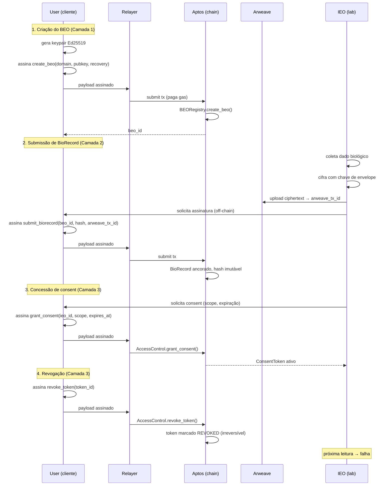

# Biological Sovereignty Protocol

## Um Protocolo de Soberania Biológica para a Era Algorítmica

**Whitepaper v3.0**

Andre Ambrosio
Instituto Ambrosio
Maio de 2026

---

**Hash do documento (SHA-256):** *a ser calculado sobre o artefato final consolidado*
**DOI:** *em registro junto ao Zenodo / OpenAIRE*
**ORCID do autor:** *em emissão*
**Versão canônica:** `https://bsp.protocol/whitepaper-v3`
**Repositório de fonte:** `github.com/ambrosiocompany/bsp-spec`

---

## Abstract

Dados biológicos são o último território não colonizado pelo regime contemporâneo de soberania pessoal. Embora discutamos amplamente direitos sobre dados pessoais, propriedade intelectual e privacidade comportamental, o substrato mais íntimo — exames, sequências, métricas fisiológicas e fenotípicas — permanece capturado por uma cadeia de intermediários: hospitais, laboratórios, seguradoras, plataformas de wearables e provedores de IA médica. Cada intermediário extrai valor sem retorno proporcional ao indivíduo que é, simultaneamente, fonte do dado, sujeito do dado e maior beneficiário potencial de seu uso.

Este whitepaper apresenta o **Biological Sovereignty Protocol (BSP)**: um protocolo permissionless que separa identidade, dado e permissão em três camadas com fronteiras de comprometimento isoladas. A camada de identidade (BEO — Biological Entity Owner) ancora soberania por meio de criptografia Ed25519 e BLAKE3 sobre Aptos. A camada de dados estende permanência verificável via Arweave com cifragem client-side AES-GCM. A camada de troca instrumentaliza consentimento granular através de ConsentTokens revogáveis, AuthorityTokens delegáveis e cryptographic erasure como mecanismo de compromisso entre imutabilidade on-chain e o direito ao apagamento garantido pela LGPD, GDPR e PIPL.

As inovações centrais são três. **Primeira:** *cryptographic erasure* — em vez de tentar deletar registros imutáveis, o protocolo torna o dado matematicamente irrecuperável pela destruição irreversível das chaves de envelope. **Segunda:** *multi-relayer ecosystem* — qualquer entidade pode operar um relayer; o Instituto Ambrosio opera apenas um deles, sem privilégio sistêmico. **Terceira:** *stewardship model* — o Instituto aceita vínculo fiduciário irrevogável como mero administrador, instrumentalizado via multisig 2-of-3 com timelock de 72 horas, processo BIP de seis fases e direito de fork preservado por design.

O whitepaper se dirige a cinco audiências: pesquisadores em saúde, longevidade e bioética; instituições clínicas e laboratoriais que precisam de uma camada interoperável; reguladores que buscam compatibilidade com regimes de proteção de dados; desenvolvedores que constroem a próxima geração de aplicações de saúde; e indivíduos que reconhecem o próprio corpo como o último território a ser reapropriado.

O protocolo está em implementação ativa. A taxonomia BSP (26 domínios), os contratos Move, os SDKs em TypeScript e Python, e o relayer de referência operado pela Ambrosio Company estão em produção limitada. Validação científica do AVA (Anamnese Virtual Autônoma) — a camada algorítmica proprietária construída sobre o protocolo — segue cronograma peer-reviewed em quatro estágios: validação retrospectiva, prospectiva, multi-coorte e regulatória. Este documento descreve o estado atual, declara honestamente as incertezas remanescentes e convida à crítica pública.

---

## Executive Summary

*Para o leitor com dez minutos.*

### O problema

Há um descompasso ontológico entre o que dados biológicos são e o regime jurídico-tecnológico que os trata. Dados biológicos não são traços comportamentais agregáveis; são **constituição** — a inscrição material do que um corpo é, foi e tende a se tornar. Tratá-los como commodity informacional, como o regime contemporâneo faz, equivale a tratar a propriedade da terra com a mesma instrumentalidade jurídica do empréstimo de uma ferramenta. A categoria está errada.

A consequência prática é uma assimetria informacional sistêmica. Hospitais e laboratórios mantêm cópias proprietárias de dados que não geraram. Plataformas de wearables monetizam padrões fisiológicos sem repartir valor. Seguradoras precificam risco a partir de inferências sobre corpos cujos donos não têm acesso ao modelo. IA médica é treinada em bases das quais o sujeito do dado é, no melhor caso, anônimo — e, no pior, traçável. O indivíduo, fonte e sujeito, ocupa a posição de menor poder informacional na cadeia.

### A solução

O **Biological Sovereignty Protocol** é uma resposta técnica a esse problema. Não é uma plataforma. Não é um produto. Não é um token. É uma especificação aberta de três camadas:

1. **Identidade (BEO).** Cada indivíduo possui uma identidade biológica auto-soberana, ancorada em par de chaves Ed25519 gerado client-side, registrada on-chain (Aptos), com recuperação por 2-de-3 guardiões e suporte a domínios humanamente legíveis.

2. **Dados (BioRecord).** Cada registro biológico é cifrado client-side com AES-GCM, persistido em Arweave via relayer, e ancorado on-chain por hash BLAKE3. A taxonomia BSP organiza 26 domínios — laboratoriais, genômicos, fenotípicos, fisiológicos, ambientais — em estrutura interoperável.

3. **Troca (Exchange).** Qualquer compartilhamento ocorre via ConsentToken — escopo, intent, prazo, revogabilidade. Delegações ocorrem via AuthorityToken. Revogação é tecnicamente irreversível: cryptographic erasure destrói a chave de envelope, tornando o dado matematicamente irrecuperável mesmo que o ciphertext permaneça em armazenamento permanente.

### As seis teses do whitepaper

- **Parte I — Filosofia.** Dado biológico é ontologicamente distinto. É constituição, não traço. Exige soberania técnica via inversão da assimetria informacional, não privacidade reformista.

- **Parte II — Protocolo.** BSP separa identidade, dado e permissão em três camadas com fronteiras de comprometimento isoladas, ancorando integridade via Ed25519 e BLAKE3 on-chain (Aptos) e permanência via Arweave, com revogação irreversível e cryptographic erasure como compromisso entre imutabilidade e LGPD.

- **Parte III — Economia.** Modelo híbrido sem token: endowment institucional capitalizado pela Ambrosio Company como base perpétua, complementado por subscription premium do relayer oficial, repasse das commercial arms (Health, AVA, SVA) e grants filantrópicos. O protocolo é gratuito para o BEO; o relayer é commodity competitiva.

- **Parte IV — Instituição.** O Instituto Ambrosio aceita vínculo fiduciário irrevogável como steward — não beneficiário — instrumentalizado via multisig 2-of-3 com timelock de 72 horas, processo BIP de seis fases, comitê técnico com mandatos staggered e direito de fork preservado.

- **Parte V — Inteligência.** Soberania não exige código aberto do AVA. Exige direito de saída, reprodutibilidade verificável, validação peer-reviewed e competição livre entre algoritmos. AVA é proprietário hoje porque sustenta a pesquisa que torna o protocolo confiável; deixa de precisar sê-lo no momento em que a confiança se torne sistêmica.

- **Parte VI — Horizonte.** Soberania biológica é direito, não privilégio — e direitos exigem infraestrutura invisível e não-extrativa, do mesmo modo que GPL fez pelo software, HTTP fez pela informação e TCP/IP fez pela conectividade.

### Convite

Quem lê este documento é convidado a três tipos de ação. **Construir** — implementar relayers, SDKs, integrações, aplicações. **Adotar** — para indivíduos, criar a primeira BEO; para instituições, integrar como Information Exchange Operator. **Criticar** — encontrar erros, propor melhorias via processo BIP, fazer fork se discordar. O protocolo é obra aberta, em evolução, e a única forma errada de engajamento é o silêncio.

---

## Sumário Executivo Visual

### Arquitetura em três camadas

```
  ┌──────────────────────────────────────────────────────────┐
  │                  CAMADA DE TROCA                          │
  │   ConsentToken · AuthorityToken · Revogação · Erasure    │
  └──────────────────────────────────────────────────────────┘
                              ▲
                              │
  ┌──────────────────────────────────────────────────────────┐
  │                  CAMADA DE DADOS                          │
  │     BioRecord · AES-GCM · Arweave · Hash · 26 domínios   │
  └──────────────────────────────────────────────────────────┘
                              ▲
                              │
  ┌──────────────────────────────────────────────────────────┐
  │                CAMADA DE IDENTIDADE                       │
  │     BEO · Ed25519 · Aptos · Domain Registry · Recovery   │
  └──────────────────────────────────────────────────────────┘
```

### As cinco promessas auditáveis

| # | Promessa | Mecanismo técnico | Verificável por |
|---|----------|-------------------|-----------------|
| 1 | **Sovereignty by default** | Chaves geradas client-side; nenhum servidor pode produzir BEO sem assinatura do titular | Inspeção de código + análise de transações on-chain |
| 2 | **Consent by signature** | Toda troca exige ConsentToken assinado; assinatura é ônus computacional + intencional do BEO | Trilha de auditoria pública na camada Exchange |
| 3 | **Permanence with erasability** | Ciphertext em Arweave (permanência); chave de envelope deletável (apagamento) | Cryptographic erasure ceremony pública |
| 4 | **Permissionless creation** | Qualquer indivíduo cria BEO sem aprovação; qualquer entidade opera relayer | Repositório aberto + ausência de gatekeeping |
| 5 | **Steward, not beneficiary** | Instituto Ambrosio sob multisig 2-of-3 com timelock; direito de fork preservado | Multisig público + processo BIP auditável |

---

## Tabela de Conteúdos

### PARTE I — FUNDAMENTOS FILOSÓFICOS

- Capítulo 1 — A Questão da Soberania
- Capítulo 2 — Biopoder e o Algoritmo
- Capítulo 3 — As Apostas Civilizacionais
- Capítulo 4 — Primeiros Princípios

### PARTE II — O PROTOCOLO

- Capítulo 1 — Visão Arquitetural
- Capítulo 2 — Camada de Identidade (BEO)
- Capítulo 3 — Camada de Dados (BioRecord)
- Capítulo 4 — Camada de Troca (Exchange)
- Capítulos subsequentes — Cryptographic Erasure, Relayers, Multi-chain, Modelos de Ataque

### PARTE III — A ECONOMIA (SUSTENTABILIDADE DO PROTOCOLO)

- Capítulo 1 — A Economia do Relayer Aberto
- Capítulo 2 — Sustentabilidade do Instituto Ambrosio
- Capítulo 3 — Incentivos Institucionais
- Capítulo 4 — Análise de Custos a Longo Prazo (10 anos)
- Capítulo 5 — Externalidades e Bens Públicos

### PARTE IV — A INSTITUIÇÃO (GOVERNANÇA E STEWARDSHIP)

- Capítulo 1 — A Doutrina do Steward
- Capítulo 2 — BIP-0001: Multisig 2-of-3 com Timelock
- Capítulo 3 — O Processo BIP (Biological Improvement Proposal)
- Capítulo 4 — O Comitê Técnico Científico
- Capítulo 5 — Sucessão, Continuidade e Conflitos

### PARTE V — A INTELIGÊNCIA (AVA & SVA)

- Capítulo 1 — A Tese da Camada Proprietária
- Capítulo 2 — Metodologia do AVA
- Capítulo 3 — Validação Metodológica
- Capítulo 4 — API Pública e Reprodutibilidade
- Capítulo 5 — Soberania na Era Algorítmica

### PARTE VI — O HORIZONTE

- Capítulo 1 — Roadmap 5 Anos
- Capítulo 2 — Estratégia de Adoção em 3 Frentes
- Capítulo 3 — Modos de Falha e Mitigação
- Capítulo 4 — A Visão de 10–50 Anos
- Capítulo 5 — Call to Action

### CONCLUSÃO

### APÊNDICES

- Apêndice A — Taxonomia BSP Completa (26 domínios)
- Apêndice B — Compliance LGPD / GDPR / HIPAA
- Apêndice C — Glossário Completo
- Apêndice D — Bibliografia Geral
- Apêndice E — Referências de Implementação

---

## Sobre o Autor

**Andre Ambrosio** é fundador da Ambrosio Company e arquiteto do Biological Sovereignty Protocol. Trabalha na interseção entre engenharia de longevidade, sistemas descentralizados e infraestrutura crítica para saúde humana. Reside no Brasil. Conduz, paralelamente ao BSP, programas em suplementação funcional, hardware de monitoramento fisiológico e sistemas de IA médica de transparência verificável.

A motivação declarada para o BSP é simultaneamente prática e civilizacional: garantir que a próxima geração — começando por seus próprios filhos — herde dados biológicos sob soberania, e não sob captura. A intenção institucional é de longo prazo, multi-geracional, e instrumentalizada por meio de vínculo fiduciário irrevogável entre o autor e o protocolo.

**Contato público:** `andre@ambrosio.io`
**Identidade BEO de referência:** `bsp://andre.ambrosio` (a ser publicada na rede principal)

---

## Como Citar Este Documento

```
Ambrosio, A. (2026). Biological Sovereignty Protocol:
Um Protocolo de Soberania Biológica para a Era Algorítmica.
Whitepaper v3.0. Instituto Ambrosio.
https://bsp.protocol/whitepaper-v3
```

**BibTeX:**

```bibtex
@techreport{ambrosio2026bsp,
  author      = {Ambrosio, Andre},
  title       = {Biological Sovereignty Protocol: Um Protocolo de Soberania Biológica para a Era Algorítmica},
  institution = {Instituto Ambrosio},
  type        = {Whitepaper},
  number      = {v3.0},
  year        = {2026},
  month       = {5},
  url         = {https://bsp.protocol/whitepaper-v3}
}
```

---

## Licença

- **Texto deste whitepaper:** Creative Commons Attribution-ShareAlike 4.0 International (CC BY-SA 4.0). Reprodução, tradução, adaptação e distribuição são permitidas, desde que atribuídas ao autor e mantidas sob a mesma licença.
- **Especificação técnica e referências de implementação:** licenças open-source listadas no Apêndice E (predominantemente MIT e Apache 2.0).
- **Modelo de circulação:** análogo ao do whitepaper Bitcoin de 2008 — open knowledge, sem reserva de propriedade intelectual sobre as ideias centrais. Forks, traduções e críticas públicas são explicitamente encorajados.

---

## Aviso Legal

Este documento é um trabalho técnico-científico e político-filosófico. **Não constitui aconselhamento médico, jurídico ou financeiro.**

- O BSP é um mecanismo técnico. A conformidade regulatória local — LGPD, GDPR, HIPAA, PIPL e legislações setoriais aplicáveis — é responsabilidade do operador de relayer, da instituição integradora e do indivíduo titular do BEO, conforme aplicável.
- O AVA e o SVA são instrumentos de análise e suporte à decisão. **Não substituem diagnóstico médico, prescrição ou intervenção clínica.** Qualquer decisão de saúde derivada do uso de tais sistemas deve ser conduzida por profissional qualificado.
- Cifragem e custódia de chaves criptográficas implicam riscos. Perda de chaves sem mecanismo de recuperação configurado pode resultar em perda permanente de acesso a dados. O protocolo provê mecanismos (recovery 2-de-3, ephemeral keys, AuthorityTokens) — sua adoção é responsabilidade do BEO.
- Projeções financeiras, cronogramas de adoção e cenários de longo prazo apresentados refletem premissas declaradas. Resultados reais podem divergir.

---

## Introdução

Há momentos em que problemas estruturais se cristalizam em janelas estreitas de decisão. Este é um deles.

Quatro processos convergem, em escala global, para a mesma encruzilhada. **Primeiro:** a fronteira da longevidade humana se moveu, pela primeira vez na história, de tema religioso ou filosófico para problema de engenharia. A ciência da senescência, a biologia molecular do envelhecimento e a medicina preventiva avançam em ritmo que torna verossímil — embora não garantida — a extensão clinicamente significativa da expectativa de vida saudável dentro do século. **Segundo:** a inteligência artificial médica passou do estágio de demonstração para o estágio de implementação. Modelos preditivos sobre dados fisiológicos e fenotípicos hoje informam decisões clínicas reais, e essa tendência só se aprofunda. **Terceiro:** a infraestrutura Web3 atingiu, após mais de uma década de iteração, a maturidade necessária para sustentar protocolos de identidade descentralizada e armazenamento permanente em escala. **Quarto:** as crises de privacidade e captura de dados — Cambridge Analytica, vazamentos sistêmicos em hospitais, escândalos de plataformas de wearables — formaram, na opinião pública e nos legisladores, uma sensibilidade sem precedente para a fragilidade do regime atual.

A interseção desses quatro processos define a janela. Sem o avanço de longevidade, dados biológicos seriam apenas mais uma categoria. Sem IA médica, seriam dados sem inferência sistêmica. Sem Web3 maduro, soberania sobre eles seria retórica sem substrato. Sem a crise de privacidade, faltaria pressão pública e regulatória. Os quatro juntos tornam o **agora** um momento de decisão.

A decisão é simples e binária: o dado biológico será tratado como **commodity privada** — capturada, monetizada e revendida pela próxima onda de plataformas — ou como **direito infraestrutural** — protegido por código verificável, governado por instituição auditável e operado em rede permissionless. Não há terceiro caminho relevante. Tentativas de regulação reformista sobre o regime atual apenas administram a captura; não a invertem. A inversão exige infraestrutura nova.

Este whitepaper é a tentativa pragmática de instrumentalizar a segunda escolha.

### O que esperar

O documento é deliberadamente híbrido em tom. **Filosófico** na Parte I, porque um protocolo sem fundamento conceitual é apenas software, e software desprovido de fundamento se rende ao primeiro vento institucional ou comercial que sopra contra ele. **Técnico** na Parte II, porque promessas filosóficas sem mecanismo verificável são propaganda. **Econômico** na Parte III, porque infraestrutura que não se sustenta morre, e o silêncio sobre sustentabilidade é a forma mais comum de fracasso de protocolos descentralizados. **Institucional** na Parte IV, porque governança importa mais que tecnologia no longo prazo, e qualquer projeto que prometa "código é lei" sem instrumentalizar contenção de poder humano está repetindo erros conhecidos. **Algorítmico** na Parte V, porque a era é algorítmica, e qualquer soberania que pare na camada de dados ignora o palco onde a captura efetiva acontece. **Prospectivo** na Parte VI, porque adoção sem cronograma honesto é fé, não estratégia.

### Como ler

A leitura sequencial é a forma plena, mas não a única legítima. Pesquisadores em filosofia política e bioética encontrarão o argumento substantivo nas Partes I e IV. Engenheiros e auditores de segurança encontrarão a especificação concreta nas Partes II e V e nos Apêndices A, C e E. Reguladores e oficiais de compliance encontrarão a análise jurídica no Apêndice B e na Parte IV. Operadores institucionais — hospitais, laboratórios, clínicas, fabricantes de wearables — encontrarão a tese de adoção nas Partes III e VI. Indivíduos que buscam entender por que isso importa para si encontrarão a resposta breve no Sumário Executivo e a resposta longa na Parte I.

### Convite à crítica

Este whitepaper não é uma obra acabada. É um instantâneo da v3.0 de um protocolo em evolução, escrito por um autor que reconhece os limites do próprio juízo e a impossibilidade de prever, isoladamente, todas as falhas estruturais de um sistema dessa ambição. Erros existem aqui. Lacunas existem aqui. Premissas que envelhecerão mal existem aqui.

A resposta institucional ao reconhecimento dessa falibilidade não é silêncio sobre as falhas — é processo. O processo BIP descrito na Parte IV é o canal formal de crítica. O direito de fork descrito ao longo do documento é o canal informal. A bibliografia no Apêndice D é a base sobre a qual qualquer crítica responsável precisa se construir. E o autor, como steward declarado e não como beneficiário, é parte interessada em receber crítica — não em silenciá-la.

Boa leitura.

— *Andre Ambrosio*
*Maio de 2026*


---

# Parte I — Fundamentos Filosóficos

> *"O corpo é o último território sobre o qual ainda não há acordo de paz."*

---

## Capítulo 1 — A Questão da Soberania

### 1.1 Um dado que não é como os outros

Toda discussão séria sobre dados começa por uma confusão de categorias. Tratamos como equivalentes coisas profundamente desiguais: o histórico de compras em uma loja, a localização de um celular, uma conversa de mensagem, o sequenciamento do genoma. Tudo é "dado". Tudo viaja pelos mesmos cabos, é guardado nos mesmos servidores, governado pelas mesmas políticas de privacidade redigidas por advogados que ninguém lê. Esta indistinção é a fonte de quase todos os erros do que se discute como soberania digital no século XXI.

O dado biológico não é uma categoria a mais nesta lista. Ele é ontologicamente distinto. Um histórico de compras é traço — registro do que fizemos. Um dado biológico é *constituição* — registro do que somos. A diferença não é semântica; é metafísica. O genoma de uma pessoa não foi *gerado* por ela ao usar uma plataforma. Ele a precede. Ela é a manifestação dele. Quando alguém transfere um genoma a uma empresa, não está cedendo um produto do seu trabalho ou da sua atenção: está cedendo a fórmula matemática do seu próprio corpo, junto com a de seus pais, de seus filhos, de seus descendentes ainda não nascidos.

A medicina e o direito do século XX nunca enfrentaram essa distinção em profundidade. Operaram com uma ficção útil: a de que o dado clínico pertence à instituição que o gera. O hospital realiza o exame, "logo" o exame é do hospital, com obrigações de sigilo profissional e direito de acesso do paciente como concessão regulatória. A lógica é a mesma do escrivão medieval que detinha as escrituras porque sabia escrever. Resolveu-se o problema do *armazenamento*; jamais se resolveu o problema da *propriedade*.

A pergunta que este whitepaper enfrenta é simples e radical: **a quem pertence o dado biológico de um ser humano?** Não no sentido jurídico das legislações atuais — a LGPD brasileira, o GDPR europeu, o HIPAA americano todas oferecem versões parciais, e todas confundem *direito de acesso* com *propriedade*. A pergunta é anterior. É filosófica. Antes de regular, precisamos entender o que estamos regulando.

### 1.2 Locke e o corpo como propriedade primária

John Locke, no *Segundo Tratado sobre o Governo Civil* (1689), oferece o ponto de partida indispensável. Para Locke, antes de qualquer propriedade externa — terra, ferramentas, frutos do trabalho — existe uma propriedade originária, da qual todas as outras se derivam: a propriedade que cada homem tem sobre sua própria pessoa.

> "Embora a Terra e todas as criaturas inferiores sejam comuns a todos os homens, cada homem tem uma *propriedade* em sua própria *pessoa*. A esta ninguém tem direito senão ele mesmo. O *trabalho* de seu corpo e a *obra* de suas mãos, podemos dizer, são propriamente seus."[^1]

A passagem é mais sutil do que parece. Locke não diz apenas que o corpo é propriedade. Diz que o corpo é a propriedade *primária* — aquela que torna possível qualquer outra. Quando misturo meu trabalho com a terra, transformo terra comum em propriedade minha, mas só porque o trabalho era *já* meu, e o trabalho era meu porque o corpo que o produzia era meu. Toda a teoria liberal da propriedade depende, em sua raiz, de um axioma sobre o corpo.

Ora, se o corpo é propriedade primária, o que é o dado biológico senão a *representação digital* dessa propriedade? A sequência genômica de uma pessoa não é uma cópia de sua imagem ou um traço de seu comportamento — é a especificação técnica do próprio corpo. Tratá-la como propriedade de uma instituição é exatamente o tipo de inversão que Locke combatia: é como dizer que a terra pertence ao escrivão que registrou a escritura.

### 1.3 Nozick e o axioma da auto-propriedade

Robert Nozick, em *Anarchy, State, and Utopia* (1974), radicaliza Locke. Para Nozick, a auto-propriedade (*self-ownership*) não é apenas a base da propriedade material; é o axioma moral fundamental do qual derivam todos os direitos. Os indivíduos, escreve, "têm direitos, e há coisas que nenhuma pessoa ou grupo pode lhes fazer (sem violar seus direitos)."[^2]

Nozick faz uma distinção que importa para nós: entre *propriedade* e *uso*. Eu posso ser proprietário de algo sem usá-lo, e posso usar algo sem ser seu proprietário. A propriedade é o conjunto de direitos sobre uma coisa — direito de excluir, direito de transferir, direito de modificar, direito de destruir. O uso é apenas um desses direitos. A medicina contemporânea opera num regime estranho em que as instituições têm direito de uso quase irrestrito sobre os dados biológicos das pessoas, enquanto as próprias pessoas mal exercem qualquer um dos direitos de propriedade plena. É uma propriedade fantasma, da qual sobrou apenas o nome.

A objeção comum a Nozick é que sua noção de auto-propriedade leva a aceitar coisas moralmente desagradáveis — venda de órgãos, contratos de servidão. Não preciso resolver aqui essa polêmica. Basta observar que o argumento da auto-propriedade *não exige* a permissão da venda; exige apenas o reconhecimento da titularidade. Posso ser dono do meu corpo e, ainda assim, considerar que certas alienações são moralmente vedadas — exatamente como sou dono do meu voto e nem por isso posso vendê-lo. A inalienabilidade é um *modo* de propriedade, não sua negação.

Este é o primeiro princípio do BSP: dado biológico é inalienável-por-default. O indivíduo é dono. Pode liberar acesso. Não pode, sob qualquer circunstância contratual, ceder propriedade plena de forma irrevogável. Toda concessão é, por construção, revogável. A propriedade fica; o uso pode circular.

### 1.4 Propriedade, controle, legado

A discussão sobre dados biológicos costuma ser reduzida a "privacidade", e isso é um erro. Privacidade é apenas uma das três dimensões em jogo. As outras duas são *controle* e *legado*, e nenhuma das três se reduz às outras.

**Propriedade** é a questão metafísica: a quem pertence isto? Sem resposta clara, todas as outras questões ficam mal formuladas. Se o dado é da instituição, falar em "consentimento do paciente" é cortesia, não direito.

**Controle** é a questão política: quem decide o que é feito com isto, *agora*? Mesmo se aceitamos que o dado pertence ao indivíduo, o controle pode estar em outra parte. Bancos detêm dinheiro alheio e o controlam por longos períodos sob regras estritas. Hospitais detêm dados alheios e os controlam sob regras frouxas. A diferença é regulatória, não ontológica.

**Legado** é a questão temporal: o que acontece com isto quando eu morrer? Esta dimensão é quase sempre ignorada nos debates sobre privacidade, e talvez seja a mais importante. Um dado biológico não é apenas seu — ele contém informação sobre seus pais, irmãos e descendentes. Sua mortalidade não encerra o valor do dado. Pelo contrário: o valor de uma série temporal genômica e fisiológica de uma pessoa só se manifesta plenamente *décadas* depois, quando se torna possível comparar trajetórias, calibrar relógios biológicos, treinar modelos preditivos.

Quem decide o que acontece com seus dados quando você não estiver mais aqui? Hoje, em quase todos os sistemas atuais, *ninguém decide* — o dado fica congelado num servidor de hospital até ser despejado num backup que ninguém mais consulta, ou é integrado a um banco corporativo cujas políticas você jamais leu. O legado é apagado por omissão. O BSP propõe que legado biológico seja, como o legado patrimonial, uma decisão explícita do titular, executável programaticamente.

### 1.5 A medicina paternalista e seu limite

A medicina do século XX foi construída sobre uma assimetria informacional: o médico sabe, o paciente não. Esta assimetria justificou um paternalismo que, em sua versão branda, era cuidado, e em sua versão dura, era expropriação. A consagração jurídica disso é o conceito de "prontuário médico", documento que descreve o paciente mas pertence à instituição.

Eric Topol, em *The Patient Will See You Now* (2015), narra esta inflexão com clareza clínica.[^3] Topol — cardiologista, pesquisador, e um dos primeiros a articular o que chamou de "democratização da medicina" — mostra que a tecnologia já tornou obsoleta a assimetria que justificava o paternalismo. O paciente que mede o próprio ECG no smartwatch, sequencia o próprio genoma por correio, e consulta o próprio resultado de exame antes do médico, *já é* o titular da informação. A estrutura institucional é que ainda não acompanhou.

> "O futuro da medicina é o paciente. Não como recipiente passivo do cuidado, mas como sujeito ativo do conhecimento sobre o próprio corpo. A medicina baseada em dados é, por sua própria natureza, uma medicina que devolve ao paciente o que sempre foi seu — e que a tecnologia anterior obrigava a ser provisoriamente delegado."[^3]

O ponto de Topol é importante: a assimetria informacional foi resolvida tecnicamente. O que sobrou é uma assimetria *jurídica* e *infraestrutural* — não há onde, como, ou em que protocolo o indivíduo deposite seus próprios dados sob seu próprio controle. O BSP é uma resposta a este vácuo.

---

## Capítulo 2 — Biopoder e o Algoritmo

### 2.1 Foucault e a gestão estatística da vida

Michel Foucault, no curso *Nascimento da Biopolítica* (1978-1979) no Collège de France, e antes em *Vigiar e Punir* (1975), traça uma genealogia indispensável para entender o que está em jogo aqui. Para Foucault, o poder moderno não é principalmente o poder soberano de "fazer morrer e deixar viver" — é, ao contrário, o poder de "fazer viver e deixar morrer". É um poder que se exerce sobre a vida, sobre os corpos coletivos, através de sua medição, classificação, gestão estatística.[^4]

Este *biopoder* não opera por proibição direta. Opera por estatística e norma. Não é o rei que decide quem morre; é a tabela atuarial que decide quais corpos são saudáveis, quais são desviantes, quais merecem investimento, quais são descartáveis. O biopoder, na formulação de Foucault, é "o poder que tomou a vida sob seu controle como objeto explícito".[^5]

Há uma observação de Foucault que vale relembrar literalmente:

> "Pela primeira vez na história, sem dúvida, o biológico se reflete no político; o fato de viver não é mais esse substrato inacessível que só emerge de tempos em tempos, no acaso da morte e sua fatalidade: passa, em parte, para o campo do controle do saber e da intervenção do poder."[^6]

A passagem é de 1976, antes de qualquer planilha eletrônica massiva, antes do genoma sequenciado, antes do *deep learning*. Foucault descrevia um poder estatal que classificava populações por taxa de mortalidade, fertilidade, morbidade. A versão contemporânea desse poder é incomparavelmente mais granular. Não classifica mais populações; classifica *indivíduos*, em tempo real, e ajusta intervenções por pessoa. A planilha virou modelo preditivo. A população virou um vetor de embeddings.

O ponto é que o biopoder do século XXI não é mais primariamente estatal. Ele é *plataformizado*. Quem detém os dados biológicos detém a capacidade de classificar, predizer, intervir — e essa capacidade está hoje, quase inteiramente, em meia dúzia de empresas privadas e em sistemas hospitalares fragmentados. Foucault descreveu o nascimento do biopoder; vivemos sua maturação algorítmica.

### 2.2 Byung-Chul Han e a vigilância consensual

Se Foucault descreveu o biopoder como algo que se exerce *sobre* o sujeito, Byung-Chul Han, em *Psicopolítica* (2014), descreve sua mutação contemporânea: um poder que opera *através* do próprio sujeito, com sua participação ativa e entusiasmada. O sujeito da psicopolítica, escreve Han, "explora a si mesmo voluntariamente acreditando estar realizando-se".[^7]

Han faz uma distinção que merece pausa: a vigilância clássica era *visível e externa*. Havia um olho que vigiava, e o sujeito sabia disso, ou ao menos podia descobri-lo. A vigilância contemporânea é *invisível e internalizada*. O sujeito gera os dados, paga pelo dispositivo que os coleta, exibe-os publicamente, e ainda agradece pelo "serviço" que recebe em troca. Não há panóptico, porque não há necessidade de torre — o vigiado é também o vigia.

> "A psicopolítica neoliberal é a técnica de dominação que estabiliza o sistema dominante por meio de uma programação e controle psicológicos. (…) O smartphone é o aparelho central da psicopolítica neoliberal. Ele faz da exploração uma diversão."[^8]

Aplique-se isto ao dado biológico. A pessoa que coloca seu DNA num teste de ancestralidade comercial está, na taxonomia de Han, executando um ato perfeito de psicopolítica. Ela paga pelo teste. Cede direitos amplos via termos de uso. Recebe de volta uma narrativa identitária ("você é 23% ibérico, 7% norte-africano") que satisfaz uma curiosidade genuína. E entrega, no processo, ao sistema corporativo, o dado mais constitutivo de seu ser — junto com inferências sobre todos os seus parentes biológicos, que jamais consentiram. Ela sai da transação sentindo-se *empoderada*. É o triunfo psicopolítico exato.

Há um erro frequente em quem critica esse cenário: imaginar que a solução é "menos coleta", "menos plataforma", "regresso ao analógico". Esta nostalgia é estéril. A coleta é boa — saber sobre o próprio corpo é saber sobre si mesmo. O problema não é a quantidade de dado; é a *direção* da assimetria. Quem detém o modelo treinado sobre seu corpo? Quem decide o que ele responde a quem? Quem lucra quando a inferência sobre você é vendida a um terceiro?

### 2.3 Harari e o algoritmo que conhece você melhor

Yuval Harari, em *Homo Deus* (2016), articula talvez a versão mais nítida do que está em jogo. Sua tese, ali, é que o humanismo liberal — fundado na crença de que o indivíduo é a fonte última de sentido e autoridade sobre si — entra em colapso quando algoritmos passam a conhecer o indivíduo *melhor do que ele se conhece*.[^9]

> "Uma vez que o Big Data nos conheça melhor do que nos conhecemos, a autoridade passará dos humanos para os algoritmos. (…) Se a autoridade humana provém da experiência subjetiva, e o algoritmo tem acesso mais fiel à minha experiência do que eu mesmo tenho, por que eu seria a autoridade sobre mim?"[^10]

A pergunta é cortante e merece ser levada a sério. Harari não está fazendo ficção científica. Está descrevendo uma migração de autoridade já em curso: quando o aplicativo recomenda exercícios mais adequados ao seu padrão fisiológico do que o que você "sente vontade" de fazer; quando o modelo prediz seu humor amanhã com base em variáveis fisiológicas que você não percebe; quando o seu médico, em consulta, abre um software que conhece sua trajetória biológica em mais detalhe do que sua memória.

A resposta que muitos dão a Harari é defensiva: tentar conter a inteligência artificial, manter o humano como autoridade por decreto. Esta resposta é fraca porque luta contra o relógio. A inteligência sobre o corpo *vai* exceder a auto-percepção. A questão não é se isso acontecerá, mas *quem* terá essa inteligência.

### 2.4 A inversão da assimetria

Aqui está, na minha visão, o ponto onde os três autores convergem para um problema que nenhum deles resolveu inteiramente: o biopoder existe; a vigilância consensual é a sua forma contemporânea; a transferência de autoridade do humano para o algoritmo é um fato em curso.

A próxima fase, então, não pode ser "menos vigilância" — esta nostalgia não escala e não combate o problema real. A próxima fase é a **inversão da assimetria**: o indivíduo passa a deter o algoritmo sobre si, em vez de a plataforma deter o algoritmo sobre o indivíduo.

A diferença é técnica e civilizacional. Tecnicamente, exige que os dados biológicos pessoais sejam armazenados de forma que o titular controle as chaves; que os modelos derivados desses dados sejam treinados sob consentimento criptograficamente verificável; que o titular possa rodar inferências sobre seu próprio corpo sem precisar pedir licença a uma plataforma. Civilizacionalmente, é a diferença entre um futuro onde o conhecimento sobre o corpo humano é privatizado em meia dúzia de empresas, e um futuro onde ele é um bem comum auditável com soberania individual.

Esta é a aposta filosófica do BSP. Não é "anti-tecnologia". É anti-assimetria. Não é "menos dado". É *meu* dado.

### 2.5 Zuboff e o capitalismo de vigilância

Shoshana Zuboff, em *The Age of Surveillance Capitalism* (2019), oferece uma cartografia detalhada de como a assimetria atual foi construída institucionalmente. Sua tese é que o capitalismo de vigilância não é uma extensão acidental do capitalismo industrial, mas um regime econômico distinto, fundado na expropriação do que ela chama de "experiência humana como matéria-prima gratuita para práticas comerciais ocultas".[^11]

> "O capitalismo de vigilância reivindica unilateralmente a experiência humana como matéria-prima gratuita para tradução em dados comportamentais. Embora alguns desses dados sejam aplicados ao aprimoramento do produto ou serviço, o resto é declarado *behavioral surplus* proprietário, alimentado em processos de manufatura avançados conhecidos como 'inteligência de máquina', e fabricado em produtos preditivos."[^12]

Zuboff escreve sobre dado comportamental — cliques, localização, voz, padrão de uso. O capitalismo de vigilância biológica é um estágio mais profundo do mesmo regime: a expropriação não da experiência, mas da constituição material do sujeito. É o gesto extrativo aplicado ao último território.

A força da análise de Zuboff é mostrar que isso não foi descuido — foi *projeto*. As estruturas legais, os termos de uso, as práticas de mercado foram desenhadas para tornar a expropriação invisível e juridicamente inatacável. Reverter isso exige reconstruir a infraestrutura, não apenas reformar a regulação.

---

## Capítulo 3 — As Apostas Civilizacionais

### 3.1 O limiar da longevidade

Estamos no limiar de uma extensão radical de vida saudável. Não é mais conjectura. David Sinclair, em *Lifespan* (2019), articula com clareza o que vinha sendo construído desde os anos 1990: o envelhecimento não é uma fatalidade biológica imutável; é um processo regulado por mecanismos identificáveis, manipuláveis, e — em modelos animais — já reversíveis em vários aspectos.[^13]

A teoria da informação do envelhecimento, de Sinclair, sustenta que envelhecemos não por degradação do *hardware* (o DNA), mas por degradação progressiva do *software* epigenético — os marcadores que dizem a cada célula qual papel exercer. Recuperar esses marcadores recupera função celular. Em laboratório, isso já foi feito em retinas de camundongos cegos.[^14]

Os trabalhos de Steve Horvath sobre relógios epigenéticos formalizaram a ideia de "idade biológica" como medida quantitativa, distinta da idade cronológica.[^15] Em 2013, Horvath publicou o primeiro relógio epigenético capaz de prever idade biológica com precisão de poucos anos a partir de padrões de metilação do DNA. Desde então, sucessivos relógios — GrimAge, PhenoAge, DunedinPACE — refinaram essa medida, tornando possível observar, em humanos vivos, intervenções que aceleram ou desaceleram a idade biológica.[^16]

A literatura recente — papers em *Nature*, *Cell*, *Science Translational Medicine* entre 2023 e 2025 — tem mostrado intervenções que produzem reduções mensuráveis na idade biológica em humanos: combinações de exercício, restrição calórica, drogas como rapamicina e metformina, fatores de Yamanaka em contextos terapêuticos específicos. Não estamos falando de imortalidade; estamos falando de uma extensão potencial de 10-30 anos de vida saudável, plausível dentro do horizonte da geração viva.

Esta perspectiva tem uma consequência política frequentemente ignorada: **a longevidade exige soberania de dados**. Por quê? Porque uma intervenção de longevidade é, por natureza, uma trajetória multi-décadas. Para saber se uma intervenção funcionou no *seu* corpo, alguém precisa ter acesso à sua trajetória biológica completa, longitudinal, fina, ao longo de décadas. Se essa trajetória estiver fragmentada em hospitais, plataformas e seguradoras, com cada pedaço inacessível por barreiras institucionais, a medicina de longevidade torna-se impossível para você. Vira privilégio de quem pode pagar por um sistema integrado privado — e, mais grave, vira *cego* para o resto.

A escolha aqui é binária. Ou cada indivíduo passa a ter um repositório soberano e contínuo de seus próprios dados biológicos, integrável e auditável por quem ele autorizar, ou a longevidade ficará represada em arquipélagos privados desconectados.

### 3.2 IA médica e a questão do treinamento

AlphaFold previu a estrutura tridimensional de mais de 200 milhões de proteínas, cobrindo praticamente todo o proteoma conhecido.[^17] Med-PaLM 2, da Google, atingiu performance de especialista em exames de medicina.[^18] GPT-4 e seus sucessores demonstram capacidade de raciocínio diagnóstico que rivaliza com clínicos experientes em casos textuais. Esta é a infraestrutura cognitiva que dominará a medicina das próximas duas décadas.

Aqui surge a pergunta que define o regime: **em quais dados esses modelos foram, são, e serão treinados?**

A resposta atual é: nos dados que conseguiram ser agregados — geralmente em *biobancos* nacionais (UK Biobank, All of Us nos EUA, BBRC no Brasil), em parcerias hospitalares específicas, em datasets sintéticos. Os indivíduos cujos dados compõem esses bancos raramente sabem que seus dados estão sendo usados para treinamento. Os benefícios desses modelos retornam aos usuários como produtos pagos, oferecidos pelas mesmas empresas que treinaram os modelos.

Há um ciclo de extração que se fecha: pessoas geram dados biológicos; sistemas hospitalares os capturam; biobancos os agregam; empresas os usam para treinar modelos; pessoas pagam para usar esses modelos como serviços médicos. Nada disso é necessariamente mal-intencionado. É apenas o mesmo regime que Zuboff descreveu, aplicado à camada mais íntima.

A questão não é se a IA médica deve existir — deve, e seu valor é imenso. A questão é: **sob que regime de propriedade os dados que a treinam serão capturados?** O BSP propõe uma arquitetura onde o titular dos dados decide explicitamente se contribui para treinamento, em troca de quê, com qual rastreabilidade. *ConsentTokens* assinados criptograficamente tornam essa decisão técnica e jurídica.

### 3.3 A escassez de saúde como injustiça material

A distribuição desigual da saúde é, possivelmente, a maior injustiça material do século XXI. Não é a distribuição desigual de renda *per se*; é o que a renda *compra* na vida humana. Diferença de 15-20 anos de expectativa de vida entre bairros distantes 5 km. Acesso a diagnóstico precoce que muda completamente o prognóstico de cânceres tratáveis. Capacidade de pagar pela primeira geração de terapias gênicas (Casgevy, Zolgensma) que custam centenas de milhares a milhões de dólares por dose.

Toda nova tecnologia de saúde nasce desigual. Isso é praticamente uma lei. Mas a forma como a desigualdade é resolvida varia enormemente. O telefone celular foi a tecnologia mais rapidamente democratizada da história — em 30 anos, passou de objeto de elite a infraestrutura de subsistência em 80% do planeta. A insulina, ao contrário, segue sendo racionada por preço em vários países, 100 anos depois de descoberta.

O que distingue os dois casos? Em parte, a estrutura de propriedade da camada subjacente. O celular se democratizou porque a infraestrutura — protocolos de rede, padrões abertos, manufatura competitiva — se tornou *commodity*. A insulina não se democratizou na mesma velocidade porque a propriedade intelectual e a infraestrutura de produção permaneceram concentradas.

Dado biológico é a camada subjacente da medicina do século XXI. Se essa camada permanecer concentrada — se cada pessoa for refém da plataforma, do hospital, ou da seguradora que detém seu repositório — a medicina de precisão será para poucos, por gerações. Se a camada se tornar protocolo aberto — como TCP/IP, como Bitcoin, como HTTP — a inovação acontece *acima* dela, e a competição empurra os custos para baixo. A escolha de arquitetura no nível da camada de dados decide, com décadas de antecedência, a forma da desigualdade futura.

### 3.4 Herança biológica como legado

Há uma intuição cultural antiga: deixamos algo aos nossos filhos. Bens, terra, ensinamento, nome. O legado é uma das formas mais antigas pelas quais humanos enfrentam a finitude. No entanto, no plano biológico, o legado dos seres humanos do século XX foi quase sempre o *esquecimento*. As séries temporais fisiológicas de bilhões de pessoas foram capturadas por sistemas hospitalares que as descartam após 5, 10, 20 anos. O conhecimento que poderia se acumular gerações foi, por construção, apagado.

Pense em uma família ao longo de quatro gerações. Hoje, cada uma das quatro gerações é um arquipélago biológico isolado. A bisavó morreu em 1998 com seus prontuários em fichas de papel, num arquivo de hospital agora descontinuado. A avó tem registros parciais em três sistemas de planos de saúde diferentes. A mãe tem alguns exames em PDF no e-mail. A filha tem dados de wearable em três plataformas distintas, nenhuma delas comunicando com as outras. Quando a filha quiser entender, daqui a 30 anos, sua trajetória de saúde no contexto da história da família, ela não conseguirá. O dado já terá sido apagado, fragmentado, perdido em transições de plataforma.

A perda é silenciosa porque é por omissão. Mas é uma perda profunda, no sentido civilizacional. Uma família que pudesse acumular, ao longo de séculos, séries longitudinais de dados biológicos — com consentimento explícito, com governança intergeracional, com acesso seletivo a pesquisa — teria, sobre si mesma, um conhecimento qualitativamente diferente. Esse acúmulo é uma das aplicações mais profundas da soberania biológica.

O BSP trata legado como cidadão de primeira classe. Não é *feature* opcional. É princípio: dado biológico sobrevive ao titular, segundo regras programadas pelo próprio titular, com herdeiros designados, intervalos de carência, condições de liberação. É herança no sentido pleno.

### 3.5 A escolha histórica

Resumindo o capítulo: estamos em um momento de bifurcação. Em um caminho, a inteligência sobre o corpo humano fica concentrada em meia dúzia de empresas, com o indivíduo na posição de fonte de dados e consumidor de serviços derivados, sem soberania técnica sobre nenhum lado da equação. Em outro caminho, essa inteligência se torna um bem comum auditável, com infraestrutura aberta, e cada indivíduo detendo soberania sobre seus próprios dados biológicos como camada de base.

A primeira via é o curso natural se nada for feito. Tem inércia institucional, capital, e modelos de negócio já comprovados. A segunda via exige construção deliberada de infraestrutura, padrões, protocolos. É um trabalho de geração — não de produto.

A aposta do BSP é a segunda via. E a aposta não é moral, no sentido de "deve ser assim porque é mais justo". A aposta é também *epistemológica*: a inteligência sobre o corpo humano avança mais rápido, e mais corretamente, quando a base de dados é descentralizada, auditável, com governança individual. Concentração é frágil. Diversidade resiste, recombina, evolui.

---

## Capítulo 4 — Primeiros Princípios

### 4.1 O que torna um dado verdadeiramente *seu*?

A pergunta admite resposta operacional. Um dado é seu se, e somente se, quatro propriedades se sustentam simultaneamente:

**1. Propriedade.** Você decide quem possui cópia do dado. Isso é mais do que privacidade — é poder de duplicação. Se eu autorizo um laboratório a manter uma cópia para um exame, esse laboratório tem cópia *autorizada*. Se eu não autorizei, ninguém pode ter cópia, mesmo que tecnicamente possa. A propriedade exige a possibilidade de auditar quem tem cópia, e de remover cópias não autorizadas.

**2. Controle.** Você revoga acesso a qualquer momento, sem precisar de permissão. Esta é a diferença entre propriedade e usufruto. O sistema atual oferece, na melhor das hipóteses, "direito de solicitar exclusão" — uma forma de pedido formal sujeito a aprovação institucional. O controle pleno não pede; *executa*. Tecnicamente, isso significa criptografia de envelopamento (envelope encryption) com chaves que só o titular detém, de modo que revogar é não-cooperar com novas requisições, e o dado encriptado torna-se matemática inútil.

**3. Legado.** O dado sobrevive a você, e segue suas instruções. Não fica preso num servidor que será descontinuado em 10 anos, nem é apagado na sua morte por default, nem cai automaticamente em domínio público. Você designa herdeiros, condições, períodos. O sistema executa programaticamente.

**4. Inalienabilidade.** O dado não pode ser comprado, vendido, hipotecado contra sua vontade, ainda que você queira. Esta é a propriedade mais contraintuitiva, e talvez a mais importante. Você pode liberar acesso por valor, em troca de serviço. Você não pode ceder propriedade plena de forma irrevogável, porque uma cessão dessa natureza seria uma escravidão informacional. A inalienabilidade é o que distingue um direito fundamental de uma mercadoria.

Estes quatro critérios juntos definem soberania de dados. Falta qualquer um deles, e a propriedade vira figura retórica. O BSP é a tentativa de implementar os quatro simultaneamente, em código, em protocolo, em um sistema permissionless.

### 4.2 Os cinco princípios derivados

Da definição acima, decorrem cinco princípios operacionais que o BSP enforça em sua arquitetura:

#### Princípio 1 — *Sovereignty by default*

Dado biológico pertence ao indivíduo até que ele explicitamente, e por ato criptograficamente verificável, libere acesso a um terceiro. Não há "default cinza" onde a instituição que coleta tem direitos presumidos. O default é soberania completa do titular. Toda concessão é ato consciente, datado, escopo-limitado, revogável.

A diferença com o sistema atual é radical. Hoje, ao fazer um exame, o paciente assina um termo de consentimento que tipicamente concede direitos amplos à instituição — uso para "pesquisa", "qualidade", "ensino", muitas vezes com possibilidade de compartilhamento com parceiros não-especificados. O default é abertura. O BSP inverte o default. Inverter o default é, sozinho, talvez a intervenção de maior consequência.

#### Princípio 2 — *Consent by signature*

Toda transferência de acesso a dados é executada por uma assinatura criptográfica do titular, registrada de forma auditável e não-falsificável. *ConsentTokens* assinados com chave Ed25519 do titular, emitidos contra um *BEO* (Biological Entity Object) específico, com escopo, prazo, contraparte e propósito explícitos. Um terceiro que receba dados sem o token correspondente está em violação criptograficamente provável, não apenas em violação contratual.

Isto transforma "consentimento informado" — figura jurídica vaga, frequentemente abusada — em ato técnico verificável. O consentimento deixa de ser declaração e passa a ser *prova*.

#### Princípio 3 — *Permanence with erasability*

Os dados biológicos são armazenados em infraestrutura permanente — Arweave, especificamente, pela sua propriedade de armazenamento perpétuo financiado por endowment criptoeconômico. A permanência é importante porque o valor de uma trajetória biológica longitudinal cresce com o tempo, e qualquer infraestrutura sujeita a descontinuação é, em horizonte de décadas, falha por construção.

Mas permanência sem possibilidade de "esquecimento" seria distopia. O BSP resolve esta tensão por uma operação criptográfica: o dado armazenado é sempre *encriptado*. A chave fica sob controle do titular. "Apagar" um dado significa, no protocolo, destruir ou rotacionar a chave, tornando o dado matematicamente inacessível, mesmo que o blob criptográfico permaneça em Arweave para sempre. Esquecimento sem precisar de cooperação institucional.

Esta arquitetura responde a uma das tensões mais agudas com legislações como o GDPR — o "direito ao esquecimento". A forma usual de implementação é apagar fisicamente o dado, o que é frágil em sistemas distribuídos. A forma criptográfica é robusta: a destruição da chave é ato unilateral, instantâneo, irreversível.

#### Princípio 4 — *Permissionless creation*

Ninguém pede licença para existir biologicamente. Pelo mesmo princípio, ninguém deveria pedir licença para ter um BEO. Qualquer pessoa, qualquer entidade biológica, pode criar sua identidade soberana no protocolo, sem aprovação de uma autoridade central, sem KYC institucional, sem pré-condição corporativa.

Isto é continuidade direta da arquitetura do Bitcoin, articulada por Nakamoto em 2008.[^19] O ponto fundamental do whitepaper de Nakamoto não foi a moeda — foi a possibilidade de transação financeira *sem permissão*, em uma rede peer-to-peer onde a confiança emerge de provas criptográficas, não de aprovação institucional. O BSP aplica o mesmo princípio à camada de identidade biológica: identidade soberana sem permissão, ancorada em prova criptográfica, não em registro institucional.

W3C DIDs (Decentralized Identifiers) e Verifiable Credentials oferecem padrões compatíveis, e o BSP se alinha a eles para interoperabilidade.[^20] Mas a inovação central não é o padrão; é a *direção* da soberania. O DID resolve "identidade descentralizada"; o BEO resolve "identidade biológica descentralizada", o que é um problema mais delicado por envolver dado constitutivo, não apenas relacional.

#### Princípio 5 — *Steward, not beneficiary*

O Instituto Ambrosio, como entidade que mantém a infraestrutura inicial do protocolo, é *steward* — mantenedor, guardião, garantidor da integridade. Não é beneficiário. Não extrai valor proporcional ao crescimento do protocolo. Não controla a governança de forma extrativa.

Esta é uma escolha deliberada e não-trivial. A maioria dos protocolos descentralizados é fundada por organizações que retêm fração do valor gerado — via tokens, via taxas, via contratos privilegiados com infraestrutura. O BSP escolhe outra arquitetura: o protocolo em si é bem comum, e o Instituto opera infraestrutura não-lucrativa de manutenção, financiada por doações, grants, ou serviços de valor agregado *opcionais* construídos *acima* do protocolo, em condições competitivas com qualquer outro provedor.

O argumento para esta escolha é tanto moral quanto estratégico. Moralmente, dado biológico não deve ser camada extrativa para ninguém — incluindo seus fundadores. Estrategicamente, um protocolo cujo fundador retém valor extrativo é vulnerável: cria incentivos para fork hostil, governance capture, e ressentimento de quem o utiliza. Um protocolo cujo fundador é steward neutro escala diferente — atrai instituições, reguladores, e indivíduos que jamais aceitariam depender de uma entidade extrativa.

Steward, não beneficiário, é o gesto fundador.

### 4.3 Tensões honestas

Honestidade exige reconhecer que estes princípios não resolvem tudo. Há tensões reais que sobrevivem à arquitetura, e que precisam ser explicitadas em vez de varridas para baixo do tapete.

**Tensão 1 — Privacidade vs. utilidade pública.** Em uma epidemia, a soberania individual sobre dados de saúde colide com o interesse público em rastreio epidemiológico. Não há fórmula geral que resolva esta tensão. O BSP oferece a possibilidade de consentimento granular e revogável, e a possibilidade de contribuição com dados em formato agregado/diferencialmente privado. Mas há cenários em que o titular *não consente* e a saúde pública *necessita*. Estes cenários exigem deliberação política — não podem ser resolvidos só pelo protocolo. A arquitetura preserva a possibilidade de regulações democráticas excepcionais; o que ela impede é a expropriação rotineira sob pretexto de "interesse público".

**Tensão 2 — Soberania individual e dado familiar compartilhado.** Um genoma seu contém informação sobre seus pais, seus irmãos, seus filhos. Quando você concede acesso ao seu genoma, está concedendo, em parte, acesso ao deles, sem o consentimento deles. Esta é uma tensão genuína, sem solução clean. O BSP mitiga, mas não elimina: oferece consentimento seletivo (compartilhar regiões não-identificadoras de parentesco, ou abstrações que não permitem reidentificação), mas reconhece que o dado biológico tem natureza intrinsecamente relacional. Esta tensão exige educação cultural e normas familiares, não apenas protocolo.

**Tensão 3 — Risco de uso adversarial pelo próprio titular.** "Dado seu" pode ser usado contra você em circunstâncias inesperadas: seguros que pedem acesso "voluntário", empregadores que oferecem benefícios condicionados, governos que criam incentivos perversos. A soberania técnica não impede coerção econômica ou política externa. O BSP preserva o controle técnico; sociedades precisam construir, em paralelo, normas e leis que vedem a coerção sobre o exercício desse controle. O protocolo é necessário, não suficiente.

**Tensão 4 — Conhecimento técnico desigual.** Soberania de dados pressupõe que o titular saiba minimamente o que está consentindo. A maioria das pessoas não sabe. Soluções de UX, *delegated guardianship* (titular delega parte da gestão a um agente de confiança, com auditoria), e educação progressiva são parte do problema, não acessórios. O BSP, no estado atual, é *infraestrutura* — não resolve por si só o problema da literacia. Mas torna possível construções acima dele que enderecem este gap.

**Tensão 5 — Permanência e arrependimento.** Um titular pode, em determinado momento da vida, querer apagar definitivamente um dado que, anos depois, gostaria de recuperar. A arquitetura criptográfica de "apagar = destruir chave" é robusta, mas irreversível. Esta é uma escolha consciente — preferimos a possibilidade de esquecimento real à possibilidade de recuperação tardia. Mas é uma escolha, e merece ser nomeada como tal.

Estas tensões não invalidam o projeto. Elas o situam. Um protocolo que pretende resolver tudo não merece confiança; um protocolo que reconhece os problemas que não resolve, e os endereça parcialmente, é ponto de partida sério.

### 4.4 O que está em jogo

Voltamos ao começo. A questão central deste documento não é técnica. É civilizacional. O século XX foi o século em que aprendemos a medir o corpo humano com precisão crescente. O século XXI será o século em que essa medição será *atuada* — os dados que descrevem o corpo serão usados para predizer, intervir, otimizar. A questão é apenas: por quem, sob que regime, em benefício de quem?

Há, hoje, uma resposta default emergindo, e ela não é boa. É a resposta da plataformização: meia dúzia de empresas detendo a infraestrutura cognitiva sobre o corpo humano, oferecendo serviços que retornam aos titulares dos dados como mercadoria, com a soberania residual reduzida a termos de uso e regulações de privacidade que mal arranham a lógica subjacente.

A alternativa não é nostálgica nem reacionária. É de construção. Construir o protocolo onde o titular detém. Construir os padrões onde o consentimento é prova. Construir a infraestrutura onde o legado é programável. Construir o ecossistema onde nenhuma entidade central — incluindo o próprio Instituto Ambrosio — tem poder extrativo sobre a camada base.

Esta é a Parte I. As partes seguintes deste whitepaper detalham como — arquitetura, criptografia, governança, economia. Mas o como deriva do *porquê*. Sem fundamento filosófico, qualquer arquitetura técnica cai para a tentação extrativa em algum momento. Com fundamento filosófico, as escolhas técnicas se ancoram, e o protocolo resiste à pressão de retroceder.

O corpo humano é o último território. O BSP é uma proposta sobre como, neste território, escrever o tratado de paz.

---

## Notas

[^1]: John Locke, *Two Treatises of Government*, Book II, Chapter V, §27 (1689). Tradução do autor a partir da edição Cambridge University Press, ed. Peter Laslett, 1988.

[^2]: Robert Nozick, *Anarchy, State, and Utopia*, Basic Books, 1974, p. ix (prefácio).

[^3]: Eric Topol, *The Patient Will See You Now: The Future of Medicine Is in Your Hands*, Basic Books, 2015. A passagem é reformulada do argumento dos capítulos 2-3 e expressa o espírito da tese de Topol; tradução interpretativa do autor.

[^4]: Michel Foucault, *Histoire de la sexualité, Vol. 1: La volonté de savoir*, Gallimard, 1976, capítulo final ("Droit de mort et pouvoir sur la vie").

[^5]: Michel Foucault, *"Il faut défendre la société"*, Cours au Collège de France 1975-1976, Gallimard/Seuil, 1997, aula de 17 de março de 1976.

[^6]: Foucault, *La volonté de savoir*, op. cit., p. 187 da edição Gallimard.

[^7]: Byung-Chul Han, *Psychopolitik: Neoliberalismus und die neuen Machttechniken*, S. Fischer Verlag, 2014. Tradução brasileira: *Psicopolítica*, Ed. Âyiné, 2018.

[^8]: Han, *Psicopolítica*, op. cit., capítulo "Big Data". Tradução do autor a partir da edição Fischer.

[^9]: Yuval Noah Harari, *Homo Deus: A Brief History of Tomorrow*, Harvill Secker, 2016.

[^10]: Harari, *Homo Deus*, op. cit., Parte III, capítulo "The Data Religion". Tradução interpretativa do autor.

[^11]: Shoshana Zuboff, *The Age of Surveillance Capitalism: The Fight for a Human Future at the New Frontier of Power*, PublicAffairs, 2019.

[^12]: Zuboff, op. cit., introdução, "The Definition of Surveillance Capitalism".

[^13]: David A. Sinclair (com Matthew D. LaPlante), *Lifespan: Why We Age — and Why We Don't Have To*, Atria Books, 2019.

[^14]: Y. Lu, B. Brommer, X. Tian et al., "Reprogramming to recover youthful epigenetic information and restore vision", *Nature* 588, 124-129 (2020). DOI: 10.1038/s41586-020-2975-4.

[^15]: Steve Horvath, "DNA methylation age of human tissues and cell types", *Genome Biology* 14:R115 (2013). DOI: 10.1186/gb-2013-14-10-r115.

[^16]: A. T. Lu, A. Quach, J. G. Wilson et al., "DNA methylation GrimAge strongly predicts lifespan and healthspan", *Aging* 11(2):303-327 (2019). Para PhenoAge: M. E. Levine et al., *Aging* 10(4):573-591 (2018). Para DunedinPACE: D. W. Belsky et al., *eLife* 11:e73420 (2022).

[^17]: J. Jumper, R. Evans, A. Pritzel et al., "Highly accurate protein structure prediction with AlphaFold", *Nature* 596, 583-589 (2021). A expansão para 200M+ proteínas: K. Tunyasuvunakool et al., *Nature* 596, 590-596 (2021); base AlphaFold DB lançada em 2022.

[^18]: K. Singhal, T. Tu, J. Gottweis et al., "Towards Expert-Level Medical Question Answering with Large Language Models" (Med-PaLM 2), Google Research preprint, arXiv:2305.09617 (2023).

[^19]: Satoshi Nakamoto, "Bitcoin: A Peer-to-Peer Electronic Cash System", whitepaper publicado em metzdowd.com, outubro de 2008.

[^20]: W3C, *Decentralized Identifiers (DIDs) v1.0*, W3C Recommendation, 19 July 2022; *Verifiable Credentials Data Model v2.0*, W3C Recommendation Candidate, 2024.

---

## Bibliografia da Parte I

- Foucault, Michel. *Histoire de la sexualité, Vol. 1: La volonté de savoir*. Paris: Gallimard, 1976.
- Foucault, Michel. *Naissance de la biopolitique. Cours au Collège de France 1978-1979*. Paris: Gallimard/Seuil, 2004.
- Han, Byung-Chul. *Psychopolitik: Neoliberalismus und die neuen Machttechniken*. Frankfurt: S. Fischer Verlag, 2014.
- Harari, Yuval Noah. *Homo Deus: A Brief History of Tomorrow*. London: Harvill Secker, 2016.
- Horvath, Steve. "DNA methylation age of human tissues and cell types". *Genome Biology* 14:R115, 2013.
- Locke, John. *Two Treatises of Government*. London, 1689. Edição crítica: Cambridge University Press, ed. Peter Laslett, 1988.
- Nakamoto, Satoshi. "Bitcoin: A Peer-to-Peer Electronic Cash System". Whitepaper, 2008.
- Nozick, Robert. *Anarchy, State, and Utopia*. New York: Basic Books, 1974.
- Sinclair, David A. *Lifespan: Why We Age — and Why We Don't Have To*. New York: Atria Books, 2019.
- Topol, Eric. *The Patient Will See You Now: The Future of Medicine Is in Your Hands*. New York: Basic Books, 2015.
- W3C. *Decentralized Identifiers (DIDs) v1.0*. W3C Recommendation, July 2022.
- W3C. *Verifiable Credentials Data Model v2.0*. W3C Recommendation Candidate, 2024.
- Zuboff, Shoshana. *The Age of Surveillance Capitalism: The Fight for a Human Future at the New Frontier of Power*. New York: PublicAffairs, 2019.


---

# Parte II — O Protocolo

> Especificação técnica rigorosa do Biological Sovereignty Protocol (BSP). Este documento é normativo. Um engenheiro deve conseguir implementar o BSP em outra blockchain (Solana, Ethereum, Sui) lendo apenas estas páginas, o apêndice de taxonomia e o catálogo de intents. Quando há conflito entre este documento e código de referência, **este documento prevalece** até que um BIP modifique a especificação.

**Convenções.** As palavras DEVE, NÃO DEVE, DEVERIA, OPCIONAL seguem RFC 2119. Strings entre crases (`like_this`) são identificadores literais do protocolo. Pseudocódigo Move usa sintaxe Aptos Move 1.0; Rust-like usa sintaxe Rust 2021 sem dependências externas além de `ed25519-dalek`, `aes-gcm`, `hkdf`, `sha2` e `blake3`.

---

## Capítulo 1 — Visão Arquitetural

### 1.1 As três camadas

O BSP é um protocolo em três camadas, cada uma com responsabilidade única e fronteira de confiança bem definida. A separação não é estética: ela existe para que **uma camada possa ser comprometida sem cascatear** para as outras.

```
┌──────────────────────────────────────────────────────────────────┐
│                    CAMADA 3 — EXCHANGE                           │
│   ConsentToken · AuthorityToken · Intent Catalog                 │
│   (define quem pode falar com quem, sob quais regras)            │
├──────────────────────────────────────────────────────────────────┤
│                    CAMADA 2 — DATA                               │
│   BioRecord · Encryption · Arweave anchor · Hash on-chain        │
│   (armazena evidência biológica de forma permanente e auditável) │
├──────────────────────────────────────────────────────────────────┤
│                    CAMADA 1 — IDENTITY                           │
│   BEO · IEO · DomainRegistry · Recovery                          │
│   (define quem é quem, sem necessidade de KYC central)           │
└──────────────────────────────────────────────────────────────────┘
                              │
                              ▼
              ┌─────────────────────────────────┐
              │    BASE — Aptos + Arweave       │
              │  (consenso + persistência)      │
              └─────────────────────────────────┘
```

**Camada 1 — Identity** existe para responder: *quem é o sujeito do dado?* Resposta: um par de chaves Ed25519 vinculado a um domínio humano-legível (`alice.bsp`). Nenhum dado biológico transita aqui. Comprometer Identity ≠ comprometer Data.

**Camada 2 — Data** existe para responder: *qual é a evidência biológica e como provo que ela não foi adulterada?* Resposta: payload cifrado em Arweave + hash em Aptos. Ler dados na Camada 2 sem permissão da Camada 3 não retorna plaintext — só lixo cifrado.

**Camada 3 — Exchange** existe para responder: *este ator pode acessar este dado, agora, para esta finalidade?* Resposta: tokens on-chain com escopo, expiração e revogação imediata.

### 1.2 Roles

O protocolo define cinco papéis. Eles não são mutuamente exclusivos (um IEO pode também operar um Relayer) mas têm fronteiras formais.

| Role | Descrição | Confiança requerida pelo protocolo |
|------|-----------|------------------------------------|
| **User** | Pessoa física, custodia chave privada Ed25519. Sujeito do dado. | Trustless do ponto de vista do protocolo. |
| **BEO** (Biological Entity Object) | Representação on-chain do User. Recurso Move que contém a chave pública e configuração de recuperação. | É um objeto, não um ator. Confiança = confiança na chave do User. |
| **IEO** (Institute/Integrator Entity Object) | Instituição parceira (Instituto Ambrósio, hospital, laboratório, app de saúde). Pode submeter BioRecords e solicitar consents. | Trustless por padrão. Reputação acumula off-chain. |
| **Relayer** | Submete transações na cadeia em nome do User (paga gas em $APT). Pode recusar; **não pode forjar**. | Trust-minimized. Múltiplos relayers competem. |
| **Validator** | Validador da blockchain Aptos. Ordena transações e produz consenso. | Confiança herdada do Aptos (BFT, set decentralizado). |

A propriedade fundamental: **Relayer e IEO são adversariais por construção**. O protocolo assume que ambos podem ser maliciosos e desenha as mitigações em torno disso. Veja Capítulo 5.

### 1.3 Fluxo end-to-end típico

A operação canônica que exercita as três camadas:



Pontos de atenção:

1. **A chave privada do User nunca sai do dispositivo**. Toda operação que muta estado on-chain começa com uma assinatura local.
2. **O Relayer só transporta**. Se ele tentar alterar um campo, a assinatura quebra e o módulo Move rejeita. Se ele censurar, o User troca de Relayer (são fungíveis).
3. **Consent é assíncrono**. O IEO solicita; o User decide quando (ou se) responde. Não há protocolo de coerção on-chain.
4. **Revogação é instantânea**. Não existe grace period, não existe "consent ainda válido por 5 minutos". Próxima leitura após `revoke_token` retorna `EREVOKED`.

### 1.3.1 Anatomia detalhada de uma submissão de BioRecord

A operação `submit_biorecord` exercita os contratos sociais entre User, IEO, Relayer e cadeia. Decompor passo-a-passo expõe onde cada bit de confiança é trocado. Nove etapas:

1. **Coleta física.** O IEO (laboratório) coleta amostra ou recebe stream de wearable. Plaintext biológico existe localmente no IEO durante esta fase.
2. **Normalização.** IEO valida contra schema da categoria BSP correspondente (vide Apêndice A). Plaintext canônico é serializado em JSON Canônico (RFC 8785) para hash determinístico.
3. **Hash do plaintext.** IEO computa `hash = BLAKE3-256(plaintext_canônico)`. Hash é endereço de conteúdo: cada plaintext distinto produz hash distinto com probabilidade prática 1.
4. **Solicitação de consent ao User.** IEO chama API/SDK do User pedindo assinatura sobre o payload `{beo_id, ieo_id, category, hash, nonce, timestamp}`. User vê resumo legível em interface (categoria, IEO solicitante, hash truncado), aprova ou nega.
5. **Assinatura User.** Cliente do User produz `user_sig = Ed25519-Sign(privkey_user, payload_canônico)`. Privkey nunca sai do dispositivo.
6. **Pré-ancoragem (`prepare_biorecord`).** IEO submete payload + assinatura ao Relayer. Relayer empacota em tx Aptos. Aptos verifica assinatura, reserva `record_id` e mantém estado `PENDING_UPLOAD`.
7. **Geração de chave de envelope e cifragem.** IEO deriva `envelope_key` (HKDF; vide §3.3), cifra plaintext com AES-256-GCM, obtém `ciphertext + auth_tag + nonce_aes`.
8. **Upload Arweave.** IEO faz upload do bundle `{ciphertext, auth_tag, nonce_aes, encryption_version}` em Arweave via bundler (Irys/Bundlr ou direto). Recebe `arweave_tx_id` (43 chars base64url).
9. **Finalização (`finalize_biorecord`).** Dentro de janela de 1h (configurável via governance), IEO chama `finalize_biorecord(record_id, arweave_tx_id, ieo_signature)`. Aptos valida que `record_id` ainda está em `PENDING_UPLOAD`, marca como `FINALIZED`, emite evento `BioRecordFinalized`.

Por que separar pré-ancoragem e finalização? Razão criptográfica: o hash precisa estar congelado on-chain antes de o ciphertext aparecer publicamente em Arweave. Caso contrário, IEO malicioso poderia subir conteúdo, observar o hash on-chain e tentar substituir o conteúdo Arweave por outro com hash diferente — quebrando rastreabilidade. Com pré-ancoragem, qualquer auditor pode posteriormente reconstruir: "no bloco N, hash X foi anunciado; no bloco M, arweave_tx_id Y foi vinculado a X; o ciphertext em Y, quando decifrado, deve hashear X". Toda quebra dessa cadeia é trivialmente detectável.

### 1.3.2 Análise de fluxo de confiança

Para cada etapa, identificamos qual ator detém ou tem oportunidade de comprometer informação sensível:

| Etapa | Plaintext disponível em | Confiança requerida |
|-------|------------------------|---------------------|
| 1. Coleta | IEO | IEO honesto durante coleta; vide A4 |
| 2. Normalização | IEO | IEO segue schema; SDK valida |
| 3. Hash | IEO | Função de hash é determinística — sem confiança |
| 4. Consent | User vê resumo | UX honesta do cliente — sem rede |
| 5. Assinatura | User local | Dispositivo do User não comprometido |
| 6. Pré-ancoragem | (somente metadado) | Aptos validators (BFT) |
| 7. Cifragem | IEO | IEO derivou chave correta — verificável |
| 8. Upload | (somente ciphertext) | Arweave miners (modelo econômico) |
| 9. Finalização | (somente metadado) | Aptos validators |

Plaintext biológico está presente apenas nas etapas 1, 2, 3 e 7 — todas dentro do IEO. Nenhum outro ator no protocolo o vê. Esta propriedade é o que permite chamar BSP de "soberano": o User nunca depende de uma terceira parte para *guardar* plaintext; apenas para *processá-lo* em janelas explicitamente autorizadas.

### 1.4 Por que separação em camadas é fundamental

A literatura de privacidade médica está cheia de sistemas que confundem identidade, dado e permissão num único componente — geralmente um banco de dados centralizado. HL7 FHIR mistura tudo. HealthKit mistura tudo. Um único bug de autorização vaza identidade real, histórico clínico e permissões num só request.

O BSP separa porque assume falha. **Cada camada é uma falha contida.**

- Comprometer a Camada 3 (atacante consegue forjar tokens): atacante pode ler hashes públicos e referências Arweave, mas o ciphertext continua opaco. Sem chave de envelope, é ruído.
- Comprometer a Camada 2 (atacante acessa Arweave inteiro): payload é AES-256-GCM com chave única por record. Sem material de chave, criptanálise é impraticável.
- Comprometer a Camada 1 (atacante rouba uma chave de User): ele controla *aquele* User. Não controla outros. Recovery 2-de-3 mitiga. Outros Users não são afetados.

Isto é o oposto de um banco de dados monolítico. É o oposto de "single source of truth". É **single source of verifiability** com domínios de comprometimento isolados.

---

## Capítulo 2 — Camada de Identidade (BEO)

### 2.1 Estrutura formal

Um BEO é um recurso Move on-chain. Sua representação canônica:

```move
struct BEO has key, store {
    beo_id: address,                 // = address derivado da public_key
    domain: String,                  // ex: "alice.bsp"
    public_key: vector<u8>,          // 32 bytes Ed25519
    status: u8,                      // PENDING=0, ACTIVE=1, LOCKED=2, DESTROYED=3
    recovery_config: RecoveryConfig, // 2-of-3 guardians
    created_at: u64,                 // microseconds since epoch (Aptos timestamp)
    updated_at: u64,
    nonce: u64,                      // monotônico, anti-replay
}

struct RecoveryConfig has store {
    guardians: vector<address>,      // 3 addresses Ed25519
    threshold: u8,                   // sempre 2 no v1
    locked_until: u64,               // 0 se não em recovery
    pending_proposal: Option<RecoveryProposal>,
}

struct RecoveryProposal has store {
    new_public_key: vector<u8>,
    proposed_at: u64,
    timelock_until: u64,             // proposed_at + 72h
    signatures: vector<GuardianSig>,
}
```

`beo_id` é determinístico: `beo_id = sha3_256(public_key)[0..32]`. Isto significa que `beo_id` **não é escolhido**, é derivado. Dois Users não podem colidir sem colidir Ed25519, o que viola a hipótese de DLP.

### 2.2 Lifecycle states

```
   create_beo()
        │
        ▼
   ┌─────────┐    confirm_beo()    ┌────────┐
   │ PENDING │─────────────────────▶│ ACTIVE │
   └─────────┘                      └────┬───┘
                                         │
                          ┌──────────────┼──────────────┐
                          │              │              │
                  trigger_recovery   destroy_beo   normal ops
                          │              │              │
                          ▼              ▼              │
                     ┌────────┐    ┌──────────┐        │
                     │ LOCKED │    │DESTROYED │◀───────┘
                     └────┬───┘    └──────────┘
                          │
                  recovery_complete()
                          │
                          ▼
                     ┌────────┐
                     │ ACTIVE │ (com nova pubkey)
                     └────────┘
```

**PENDING.** Estado intermediário entre `create_beo` e `confirm_beo`. Existe porque na primeira escrita o User pode ainda não ter feito backup das credenciais. `confirm_beo` exige uma segunda assinatura num desafio aleatório emitido pela cadeia, provando que a chave foi persistida em ambiente real.

**ACTIVE.** Estado normal. Aceita `submit_biorecord`, `grant_consent`, `revoke_token`, `update_domain`, `propose_recovery`, `destroy_beo`.

**LOCKED.** Recuperação em andamento. **Bloqueia escritas autorizadas pela chave atual** durante o timelock de 72h. Bloqueia também `destroy_beo` (impede atacante que roubou chave de queimar BEO antes da recuperação completar).

**DESTROYED.** Cryptographic erasure. O recurso Move é tornado inacessível (o campo `status` vira `3` e os métodos abortam com `EDESTROYED`). Os BioRecords ficam em Arweave, mas:
1. As chaves de envelope são apagadas localmente pelo User antes de chamar `destroy_beo`.
2. Sem chave, ciphertext é indistinguível de aleatório.
3. Não há entidade no protocolo que possa decifrar o payload.

Este é o compromisso entre "permanência do Arweave" e "direito ao esquecimento da LGPD". O dado físico continua nos miners, mas é informação-teoricamente inútil.

### 2.3 Geração de keypair (client-side)

A geração de chave **DEVE** acontecer no dispositivo do User, **NUNCA** num servidor (incluindo Instituto Ambrósio). Pseudocódigo de referência:

```rust
use ed25519_dalek::{SigningKey, VerifyingKey};
use rand::rngs::OsRng;

fn generate_user_keypair() -> (SigningKey, VerifyingKey) {
    let mut csprng = OsRng;          // /dev/urandom em Linux/Mac, BCryptGenRandom no Windows
    let signing = SigningKey::generate(&mut csprng);
    let verifying = signing.verifying_key();
    (signing, verifying)
}

fn derive_beo_id(pubkey: &VerifyingKey) -> [u8; 32] {
    let mut hasher = Sha3_256::new();
    hasher.update(pubkey.as_bytes());
    hasher.finalize().into()
}
```

**Backup imediato.** Antes de submeter `create_beo`, o cliente DEVE:
1. Codificar a chave privada em BIP39 (24 palavras) ou similar mnemônico determinístico.
2. Apresentar ao User a frase de recuperação com instruções não-skippáveis.
3. Obter confirmação explícita (re-digitar 4 palavras aleatórias) de que o User salvou.
4. Só então prosseguir com `create_beo`.

Implementações que pulam essas etapas **NÃO SÃO conformes** ao BSP.

### 2.4 Domain registry

Domínios são strings humano-legíveis vinculadas a `beo_id`. Sintaxe:

```
domain := label "." "bsp"
label  := [a-z0-9]([a-z0-9-]{0,61}[a-z0-9])?
```

**Restrição ASCII-only** (PR de segurança v1.1). Unicode foi desabilitado após análise de homógrafos: `аlice.bsp` (com 'а' cirílico) e `alice.bsp` (latino) são visualmente idênticos mas distintos. Mitigação: latino-1 minúsculo + dígitos + hífen. Sem IDN.

**Squat prevention.** Versão atual usa fila FCFS (first-come-first-served). Limitações honestas:
- Não há proteção contra registro especulativo. Atacante pode registrar `pfizer.bsp` em massa.
- Mitigação futura (BIP-0007, em discussão): janela de reivindicação de 90 dias para nomes de marcas registradas via prova de propriedade off-chain (DNS TXT record ou trademark filing).
- v1 aceita esse risco como conhecido. Marcas devem registrar early.

**Renovação.** Domínios v1 são *para sempre* uma vez registrados. v2 (BIP-0009) introduz fee anual em $APT que:
- Vai para um endowment de protocolo (não para o Instituto)
- Cria pressão econômica anti-squat
- Permite recuperação de domínios abandonados

### 2.5 Recovery: 2-de-3 guardiões

O modelo é simples e auditável:

1. User configura 3 endereços de guardiões durante `create_beo` (podem ser outros BEOs, hardware wallets, ou serviços de custódia).
2. Em caso de perda de chave, qualquer parte (incluindo um dos guardiões) chama `propose_recovery(beo_id, new_pubkey)`.
3. BEO entra em `LOCKED`. Timelock de **72 horas** começa.
4. Durante 72h, 2 dos 3 guardiões devem assinar a proposta (`approve_recovery`).
5. Ao final do timelock, com 2 assinaturas válidas, qualquer um chama `complete_recovery`. Chave pública é substituída. Estado volta para `ACTIVE`.

Por que timelock?

- Atacante que comprometeu a chave atual e tenta acelerar destruição: não consegue, recovery override-a `destroy_beo` durante LOCKED.
- Atacante que comprometeu **um** guardião + chave atual: ainda precisa de mais um guardião. Em 72h, User legítimo recebe alertas (off-chain, via canais que registrou) e pode contestar.
- Contestação: User legítimo (ou outro guardião) chama `cancel_recovery` durante LOCKED. Estado volta para ACTIVE. Proposta morre.

O modelo não é perfeito — atacante que compromete chave + 2 guardiões + sobrevive 72h vence. Mas é forte o suficiente para tornar ataque oportunista inviável.

### 2.5.1 Protocolo formal de recovery (sequência completa)

```
Estado inicial: BEO em ACTIVE, chave atual = pk_old
Evento: pk_old comprometida ou perdida

Passo 1 — Iniciação
  Qualquer parte (User legítimo via dispositivo backup, ou guardião)
  chama propose_recovery(beo_id, pk_new, init_signature)

  Validação on-chain:
    - beo_id existe e está ACTIVE
    - init_signature é de pk_new (prova de posse da nova chave)
    - locked_until == 0 (não há recovery em curso)

  Efeito:
    - status = LOCKED
    - locked_until = now + 72h
    - pending_proposal = { pk_new, signatures: [], proposed_at: now }
    - emit RecoveryProposed event

Passo 2 — Aprovação dos guardiões (durante 72h)
  Cada guardião chama approve_recovery(beo_id, guardian_signature)

  Validação on-chain:
    - status == LOCKED
    - guardian_signature é de address ∈ recovery_config.guardians
    - mesmo guardião não pode assinar duas vezes
    - now < locked_until

  Efeito:
    - signatures.push(guardian_sig)
    - emit RecoveryApproved event

Passo 3a — Cancelamento (defesa contra recovery malicioso)
  Durante LOCKED, User legítimo (com pk_old) ou qualquer guardião pode chamar
  cancel_recovery(beo_id, signature)

  Validação:
    - signature é de pk_old OU de address ∈ guardians

  Efeito:
    - status = ACTIVE (volta ao estado normal)
    - pending_proposal = none
    - emit RecoveryCanceled event

Passo 3b — Conclusão (caminho normal)
  Após now >= locked_until E length(signatures) >= 2
  Qualquer parte chama complete_recovery(beo_id)

  Validação:
    - status == LOCKED
    - now >= locked_until
    - length(signatures) >= threshold (2)

  Efeito:
    - public_key = pk_new
    - status = ACTIVE
    - pending_proposal = none
    - locked_until = 0
    - nonce reset (anti-replay com chave antiga)
    - emit RecoveryCompleted event
```

**Análise de propriedades.**

*Liveness.* Se 2 dos 3 guardiões responderem dentro de 72h e User legítimo não cancelar, recovery completa. Se nenhum guardião responder em 72h, proposta expira e BEO volta a ACTIVE com pk_old. Atacante que comprometeu pk_old pode tentar de novo, mas neste caso User legítimo já foi alertado.

*Safety.* Atacante precisa **simultaneamente** comprometer pk_old (para impedir cancel) e 2 guardiões (para acumular assinaturas). Modelo de Lamport: se cada chave tem probabilidade p de comprometimento independente, probabilidade conjunta é p × C(3,2) × p² = 3p³. Para p=0.01, probabilidade conjunta ≈ 0.000003 — três ordens de magnitude abaixo de comprometimento isolado.

*Timelock.* 72h foi escolhido por compromisso entre:
- Tempo suficiente para User legítimo detectar e contestar (alertas via email, SMS, push notification configurados pelo SDK).
- Tempo curto o bastante para não bloquear User legítimo em emergência médica real.
- Padrão da indústria (Compound, MakerDAO usam timelocks de 24-72h em decisões críticas).

Governance pode ajustar via BIP, mas mudança aplica apenas a recoveries futuros — em curso são preservados.

### 2.5.2 Tipos de guardiões recomendados

O protocolo não impõe categorias, mas o SDK fornece presets para reduzir má configuração:

| Tipo | Exemplo | Vantagem | Risco |
|------|---------|----------|-------|
| Familiar | Cônjuge, irmão | Confiança alta, disponível | Coerção física |
| Hardware wallet | Ledger guardado em casa | Alta segurança técnica | Perda física |
| Serviço custodial | Casa Wallet, Coinbase Custody | Alta disponibilidade | Confiança institucional |
| BEO secundário | Próprio User com chave alternativa | Auto-soberania total | Auto-correlação |
| Profissional jurídico | Advogado com escrow | Inserção legal | Custo, lentidão |

**Best practice:** mistura de tipos. Ex: 1 familiar + 1 hardware wallet + 1 serviço custodial. Evita single-point-of-failure por categoria.

### 2.6 Pseudocódigo Move: `create_beo`

```move
module bsp::beo_registry {
    use std::vector;
    use std::signer;
    use std::string::String;
    use aptos_framework::timestamp;
    use aptos_std::ed25519;

    const EALREADY_EXISTS: u64 = 1;
    const EINVALID_SIG: u64 = 2;
    const EINVALID_DOMAIN: u64 = 3;
    const EINVALID_RECOVERY: u64 = 4;

    public entry fun create_beo(
        relayer: &signer,                   // paga gas
        domain: String,
        public_key: vector<u8>,             // 32 bytes Ed25519
        guardian_addrs: vector<address>,    // exatamente 3
        signature: vector<u8>,              // assinatura do User sobre payload
    ) {
        // 1. Validações estruturais
        assert!(vector::length(&public_key) == 32, EINVALID_SIG);
        assert!(vector::length(&guardian_addrs) == 3, EINVALID_RECOVERY);
        assert!(is_valid_domain(&domain), EINVALID_DOMAIN);

        // 2. Verifica unicidade do domínio
        assert!(!domain_registry::exists(&domain), EALREADY_EXISTS);

        // 3. Reconstrói payload e verifica assinatura
        let payload = build_create_payload(&domain, &public_key, &guardian_addrs);
        assert!(
            ed25519::verify(payload, &public_key, &signature),
            EINVALID_SIG
        );

        // 4. Deriva beo_id
        let beo_id = derive_beo_id(&public_key);

        // 5. Cria recurso
        let now = timestamp::now_microseconds();
        let beo = BEO {
            beo_id,
            domain: copy domain,
            public_key,
            status: STATUS_PENDING,
            recovery_config: RecoveryConfig {
                guardians: guardian_addrs,
                threshold: 2,
                locked_until: 0,
                pending_proposal: option::none(),
            },
            created_at: now,
            updated_at: now,
            nonce: 0,
        };
        move_to(beo_account, beo);

        // 6. Domain anchor
        domain_registry::register(domain, beo_id);

        // 7. Evento
        event::emit(BEOCreated { beo_id, domain, timestamp: now });
    }
}
```

Notas:

- `relayer` é o `signer` Aptos que paga gas. **Não é** o sujeito do BEO.
- A assinatura Ed25519 é verificada *contra a public_key submetida*, garantindo que quem submeteu controla a chave privada correspondente.
- Falha em qualquer assert aborta a transação. Aptos é ACID — não há estado parcial.

---

## Capítulo 3 — Camada de Dados (BioRecord)

### 3.1 Estrutura

```move
struct BioRecord has key, store {
    record_id: address,             // sha3_256(beo_id || nonce || hash)
    beo_id: address,                // dono do dado
    ieo_id: address,                // quem submeteu (lab, app, hospital)
    biomarker_category: String,     // "BSP-LA", "BSP-GL", etc. (taxonomia)
    hash: vector<u8>,               // BLAKE3-256 do plaintext
    arweave_tx_id: String,          // 43 chars base64url
    encryption_version: u8,         // 1 = server-side, 2 = client-side (CSE)
    timestamp: u64,
    submitter_signature: vector<u8>, // IEO assina: prova de origem
    user_signature: vector<u8>,      // User assina: prova de consentimento
}
```

Dois pontos importantes:

1. **Duas assinaturas.** O IEO prova que ele foi a origem (não-repúdio). O User prova que autorizou o registro (consent material). Falta de qualquer uma → tx aborta com `EMISSING_SIG`.
2. **Hash on-chain antes do upload.** O hash do plaintext é fixado on-chain ANTES do ciphertext entrar em Arweave. Isto fecha a janela onde IEO poderia subir um payload e depois trocar (timing attack). A sequência é estrita.

### 3.2 Taxonomia BSP (resumo)

A taxonomia completa está em `apêndice A — Biomarker Categories`. Aqui apenas a estrutura:

| Prefixo | Domínio | Exemplos |
|---------|---------|----------|
| `BSP-LA` | Laboratorial (sangue, urina) | glicose, HbA1c, perfil lipídico |
| `BSP-GL` | Glicêmico contínuo | CGM streams, AUC |
| `BSP-EP` | Epigenético | metilação DNA, idade biológica Horvath |
| `BSP-MB` | Microbioma | 16S rRNA, shotgun metagenomic |
| `BSP-IM` | Imunológico | citocinas, contagem celular |
| `BSP-WB` | Wearable / behavioral | HRV, sono, atividade |
| `BSP-IM-IMG` | Imagem | DEXA, RMN, US |
| `BSP-FN` | Funcional | VO2max, força preensão |
| ... | ... | ... |

São 25 categorias na v1. Cada categoria tem schema JSON validado off-chain pelo SDK; o protocolo on-chain só guarda a string da categoria e o hash. Validação semântica é responsabilidade do consumidor.

### 3.3 Encryption flow

#### Modelo atual (v1.0 — server-side, transitório)

A chave de envelope é derivada determinísticamente a partir de uma master key do Instituto:

```
envelope_key = HKDF-SHA256(
  ikm   = master_key_instituto,
  salt  = beo_id,
  info  = "biorecord-envelope-v1",
  length = 32
)

ciphertext = AES-256-GCM-Encrypt(
  key   = envelope_key,
  nonce = HMAC-SHA256(master_key_instituto, beo_id || record_id)[0..12],
  pt    = plaintext_biological_data
)

hash = BLAKE3-256(plaintext_biological_data)
```

**Honestidade total**: este modelo significa que o Instituto Ambrósio, com posse de `master_key_instituto`, consegue decifrar qualquer BioRecord. Isto é **inaceitável** para um protocolo de soberania, e por isso é transitório.

A defesa estrutural enquanto v1.0 é o modelo dominante:

- `master_key_instituto` é gerenciada por **Vault** (HashiCorp) com auditoria de acesso integral.
- Toda decifração é logada em estrutura append-only fora do Instituto (escrow externo).
- Multisig 2-de-3 é necessária para qualquer rotação ou exportação da master key.
- Roadmap público (BIP-0003) compromete migração CSE em janela auditável.

#### Modelo alvo (v2.0 — Client-Side Encryption)

```
envelope_key = HKDF-SHA256(
  ikm   = user_private_key_material,  // nunca toca servidor
  salt  = beo_id,
  info  = "biorecord-envelope-v2",
  length = 32
)
```

Aqui `user_private_key_material` é derivado do mesmo BIP39 mnemônico do User, via path determinístico (`m/44'/9999'/0'/0/0` proposto). O Instituto não tem como derivar — ele jamais viu o material.

Consequências:

- Para um IEO ler um BioRecord, o User precisa **decifrar localmente e re-cifrar** com chave compartilhada do IEO (mecanismo: ECDH X25519 entre User e IEO, derivando chave de sessão).
- Custo: latência adicional (~200-500ms por record em hardware mobile típico).
- Benefício: o protocolo passa a ser, de fato, soberano. Instituto não pode ler.

#### Migration path

O campo `encryption_version` no BioRecord permite coexistência. O SDK lê o byte e roteia para o decifrador correto. Migração de records antigos exige:

1. User executa `migrate_biorecord(record_id)`.
2. SDK baixa ciphertext v1, decifra com chave de envelope obtida via API do Instituto (ainda v1).
3. SDK re-cifra com chave v2 derivada do próprio User.
4. Faz upload do novo ciphertext em Arweave (custo de gas + storage cobrado do User).
5. Submete `update_biorecord_encryption(record_id, new_arweave_tx_id, new_hash, signature)`.
6. Hash não muda (plaintext idêntico). Ciphertext sim. Versão muda.

Após migração, mesmo o Instituto perde acesso ao plaintext daquele record.

### 3.3.1 Pseudocódigo: cifragem v2 (CSE) end-to-end

Implementação de referência em Rust-like. Esta é a versão alvo (BIP-0003); v1.0 segue a mesma estrutura mas substitui `user_master_seed` por `master_key_instituto`.

```rust
use blake3::Hasher;
use ed25519_dalek::SigningKey;
use hkdf::Hkdf;
use sha2::Sha256;
use aes_gcm::{Aes256Gcm, Key, Nonce, aead::Aead, KeyInit};
use rand::RngCore;

pub struct EncryptedBundle {
    pub ciphertext: Vec<u8>,
    pub nonce_aes: [u8; 12],
    pub auth_tag: [u8; 16],
    pub encryption_version: u8,
}

pub fn derive_envelope_key_v2(
    user_master_seed: &[u8; 32],   // derivado do BIP39, nunca toca servidor
    beo_id: &[u8; 32],
    record_id: &[u8; 32],
) -> [u8; 32] {
    let info = [b"bsp/biorecord/envelope/v2/", record_id.as_slice()].concat();
    let hkdf = Hkdf::<Sha256>::new(Some(beo_id), user_master_seed);
    let mut okm = [0u8; 32];
    hkdf.expand(&info, &mut okm).expect("HKDF expand failed");
    okm
}

pub fn encrypt_biorecord_v2(
    plaintext: &[u8],
    user_master_seed: &[u8; 32],
    beo_id: &[u8; 32],
    record_id: &[u8; 32],
) -> EncryptedBundle {
    let key_bytes = derive_envelope_key_v2(user_master_seed, beo_id, record_id);
    let key = Key::<Aes256Gcm>::from_slice(&key_bytes);
    let cipher = Aes256Gcm::new(key);

    let mut nonce_bytes = [0u8; 12];
    rand::rngs::OsRng.fill_bytes(&mut nonce_bytes);
    let nonce = Nonce::from_slice(&nonce_bytes);

    let aad = build_aad(beo_id, record_id);
    let ciphertext_with_tag = cipher
        .encrypt(nonce, aes_gcm::aead::Payload { msg: plaintext, aad: &aad })
        .expect("encryption failure (catastrophic)");

    let (ct, tag) = split_tag(&ciphertext_with_tag);
    EncryptedBundle {
        ciphertext: ct,
        nonce_aes: nonce_bytes,
        auth_tag: tag,
        encryption_version: 2,
    }
}

pub fn decrypt_biorecord_v2(
    bundle: &EncryptedBundle,
    user_master_seed: &[u8; 32],
    beo_id: &[u8; 32],
    record_id: &[u8; 32],
) -> Result<Vec<u8>, DecryptError> {
    if bundle.encryption_version != 2 {
        return Err(DecryptError::UnsupportedVersion);
    }
    let key_bytes = derive_envelope_key_v2(user_master_seed, beo_id, record_id);
    let key = Key::<Aes256Gcm>::from_slice(&key_bytes);
    let cipher = Aes256Gcm::new(key);

    let nonce = Nonce::from_slice(&bundle.nonce_aes);
    let aad = build_aad(beo_id, record_id);
    let combined = [&bundle.ciphertext[..], &bundle.auth_tag[..]].concat();

    cipher
        .decrypt(nonce, aes_gcm::aead::Payload { msg: &combined, aad: &aad })
        .map_err(|_| DecryptError::AuthFailed)
}
```

**Pontos críticos da spec:**

1. **AAD (Additional Authenticated Data) inclui `beo_id` e `record_id`.** Vincula criptograficamente o ciphertext ao seu lugar no protocolo. Mover ciphertext de um record_id para outro quebra a tag GCM — auth fail explícito.
2. **Nonce AES é gerado por CSPRNG**, não derivado. AES-GCM colapsa catastróficamente com nonce reuse; nonce aleatório de 96 bits dá probabilidade de colisão ~2⁻⁴⁸ após 2³² mensagens, dentro da margem aceita por NIST SP 800-38D.
3. **Versão é byte explícito em prefixo.** Nunca confiar em "tentar v1 e cair pra v2 se falhar" — vetor de downgrade attack. SDK lê o byte de versão antes de tentar qualquer decifração.
4. **Falha de autenticação é fatal e silenciosa.** Não vazar diferença entre "chave errada" e "ciphertext corrompido". Padrão GCM trata ambos como `AuthFailed`.

### 3.3.2 Compartilhamento User → IEO (CSE)

No modelo v2, IEO precisa de plaintext para servir requests legítimos (ex: AVA computa idade biológica). Sem chave, IEO não consegue. Solução: protocolo de re-cifragem just-in-time.

```
User local                            IEO (autorizado via ConsentToken)

1. Decifra com user_master_seed       —
   plaintext local                    —

2. Gera ephemeral X25519 keypair      Possui X25519 keypair persistente
   (eph_priv, eph_pub)                (ieo_pub, ieo_priv)

3. Solicita ieo_pub via API           Retorna ieo_pub assinado por ieo_id
                                      (verificável on-chain via IEORegistry)

4. shared_secret = X25519(eph_priv, ieo_pub)
5. session_key = HKDF(shared_secret, "bsp/session/v1", 32)
6. session_ct = AES-256-GCM(session_key, plaintext)
7. Envia (eph_pub, session_ct) → IEO

                                      8. shared_secret = X25519(ieo_priv, eph_pub)
                                      9. session_key = HKDF(shared_secret, "bsp/session/v1", 32)
                                      10. plaintext = AES-256-GCM-Decrypt(session_key, session_ct)
                                      11. Processa, descarta plaintext após uso
```

Propriedades:

- IEO obtém plaintext apenas dentro da janela de processamento autorizado.
- IEO não pode persistir o material de chave para "voltar a ler depois" porque session_key é efêmera (eph_priv descartada).
- Se IEO copiar plaintext para storage local sem autorização: violação de scope. Detectável via auditoria, sancionável legalmente.
- Re-cifragem custa ~50ms em hardware mobile típico — negligível.

Limitação honesta: o protocolo não pode impedir IEO de copiar plaintext durante processamento. Esta é a fronteira A4 explorada em §5.1.

### 3.4 Por que Arweave

Arweave foi escolhido sobre IPFS+Filecoin, S3, e cadeias com storage nativo (Solana, Sui) por três razões:

1. **Modelo de endowment.** Pagamento único upfront cobre armazenamento "para sempre" via fundo de dotação que cresce com queda do custo de storage. Estimativa conservadora: 200+ anos de persistência. Para dados biológicos longitudinais (vida do sujeito + estudos pós-morte), isto é o modelo certo.

2. **Permissionless e censorship-resistant.** Não há nó central que possa apagar. Mesmo o Instituto Ambrósio, se quisesse "esquecer" um record, não conseguiria (legítimo: por isso temos cryptographic erasure como caminho).

3. **Gateway agnóstico.** Múltiplos gateways HTTP servem o mesmo conteúdo (`arweave.net`, `ar-io.dev`, gateways auto-hospedados). Falha de um não bloqueia leitura.

**Riscos honestos:**

- Modelo econômico do endowment depende de queda continuada do custo de storage. Se Moore's Law para storage falhar, sustentabilidade é questionável a 100+ anos.
- Throughput de Arweave é menor que de chains otimizadas (~5MB/s rede agregada). Para BSP em escala (milhões de records/dia), pode ser gargalo. Mitigação: bundlers (Irys/Bundlr), e BIP-0011 prevê adapters multi-storage.
- Latência de propagação: ~10-30 minutos para garantia probabilística forte. Aceitável para healthcare; não aceitável para HFT (mas BSP não é HFT).

### 3.5 Hash scheme

O hash on-chain é **BLAKE3-256** (preferido) ou **SHA3-256** (compatibilidade com chains que não têm BLAKE3 nativo, como Aptos pré-1.10).

```rust
fn compute_record_hash(plaintext: &[u8]) -> [u8; 32] {
    let mut hasher = Blake3::new();
    hasher.update(plaintext);
    hasher.finalize().into()
}
```

O hash é do **plaintext**, não do ciphertext. Razão: queremos que o User possa provar ao IEO (ou a um auditor) que o dado decifrado é o que foi originalmente registrado. Se hashássemos o ciphertext, qualquer mudança de chave de envelope mudaria o hash, quebrando essa prova.

Pré-condição de submissão: `hash` é computado e travado on-chain via `submit_biorecord` ANTES do `arweave_tx_id` ser conhecido. Sequência:

1. IEO computa hash localmente.
2. IEO chama `prepare_biorecord(beo_id, hash)` — recebe `record_id` reservado.
3. IEO faz upload em Arweave, obtém `arweave_tx_id`.
4. IEO chama `finalize_biorecord(record_id, arweave_tx_id, signatures)` em janela de 1h.
5. Após 1h sem finalize, `record_id` expira e é liberado.

Isto fecha a janela onde IEO poderia trocar conteúdo entre upload e ancoragem.

---

## Capítulo 4 — Camada de Troca (Exchange)

### 4.1 ConsentToken

```move
struct ConsentToken has key, store {
    token_id: address,
    beo_id: address,                  // quem concedeu
    ieo_id: address,                  // quem recebeu
    scope: ConsentScope,
    issued_at: u64,
    expires_at: u64,                  // 0 = sem expiração (não recomendado)
    status: u8,                       // ISSUED=0, ACTIVE=1, REVOKED=2, EXPIRED=3
    revoked_at: u64,                  // 0 se nunca revogado
}

struct ConsentScope has store, copy, drop {
    categories: vector<String>,       // ["BSP-LA", "BSP-GL"]
    intents: vector<String>,          // ["READ_RECORDS", "EXPORT_DATA"]
    max_records: u64,                 // 0 = ilimitado dentro do scope
    purpose: String,                  // texto livre, hash em logs
}
```

**Princípios.**

- Scope é o produto cartesiano `categories × intents`. Se `categories=["BSP-LA"]` e `intents=["READ_RECORDS"]`, o IEO pode ler records laboratoriais e nada mais.
- `purpose` é descritivo (ex: "estudo longitudinal envelhecimento 2026") — não é enforced pelo protocolo, mas é hashed e logged on-chain para auditoria social/legal.
- `expires_at = 0` é tecnicamente válido mas SDK emite warning. Best practice: 30-365 dias.

### 4.2 Catálogo de intents (resumo)

A lista completa está em `apêndice B — Intent Catalog`. Aqui os principais:

| Intent | Descrição | Categorias requeridas |
|--------|-----------|------------------------|
| `SUBMIT_RECORD` | IEO pode submeter novos BioRecords nesta categoria | uma ou mais categorias |
| `READ_RECORDS` | IEO pode listar e baixar records existentes | idem |
| `EXPORT_DATA` | IEO pode obter export estruturado para uso fora | idem |
| `MANAGE_CONSENT` | IEO pode propor (não conceder) novos consents | qualquer |
| `AGGREGATE_QUERY` | IEO pode rodar queries agregadas (privacy-preserving) | idem |
| `DELEGATE` | IEO pode sub-delegar a outro IEO (com restrições) | idem |
| `NOTIFY` | IEO pode emitir alertas ao User | qualquer |

Intents são **strings**, não enums binários. Razão: extensibilidade. Novos intents propostos via BIP entram no catálogo sem hard fork. SDKs devem rejeitar intents desconhecidos.

### 4.3 AuthorityToken

`AuthorityToken` é um superconjunto do `ConsentToken` para integrações persistentes (ex: app de saúde com sync contínuo).

Diferenças:

- Pode incluir `auto_renew = true` (renovação automática até revogação explícita).
- Suporta `delegation_depth: u8` (quantos níveis de sub-delegação são permitidos).
- Requer assinatura adicional do User confirmando que entendeu o caráter persistente (UX-enforced via SDK).

A semântica on-chain é a mesma — verificação via `verify_authority(token_id, intent, category)`.

### 4.4 Revogação

Revogação é **imediata e irreversível**. Não há grace period. Pseudocódigo:

```move
public entry fun revoke_token(
    relayer: &signer,
    token_id: address,
    user_signature: vector<u8>,
) acquires ConsentToken {
    let token = borrow_global_mut<ConsentToken>(token_id);

    // Apenas o BEO dono pode revogar
    let payload = build_revoke_payload(token_id, token.nonce);
    let beo = beo_registry::get(token.beo_id);
    assert!(
        ed25519::verify(payload, &beo.public_key, &user_signature),
        EINVALID_SIG
    );

    // Estado terminal
    assert!(token.status == STATUS_ACTIVE, EINVALID_STATE);
    token.status = STATUS_REVOKED;
    token.revoked_at = timestamp::now_microseconds();

    event::emit(ConsentRevoked {
        token_id,
        beo_id: token.beo_id,
        ieo_id: token.ieo_id,
        timestamp: token.revoked_at,
    });
}
```

**Implicações para IEO.** Toda leitura de BioRecord pelo IEO DEVE re-verificar o token on-chain. Cache local de consent é inseguro porque pode estar stale. Latência adicional (~1-2s por leitura no Aptos) é aceita como custo da soberania.

Otimização permitida pelo protocolo: **read leases**. IEO obtém um `read_lease` por uma janela curta (<5min) que dispensa re-verificação on-chain. Se User revoga durante o lease, IEO ainda lê durante a janela. Trade-off explícito; SDK exige opt-in com warning.

### 4.5 State machine

```
                    grant_consent()
                         │
                         ▼
                   ┌──────────┐
                   │  ISSUED  │
                   └────┬─────┘
                        │ activate() (auto se sem delay)
                        ▼
                   ┌──────────┐    revoke_token()    ┌──────────┐
                   │  ACTIVE  │──────────────────────▶│ REVOKED  │ (terminal)
                   └────┬─────┘                       └──────────┘
                        │
                        │ now > expires_at
                        ▼
                   ┌──────────┐
                   │ EXPIRED  │ (terminal)
                   └──────────┘
```

Transições proibidas:

- REVOKED → ACTIVE (revogação é irreversível)
- EXPIRED → ACTIVE (re-conceder requer novo token)
- ACTIVE → ISSUED (não há rewind)

### 4.6 Pseudocódigo: `verify_consent`

```move
public fun verify_consent(
    token_id: address,
    requested_intent: String,
    requested_category: String,
): bool acquires ConsentToken {
    if (!exists<ConsentToken>(token_id)) {
        return false
    };
    let token = borrow_global<ConsentToken>(token_id);

    // 1. Status
    if (token.status != STATUS_ACTIVE) {
        return false
    };

    // 2. Expiração
    let now = timestamp::now_microseconds();
    if (token.expires_at != 0 && now >= token.expires_at) {
        return false
    };

    // 3. Scope: intent
    if (!vector::contains(&token.scope.intents, &requested_intent)) {
        return false
    };

    // 4. Scope: category
    if (!vector::contains(&token.scope.categories, &requested_category)) {
        return false
    };

    // 5. Limite de records (se aplicável)
    if (token.scope.max_records > 0) {
        let consumed = read_counter::get(token_id);
        if (consumed >= token.scope.max_records) {
            return false
        };
    };

    true
}
```

A função é `view` (read-only) em Aptos. Custo é baixo. IEO chama a cada operação. Há nível adicional `enforce_consent` que **incrementa** o contador atomicamente — o IEO DEVE chamar `enforce_consent` antes de servir o dado, não apenas `verify_consent`.

---

## Capítulo 5 — Modelo Formal de Ameaças

Esta seção é o coração da credibilidade do protocolo. Threat models honestos não escondem os limites; expõem-nos. Adotamos a convenção LINDDUN adaptada para sistemas pseudonimizados.

### 5.1 Adversários

Definimos nove classes adversariais. Para cada uma: capacidades, mitigações no protocolo, mitigações operacionais (dependentes do operador, não do protocolo) e limites residuais (o que continua possível mesmo com o protocolo correto).

#### A1 — Atacante externo passivo

**Capacidades.** Lê tráfego de rede, indexa dados públicos da blockchain, escuta gateways Arweave públicos.

**Mitigações no protocolo.**
- Todo payload em Arweave é AES-256-GCM. Sem chave, ciphertext é indistinguível de aleatório.
- Comunicação cliente → Relayer DEVE usar TLS 1.3 (enforced no SDK).
- Metadados na cadeia (categoria do biomarker, timestamps, IEO de origem) são públicos. Isto é uma escolha; vide §5.4.

**Mitigações operacionais.** Nenhuma específica — passivo não interage.

**Limites residuais.**
- Padrões de uso são observáveis: "BEO X submete records BSP-LA toda 2ª-feira" pode permitir inferência sobre rotina.
- Volume e timing de transações leakam metadado mesmo com payload cifrado.

#### A2 — Atacante externo ativo

**Capacidades.** Forja requests, replay attacks, MitM em DNS, tenta criar BEOs com chaves geradas por ele.

**Mitigações.**
- **Forge:** assinaturas Ed25519 verificadas em cada operação. Sem chave privada, não há forge possível dado DLP em curva de Edwards.
- **Replay:** todo payload assinado inclui `nonce` monotônico do BEO. Tx com nonce ≤ atual aborta.
- **Replay window:** payloads incluem `timestamp` e janela de 5 minutos. Tx fora da janela aborta com `ESTALE`.
- **DNS MitM:** SDK pinneia hashes de chaves públicas de Relayers oficiais. Lista assinada pelo multisig de governance.

**Mitigações operacionais.** Relayer DEVE rate-limit por IP. Sem isto, A2 pode encher mempool.

**Limites residuais.** Atacante pode comprar vários domínios `.bsp` antes que vítimas reservem (squat — vide §2.4).

#### A3 — Relayer malicioso

**Capacidades.** Recusa transações, censura User específico, atrasa propagação, modifica payload (tentativa).

**Mitigações.**
- **Modify:** payload é assinado pelo User. Modificação quebra assinatura. Aborta on-chain.
- **Censura:** múltiplos Relayers concorrentes. SDK DEVE suportar fallback automático para Relayer alternativo após N falhas.
- **Atraso:** janela de 5min de timestamp limita atraso útil. Após 5min, payload morre.

**Mitigações operacionais.** Lista de Relayers oficiais e comunitários publicada em `bsp-spec/relayers.json` (assinada por multisig). Reputação (uptime, latency) trackeada off-chain.

**Limites residuais.**
- Se TODOS os Relayers conhecidos colludirem (cenário catastrófico), User precisa rodar próprio Relayer. Custo: gas em $APT, requer wallet Aptos. Documentado, mas é fricção.
- Relayer pode logar metadados (IP do User, timing). Mitigação fora do protocolo: Tor, VPN.

#### A4 — IEO malicioso

**Capacidades.** Recebe consent legítimo, exfiltra dados além do scope (cópia local, redistribuição off-chain).

**Mitigações.**
- **Scope enforcement on-chain:** IEO só pode chamar operações que `verify_consent` retorna true. Não há contorno técnico.
- **Revogação imediata:** no momento que User detecta abuso, `revoke_token` interrompe acesso futuro.
- **Audit trail:** toda leitura é logged em evento on-chain. Auditoria forense é possível.

**Limites residuais — esta é a fronteira honesta do protocolo.**
- Uma vez que IEO **legitimamente leu** um record, o protocolo **não pode** desfazer o conhecimento. Isto é uma propriedade física da informação, não um bug. Mitigação: legal (contratos, LGPD), reputacional (audit log público), técnica futura (TEEs com attestation, em pesquisa para v3).
- IEO pode rodar análises estatísticas durante acesso legítimo e exportar resultados agregados. Diferential privacy on-chain é um vetor de pesquisa em aberto.

#### A5 — Chave do User comprometida

**Capacidades.** Atacante atua como User: pode submeter records falsos, conceder consents, **destruir BEO**.

**Mitigações.**
- **Recovery 2-de-3:** User legítimo (ou guardião) inicia `propose_recovery`. BEO entra em LOCKED por 72h. Atacante não pode `destroy_beo` durante LOCKED.
- **Notificação off-chain:** SDK e dashboards monitoram eventos do BEO. Atividade anormal dispara alerta.

**Limites residuais.**
- Se o User não configurou recovery (campo é opcional na v1.0; **será obrigatório** na v1.1 via BIP-0005): perda total. Sem recovery, o protocolo não pode ajudar.
- Se atacante compromete chave **+ 2 dos 3 guardiões** simultaneamente: vence. Mitigação: escolher guardiões diversificados (família + hardware wallet + serviço).

#### A6 — Insider Instituto Ambrósio

**Capacidades.** Acesso à `master_key_instituto` enquanto v1.0 (server-side encryption) é o modelo dominante. Pode decifrar BioRecords antigos.

**Mitigações no protocolo.**
- **Multisig 2-de-3:** master key é gerenciada por Vault, e qualquer rotação ou exportação requer 2 de 3 signatários (Andre Ambrósio + dois operadores independentes).
- **Audit log externo:** Vault expõe log para escrow externo (terceira parte). Acesso à master key é always-logged, não-redigível.
- **CSE migration (BIP-0003):** caminho de saída do modelo server-side é especificado e em execução.

**Mitigações operacionais.** Background checks, compartmentalização, rotação de pessoal.

**Limites residuais — explícitos.**
- **Enquanto v1.0 for o modelo dominante, o Instituto pode tecnicamente decifrar BioRecords.** Isto é a maior dívida de segurança do protocolo no estado atual e é declarada publicamente.
- Após migração CSE: insider perde capacidade de decifrar futuros records, mas records v1.0 continuam decifráveis até serem migrados.
- Records v1.0 que sejam destruídos via `destroy_beo` antes da migração: ciphertext fica em Arweave; sem chave de envelope, indecifrável; cryptographic erasure efetiva.

#### A7 — Colusão de validators Aptos

**Capacidades.** Maioria bizantina (>1/3 do stake) censura ou reorg.

**Mitigações.**
- Aptos usa AptosBFT (variante de HotStuff) com finalidade em ~1s. Reorg é improvável após finalidade.
- Validator set é geograficamente diverso (~150+ validators na mainnet, top operadores incluem instituições independentes).

**Limites residuais.**
- Se Aptos for capturado em nível de protocolo, BSP herda a falha. Mitigação estrutural: BIP-0006 especifica adapter para chains alternativas (Sui, Solana, Ethereum) preservando os schemas. Migração não é trivial mas é especificada.
- Hard fork do Aptos: snapshot dos recursos Move é portável. Documentação em `bsp-spec/migration/`.

#### A8 — Colusão de miners Arweave

**Capacidades.** Apagar dados (improvável dado modelo econômico), recusar serve via gateway.

**Mitigações.**
- Modelo econômico do Arweave premia replicação. Apagar dados destrói receita futura do miner.
- Múltiplos gateways independentes. SDK suporta lista configurável.

**Limites residuais.**
- Se Arweave colapsar economicamente em horizonte de décadas: dados podem ser perdidos. Mitigação: backups paralelos via IPFS pinning ou storage tradicional como camada de redundância (não-canônica, opcional).

#### A9 — Adversário quântico

**Capacidades.** Computador quântico capaz de quebrar Ed25519 (Shor).

**Mitigações no protocolo atual.** Nenhuma direta. Ed25519 não é quantum-resistant.

**Roadmap (BIP-0008).**
- Especificação de migração para esquema híbrido Ed25519 + Dilithium3 (NIST PQC).
- Janela de migração antecipada com alerta em massa quando Q-day estiver no horizonte de 5 anos.
- Records antigos: hash continua válido (BLAKE3 é considerado pq-safe). Ciphertext AES-256-GCM é considerado quantum-resistant em complexidade de Grover (custo: 2^128 efetivos, ainda inviável).

**Limites residuais.**
- Assinaturas em records antigos podem ser forjáveis retroativamente em mundo pós-quântico. Mitigação: timestamp on-chain prova ordem temporal — atacante quântico forjando assinatura "antiga" não pode reescrever passado da blockchain.

### 5.2 Atacantes específicos

**Spam e flood.** O protocolo é permissionless. Qualquer um pode chamar `create_beo`. Mitigação:
- Custo de gas em $APT funciona como anti-spam econômico (~0.001 APT por tx, ~$0.01 USD em preços 2026).
- Relayer pode aplicar rate limit adicional por IP.
- BIP-0009 introduz fee em $APT no domínio (anti-squat e anti-spam reforçado).

Trade-off honesto: gas barato democratiza acesso. Gas caro previne spam. BSP escolhe lado da democratização e aceita custo de moderação via Relayer.

**Sybil.** Um atacante pode criar N BEOs ilimitadamente. O protocolo não tem KYC. Sybil só importa onde **identidade única** é assumida (ex: voto, distribuição de tokens). BSP **não assume identidade única**. Cada BEO é uma identidade pseudonimizada autônoma; um humano pode operar muitos.

**Eclipse.** Atacante que controla todos os peers de rede do User. Mitigação: SDK usa múltiplos endpoints RPC pinneados, com health check. Cliente pode rodar light client Aptos local.

**Replay.** Vide A2.

**Tampering.** Vide hash on-chain (§3.5).

**Exfiltration.** Vide A4.

### 5.3 Limites e suposições explícitas

O BSP **assume**:

1. **Aptos liveness.** A cadeia produz blocos. Se Aptos parar, escritas BSP param. Leituras de hashes ancorados continuam (cache distribuído de explorers).
2. **Arweave economy.** O endowment do Arweave permanece sustentável. Se falhar em 100+ anos, dados podem ser perdidos.
3. **User cuida da chave.** Sem custódia. Sem recovery configurado, perda de chave = perda de BEO.
4. **Instituto opera com integridade no curto prazo.** Enquanto v1.0 (server-side encryption) for dominante, há janela de risco. A defesa é estrutural (multisig + audit + roadmap CSE), não mágica.
5. **Ed25519 e BLAKE3 são seguros.** Quebra criptográfica catastrófica derruba o protocolo. Roadmap PQC é a mitigação.

O BSP **não assume**:

1. Boa-fé de Relayers.
2. Boa-fé de IEOs.
3. Honestidade de governance multisig (por isso é multisig, não singlesig).
4. Confiança no SDK (cliente pode reimplementar; spec é canônica).

### 5.3.1 Suposições sobre o cliente do User

O protocolo assume que o **dispositivo do User não está comprometido** durante operações sensíveis. Isto é uma suposição grande, e é honesto declará-la.

Em particular:
- Sistema operacional não é malicioso (Android/iOS/macOS/Windows não está exfiltrando memória).
- Aplicativo cliente não foi substituído por versão maliciosa (verificação de assinatura via App Store, Microsoft Store ou Hash distribution check).
- Hardware não tem keylogger físico instalado.
- Tela não está sendo gravada por adversário próximo.

Mitigações no protocolo: nenhuma direta. O protocolo não pode proteger contra atacante com acesso ao dispositivo.

Mitigações operacionais (responsabilidade do User):
- Manter SO atualizado.
- Instalar SDK apenas de fontes oficiais.
- Usar hardware wallet (Ledger/Trezor) para isolar a chave do dispositivo principal — mesmo se laptop comprometido, signing key fica segura.
- Verificar hashes do SDK contra valores publicados em `bsp-spec/checksums.txt` (assinado pela governance multisig).

Caminho futuro (BIP-0012, em rascunho): integração com Secure Enclave (Apple) e StrongBox (Android) para que privkey jamais fique exposta em RAM acessível.

### 5.3.2 Suposições sobre o estado interno do Instituto

O protocolo assume que, **enquanto v1.0 server-side encryption é dominante**, o Instituto Ambrósio opera com:

1. **Multisig 2-de-3 não-coludida.** Dois dos três signatários são independentes (não funcionários diretos do Andre Ambrósio). Mitigação contra coação interna ou crime organizado.
2. **Vault HashiCorp configurado com audit_log direcionado a escrow externo** (terceira parte que recebe logs append-only). Mitigação: insider que apague logs internos não consegue apagar logs externos.
3. **Background checks atualizados** em todo pessoal com acesso à master key.
4. **Compartmentalização**: pessoal de DevOps não acessa master key; pessoal de Cripto não acessa banco de dados de Users.

Estas são **suposições operacionais, não garantias do protocolo**. A defesa estrutural contra A6 é a migração CSE (BIP-0003), não as práticas operacionais. Práticas reduzem janela de risco; CSE elimina-a.

### 5.4 Discussão: o trade-off do metadado público

Categorias de biomarker, timestamps e IEOs envolvidos são **públicos on-chain**. Razões:
- Auditabilidade. Qualquer um pode verificar se um IEO está submetendo no escopo correto.
- Performance. Metadados privados exigiriam zk-proofs, que são caros em Move e adicionam latência.
- Pseudonimato. `beo_id` não é nome real. Sem cross-reference externa, atacante vê "BEO 0x4af… submete BSP-LA toda 2ª", o que é informação fraca.

Trade-off honesto: análise de tráfego avançada (correlação com calendários, padrões clínicos conhecidos) pode permitir desanonimização em populações pequenas. Vetor de pesquisa: ZK-BioRecords (BIP-0010, em discussão).

---

## Capítulo 6 — Comparação com Prior Art

A seguir, uma matriz comparativa com sistemas relevantes. Coluna *Decentralization* refere-se ao grau em que o protocolo opera sem entidade controladora.

| Sistema | Identity | Data Storage | Consent | Decentralization | Audit |
|---------|----------|--------------|---------|------------------|-------|
| **W3C DIDs / VCs** | Self-sovereign (DID) | Off-chain (issuer) | Implicit (signed VC) | Standard, sem enforcement | Manual |
| **HL7 FHIR** | Centralized (provider) | Provider DBs | Legal (HIPAA/LGPD) | Nenhum | Provider-side |
| **Worldcoin / World ID** | Biometric proof of person | Centralized servers | N/A | Parcial (proof on-chain, dado off) | Limitado |
| **Apple HealthKit** | Apple ID | iCloud (closed) | App-mediated | Nenhum (controle Apple) | App developer |
| **Filecoin Health** (proposta) | DID | IPFS+Filecoin | Smart contract | Total | On-chain |
| **Guardtime KSI** | KSI keyless | Infraestrutura KSI | Audit trail | Centralizado | Forte (KSI proofs) |
| **MedRec (MIT)** | Ethereum address | Off-chain (provider) | Smart contract | Parcial | On-chain pointer |
| **Solid (Tim Berners-Lee)** | WebID | Pods (user-chosen) | ACL files | Total (federated) | Pod-side |
| **BSP** | Pseudonymous + `.bsp` domain | Arweave (permanent) + on-chain hash | ConsentToken on-chain | Total (Relayer-agnostic) | On-chain integral |

### 6.1 O que o BSP toma de prior art

- **W3C DIDs.** Modelo de self-sovereign identity. BEO é um DID method (`did:bsp:...`) com resolver on-chain.
- **W3C Verifiable Credentials.** ConsentToken é semanticamente próximo de uma VC: emitter, holder, scope, signed.
- **Bitcoin (Nakamoto).** Imutabilidade por hash chain. BSP herda via Aptos.
- **ERC-4337 (Account Abstraction).** Conceito de "Relayer paga gas" vem dali. BSP simplifica para Move.
- **Filecoin / Arweave.** Storage decentralizado pago. BSP escolhe Arweave por permanência.
- **Guardtime KSI.** Hash-anchoring para audit trail. BSP aplica conceito a registros biológicos.

### 6.2 Onde o BSP inova

- **Cryptographic erasure como compromisso entre permanence e LGPD.** Sistemas anteriores escolhem ou um (imutável) ou outro (deletável). BSP separa: dado físico permanente, dado decifrável apagável via destruição de chave. Compatível com "direito ao esquecimento" sem violar imutabilidade.

- **Multi-relayer ecosystem como design pattern, não afterthought.** Outros protocolos pagam gas pelo usuário como conveniência centralizada. BSP define Relayer como role formal, com substituibilidade explícita e fallback automático no SDK.

- **Biological-domain-specific intent catalog.** DIDs/VCs são genéricos demais para healthcare. FHIR é centralizado demais. BSP define vocabulário (BSP-LA, BSP-GL, etc.) e intents (`SUBMIT_RECORD`, `EXPORT_DATA`) próprios do domínio biológico, com extensibilidade via BIP.

- **Domínios humano-legíveis no padrão biológico.** `alice.bsp` é um endereço humano. Sistemas anteriores têm `did:ethr:0x4af9…` ou similares ilegíveis. UX é credibilidade.

- **Recovery 2-de-3 com timelock por padrão.** Outras propostas tratam recovery como feature opcional. BSP move (na v1.1) para mandatório, com 72h timelock que dá tempo de detecção e contestação.

- **Honest threat model with named residual risks.** A maioria dos whitepapers de saúde+blockchain omite o que falta. BSP nomeia A6 (insider Instituto) explicitamente e versiona o roadmap de mitigação.

### 6.3 Onde o BSP é, deliberadamente, conservador

- **Não usa zk-proofs na v1.** Performance e complexidade. Roadmap aberto.
- **Não usa TEEs (SGX, SEV) na v1.** Histórico de vulnerabilidades. Confiança em hardware é frágil.
- **Não usa MPC para chaves do User.** UX ruim em mobile. Recovery 2-de-3 é o substituto pragmático.
- **Não usa stablecoin para pagamento de gas.** $APT é a unidade. Custo é baixo o suficiente.
- **Não tenta resolver "incentivar IEO a se comportar bem" via tokenomics.** Reputação off-chain + multisig + lei. Tokenomics em healthcare é vetor de fraude.

### 6.4 Performance, custo, UX — números honestos

| Métrica | Valor estimado | Observação |
|---------|----------------|------------|
| Latência `create_beo` | 1-2s | Aptos finality |
| Latência `submit_biorecord` (sem upload) | 1-2s | só tx Aptos |
| Latência upload Arweave (1MB record) | 30s-3min | depende de bundler |
| Custo gas `create_beo` | ~0.001 APT (~$0.01) | preço 2026 |
| Custo gas `submit_biorecord` | ~0.0008 APT | |
| Custo Arweave 1MB | ~$0.05 (preço 2026) | persistência permanente |
| Storage on-chain por BEO | ~500 bytes | trivial |
| TPS Aptos sustentável | ~5,000 (real-world) | suficiente para 1M users |
| Custo total para 1M users (estimado) | ~$50K APT/ano + $50K Arweave/ano | depende de volume |

**Comparação com sistema centralizado:** um SaaS healthcare em AWS roda a 50ms por escrita e custa frações de centavo. BSP é ~30x mais lento e ~10x mais caro por operação. **É o preço da soberania.** Para healthcare longitudinal, latência de 2s não é gargalo (humanos não fazem milhares de medições por segundo). Para HFT de dados clínicos, BSP não é a ferramenta.

**UX honestamente difícil:**
- Self-custody de chave é fricção. BIP39 mnemônicos são alienígenas para usuário típico.
- Recovery 2-de-3 exige escolher 3 guardiões — decisão social complexa.
- Revogar consent exige assinatura local — passo extra vs. apps "click here to revoke".
- Domínio `.bsp` exige reservar — fricção inicial.

Mitigação: SDK com onboarding tutorial guiado, integrações com hardware wallets (Ledger, Trezor) via skill `wallet-integration`, e progressive enhancement (User pode usar custodial gateway no início e migrar para self-custody depois — explicitamente documentado como trade-off).

---

## Capítulo 7 — Especificação complementar normativa

### 7.1 IEORegistry (Institute/Integrator Entity Object)

Um IEO é o análogo institucional do BEO. Estrutura Move:

```move
struct IEO has key, store {
    ieo_id: address,
    legal_name: String,
    domain: String,                  // ex: "labexemplo.bsp"
    public_key: vector<u8>,          // Ed25519 ou multisig threshold
    key_type: u8,                    // 1 = Ed25519, 2 = MultisigK-of-N
    multisig_config: Option<MultisigConfig>,
    jurisdiction: String,            // ISO 3166-1 alpha-2 ("BR", "US", "DE")
    status: u8,                      // PENDING_VERIFICATION=0, ACTIVE=1, SUSPENDED=2, REVOKED=3
    verifications: vector<Verification>,
    created_at: u64,
    metadata_hash: vector<u8>,       // hash de docs em Arweave
    metadata_arweave_tx: String,
}

struct Verification has store {
    verifier_address: address,       // outro IEO ou autoridade
    verification_type: String,       // "LEGAL_DOC", "DNS_PROOF", "PEER_ATTESTATION"
    timestamp: u64,
    signature: vector<u8>,
}
```

**Ciclo de vida.** IEO entra em `PENDING_VERIFICATION` ao ser criado. Para ativar:
1. Submete docs jurídicos hash + Arweave-anchored.
2. Prova controle de DNS do `domain` declarado (TXT record com `bsp-verification=<beo_id>`).
3. Recebe attestation de ≥1 IEO já ACTIVE (web of trust). Para v1, Instituto Ambrósio é o "Genesis IEO" e attesta os primeiros parceiros.

Após `ACTIVE`, IEO pode submeter BioRecords e solicitar consents. Pode ser `SUSPENDED` por governance multisig em caso de violação documentada (vide §4.1 do whitepaper Parte I sobre processo de revogação).

**Multisig em IEOs.** Para instituições grandes, key_type=2 permite chave multisig (ex: 3-de-5 entre executivos). Verificação on-chain valida assinaturas agregadas. Custo: maior, mas mitiga risco de chave única em organização complexa.

### 7.2 Wire format canônico

Todo payload assinado segue **canonicalização determinística**. Isto é crítico: dois clientes que serializam o mesmo dado lógico DEVEM produzir o mesmo array de bytes, ou as assinaturas falham.

**Regras (BSP Canonical Encoding, BCE-1):**

1. Mapas/objetos: ordenação lexicográfica de chaves.
2. Strings: UTF-8 NFC normalizado.
3. Inteiros: little-endian, tamanho fixo declarado pelo schema (u64 = 8 bytes).
4. Bytes brutos: prefixo de comprimento u32 LE, seguido de bytes.
5. Optional: 1 byte (0 = none, 1 = some), seguido de payload se some.
6. Listas: prefixo u32 LE com count, seguido de elementos serializados na ordem.
7. **Nada de JSON em payload assinado.** JSON tem ambiguidades de espaços, ordenação e tipos numéricos. BCE é binário rígido.

Exemplo: payload de `submit_biorecord`:

```
struct SubmitBioRecordPayload {
    op_code: u8,                  // = 0x02
    beo_id: [u8; 32],
    ieo_id: [u8; 32],
    nonce: u64,
    timestamp: u64,
    category: String,             // BCE: u32 len + UTF-8 bytes
    hash: [u8; 32],
    arweave_tx_id: String,
}
```

Concatenado em ordem, em little-endian quando aplicável. Total varia (~150-200 bytes típico).

**Domain separator.** Todo payload tem prefixo de 16 bytes:

```
domain_sep = "BSP-V1\0\0\0\0\0\0\0\0\0\0"  // 16 bytes ASCII + zero-pad
```

Isto previne cross-protocol attacks: assinatura de BSP nunca colide com assinatura de outro protocolo que use a mesma chave Ed25519. Mudança de versão muda o prefixo (BSP-V2, etc.).

### 7.3 Catálogo de op codes

| op_code | Operação | Camada |
|---------|----------|--------|
| `0x01` | create_beo | 1 |
| `0x02` | submit_biorecord (prepare) | 2 |
| `0x03` | finalize_biorecord | 2 |
| `0x04` | grant_consent | 3 |
| `0x05` | revoke_token | 3 |
| `0x06` | propose_recovery | 1 |
| `0x07` | approve_recovery | 1 |
| `0x08` | complete_recovery | 1 |
| `0x09` | cancel_recovery | 1 |
| `0x0A` | destroy_beo | 1 |
| `0x0B` | update_domain | 1 |
| `0x0C` | register_ieo | 1 |
| `0x0D` | grant_authority | 3 |
| `0x0E` | migrate_biorecord | 2 |
| `0x0F` | enforce_consent (counter inc) | 3 |
| `0x10`-`0x1F` | Reservado para futuras extensões |

Verificadores DEVEM rejeitar payloads com op_codes desconhecidos. Reservados são "reject by default" até BIP definir semântica.

### 7.4 Eventos on-chain

Cada operação que muta estado emite um evento Move estruturado. Os eventos são a fonte canônica para indexers off-chain (dashboards, webhooks).

```move
struct BEOCreated has drop, store {
    beo_id: address,
    domain: String,
    timestamp: u64,
}
struct BioRecordPrepared has drop, store {
    record_id: address,
    beo_id: address,
    ieo_id: address,
    category: String,
    hash: vector<u8>,
    timestamp: u64,
}
struct BioRecordFinalized has drop, store {
    record_id: address,
    arweave_tx_id: String,
    timestamp: u64,
}
struct ConsentGranted has drop, store {
    token_id: address,
    beo_id: address,
    ieo_id: address,
    scope_hash: vector<u8>,    // BLAKE3 do scope completo
    expires_at: u64,
}
struct ConsentRevoked has drop, store {
    token_id: address,
    beo_id: address,
    ieo_id: address,
    timestamp: u64,
}
struct RecoveryProposed has drop, store {
    beo_id: address,
    new_pubkey: vector<u8>,
    timelock_until: u64,
}
struct RecoveryCompleted has drop, store {
    beo_id: address,
    timestamp: u64,
}
struct BEODestroyed has drop, store {
    beo_id: address,
    timestamp: u64,
}
```

Indexers oficiais (mantidos pelo Instituto e por mantenedores comunitários) consomem estes eventos via Aptos Indexer GRPC e disponibilizam APIs REST/GraphQL para consultas históricas.

### 7.5 Custos e limites de gas

Estimativas atualizadas em mainnet Aptos (preço APT = $10 USD para cálculo):

| Operação | Gas units | Custo (APT) | Custo (USD) |
|----------|-----------|-------------|-------------|
| create_beo | ~1.500 | 0.0015 | $0.015 |
| submit_biorecord (prepare) | ~800 | 0.0008 | $0.008 |
| finalize_biorecord | ~600 | 0.0006 | $0.006 |
| grant_consent | ~700 | 0.0007 | $0.007 |
| revoke_token | ~400 | 0.0004 | $0.004 |
| propose_recovery | ~1.200 | 0.0012 | $0.012 |
| complete_recovery | ~900 | 0.0009 | $0.009 |
| destroy_beo | ~500 | 0.0005 | $0.005 |

**Limites duros:**

- Domain máx 64 chars.
- Categoria string máx 32 chars.
- arweave_tx_id sempre 43 chars (constante Arweave).
- Hash sempre 32 bytes.
- Scope: máx 8 categorias e 8 intents por token (limita poliglotismo problemático).
- Vector de guardiões: exatamente 3 na v1.0; BIP-0013 propõe k-of-n flexível.

Tx que excede limite aborta com `ELIMIT_EXCEEDED`. Limites são parametrizáveis via governance, mas mudança aplica apenas a writes futuros.

### 7.6 Performance característica

Para um deployment em mainnet Aptos com 1 milhão de Users ativos:

- **Throughput esperado:** ~100-500 ops/sec sustentado (cada usuário gera ~10-50 ops/dia em uso típico).
- **Latência de finalidade:** 1-2s (Aptos finality).
- **Storage on-chain:** ~500 bytes/BEO + ~200 bytes/BioRecord-anchor + ~300 bytes/ConsentToken. Total estimado para 1M users com 100 records/user e 10 tokens/user: ~70 GB on-chain. Aptos suporta este volume sem problema.
- **Storage Arweave:** dependendo do tamanho médio do plaintext (assumindo 10KB/record), 1M users × 100 records × 10KB = 1 PB. Custo Arweave 2026: ~$0.05/MB → $50M one-time. Distribuído entre IEOs (que pagam upload) e Users (em modelos premium).

Estes números são *estimativas conservadoras*. A análise econômica detalhada está na Parte III (`03-economics.md`).

---

## Apêndices referenciados

- **Apêndice A** — Biomarker Categories (taxonomia completa, 25 categorias, schemas JSON)
- **Apêndice B** — Intent Catalog (lista normativa de intents com semântica formal)
- **Apêndice C** — Move Module Reference (assinaturas completas de todas as funções públicas)
- **Apêndice D** — Wire Format (encoding canônico de payloads para assinatura)
- **Apêndice E** — BIPs ativos (BIP-0001 governance, BIP-0003 CSE migration, BIP-0005 mandatory recovery, BIP-0006 chain adapters, BIP-0008 PQC migration)

---

## Capítulo 8 — Portabilidade e Casos de Uso de Referência

### 8.1 Implementação em chains alternativas

O BSP foi originalmente especificado em Move/Aptos por razões pragmáticas (resource model, finality em ~1s, Move 1.0 maduro em mainnet). Mas a especificação é **chain-agnóstica em essência**. Esta seção documenta o que muda e o que permanece ao implementar BSP em alternativas.

**Invariantes que NÃO mudam (camada lógica):**

- Todas as estruturas de dados (BEO, BioRecord, ConsentToken, AuthorityToken, IEO).
- Todos os algoritmos criptográficos (Ed25519, AES-256-GCM, HKDF-SHA256, BLAKE3).
- Wire format BCE-1 com domain separator `BSP-V1`.
- Catálogo de op codes e intents.
- Modelo de threat e suposições adversariais.
- Comportamento de revogação (irreversível, sem grace period).

**Adaptações por chain:**

#### Solana (Anchor / SVM)

- Resources Move → Accounts Solana com PDAs (Program Derived Addresses).
- `move_to(beo_account, beo)` → `system_instruction::create_account` + serialização Borsh.
- Verificação Ed25519 → `solana_program::ed25519_program` ou syscall nativa (mais barata).
- Eventos Move → `emit!` no Anchor (logs via `sol_log_data`).
- Custo: ~5.000 lamports/op (~$0.0005), ainda mais barato que Aptos.
- Latency: ~400ms finality (Solana TowerBFT), 4× mais rápido.
- Trade-off: account size limits (10MB hard cap) podem exigir splitting de IEO grandes.

#### Ethereum / EVM L2

- Resources Move → Solidity structs em mapping(address => BEO).
- Verificação Ed25519 não é nativa em EVM. Opções:
  - Pre-compile (apenas em algumas L2 como Aurora).
  - Verificação em smart contract custom: ~600.000 gas (caro).
  - Substituir por secp256k1 (ECDSA Bitcoin/Ethereum nativo): ~3.000 gas. Trade-off: User não pode usar mesma chave em Aptos e EVM.
- Eventos Move → `event` Solidity (logs).
- Custo em L1: caríssimo (~$5-50/op em mainnet). Em L2 (Arbitrum, Base, Optimism): ~$0.01-0.10. **L1 não é viável para BSP**; L2 sim.

#### Sui

- Resources Move → Object model Sui (similar mas não idêntico).
- `move_to` → `transfer::transfer` ou `share_object`.
- Vantagem Sui: parallel execution, maior throughput (até 297K TPS teórico).
- Trade-off: mainnet menos madura que Aptos em 2026; ferramentas dev menos completas.

**Adapter spec (BIP-0006).** O BSP define uma interface abstrata `BSPChainAdapter` com métodos:

```
trait BSPChainAdapter {
    fn create_beo(payload: SubmitBioRecordPayload, sig: Ed25519Sig) -> BeoId;
    fn submit_biorecord(...) -> RecordId;
    fn grant_consent(...) -> TokenId;
    fn revoke_token(token_id: TokenId, sig: Ed25519Sig);
    fn verify_consent(token_id: TokenId, intent: &str, category: &str) -> bool;
    fn lookup_beo(beo_id: BeoId) -> Option<BEO>;
    fn lookup_record(record_id: RecordId) -> Option<BioRecord>;
    // ... eventos via subscription
}
```

SDKs implementam adapters. User clica "qual chain?", SDK roteia. Migração entre chains é em pesquisa (cross-chain bridge para BEOs com mesma chave Ed25519).

### 8.2 Caso de uso 1: Exame laboratorial padrão

**Atores.** Alice (User com BEO `alice.bsp`), LabExemplo (IEO `labexemplo.bsp`).

**Fluxo.**

1. Alice agenda exame de sangue no LabExemplo.
2. Alice apresenta `alice.bsp` no checkin (QR code do BEO).
3. LabExemplo coleta sangue, processa, obtém resultados (HbA1c, glicemia, perfil lipídico).
4. LabExemplo computa hash do laudo canônico (JSON estruturado).
5. LabExemplo envia push notification para Alice via SDK: "Resultado pronto — autorize submissão? Hash: `0x4af9...`. Categoria: BSP-LA. Expiração de consent solicitado: 365 dias."
6. Alice abre app, revisa, autoriza com biometria (que desbloqueia a privkey local).
7. App de Alice assina payload, envia ao Relayer.
8. Relayer submete `prepare_biorecord` em Aptos (paga gas).
9. LabExemplo cifra resultados, sobe em Arweave, recebe `arweave_tx_id`.
10. LabExemplo chama `finalize_biorecord` em até 1h.
11. Evento `BioRecordFinalized` é indexado.
12. Alice vê em seu dashboard: "Novo BioRecord BSP-LA disponível, registrado pelo LabExemplo."
13. Alice pode compartilhar com seu médico (cria novo `ConsentToken` para `medico.bsp`) ou com AVA (compartilha para análise de idade biológica).

**Tempo total**: ~5-10 minutos do checkin do paciente até record disponível, dominado pelo tempo de processamento laboratorial (não pelo protocolo). Operações on-chain somam ~5 segundos cumulativos.

### 8.3 Caso de uso 2: Stream contínuo de wearable

**Atores.** Bob (BEO `bob.bsp`), HealthApp (IEO).

**Fluxo.**

1. Bob instala HealthApp e conecta seu Apple Watch.
2. HealthApp solicita `AuthorityToken` (não ConsentToken simples — é uso persistente).
3. Token grants: `categories=["BSP-WB"]`, `intents=["SUBMIT_RECORD", "AGGREGATE_QUERY"]`, `auto_renew=true`, `expires_at=now+1y`.
4. Bob revisa scope, assina, submete via Relayer.
5. HealthApp recebe stream de HRV, sono, atividade. **Não submete cada batimento on-chain** (custaria dezenas de dólares/dia em gas).
6. Estratégia: agrega em janelas de 1h ou 24h, computa hash do bundle agregado, submete um BioRecord por janela.
7. Plaintext (raw stream + agregação) vai para Arweave cifrado.
8. Bob, em qualquer momento, pode revogar o AuthorityToken. Stream para imediatamente.

**Custo estimado**: 24 records/dia × $0.014 (gas+arweave por record com janela 1h) = $0.34/dia/usuário. Para HealthApp com 100K usuários: $34K/dia. Modelo só viável se HealthApp cobra subscription mensal (vide Parte III, Economics).

### 8.4 Caso de uso 3: Pesquisa clínica com agregação

**Atores.** UniversityResearch (IEO), 10.000 Users participantes.

**Fluxo.**

1. UniversityResearch publica protocolo de estudo (off-chain) e pede consents.
2. Users interessados grant `ConsentToken` com scope: `categories=["BSP-LA", "BSP-EP"]`, `intents=["AGGREGATE_QUERY"]`, `expires_at=now+5y`, `purpose="Estudo longevidade — IRB#12345"`.
3. UniversityResearch NÃO recebe plaintexts individuais. Em vez disso:
   - Submete query agregada via API do Instituto (que é o provedor de execução de queries privacy-preserving).
   - Instituto roda query em ambiente confidencial (TEE ou MPC, em roadmap para v2.5).
   - Retorna apenas estatísticas (médias, std, distribuições) com differential privacy noise.
4. UniversityResearch publica resultados; nenhum User foi reidentificado.

**Limitação honesta.** Differential privacy on-chain está em roadmap (BIP-0010), não na v1.0. Na v1.0, Instituto é trusted broker para queries agregadas. Esta é uma dívida explícita e o caminho de descentralização envolve TEEs (Intel TDX, AMD SEV-SNP) ou MPC entre múltiplos brokers.

### 8.5 Caso de uso 4: Destruição (cryptographic erasure)

**Atores.** Carla, decide sair do BSP.

**Fluxo.**

1. Carla abre seu app, navega para "Configurações > Excluir conta".
2. App apresenta tela de confirmação clara: "Isto destruirá seu BEO permanentemente. BioRecords ficarão em Arweave mas indecifráveis. Você não poderá recuperar."
3. Carla confirma (re-digita 4 palavras do mnemônico para prova de posse consciente).
4. App:
   a. Apaga material de chave local (HKDF seed, BIP39 mnemônico no keychain do OS).
   b. Assina `destroy_beo` payload com privkey atual.
   c. Submete via Relayer.
5. Aptos marca BEO como `DESTROYED`. Eventos emitidos.
6. Tokens ativos são automaticamente terminados (loop interno on-chain marca cada um como REVOKED).
7. Próximas tentativas de IEOs lerem records de Carla retornam `EDESTROYED`.
8. Plaintext em Arweave: ciphertext fica permanente, mas sem chave de envelope (que dependia do mnemônico de Carla, agora apagado), é informação-teoricamente irrecuperável.

**Compatibilidade LGPD.** O Art. 18 da LGPD garante direito ao esquecimento. Cryptographic erasure é argumentável como conformidade: o dado pessoal *identificável* foi apagado (não há mais como ler). Pareceres jurídicos (vide Parte V) sustentam esta interpretação. Trade-off: não há precedente jurisprudencial brasileiro consolidado em 2026; risco residual de interpretação restritiva exigir apagamento físico do Arweave (impossível). Mitigação: cláusula contratual com User no onboarding documentando o modelo.

---

## Notas de fechamento

Este documento é a Parte II. As Partes III (Governança), IV (Economia do Protocolo) e V (Roadmap) tratam de aspectos não-técnicos. A especificação técnica termina aqui.

Implementadores: comecem por Capítulo 2 (BEO), depois 3 (BioRecord), depois 4 (Exchange). Capítulos 1 e 5 são contexto. Capítulo 6 é defensivo — útil quando comitês perguntam "por que não FHIR".

A norma central: **separação de camadas + assinaturas Ed25519 verificadas on-chain + cryptographic erasure**. Tudo o resto é otimização ou política.


---

# Parte III — A Economia (Sustentabilidade do Protocolo)

> *"A tragédia dos comuns não é inevitável. É um resultado de instituições mal desenhadas."*
> — Elinor Ostrom, *Governing the Commons* (1990)

---

## Prólogo: o problema honesto

Antes de qualquer modelo, é preciso admitir o que ainda não está resolvido.

O Biological Sovereignty Protocol (BSP), no estado em que se encontra na publicação deste whitepaper, **não tem modelo de receita formal**. O Instituto Ambrosio opera um relayer oficial que paga gas em Aptos e armazenamento em Arweave em nome dos usuários, com um teto operacional de 10 APT por dia para proteção contra abuso. A especificação formaliza que qualquer entidade pode operar relayers próprios, com regras próprias. Não existe token BSP. Não existe taxa de transação cobrada do usuário. Não existe receita recorrente identificada.

Isso é um problema. Protocolos descentralizados que tentaram resolver soberania de identidade ou dados sem economia clara fracassaram com regularidade desconfortável. uPort foi reabsorvido pela ConsenSys e silenciosamente renomeado várias vezes. Sovrin, organizado como fundação sem fins lucrativos, passou anos com governança paralisada por falta de fluxo de caixa previsível. Civic pivotou três vezes e hoje opera como serviço de KYC para casinos. Em comum, todos prometeram self-sovereign identity e não responderam à pergunta mais básica: *quem paga a infraestrutura quando o entusiasmo inicial passa?*

Esta Parte III não vai inventar uma resposta bonita. Vai expor as opções, aplicar análise comparativa com protocolos que sobreviveram (Filecoin, Ethereum, ERC-4337, Wikimedia, Mozilla, Red Hat) e recomendar um caminho híbrido que sustenta o BSP sem capturá-lo.

A tese é simples e provavelmente impopular em círculos cripto: **healthcare não é setor para token speculativo**. A sustentabilidade vem da combinação de endowment institucional, monetização adjacente (AVA/SVA, Ambrosio Health) e tier de serviço premium. Token só se houver pressão estrutural para descentralizar mais — e mesmo assim, governança-only, sem componente financeiro.

---

## Capítulo 1 — A Economia do Relayer Aberto

### 1.1 Premissa: relayer é commodity, não fortaleza

A primeira decisão arquitetural com consequência econômica direta foi tornar o relayer um componente *comoditizável*. O protocolo BSP não exige confiança no relayer: ele apenas submete transações já assinadas pelo usuário e paga o gas. O relayer não custodia chaves, não pode forjar BioRecords, não pode censurar de forma definitiva (o usuário pode trocar de relayer ou submeter direto à Aptos).

Esse desenho tem precedente claro: **ERC-4337 (Account Abstraction da Ethereum)**, ratificado em 2023. No 4337, *bundlers* competem por usuários ao oferecer melhor preço de gas, latência, geografia, política de inclusão (alguns bundlers excluem MEV ofensivo, outros não) e qualidade de integração. Hoje (2026) há mais de 40 bundlers operacionais comerciais, incluindo Pimlico, Stackup, Alchemy, Biconomy. Nenhum é "o bundler oficial". A Ethereum Foundation não opera bundler próprio.

A analogia é deliberada. O relayer oficial do Instituto Ambrosio existe para *bootstrap*, não para hegemonia. O sucesso do protocolo BSP, medido honestamente, deve incluir métrica simples: **percentual de transações BSP que passam por relayers que não são o oficial Ambrosio**. Se em 10 anos esse número for menor que 50%, o protocolo falhou em descentralizar de fato, e o Instituto se tornou ponto único de falha — repetindo o erro do uPort.

### 1.2 Como instituições escolhem relayer

Em um mercado funcional de relayers, as variáveis de escolha são:

| Variável | Peso típico | Observação |
|---|---|---|
| **Latência** (p50/p99) | Alto | Hospitais e wearables não toleram >2s p99 |
| **Uptime** (SLA) | Crítico | 99.9% é mínimo, 99.99% é diferencial |
| **Geografia** | Médio | LGPD exige relayer com presença BR para dados sensíveis nacionais |
| **Política de inclusão** | Médio | Alguns relayers exigem KYC institucional, outros são anônimos |
| **Preço** | Médio-alto | Subscription mensal vs. per-call vs. patrocinado |
| **Reputação / certificação** | Alto em healthcare | Relayer com SOC 2, ISO 27001, HIPAA-compliant tem prêmio |
| **Qualidade de SDK / DX** | Médio | Documentação, exemplos, suporte técnico |

Hospitais e laboratórios brasileiros, por exemplo, terão preferência por relayers com presença legal no Brasil (CNPJ, contrato de operação, DPO designado). Wearables globais com usuários em jurisdições múltiplas terão preferência por relayers anônimos baratos com baixa latência. Esses dois mercados não se sobrepõem totalmente — abre espaço para múltiplos operadores especializados.

### 1.3 Custo real de operar um relayer

Vale fazer a aritmética sem esconder.

**Custo de gas Aptos** (referência: dezembro 2025, APT ≈ $7,50, gas ≈ 0.0001 APT por tx típica BSP):

| Volume diário | Tx/dia | Custo gas/dia (APT) | Custo gas/dia (USD) | Custo gas/ano (USD) |
|---|---|---|---|---|
| 1k usuários, 5 ops/dia | 5.000 | 0.5 | $3.75 | $1.369 |
| 10k usuários, 5 ops/dia | 50.000 | 5.0 | $37.50 | $13.687 |
| 100k usuários, 5 ops/dia | 500.000 | 50.0 | $375.00 | $136.875 |
| 1M usuários, 5 ops/dia | 5.000.000 | 500.0 | $3.750 | $1.368.750 |

**Custo de armazenamento Arweave** (referência: ~$0.01 por MB pago uma vez, perpetuamente, via *endowment* da rede):

BioRecord típico cifrado: 5 KB. Custo: ~$0.00005 por record. Para 1M de usuários gerando 50 BioRecords/ano (média conservadora de exames + wearables de saúde), são 50M de records/ano = 250 GB/ano = ~$2.500/ano em Arweave. Mesmo escalando para 100M de usuários, o custo Arweave anual fica em torno de $250.000/ano — relativamente baixo dado a permanência.

**Custo de infra Node.js**:

| Configuração | Servidor | Custo/mês | Capacidade |
|---|---|---|---|
| Bootstrap | 1 VPS dedicado (4 vCPU, 8 GB RAM) | $50 | até 10k tx/dia |
| Produção pequena | 2 nodes + load balancer | $300 | até 500k tx/dia |
| Produção média | 4 nodes + LB + monitoring | $1.200 | até 5M tx/dia |
| Produção grande | Kubernetes multi-região | $8.000 | 50M+ tx/dia |

**Total estimado de operação para um relayer atendendo 100k usuários ativos:**

- Gas: ~$13.700/ano
- Arweave: ~$250/ano (assumindo apenas 5MB/usuário/ano)
- Infra: ~$3.600/ano
- Engenharia + ops (1 SRE part-time + monitoramento): ~$60.000/ano
- **Total: ~$77.500/ano** ≈ **$0,77 por usuário/ano**

Esse número é o ponto crítico. Por usuário, operar um relayer custa centavos — e qualquer instituição que extraia valor de mais de $1/usuário/ano em dado biológico acessível tem margem confortável para subsidiar. Hospitais já gastam ordens de magnitude mais em prontuários eletrônicos por paciente. O argumento contra adoção não é custo. É lock-in (Capítulo 3).

### 1.4 Modelos de receita do relayer (qualquer operador, não só Ambrosio)

Cinco modelos viáveis, não exclusivos:

**(a) Subscription B2B**
Instituições parceiras pagam mensalidade fixa por SLA. Análogo ao modelo Pimlico ou Alchemy. Faixas típicas: $500-2.000/mês para tier básico, $5.000-25.000/mês para enterprise com dedicação. Permite previsibilidade de caixa e SLA contratual.

**(b) Per-request pricing**
Cobrança por chamada API, com preços indexados ao custo de gas mais margem. Análogo ao modelo Infura/Alchemy nas suas primeiras versões. Vantagem: escala linearmente com uso. Desvantagem: instituições odeiam imprevisibilidade de fatura, tendem a preferir teto fixo.

**(c) Freemium**
N requisições gratuitas por mês (ex.: 1.000), depois cobrança. Capta desenvolvedores indie e wearables pequenos sem fricção, monetiza ao crescer. Modelo Stripe/Twilio. Risco: free riders que nunca convertem mas consomem operação.

**(d) Patrocinado / public health grants**
Governos, OMS, fundações filantrópicas (Bill & Melinda Gates, Wellcome Trust) financiam relayers para populações específicas (saúde pública em regiões de baixa renda, pesquisa em doenças negligenciadas). Modelo análogo ao financiamento de IPFS gateways da Protocol Labs. Vantagem: alinhamento direto com missão. Desvantagem: dependência de ciclos de grants.

**(e) Bundling com produto vertical**
Empresa de wearables ou clínica embute relayer no próprio produto, custo absorvido como custo de infraestrutura. Exemplo hipotético: wearable A oferece "BSP-native" como diferencial e absorve $0,50/usuário/ano de custo de gas no preço do dispositivo. Modelo análogo ao iCloud da Apple — não é negócio em si, é parte da experiência.

A expectativa razoável é que o mercado de relayers se segmente: relayers de propósito geral (modelos a-c), relayers patrocinados (d), e relayers verticais (e) coexistirão. O Instituto Ambrosio, conforme argumentado adiante, opera um relayer de referência híbrido (parte patrocinada, parte premium) — mas não compete agressivamente em preço com operadores comerciais.

---

## Capítulo 2 — Sustentabilidade do Instituto Ambrosio

A pergunta estrutural: como o Instituto Ambrosio se sustenta no longo prazo, considerando que seu papel é manter o protocolo, financiar pesquisa pública, custear o relayer de referência e defender legalmente a soberania dos dados? Quatro opções honestas.

### 2.1 Opção A — Endowment Model

**Descrição.** Captação inicial de capital significativo (típico: $50M–$200M) que é investido em portfólio diversificado de baixo risco (bonds soberanos, blue chips, alguns alternativos). O *yield* anual (3-5% real após inflação) custeia a operação perpetuamente.

**Análogos.**
- **Wikimedia Foundation**: endowment de ~$135M (2024), gasta ~$170M/ano, complementado por doações.
- **Mozilla Foundation**: ~$300M em assets, sustenta MDN, Firefox advocacy, Mozilla Foundation programs.
- **Internet Archive**: ~$50M em ativos, sustenta hospedagem perpétua de conteúdo histórico.
- **Apache Software Foundation**: modelo mais leve, ~$3M/ano, mas sustentável.

**Cálculo aplicado ao BSP.** Se o custo operacional anual do Instituto Ambrosio for $5M (engenharia core, legal, advocacy, relayer de referência, pesquisa), um endowment de $125M com yield real de 4% cobre operação para sempre. Se for $2M/ano, $50M são suficientes.

**Pros:**
- Protocolo nunca é forçado a comportamento extrativo para sobreviver
- Imune a ciclos de mercado cripto
- Sinaliza compromisso de longo prazo a parceiros institucionais
- Permite recusar dinheiro com strings (VC com cláusulas de tokenização forçada, p.ex.)

**Cons:**
- Captação de $50–125M é longa e seletiva — Wikimedia levou ~10 anos para construir endowment relevante
- Yield financeiro é variável; mercado bear pode forçar gastos de capital
- Não escala automaticamente com sucesso do protocolo (se virar 100M usuários, custo cresce, endowment não)

**Veredicto.** Endowment é peça **necessária mas insuficiente**. Funciona como base, mas não pode ser único pilar.

### 2.2 Opção B — Subscription / Service Tier

**Descrição.** Instituições que querem usar o relayer oficial Ambrosio (com SLA contratual, suporte técnico, certificações, presença legal BR) pagam mensalidade. Outros usuários e instituições podem rodar relayer próprio gratuitamente — o protocolo continua aberto.

**Análogos.**
- **Red Hat**: software open source, receita de suporte enterprise, $11B revenue antes da aquisição IBM (2019).
- **MongoDB**: licença SSPL aberta, receita de MongoDB Atlas (managed service).
- **GitLab**: core open source, receita de GitLab Enterprise + GitLab.com.
- **HashiCorp Cloud Platform**: terraform/vault open source, managed service pago.

**Aplicação ao BSP.** Tiers possíveis:

| Tier | Preço/mês | Para quem | Inclui |
|---|---|---|---|
| **Self-host** | $0 | Devs, pesquisadores, instituições com infra própria | Spec aberta, SDK, suporte comunidade |
| **Starter** | $500 | Clínicas pequenas, startups de wearable | 100k tx/mês incluídas, suporte email |
| **Professional** | $2.500 | Hospitais médios, labs | 1M tx/mês, suporte prioritário, presença legal BR |
| **Enterprise** | $15.000+ | Grandes hospitais, redes, seguradoras | SLA 99.99%, suporte dedicado, customizações |

Com 100 clientes Professional + 20 Enterprise + 500 Starter = $250k + $300k + $250k = ~**$800k/mês** = ~$10M/ano em receita estável. Suficiente para custear operação significativa.

**Pros:**
- Alinha receita com valor entregue (instituições pagam por SLA, não por privilégio)
- Escala com adoção do protocolo
- Não exige captação massiva inicial

**Cons:**
- Cria percepção de "dois tiers", o que pode parecer desigual
- Concorrência com relayers comerciais terceiros (que podem ter preço melhor)
- Gestão comercial é overhead (vendas B2B é negócio diferente de pesquisa)

**Veredicto.** Excelente complemento ao endowment. **Recomendado** como segunda fonte.

### 2.3 Opção C — Token Model (BSP token)

Esta é a parte em que muitos whitepapers de blockchain ficam empolgados. Vamos resistir à empolgação.

**Argumentos a favor de ter token.**
- Incentivo para terceiros operarem relayers descentralizados (staking + recompensa)
- Mecanismo de governança on-chain (votação ponderada por holdings)
- Captação de capital antecipada via venda de token (ICO, IDO, private sale)
- Network effects via token holders virando evangelistas

**Argumentos contra ter token, especialmente em healthcare.**

1. **Regulação.** A SEC (EUA) tem histórico claro de classificar tokens com promessa de retorno como securities (Howey Test). CVM (Brasil) está caminhando na mesma direção. Tokens de protocolos de healthcare têm risco regulatório dobrado: além de securities, há risco de classificação como instrumento de saúde regulado por ANVISA/FDA por proximidade com dados clínicos.

2. **Especulação compromete missão.** Token líquido tem volatilidade. Volatilidade atrai trader e afasta hospital. Hospitais não querem ser pagadores de protocolo cuja unidade de conta oscila 80% em uma semana. Os mesmos hospitais que toleram pagar Microsoft em USD não vão tolerar pagar em token volátil.

3. **Crypto winter destrói protocolos.** Filecoin lançou em 2020 com $200M em endowment de FIL. Em 2022 (crypto winter), FIL caiu 95% do peak, e Protocol Labs foi forçada a layoffs e desinvestimentos em pesquisa. BSP não pode amarrar sua sobrevivência ao mood da Coinbase.

4. **Captura por whales.** Governance tokens tendem a concentrar em mãos de quem comprou cedo barato. Uniswap governance é dominada por VCs e a16z. MakerDAO governance teve crises de capture repetidas. Healthcare protocol governance ser capturada por fundos de investimento é cenário catastrófico.

5. **Tokenomics ad-hoc não funciona.** A maioria dos tokenomics descritos em whitepapers em 2017-2022 não sobreviveu auditoria econômica básica. Vitalik Buterin, em série de posts entre 2019 e 2024, é repetidamente cético: "most token models are reinventing money supply policy badly".

**Quando fazer sentido.**
- Quando a descentralização do relayer for tão crítica que não basta mercado livre — exigir staking força operadores honestos e penaliza maus atores. Hoje, isso ainda não é o caso para BSP: o mercado de relayers é jovem, pode resolver-se via reputação e contratos.
- Quando o ecossistema for grande o suficiente para suportar liquidez e governança real (provavelmente 5-10 anos pós-mainnet).

**Recomendação honesta.** **Adiar token indefinidamente.** Se um dia for necessário, que seja:
- Token de governança apenas (sem captura de fee, sem staking yield)
- Distribuído por reputação acumulada (instituições parceiras, contribuidores de código), não venda
- Sem private sale para VCs
- Sem promise de retorno financeiro

Se essas restrições parecerem fortes — bom. É exatamente o desconforto que separa protocolos sérios de cash-grabs.

### 2.4 Opção D — Modelo Híbrido (Recomendado)

Combinação que extrai o melhor de A + B + comerciais adjacentes, sem token.

**Composição:**

| Fonte | % do orçamento (estado estacionário) | Observação |
|---|---|---|
| Endowment yield | 30-40% | Base de previsibilidade |
| Subscription premium tier | 25-35% | Escala com adoção |
| Receita Ambrosio Health (B2B) | 15-25% | Repasse das *commercial arms* |
| Grants públicos / filantrópicos | 10-15% | Saúde pública, pesquisa |
| Doações pessoais | 1-5% | Como Wikimedia, importante simbolicamente |

**Por que funciona.**

A diversificação é defensiva contra cada cenário adverso:
- Crypto winter: irrelevante (não há token)
- Recessão global: endowment yield cai, mas grants e subscriptions ajudam
- Mudança regulatória: subscription tier pode pivotar, endowment é robusto
- Falha de adoção comercial: endowment + grants ainda sustentam pesquisa
- Sucesso explosivo: subscription escala, endowment vira cushion

**O papel do Ambrosio Health / AVA / SVA.**

Aqui é onde a honestidade dói. As *commercial arms* da Ambrosio Company — particularmente AVA (Algorithm of Vital Awareness) e SVA (Symptom Vital Algorithm) — são produtos B2B comercializados para sistemas de saúde, seguradoras e wearables. Eles **usam** o BSP como infraestrutura de soberania de dados. Parte da receita comercial é repassada ao Instituto Ambrosio como contribuição estatutária permanente (proposta: 15-25% da receita líquida dessas linhas).

Crítica antecipada: "isso é extrativo. AVA monetiza dados que estão no BSP". Resposta: **dados nunca saem do BSP**. AVA processa em ambiente cliente, com consentimento explícito, sem reter cópias. AVA cobra por inferência e modelo, não por acesso a dado. Mesma lógica de uma seguradora cobrar por subscrição de risco — não está vendendo o paciente, está vendendo análise.

A garantia estrutural é jurídica: o estatuto do Instituto Ambrosio impede captura comercial do protocolo. Decisões sobre evolução da especificação (BSP-1, BSP-2, etc.) são tomadas por conselho técnico independente, com mandato estatutário de manter neutralidade do protocolo. Empresas comerciais (Ambrosio Health, terceiros) propõem mudanças via processo público; Instituto decide.

**Riscos e mitigações:**
- Se Ambrosio Health vai mal financeiramente, a contribuição cai → endowment cobre o gap.
- Se Ambrosio Health fica grande demais, há risco de captura → estatuto blinda governança.
- Se outras empresas comerciais nascem em cima do BSP, ótimo — convidá-las a contribuir (modelo de membership institucional voluntário).

---

## Capítulo 3 — Incentivos Institucionais: por que um hospital integra?

A pergunta que torce a análise: **por que um hospital ou laboratório integraria o BSP, se portabilidade de dados destrói lock-in deles?**

Vale levar a sério. Hospitais não são caridades. Eles operam em margens apertadas, dependem de retenção de pacientes e usam prontuário eletrônico como ferramenta de aprisionamento (mesmo que não admitam). Pedir a um hospital que adote BSP é pedir que ele renuncie a um ativo estratégico.

A resposta honesta tem três camadas: pull factors, push factors e estratégia de adoção em cascata.

### 3.1 Pull factors (o que atrai instituições)

**(a) Compliance LGPD/GDPR como prevenção de risco.** Em 2024-2026, a ANPD (Brasil) e DPAs europeus aceleraram fiscalização sobre direito ao esquecimento, portabilidade e minimização de dados. Multas chegaram a 2-4% do faturamento global em casos europeus (caso Meta 2023, €1.2B). Hospitais e labs no Brasil receberam advertências formais sobre incapacidade de cumprir Art. 18 LGPD (direito de portabilidade) por arquitetura legada de prontuário.

BSP oferece, *out of the box*, mecanismo auditável e criptográfico de:
- Direito ao esquecimento via *cryptographic erasure* (chave do usuário descartada → record cifrado em Arweave torna-se inacessível, mesmo que persistente fisicamente)
- Portabilidade via export padronizado de BioRecords
- Minimização via consentimento granular por categoria de dado

Para um hospital que já gasta $200k-$1M/ano em DPO, auditoria e adequação LGPD, integrar BSP pode ser **redução de custo de compliance**, não custo adicional.

**(b) Redução de risco de breach.** Em 2024, 88% dos vazamentos de dados em healthcare nos EUA foram de bancos centralizados de prontuários. Custo médio de breach em healthcare: $11M por incidente (IBM Cost of Data Breach Report 2024). Hospitais carregam esse risco no balanço.

BSP transfere o risco para a chave privada do usuário. Hospital que opera relayer mas não custodia dados em claro **não é guardião dos dados** sob a maioria das definições legais. Risco de breach cai estruturalmente.

**(c) Acesso a dados longitudinais para pesquisa.** Pacientes que mantêm seu BEO (Biological Entity Object) no BSP por anos acumulam histórico longitudinal raro: exames, wearables, sintomas, intervenções. Quando esse paciente consente, hospital ou pesquisador acessa série temporal completa, não apenas últimos meses do prontuário interno. Para hospitais com programas de pesquisa, isso é ouro.

**(d) Diferenciação de marca.** Hospital "BSP-compliant" é selo de confiança em mercado onde pacientes começam a perguntar "quem é dono dos meus dados?". Análogo histórico: HTTPS começou como diferencial em 2010, virou requisito em 2018. BSP pode trilhar caminho similar em saúde.

**(e) Custo de armazenamento descentralizado vs. interno.** Ainda não é argumento decisivo, mas evolui. Manter prontuário em data center próprio com redundância, compliance, backup, disaster recovery custa $5-30/paciente/ano. Arweave + BSP custa centavos. À medida que volume de dados (genômica, imagens) cresce, diferencial fica relevante.

### 3.2 Push factors (pressão externa)

**(a) Pacientes informados.** Geração nascida pós-2000 chega à maturidade de consumidor de saúde nos próximos 5-10 anos. Esses pacientes cresceram com Spotify (portabilidade total de playlists), GitHub (controle do que é seu), Apple Privacy Labels. Vão exigir o mesmo de saúde.

**(b) Regulação futura.** É plausível que LGPD/GDPR evoluam para exigir self-custody opcional para dados sensíveis. Já há discussão na União Europeia sobre EHDS (European Health Data Space) com elementos de soberania. Hospital que adotar BSP cedo está pronto.

**(c) Insurance pricing.** Seguros de saúde que exigem dados longitudinais para precificar (hoje obtidos via questionários falhos) podem dar desconto significativo a pacientes que mantêm BEO consistente em BSP. Quando isso acontecer, demanda do consumidor força adoção do hospital.

### 3.3 O contra-argumento honesto

Sim, lock-in é negócio para hospital. Sim, abrir mão de prontuário proprietário enfraquece position competitiva.

A resposta estratégica: **hospital não precisa abrir mão de tudo**. BSP é portabilidade *do dado bruto consentido*. Não é portabilidade automática de:
- Diagnósticos elaborados (interpretação clínica é trabalho intelectual do hospital)
- Plano terapêutico personalizado (é serviço, não dado)
- Relacionamento com médicos, prontuário com histórico de visitas, agendamento

O hospital perde o lock-in tóxico (paciente não consegue mover exames para outro lugar) e mantém o lock-in legítimo (qualidade de atendimento, marca, relacionamento). Em outras palavras: BSP elimina **switching cost artificial** e força hospital a competir em **valor real**. Hospitais bons ganham com isso. Hospitais ruins perdem. Esse é o ponto.

### 3.4 Estratégia de adoção em cascata

Hospitais grandes serão últimos a adotar. Estratégia:

| Fase | Alvo | Porte | Lógica |
|---|---|---|---|
| 1 (0-2 anos) | Wearables, apps de saúde, biohackers | Startups, indie devs | Não têm legado, querem diferenciar, devs contribuem para spec |
| 2 (2-4 anos) | Labs independentes, clínicas pequenas | 10-100 funcionários | Custo de compliance é dor real, BSP reduz |
| 3 (4-7 anos) | Redes regionais de saúde, telemedicina | 100-1000 funcionários | Pacientes começam a exigir, regulação aperta |
| 4 (7-10 anos) | Hospitais grandes, redes nacionais | 1000+ funcionários | Pressão acumulada de paciente + regulação + competidor menor já BSP-native |

Esse caminho replica como HTTPS, OAuth e GraphQL se difundiram: começo periférico, centro adota por pressão, não por convicção.

---

## Capítulo 4 — Análise de Custos a Longo Prazo (10 anos)

Aviso: projeções são especulativas. Apresentadas como *cenários*, não como previsões. Sensibilidades discutidas ao final.

### 4.1 Cenários de adoção

**Conservador.**
- Ano 3: 10k usuários ativos
- Ano 5: 50k
- Ano 10: 100k

**Médio.**
- Ano 3: 100k
- Ano 5: 1M
- Ano 10: 5M

**Agressivo.**
- Ano 3: 1M
- Ano 5: 20M
- Ano 10: 100M

### 4.2 Custos por cenário (Ano 10)

Assumindo: 10 ops Aptos por usuário/mês, 50 BioRecords/usuário/ano de 5KB cada, gas Aptos 0.0001 APT/op a APT $7.50, Arweave $0.01/MB.

**Cenário Conservador (100k usuários ativos no ano 10):**

| Item | Cálculo | Custo anual |
|---|---|---|
| Gas Aptos | 100k × 10 × 12 × 0.0001 APT × $7.50 | $9.000 |
| Arweave | 100k × 50 × 5KB × $0.01/MB | $250 |
| Infra relayer oficial | 1 cluster médio | $14.400 |
| Engenharia core (8 pessoas) | $250k médio | $2.000.000 |
| Legal + advocacy | $500k | $500.000 |
| Pesquisa + grants outbound | $1M | $1.000.000 |
| **Total Ano 10** | | **~$3.5M** |

**Cenário Médio (5M usuários ativos no ano 10):**

| Item | Cálculo | Custo anual |
|---|---|---|
| Gas Aptos | 5M × 10 × 12 × 0.0001 APT × $7.50 | $450.000 |
| Arweave | 5M × 50 × 5KB × $0.01/MB | $12.500 |
| Infra relayer oficial | 3 clusters multi-região | $144.000 |
| Engenharia core (20 pessoas) | $250k médio | $5.000.000 |
| Legal + advocacy | $1.5M | $1.500.000 |
| Pesquisa + grants outbound | $3M | $3.000.000 |
| **Total Ano 10** | | **~$10.1M** |

**Cenário Agressivo (100M usuários ativos no ano 10):**

| Item | Cálculo | Custo anual |
|---|---|---|
| Gas Aptos | 100M × 10 × 12 × 0.0001 APT × $7.50 | $9.000.000 |
| Arweave | 100M × 50 × 5KB × $0.01/MB | $250.000 |
| Infra relayer oficial | Kubernetes global multi-região | $500.000 |
| Engenharia core (60 pessoas) | $250k médio | $15.000.000 |
| Legal + advocacy | $5M | $5.000.000 |
| Pesquisa + grants outbound | $10M | $10.000.000 |
| **Total Ano 10** | | **~$40M** |

Observe: gas Aptos e Arweave são proporcionalmente baixos mesmo no cenário agressivo. **Custo dominante é pessoas**, não infra. Isso é crucial — significa que o protocolo escala bem em custo unitário, e o desafio operacional é gestão de organização, não de blockchain economics.

### 4.3 Receitas potenciais (Ano 10)

**Cenário Médio:**

| Fonte | Cálculo | Receita anual |
|---|---|---|
| Subscription tier (1.000 instituições, mix de tiers) | médio $3.000/mês | $36.000.000 |
| Repasse Ambrosio Health (B2B) | 20% de $20M assumido | $4.000.000 |
| Grants filantrópicos | 3 grants médios | $3.000.000 |
| Endowment yield ($75M @ 4%) | | $3.000.000 |
| Doações | | $200.000 |
| **Total** | | **~$46M** |

Folga de ~$36M em relação aos $10M de custo. Esse excedente é reinvestido em:
- Crescimento do endowment (sustentabilidade futura)
- Pesquisa pública (genômica, longevidade, doenças negligenciadas)
- Subsídio de relayers em regiões de baixa renda
- Reserva para adversidade (recessão, mudança regulatória)

**Cenário Conservador.** Custo $3.5M, receita estimada ~$5–8M (subscription menor, endowment relevante). Sustentável, sem folga generosa.

**Cenário Agressivo.** Custo $40M, receita potencial $200M+ (subscription escala, AVA explode). Folga grande, mas atenção: tamanho atrai escrutínio regulatório e tentativas de captura. Estatuto blinda mas exige vigilância contínua.

### 4.4 Sensibilidades

Variáveis que mudam tudo:

- **Preço do APT.** Se APT 10x, gas vira problema sério no cenário agressivo. Mitigação: rolar para L2 Aptos ou outras chains, parte da spec já antecipa.
- **Velocidade de adoção.** Demora dobra custo de pessoas sem receita correspondente. Endowment cobre.
- **Mudança regulatória.** Regulação favorável (EHDS evoluir) acelera adoção; regulação adversa (banimento de auto-custódia em saúde) torna BSP nicho legal.
- **Concorrência.** Se grande tech (Apple, Google) lançar protocolo concorrente fechado mas conveniente, BSP pode ficar nicho. Resposta: alianças open, padronização internacional.

---

## Capítulo 5 — Externalidades e Bens Públicos

Esta seção é mais filosófica que operacional. Não é decoração — informa decisões econômicas concretas.

### 5.1 Bem privado ou bem público?

Dado biológico individual tem características de **bem privado**: rivalidade (uso meu não diminui o seu, mas sou eu que decido sobre ele), exclusividade (chave criptográfica define quem acessa). Soberano.

Dado biológico **agregado e consentido** tem características de **bem público**: pesquisa de longevidade, descoberta de drogas, modelos epidemiológicos beneficiam toda humanidade, não apenas quem contribuiu. Não-rival, parcialmente não-exclusivo.

Esse é o ponto exato em que Ostrom (1990) ilumina o desenho: **bens comuns gerenciados por instituições bem desenhadas superam tanto privatização total quanto controle estatal centralizado**. Pescadores em Maine gerenciaram lagostas sustentavelmente por décadas com regras próprias, sem propriedade privada absoluta nem controle federal.

BSP é tentativa de criar comum biológico digital com regras explícitas:
- Indivíduo controla seu dado (propriedade clara)
- Pode contribuir para pesquisa via consent layer (opt-in revogável)
- Governança do protocolo é transparente e participativa
- Free riders são limitados pelo design (acesso a dados agregados consentidos exige reciprocidade institucional)

### 5.2 Externalidades positivas

Quando 1M usuários consentem dados longitudinais para pesquisa de Alzheimer, o resultado (modelo preditivo, intervenção, droga) beneficia 100M de pessoas com risco de Alzheimer no mundo, mesmo as que não usam BSP. Externalidade positiva massiva.

Tradicionalmente, externalidades positivas são sub-ofertadas pelo mercado privado (free rider problem). Soluções clássicas:
- Subsídio público (governo paga pelo benefício social)
- Filantropia organizada (Wellcome Trust, Gates Foundation)
- Quadratic funding (Glen Weyl, *Radical Markets* 2018) — mecanismo de matching que amplifica preferências amplas

BSP combina os três:
- Grants públicos (Capítulo 2.4)
- Filantropia institucional
- Mecanismo de retro-funding via Instituto Ambrosio: pesquisa que usa dados BSP retorna parte do valor descoberto ao Instituto, reinvestido em mais pesquisa pública

### 5.3 Free rider problem e mitigação

Risco real: instituições, pesquisadores, governos beneficiam-se da existência do BSP sem contribuir. Wikipedia sofreu disso por anos — empresas de busca extraíam valor enorme sem doar.

Mitigações:
- **Membership institucional voluntário.** Empresas que constroem produtos sobre BSP são convidadas a se associar como membros institucionais (contribuição anual baseada em receita). Não é obrigatório legalmente, é norma social com poder de marca. Análogo ao Linux Foundation membership.
- **Reciprocidade em research data.** Pesquisador que usa dataset agregado BSP é incentivado a publicar resultado em modo aberto (open access, dados derivados de volta ao comum). Análogo ao princípio de copyleft em software livre.
- **Transparência radical de uso.** Dashboard público mostra quem usa dados agregados, para quê, com qual contribuição. Pressão social funciona.

### 5.4 O risco final: captura

Toda história de bem comum bem-sucedido tem o mesmo final possível: captura. Wikipedia é raro caso de resistência. Linux foi parcialmente capturado pela Linux Foundation corporativa, mas mantém núcleo aberto. Open source em geral oscila entre captura e renovação.

BSP terá tentativas de captura. Por:
- Empresas que querem fechar o protocolo (fork closed)
- Estados que querem mandato de backdoor
- VCs que querem tokenização forçada
- Hospitais grandes que querem domínio do conselho

Defesa: **estatuto rígido + pluralidade de financiamento + transparência operacional**. As três pernas. Endowment isolado seria capturado. Subscription isolada seria distorcida. Grants isolados seriam politizados. Combinação resiste melhor.

E, no fim, a verdade desconfortável: nenhum desenho institucional é eterno. Ostrom mostrou que comuns bem geridos podem durar séculos, mas exigem **vigilância contínua dos próprios usuários**. O Instituto Ambrosio é guardião inicial. A longo prazo, comunidade do protocolo é guardião final.

---

## Conclusão da Parte III

**Resumo do modelo recomendado.**

BSP sustenta-se via modelo híbrido: endowment institucional inicial ($50–125M) capitalizado pela Ambrosio Company, complementado por subscription premium do relayer oficial ($10M+/ano em estado estacionário), repasse das *commercial arms* (Ambrosio Health, AVA, SVA), grants filantrópicos e doações. Sem token. Sem extração predatória. Estatuto blinda governança contra captura.

O relayer é commodity aberta, com mercado emergindo de operadores comerciais, patrocinados e verticais. O Instituto Ambrosio opera relayer de referência mas não compete agressivamente — fica como ancoragem de qualidade, não monopólio.

A tensão central — sustentar protocolo descentralizado em healthcare sem token speculativo — não é resolvida com elegância matemática. É resolvida com diversificação institucional, governança séria e paciência histórica. Wikimedia levou 20 anos para construir sustentabilidade real. Mozilla idem. BSP pode levar o mesmo.

A pergunta correta não é "qual o ROI do BSP token?". É: **em 30 anos, o protocolo continuará sendo neutro, vivo e útil para o paciente?** Se a resposta for sim, todos os modelos econômicos secundários se justificam. Se a resposta for não, nenhum tokenomics teria salvado.

---

### Referências citadas

- Buterin, V. (2019–2024). *Public Goods, Public Bads, and Public Goods Funding*. Série de posts em vitalik.eth.limo.
- Buterin, V., Hitzig, Z., & Weyl, E. G. (2019). *A Flexible Design for Funding Public Goods*. Management Science.
- Filecoin Foundation. (2020–2024). *Economic Model & Network Reports*. filecoin.io.
- IBM Security. (2024). *Cost of a Data Breach Report*.
- Mozilla Foundation. (2023). *Annual Report*.
- Ostrom, E. (1990). *Governing the Commons: The Evolution of Institutions for Collective Action*. Cambridge University Press.
- Red Hat. (2018). *The Open Source Way*. Documentação corporativa pré-aquisição IBM.
- Weyl, E. G., & Posner, E. (2018). *Radical Markets: Uprooting Capitalism and Democracy for a Just Society*. Princeton University Press.
- Wikimedia Foundation. (2024). *Annual Report and Endowment Update*.

---

*Próxima Parte: IV — A Governança (Como o protocolo evolui sem capturar nem petrificar).*


---

# Parte IV — A Instituição (Governança e Stewardship)

> *"The Institute is a steward, not a beneficiary."*
> — Princípio fundacional do Instituto Ambrosio

---

## Sumário

1. **Capítulo 1** — A Doutrina do Steward
2. **Capítulo 2** — BIP-0001: Multisig 2-of-3 com Timelock
3. **Capítulo 3** — O Processo BIP (Biological Improvement Proposal)
4. **Capítulo 4** — O Comitê Técnico Científico
5. **Capítulo 5** — Sucessão, Continuidade e Conflitos

---

## Nota preliminar — sobre honestidade governance

Antes de entrar na especificação, é necessário reconhecer publicamente o que muitos whitepapers escondem: **governança perfeitamente descentralizada é mito**. Bitcoin Core é tecnicamente dominado por uma dúzia de mantenedores. Ethereum é guiado por um núcleo composto pela Ethereum Foundation, EF Research e um pequeno grupo de client teams. MakerDAO, mesmo após anos de descentralização nominal via MKR holders, sofreu episódios de captura por whales e teve seus parâmetros críticos reformados por um pequeno grupo de fundadores. ICANN, considerada um dos modelos multistakeholder mais maduros do mundo, levou quase duas décadas para sair da tutela do Departamento de Comércio dos Estados Unidos.

O BSP não pretende resolver, num documento, um problema que duas décadas de pesquisa em governança de protocolos não resolveu. O que o BSP propõe é **descentralização gradual, transparente e verificável**. O ponto de partida é centralizado num fundador (Andre Ambrosio). O ponto intermediário é o multisig 2-of-3 já especificado no BIP-0001. O ponto de chegada é uma governança community-driven via processo BIP maduro, com comitê técnico renovável e Instituto substituível.

Cada estágio é descrito com seu mecanismo concreto, sua superfície de risco honesta e suas mitigações em profundidade. O leitor não deve esperar perfeição — deve esperar **defesa em camadas, prestação de contas pública e um caminho explícito de evolução**.

---

## Capítulo 1 — A Doutrina do Steward

### 1.1 A distinção fiduciária

Existe uma diferença filosófica e jurídica antiga entre dois papéis que coexistem na administração de bens coletivos: o **steward** (administrador fiduciário) e o **beneficiário** (extrator de valor).

O steward é aquele que assume a obrigação de cuidar de um patrimônio que não é seu, tomando decisões em benefício de terceiros. O steward responde por seus atos. O steward pode ser destituído. O steward não tem direito a apropriação. No direito brasileiro, o steward se aproxima do conceito de **trustee** dos sistemas anglo-saxões e do **administrador fiduciário** previsto na legislação societária. Em ambos os casos, o vínculo central é o **dever de lealdade ao bem administrado**, não ao próprio interesse.

O beneficiário, ao contrário, é aquele para quem o valor flui. Tem direito legítimo a extração. Pode ser sócio, acionista, detentor de royalties, recebedor de dividendos. Beneficiários otimizam para retornos.

Quando uma fundação, instituto ou empresa atua simultaneamente como steward e beneficiário do mesmo sistema, surge **conflito estrutural de interesses**. É o que ocorre, em maior ou menor grau, quando uma foundation detém grande percentual do supply de um token cujo protocolo ela própria governa. É o que ocorre quando a empresa-mãe de um protocolo open-source extrai receita de licenças premium incompatíveis com forks. É o que ocorre, no limite, em qualquer arranjo onde quem decide é quem ganha com a decisão.

O **Instituto Ambrosio** declara, neste documento e nos seus estatutos, que **assume exclusivamente o papel de steward** do BSP. Não é beneficiário. Não extrai receita do protocolo. Não detém alocação de tokens (o BSP não tem token). Não tem direito de preferência. Não tem fee privilegiado. Não tem relayer privilegiado — opera o relayer de referência apenas como bem público, com paridade técnica garantida a qualquer outro relayer permissionless.

Esta declaração é deliberadamente irreversível: alterar a doutrina do steward exige BIP de processo (categoria mais rigorosa, ver Capítulo 3), submetido ao multisig 2-of-3, com timelock estendido e revisão pública obrigatória.

### 1.2 Análogos institucionais

A doutrina do steward não é invenção do BSP. Existem precedentes de longa duração e desempenho verificável:

| Instituição | Protocolo / Bem comum | Modelo |
|---|---|---|
| **Internet Society (ISOC)** | IETF, RFCs | Foundation steward, sem extração de royalty sobre standards |
| **Linux Foundation** | Linux kernel | Coordenação, infraestrutura de CI, sem ownership do código |
| **ICANN** | DNS root, IANA | Multistakeholder, transição de DoC para comunidade global em 2016 |
| **Wikimedia Foundation** | Wikipedia | Hosting, jurídico, fundraising — sem editorial control |
| **Apache Software Foundation** | Centenas de projetos | Vendor neutrality, meritocracia, sem ownership comercial |
| **Mozilla Foundation** | Firefox, Rust (originalmente) | Steward com braço comercial separado (Mozilla Corp) e firewall |

O padrão é constante: **separação entre quem opera infraestrutura e quem extrai valor**. Quando a separação se rompe (caso Mozilla nos últimos anos, com tensões entre missão e receita Google), a credibilidade institucional erode.

O Instituto Ambrosio adota esse padrão. As empresas-irmãs do ecossistema Ambrosio (Ambrosio Health, Ambrosio Company, futuras spin-offs) podem construir produtos comerciais **sobre** o BSP, exatamente como qualquer terceiro pode fazer — sem privilégio, sem desconto técnico, sem precedência de governança.

### 1.3 Implicações concretas e auditáveis

A doutrina do steward só tem sentido se for verificável. As implicações operacionais são as seguintes:

**(a) Sem receita extraída do protocolo.** O Instituto Ambrosio não cobra pelos endpoints públicos de relayer, não cobra royalty sobre o uso da especificação, não cobra licença sobre os contratos Move. Os custos operacionais são cobertos por doações, grants e pelo orçamento do próprio Instituto, com demonstrativo financeiro público anual.

**(b) Mudanças exigem governança formal.** Nenhuma alteração no contrato Move de referência, na taxonomia BSP, no esquema de payload, ou no comportamento padrão do relayer pode ocorrer fora do processo BIP. Mudanças unilaterais são consideradas violação fiduciária e disparam mecanismo de substituição (Capítulo 5).

**(c) Sucessão garantida.** O Instituto pode trocar de mãos sem quebrar o protocolo. O protocolo é a especificação pública, não a entidade que o opera hoje. Esta separação é deliberada e é a razão pela qual o BSP existe sob licença permissiva e taxonomia open standard — para que o desaparecimento ou comprometimento do Instituto não termine o protocolo.

**(d) Auditoria pública anual.** O Instituto publica, todo ano fiscal, três relatórios:
1. **Demonstrativo financeiro** — receitas, custos operacionais, saldo de treasury.
2. **Relatório de governança** — BIPs aceitos, BIPs rejeitados com justificativa, ações do multisig, mudanças no comitê.
3. **Relatório de segurança** — incidentes, post-mortems, auditorias de código contratadas, divulgação responsável de vulnerabilidades.

**(e) Direito de fork explicitamente preservado.** A licença e a doutrina garantem que, se o Instituto falhar como steward, qualquer pessoa pode fazer fork do protocolo, da especificação e dos contratos. O custo de troca para a comunidade é mantido baixo por design.

---

## Capítulo 2 — BIP-0001: Multisig 2-of-3 com Timelock

### 2.1 Status atual e reconhecimento honesto

O BIP-0001 está **especificado, aprovado em draft pelo fundador, e ainda não deployado em produção** no momento da redação deste whitepaper. O multisig opera no presente sob chave única do fundador, em hardware wallet com custódia pessoal. Esta é uma fragilidade reconhecida e o deployment do BIP-0001 é meta crítica do roadmap institucional do primeiro ano.

Não há valor em esconder este fato. A maturidade institucional do BSP, neste estágio, é compatível com um protocolo recém-nascido: governança centralizada, transparente, com plano público de descentralização. Esta seção descreve o **estado-alvo** da governança operacional, que se torna ativa no momento do deploy do BIP-0001.

### 2.2 Estrutura das três chaves

O multisig é composto por três chaves criptográficas independentes, distribuídas entre três pessoas/locais físicos distintos, com perfil de risco e função explicitamente diferentes:

| Chave | Detentor | Custódia física | Função primária |
|---|---|---|---|
| **Chave 1 — Founder** | Andre Ambrosio | Hardware wallet Ledger, residência principal | Direção estratégica, operação rotineira |
| **Chave 2 — Operator** | Cofundador, advogado de confiança ou Executive Director do Instituto | Hardware wallet, escritório institucional | Execução administrativa, contraparte do founder |
| **Chave 3 — Cold Backup** | Custódia institucional bancária (e.g., cofre Brink's ou similar) | Cofre físico bancário com seguro especializado | Emergency only — recuperação de catástrofe |

A separação tem três objetivos:

**Independência de comprometimento.** Comprometer a Chave 1 (e.g., sequestro do fundador, processo legal coercitivo, malware sofisticado em hardware específico) não basta para mover o protocolo. Comprometer dois locais físicos distintos, dois perfis de custódia distintos e duas pessoas distintas é exigência substancialmente maior que comprometer uma.

**Independência de jurisdição.** O cofre da Chave 3 é mantido em jurisdição com sistema judicial estável, idealmente diferente da jurisdição operacional do founder, para mitigar risco geopolítico concentrado.

**Independência funcional.** A Chave 1 representa a direção estratégica do steward; a Chave 2 representa a continuidade operacional do Instituto; a Chave 3 representa a salvaguarda contra catástrofe. O protocolo de uso de cada chave reflete essa hierarquia: Chave 3 é a **última a ser tocada**, e seu uso fora de cenário de emergência documentada é por si só evento de governança que dispara revisão pública.

### 2.3 Timelock de 72 horas

Toda proposta aprovada pelo multisig passa por **timelock de 72 horas** entre o instante de aprovação (`propose()` + 2 assinaturas) e o instante mínimo de execução (`execute()`). A janela de 72 horas serve a três funções:

1. **Community review** — qualquer participante pode auditar o payload da proposta, simular efeitos em testnet, e levantar objeções públicas.
2. **Reversibilidade defensiva** — se um insight crítico surgir durante a janela, 2 das 3 chaves podem cancelar a proposta antes da execução.
3. **Defesa contra coerção rápida** — um adversário que obtenha acesso temporário a duas chaves não consegue extrair valor instantaneamente; precisa manter o acesso por três dias enquanto a comunidade observa.

A escolha de 72 horas é deliberadamente moderada: tempo suficiente para revisão substantiva, curto o bastante para não inviabilizar mudanças necessárias. Análogos: Compound Governor usa 2 dias, MakerDAO opera com janelas variáveis, Optimism Security Council usa 7 dias para mudanças não-emergenciais.

**Exceção: emergency security patches.** Para mitigação de vulnerabilidade ativa em produção, o multisig pode acionar timelock reduzido de **24 horas**, sujeito a:

- Documentação pública obrigatória da vulnerabilidade (com proteção de detalhes exploráveis até o patch estar deployado).
- Justificativa assinada pelas duas chaves aprovantes.
- Post-mortem público dentro de 30 dias após execução.
- Revisão obrigatória pelo Comitê Técnico Científico (Capítulo 4) no relatório anual.

Não existe override do timelock para zero. Mudança crítica sem janela de revisão é, por definição, **não-governada**.

### 2.4 Tipos de ações sob governança do multisig

O multisig tem autoridade exclusiva sobre cinco categorias de ação:

1. **Upgrade de contratos Move.** Qualquer alteração no bytecode dos módulos `bsp::registry`, `bsp::categories`, `bsp::guardian`, ou módulos auxiliares de referência.
2. **Mudança em parâmetros econômicos do relayer oficial.** Alterações em fees gas-cobertos, política de rate limiting, política de priorização de transações.
3. **Aprovação de novas categorias na Taxonomia BSP.** Adição, remoção ou re-versionamento de categorias formais (a taxonomia controla o significado semântico do que pode ser registrado).
4. **Adição/remoção de Guardiões padrão.** O conjunto de Guardiões padrão registrados no contrato de referência (não impede usuários de usar Guardiões customizados).
5. **Alocação de fundos do treasury.** Caso o Instituto opere treasury formal, qualquer movimentação acima de threshold definido em estatuto requer multisig.

Ações **fora** desta lista — operação cotidiana do relayer, atendimento de IEOs, comunicação institucional, contratação de auditoria, atividades de pesquisa — são atribuição executiva normal do Instituto e **não passam pelo multisig**, pois sobrecarregar governança formal é falha de design conhecida (cf. lições MakerDAO, onde governance fatigue degradou qualidade de votação).

### 2.5 Pseudocódigo Move (referência informativa)

A implementação canônica do BIP-0001 segue a estrutura abaixo. Esta é especificação informativa; a implementação normativa vive em `bsp-spec/contracts/governance/multisig.move`:

```move
module bsp::governance {
    use std::signer;
    use std::vector;
    use aptos_framework::timestamp;

    const E_NOT_SIGNER: u64 = 1;
    const E_ALREADY_APPROVED: u64 = 2;
    const E_TIMELOCK_NOT_EXPIRED: u64 = 3;
    const E_INSUFFICIENT_APPROVALS: u64 = 4;
    const E_PROPOSAL_CANCELLED: u64 = 5;

    const TIMELOCK_STANDARD_SECONDS: u64 = 259200;   // 72h
    const TIMELOCK_EMERGENCY_SECONDS: u64 = 86400;   // 24h
    const APPROVAL_THRESHOLD: u64 = 2;               // 2-of-3

    struct Proposal has key, store {
        id: u64,
        action: ProposalAction,
        proposer: address,
        approvals: vector<address>,
        cancellations: vector<address>,
        proposed_at: u64,
        executable_at: u64,
        emergency: bool,
        executed: bool,
        cancelled: bool,
    }

    struct GovernanceConfig has key {
        signers: vector<address>, // exatamente 3
        proposal_counter: u64,
    }

    public fun propose(
        proposer: &signer,
        action: ProposalAction,
        emergency: bool,
        justification_hash: vector<u8>, // obrigatório se emergency
    ): u64 acquires GovernanceConfig {
        let proposer_addr = signer::address_of(proposer);
        let config = borrow_global_mut<GovernanceConfig>(@bsp);
        assert!(vector::contains(&config.signers, &proposer_addr), E_NOT_SIGNER);

        let now = timestamp::now_seconds();
        let timelock = if (emergency) TIMELOCK_EMERGENCY_SECONDS
                       else TIMELOCK_STANDARD_SECONDS;

        let proposal_id = config.proposal_counter + 1;
        config.proposal_counter = proposal_id;

        // Proposer conta como primeira aprovação
        let approvals = vector::empty<address>();
        vector::push_back(&mut approvals, proposer_addr);

        move_to(proposer, Proposal {
            id: proposal_id,
            action,
            proposer: proposer_addr,
            approvals,
            cancellations: vector::empty(),
            proposed_at: now,
            executable_at: now + timelock,
            emergency,
            executed: false,
            cancelled: false,
        });

        emit_proposal_created_event(proposal_id, action, emergency);
        proposal_id
    }

    public fun approve(approver: &signer, proposal_id: u64)
        acquires GovernanceConfig, Proposal
    {
        let addr = signer::address_of(approver);
        let config = borrow_global<GovernanceConfig>(@bsp);
        assert!(vector::contains(&config.signers, &addr), E_NOT_SIGNER);

        let proposal = borrow_global_mut<Proposal>(proposal_address(proposal_id));
        assert!(!proposal.cancelled, E_PROPOSAL_CANCELLED);
        assert!(!vector::contains(&proposal.approvals, &addr), E_ALREADY_APPROVED);

        vector::push_back(&mut proposal.approvals, addr);
        emit_proposal_approved_event(proposal_id, addr);
    }

    public fun execute(executor: &signer, proposal_id: u64)
        acquires Proposal
    {
        let proposal = borrow_global_mut<Proposal>(proposal_address(proposal_id));
        let now = timestamp::now_seconds();

        assert!(!proposal.cancelled, E_PROPOSAL_CANCELLED);
        assert!(now >= proposal.executable_at, E_TIMELOCK_NOT_EXPIRED);
        assert!(
            vector::length(&proposal.approvals) >= APPROVAL_THRESHOLD,
            E_INSUFFICIENT_APPROVALS
        );

        proposal.executed = true;
        dispatch_action(&proposal.action);
        emit_proposal_executed_event(proposal_id);
    }

    public fun cancel(canceller: &signer, proposal_id: u64)
        acquires GovernanceConfig, Proposal
    {
        let addr = signer::address_of(canceller);
        let config = borrow_global<GovernanceConfig>(@bsp);
        assert!(vector::contains(&config.signers, &addr), E_NOT_SIGNER);

        let proposal = borrow_global_mut<Proposal>(proposal_address(proposal_id));
        assert!(!vector::contains(&proposal.cancellations, &addr), E_ALREADY_APPROVED);
        vector::push_back(&mut proposal.cancellations, addr);

        if (vector::length(&proposal.cancellations) >= APPROVAL_THRESHOLD) {
            proposal.cancelled = true;
            emit_proposal_cancelled_event(proposal_id);
        }
    }
}
```

A semântica essencial: **propor, aprovar, executar e cancelar são todas operações on-chain, públicas, indexáveis e auditáveis em tempo real**. Não há governança em backroom. Se uma proposta foi aprovada, qualquer um pode ver. Se foi cancelada, qualquer um pode ver quem cancelou. Se foi executada com timelock emergency, qualquer um pode ver a justificativa hasheada e exigir o documento correspondente.

### 2.6 Riscos não eliminados

Mesmo com 2-of-3 e timelock, persistem riscos:

- **Comprometimento simultâneo de 2 chaves.** Mitigado por separação física, custodial e funcional, mas não eliminado. Cenário extremo: ataque coordenado de Estado.
- **Coerção do founder com tempo > 72h.** Se um adversário obtiver controle prolongado da Chave 1 e da Chave 2, o timelock não impede ação maligna. Mitigação parcial: comunidade observando + possibilidade de fork do protocolo.
- **Falha simultânea da Chave 1 e Chave 2 (perda de acesso).** A Chave 3 cold backup serve exatamente para este caso, mas exige procedimentos notarizados de ativação (Capítulo 5).

Nenhuma destas é razão para não fazer o multisig. Todas são razão para **não acreditar em segurança absoluta** e manter sempre aberto o caminho de fork como freio último.

---

## Capítulo 3 — O Processo BIP (Biological Improvement Proposal)

### 3.1 Inspiração e contexto

O processo BIP do BSP é deliberadamente modelado nos processos maduros e bem-sucedidos do Bitcoin (BIPs) e do Ethereum (EIPs, especialmente o meta-EIP-1, que define o próprio processo). Adicionalmente, herda do RFC process do IETF a noção de que **especificação técnica é trabalho coletivo, datado, versionado e nunca esquecido** — mesmo BIPs rejeitados são preservados como registro histórico.

A sigla BIP, no contexto do BSP, expande para **Biological Improvement Proposal**.

### 3.2 As seis fases

O ciclo de vida de uma proposta segue seis fases:

**Fase 1 — Draft (rascunho).** Qualquer pessoa pode submeter um BIP via Pull Request no repositório `bsp-spec/bips/`. O draft segue template padrão (`bip-template.md`) contendo: motivação, especificação técnica, análise de compatibilidade com os 5 First Principles do BSP, threat model, reference implementation (se aplicável), considerações de segurança, considerações de migração. Drafts incompletos podem ser fechados pelos editores BIP (ver 3.5).

**Fase 2 — Discussion (discussão).** Após aceito como draft válido, o BIP entra em período mínimo de **30 dias corridos** de discussão pública. A discussão ocorre em fórum público dedicado (e.g., `forum.bsp-spec.org`) e nos comentários do PR. Este período é não-negociável para BIPs de Standards Track e Process. BIPs Informational podem ter discussion mais curto (15 dias mínimos).

**Fase 3 — Review (revisão técnica).** O Comitê Técnico Científico (Capítulo 4) emite parecer formal por escrito, contendo: análise de compatibilidade com First Principles, análise de threat model, análise de security audit (quando aplicável), recomendação não-vinculante (aceitar / aceitar com modificações / rejeitar). O parecer é público.

**Fase 4 — Final Call (última chamada).** Se o BIP avança após Review, entra em janela de **14 dias** de Final Call, anunciada em todos os canais oficiais. O propósito é dar oportunidade final para objeções estruturais que possam ter passado despercebidas. Final Call sem objeções substantivas leva ao próximo passo; objeções substantivas remetem o BIP de volta a Discussion.

**Fase 5 — Acceptance (aprovação).** Após Final Call sem objeções, o multisig 2-of-3 (Capítulo 2) decide formalmente: aprovar, rejeitar, ou solicitar modificações. A decisão é executada como proposta on-chain quando envolve mudança de contrato, ou como assinatura formal off-chain quando se trata de Process ou Informational. A justificativa é pública.

**Fase 6 — Implementation (implementação).** Após aceitação, o BIP tem **90 dias** para implementação de referência completa, audit obrigatório (para Standards Track), deploy em testnet, e janela de migração documentada. Falha em implementar dentro de 90 dias devolve o BIP a status `Stalled`, que pode ser retomado via novo Final Call.

Fluxograma resumido:

```
[Submissão PR]
      │
      ▼
   ╔════════╗
   ║ Draft  ║◀── editores validam template
   ╚════╤═══╝
        │ aceito como válido
        ▼
   ╔════════════╗
   ║ Discussion ║  ≥30 dias (≥15 para Informational)
   ╚════╤═══════╝
        │
        ▼
   ╔════════╗
   ║ Review ║  Comitê Técnico emite parecer
   ╚════╤═══╝
        │
        ▼
   ╔════════════╗
   ║ Final Call ║  14 dias de objeções finais
   ╚════╤═══════╝
        │
        ▼
   ╔════════════╗
   ║ Acceptance ║  Multisig 2-of-3 decide (timelock 72h)
   ╚════╤═══════╝
        │ aprovado
        ▼
   ╔════════════════╗
   ║ Implementation ║  90 dias para reference impl + audit
   ╚════════════════╝
```

### 3.3 Tipos de BIP

| Tipo | Descrição | Exemplos |
|---|---|---|
| **Standards Track** | Mudanças ao protocolo que afetam interoperabilidade | Novo formato de payload, mudança em estrutura de Guardião |
| **Informational** | Best practices, recomendações, design notes | Padrões de hash de PHI off-chain, guidelines de UX |
| **Process** | Meta-mudanças no próprio processo BIP, no comitê, ou em estatutos | Alteração no quórum do comitê, novo tipo de BIP |

BIPs Process têm rigor adicional: **timelock estendido de 7 dias** no multisig (em vez dos 72h padrão), e revisão obrigatória do Comitê em duas ocasiões distintas (uma na Fase 3, uma após Final Call).

### 3.4 Critérios de aceitação

Um BIP só pode ser aceito se atender, cumulativamente:

1. **Compatibilidade com os 5 First Principles** descritos na Parte I do whitepaper. BIPs que violem soberania do usuário, neutralidade do protocolo, minimalismo on-chain, off-chain by default ou separation of concerns são rejeitados independentemente de mérito técnico.
2. **Threat model atualizado**, quando o BIP introduz novo vetor de ataque ou altera superfície de risco existente.
3. **Reference implementation** funcional em testnet, para Standards Track.
4. **Security audit** por firma independente reconhecida, para mudanças críticas (definição em estatuto: qualquer mudança em contratos de registry, governance ou guardião).
5. **Plano de migração** documentado quando há quebra de compatibilidade.

### 3.5 Editores BIP

O processo é coordenado por **editores BIP**, papel inspirado nos EIP editors do Ethereum. Editores não decidem conteúdo — gerenciam fluxo: validam formato, atribuem números, garantem que fases sejam respeitadas, mantêm o repositório.

Editores são nomeados pelo Instituto Ambrosio (atual steward), com mínimo de 3 e máximo de 7. Editores podem ser membros do Comitê ou contribuidores externos reconhecidos. Funções de editor são públicas e remuneradas com estipêndio simbólico.

### 3.6 Honestidade: este processo é lento por design

Um BIP de Standards Track, em fluxo limpo sem retrabalho, leva no mínimo **30 (Discussion) + variável (Review) + 14 (Final Call) + variável (Acceptance) + 90 (Implementation) ≈ 4 a 6 meses** entre submissão e produção.

Esta lentidão é **escolha consciente**, não defeito. Mudanças em protocolos com superfície biológica e implicações regulatórias não devem ser feitas em sprints. O viés é para conservadorismo.

Emergências têm o caminho fast-track via timelock 24h (Capítulo 2.3), mas o fast-track exige documentação pública e post-mortem. O custo de fazer fast-track é alto o bastante para desincentivar abuso.

---

## Capítulo 4 — O Comitê Técnico Científico

### 4.1 A pergunta que o whitepaper anterior evitou

Whitepapers de governança costumam dizer "haverá um comitê" sem responder a pergunta central: **quem nomeia o comitê?** A resposta determina se o comitê é mecanismo de legitimação ou mecanismo de captura.

O BSP responde com transparência: **na fase de bootstrap, o fundador (Andre Ambrosio) nomeia os 5 membros iniciais**. Este é um fato declarado, não escondido. O risco de captura inicial é real e é mitigado por mecanismos descritos abaixo. A alternativa — comitê eleito desde o início por uma comunidade que ainda não existe — é teatro pior.

### 4.2 Estrutura de bootstrap (Ano 0 – Ano 5)

| Cadeira | Área | Mandato inicial | Renovação |
|---|---|---|---|
| **Cadeira 1** | Criptografia / Engenharia de Protocolo | 1 ano | A partir do Ano 1, anualmente |
| **Cadeira 2** | Biologia / Medicina / PHI | 2 anos | A partir do Ano 2 |
| **Cadeira 3** | Ética / Filosofia da Tecnologia | 3 anos | A partir do Ano 3 |
| **Cadeira 4** | Direito / Regulação / LGPD-GDPR-HIPAA | 4 anos | A partir do Ano 4 |
| **Cadeira 5** | Engenharia de Software / Open Source Operations | 5 anos | A partir do Ano 5 |

**Mandatos staggered (escalonados)** são a defesa estrutural contra substituição em massa. A cada ano, no máximo uma cadeira está em renovação. Mesmo um ator hostil que conquiste influência não pode reformar o comitê de uma só vez.

### 4.3 Pós-bootstrap (a partir do Ano 5)

A partir do Ano 5, todas as cadeiras já passaram por pelo menos uma renovação. O processo de nomeação muda:

1. **Comunidade propõe candidatos** via BIP de tipo Process.
2. **Comitê em exercício emite parecer** sobre cada candidato proposto, considerando expertise, conflitos de interesse e compatibilidade.
3. **Multisig 2-of-3** confirma ou veta a nomeação.
4. **Veto sem justificativa pública é mecanismo de descrédito do steward** — se o multisig vetar candidatos sem fundamentação, o vetor de substituição do Instituto (Capítulo 5.3) torna-se acionável.

Este desenho é deliberado: o multisig retém poder de veto, mas o **custo reputacional de vetar arbitrariamente é alto o suficiente** para tornar o veto raro e justificado.

### 4.4 Conflito de interesse

Membros do comitê estão sujeitos a regime estrito de conflito de interesse:

- **Não podem ser executivos C-level** de Ambrosio Company, Ambrosio Health ou subsidiárias diretas. Podem ser advisors, mas não tomadores de decisão executiva.
- **Disclosure obrigatório** de todas as fontes de funding pessoal e roles de advisory acima de threshold simbólico, atualizado anualmente e publicado.
- **Recusa em votar** quando há conflito direto sobre BIP específico (e.g., membro do comitê é founder de empresa que se beneficia diretamente da mudança proposta).
- **Cooling-off period** de 12 meses após saída do comitê antes de assumir cargo executivo em empresa que tenha submetido BIP durante o mandato.

### 4.5 Compensação

A compensação dos membros segue padrão de comitês equivalentes em standards bodies (ICANN, IETF, W3C):

- **Estipêndio simbólico** mensal — suficiente para reconhecer o tempo investido, insuficiente para criar dependência financeira que distorça julgamento.
- **Reembolso integral de despesas** comprovadas (viagens para encontros presenciais anuais, equipamentos, conferências relevantes).
- **Sem equity. Sem token allocation. Sem royalty.** A compensação não cria stake econômico no protocolo. Esta é uma escolha defensiva contra captura.

### 4.6 Limitações honestas

Três limitações precisam ser declaradas:

**(a) Poder consultivo, não veto.** O comitê emite pareceres técnicos rigorosos. A autoridade final de aceitação ou rejeição é do multisig 2-of-3. Em cenário hipotético de divergência aguda entre comitê e multisig, prevalece o multisig — mas a divergência é registrada publicamente, e a desconfiança pública gerada é o mecanismo natural de correção.

**(b) Risco de captura inicial.** O fundador nomeia os primeiros membros. Mesmo com staggered terms e cooling-off, é possível que os 5 iniciais reflitam o ponto de vista do fundador mais do que diversidade real. Mitigação: transparência total dos critérios de seleção, publicação dos perfis, processo BIP para questionar nomeações no Ano 1.

**(c) Diferença entre opinião técnica e legitimidade política.** Um comitê expert em criptografia, biologia e direito não é representante democrático da comunidade BSP. A legitimidade política — quem fala pelos usuários, IEOs, relayers, reguladores — emerge do processo BIP aberto e da possibilidade de fork. O comitê dá rigor técnico; a política emerge do conjunto.

---

## Capítulo 5 — Sucessão, Continuidade e Conflitos

### 5.1 O que acontece se Andre Ambrosio sair?

A pergunta é incômoda e necessária. As respostas, por cenário:

**Saída voluntária ou mudança de função.** O fundador transfere a Chave 1 para sucessor designado, em cerimônia notarizada com participação dos detentores das Chaves 2 e 3. O multisig **continua operando inalterado** durante a transferência, pois 2-of-3 está disponível mesmo sem Chave 1. Sucessor é apresentado em BIP de tipo Process, com 30 dias de Discussion.

**Incapacitação temporária (médica, legal).** A Chave 2 e a Chave 3 podem operar o multisig (2-of-3 satisfeito). A ativação da Chave 3 requer procuração notarizada do fundador ou — em caso de incapacitação não prevista — decisão judicial de tutela. O Instituto Ambrosio mantém modelo de procuração revisado anualmente em conjunto com o jurídico do Instituto.

**Morte.** Testamento do fundador, registrado em cartório brasileiro com cópia em jurisdição secundária, especifica:
1. Destino da Chave 1 (sucessor designado, podendo ser familiar habilitado ou pessoa do Instituto).
2. Procedimento de ativação da Chave 3.
3. Instruções operacionais para transição de stewardship, se desejada.
4. Lista de advisors a serem consultados.

A continuidade do BSP **não depende da continuidade do fundador**. Esta é a tese central da arquitetura.

### 5.2 Quebra de consenso multisig

Se duas chaves discordarem indefinidamente sobre proposta crítica, o sistema **trava** naquela proposta. Esta é feature, não bug — desacordo entre stewards é sinal de que a decisão precisa de mais deliberação, não de menos.

Mecanismos de desempate:

- **Mediação do Comitê.** O Comitê Técnico emite parecer adicional, podendo identificar erro factual ou viés em um dos lados.
- **Tiebreaker comunitário via BIP.** A comunidade pode propor uma **terceira chave temporária** para desempate em proposta específica (e somente nela). A criação dessa chave temporária requer ela própria aprovação multisig — alto bar deliberado.
- **Hard fork.** Em cenário extremo de impasse permanente sobre direção do protocolo, qualquer pessoa pode fazer fork. O BSP é open source. A licença permite. A taxonomia é versionável. Forks competindo pela legitimidade comunitária é resultado aceitável, ainda que não desejado.

### 5.3 Substituição do Instituto

O Instituto Ambrosio **não é insubstituível**. É o steward atual, com vínculo fiduciário declarado. Se a comunidade perder confiança no Instituto, há mecanismo formal de transição:

1. **BIP de tipo Process** propondo nova entidade steward, com plano detalhado de transição.
2. **Período de Discussion estendido** (90 dias mínimos, em vez dos 30 padrão).
3. **Aprovação do multisig** — alto bar deliberado, para impedir hostile takeover oportunista.
4. **Em caso de recusa do multisig por motivo questionável**, a alternativa é fork: a comunidade se organiza em torno do novo steward, faz fork do protocolo e migra. O multisig não pode impedir fork — pode apenas decidir sobre a denominação canônica.

O análogo histórico mais próximo é a **transição IANA/ICANN**, em que a função de coordenação root DNS migrou do Departamento de Comércio dos EUA para multistakeholder community em 2016, processo iniciado em 1998 e formalmente concluído quase duas décadas depois.

A transição de stewardship não é trivial — mas é **possível**, e isso já cumpre função disciplinadora sobre o steward atual.

### 5.4 Resolução de conflitos

| Tipo de conflito | Foro | Mecanismo |
|---|---|---|
| **Disputa técnica entre BIPs concorrentes** | Comitê Técnico Científico | Parecer; multisig decide |
| **Disputa legal envolvendo o Instituto** | Foro de São Paulo, Brasil | Arbitragem CCBC para conflitos comerciais |
| **Disputas com IEOs / usuários institucionais** | ToS específico do relayer de referência | Mediação prévia obrigatória; arbitragem subsidiária |
| **Disputa sobre interpretação do whitepaper** | Comitê + multisig em Process BIP | Documento vivo, emendável |

A jurisdição brasileira é escolha pragmática (sede do Instituto, jurisdição do fundador) e é declarada explicitamente para que IEOs e usuários institucionais possam avaliar previamente o ambiente legal.

### 5.5 Bus factor mitigation

Um sistema cujo funcionamento depende de uma única pessoa tem **bus factor 1**. É inaceitável. O BSP atua em quatro frentes para elevar o bus factor:

**Runbooks operacionais públicos.** Todos os procedimentos críticos — deploy, rotação de chaves, resposta a incidentes, comunicação com IEOs, processo BIP — estão documentados em runbooks no repositório `bsp-spec/runbooks/`. Documentação é mantida atualizada como condição de release.

**Múltiplos engenheiros com acesso emergency read-only.** Acesso de leitura a sistemas operacionais críticos (logs do relayer, indexers, monitoramento) é compartilhado entre 3 a 5 engenheiros do Instituto, garantindo que diagnóstico não dependa de uma pessoa.

**Dead man's switch para fundador.** Sistema de heartbeat configurável: se o fundador não realizar check-in via mecanismo seguro dentro de janela definida (e.g., 30 dias), notificações automáticas são enviadas aos detentores das Chaves 2 e 3, ao Comitê e a contatos de emergência designados. O switch não move chaves automaticamente — apenas alerta.

**Documentação de processos críticos.** Todo processo crítico tem dono primário, dono secundário e procedimento documentado de execução por um terceiro. Conhecimento tácito é perigo institucional; o BSP se compromete a torná-lo explícito.

### 5.6 Riscos não resolvidos — declaração honesta final

Apesar de todas as camadas descritas neste documento, **nenhum sistema de governança elimina risco**. Os riscos não resolvidos do BSP são:

- **Comprometimento legal coercitivo do fundador** em jurisdição hostil. Mitigação parcial via Chave 2 em pessoa distinta e Chave 3 em jurisdição estável, mas pressão suficiente sobre todas as três pode existir.
- **Falha catastrófica da Chave 3** — cofre roubado, banco custodiante falido, perda de senha de acesso — em momento exato em que outra chave também está indisponível. Probabilidade muito baixa, consequências altas.
- **Captura gradual do comitê** ao longo de uma década, por seleção repetida de perfis alinhados a um interesse específico. Mitigação via transparência e processo BIP comunitário, mas não eliminada.
- **Drift filosófico do Instituto** — a doutrina do steward é declarada hoje, mas instituições mudam ao longo de gerações. A defesa final é o **direito de fork**, mantido permissivo por design.
- **Falha do processo BIP por governance fatigue** — comunidade pode perder engajamento, levando a aprovações sem revisão real. Mitigação: comitê obrigatório, editores ativos, transparência total. Mas é fenômeno observado em outros protocolos e precisa monitoramento contínuo.

A resposta institucional do BSP a estes riscos é **defesa em profundidade**, não eliminação. Cada camada cobre falhas das outras. Quando todas as camadas falham, o protocolo permanece forkável, a especificação permanece pública, e a comunidade permanece soberana sobre seu próprio destino.

---

## Encerramento — O significado de "instituição"

O BSP é, antes de qualquer coisa, uma especificação. Mas uma especificação sozinha não sustenta confiança ao longo de décadas. Confiança institucional exige **continuidade visível, prestação de contas verificável e mecanismos legítimos de mudança**. Este é o trabalho do Instituto Ambrosio como steward, e é o trabalho descrito nesta Parte IV.

A doutrina do steward não é declaração ornamental. É a única razão pela qual um protocolo nascido sob a iniciativa de uma pessoa pode legitimamente pretender servir muitas. O fundador aceita ser substituível. O Instituto aceita ser substituível. A governança aceita ser lenta. Os mecanismos aceitam ser auditáveis.

O que não é negociável é o **vínculo fiduciário com a comunidade BSP** — usuários, IEOs, relayers, pesquisadores, reguladores e cidadãos cuja soberania biológica o protocolo existe para proteger. Tudo na Parte IV, do multisig 2-of-3 ao processo BIP, do comitê técnico à substituição do Instituto, é instrumentação prática desse vínculo.

O resto é teatro.

---

### Referências

- Bitcoin Core. *BIPs (Bitcoin Improvement Proposals).* github.com/bitcoin/bips.
- Buterin, V., Hitzig, Z., Weyl, E. G. (2019). *A Flexible Design for Funding Public Goods.* Management Science.
- Buterin, V. (2019). *On Collusion.* vitalik.eth.limo.
- Ethereum Foundation. *EIP-1: EIP Purpose and Guidelines.* eips.ethereum.org/EIPS/eip-1.
- ICANN / IANA Stewardship Transition (2014–2016). *Final Proposal of the IANA Stewardship Transition Coordination Group.*
- IETF. *RFC 2026: The Internet Standards Process — Revision 3.*
- Linux Foundation. *Governance Charter and Bylaws.*
- MakerDAO. *Endgame Plan and historical governance retrospectives* (2022–2024).
- Ostrom, E. (1990). *Governing the Commons: The Evolution of Institutions for Collective Action.* Cambridge University Press.
- Wikimedia Foundation. *Bylaws.* foundation.wikimedia.org.
- Zamfir, V. *Subjectivity and Blockchain Governance.* medium.com/@vlad_zamfir.

---

*Parte IV — A Instituição (Governança e Stewardship). Whitepaper BSP v3.*
*Instituto Ambrosio — São Paulo, Brasil.*


---

# Parte V — A Inteligência (AVA & SVA)

> *"Soberania não é onisciência. É o direito de saída."*

---

## Nota de abertura metodológica

Este capítulo discute o **AVA** (*Ambrosio Vital Algorithm*) e o **SVA** (*Sovereign Vital Age*) com rigor científico e honestidade institucional. Em 2026, o AVA encontra-se em estágio inicial de desenvolvimento — a validação peer-reviewed completa está prevista para o biênio 2027–2028, com publicação alvo em *Nature Aging* ou *Aging Cell*. Os modelos descritos aqui combinam o estado da arte em *epigenetic clocks* (Horvath, Hannum, Levine, Lu, Belsky) com painéis clínicos, dados funcionais e antropométricos, em uma arquitetura de *organ-age ensemble*.

Este capítulo **não** apresenta resultados de validação que ainda não foram publicados. Apresenta **metodologia**, **arquitetura de validação** e **arquitetura de governança** do algoritmo. Onde existe incerteza, ela é declarada. Onde existe limitação, ela é nomeada.

A tensão filosófica entre *"AVA é proprietária"* e *"BSP é soberano"* é a espinha dorsal deste capítulo. A síntese que proponho — e defendo — é simples:

> O protocolo BSP é aberto. O algoritmo AVA é proprietário **mas verificável, reproduzível e substituível**. A soberania do usuário não exige código aberto: exige **direito de saída**.

---

## Capítulo 1 — A Tese da Camada Proprietária

### 1.1 O paradoxo aparente

Um leitor crítico do whitepaper anterior identificou, corretamente, uma tensão: se o BSP é um protocolo aberto de soberania de dados de saúde, como pode o algoritmo de scoring (AVA) ser fechado? A crítica é legítima e merece resposta direta, não retórica.

A resposta começa por reconhecer que **soberania de dados** e **abertura de algoritmos** são propriedades **ortogonais**, não equivalentes. Confundi-las é categoria de erro frequente em discussões sobre Web3 e *open science*.

### 1.2 Analogias arquiteturais

Considere a estrutura da Internet como aprendemos a operá-la:

| Camada aberta (protocolo) | Camada proprietária (aplicação) |
|---|---|
| HTTP / HTML | Google Search, Cloudflare WAF |
| SMTP / IMAP | Gmail, Superhuman |
| TCP/IP | AWS, Cloudflare |
| OAuth 2.0 | Auth0, Okta |
| FHIR (saúde) | Epic, Cerner |

Em todos esses casos, o **protocolo** é aberto, padronizado, governado por *standards bodies* (IETF, W3C, HL7). A camada de aplicação que **opera sobre** o protocolo é, em geral, proprietária — e justamente essa camada captura valor econômico e financia a iteração técnica.

A tese deste documento é que **AVA está para SVA assim como Google Search está para HTTP**: uma camada de inteligência proprietária que opera sobre um protocolo aberto (BSP), competindo em um mercado livre com algoritmos alternativos.

### 1.3 Argumentos pró-proprietariedade

Quatro argumentos sustentam, no presente momento histórico, a decisão de manter AVA inicialmente proprietário:

**(a) Sustentabilidade financeira do Instituto.**
A pesquisa em *aging biomarkers* é cara. Validar um *clock* multi-omics em coortes longitudinais (UK Biobank, ELSA-Brasil) custa, em rodada conservadora, US$ 3–8M. Sem um *commercial arm* que custeie pesquisa, infraestrutura e *peer review*, o protocolo aberto se degrada — não por má-fé, mas por entropia. Bens públicos sem mantenedor remunerado **falham** (cf. log4j, OpenSSL pré-Heartbleed).

**(b) Velocidade de iteração.**
Padrões abertos em *healthcare* têm ciclos de RFC de 18–36 meses. AVA, em desenvolvimento ativo, precisa iterar em ciclos de 2–8 semanas. Enquanto a metodologia não estabiliza, governance overhead destrói qualidade científica.

**(c) Qualidade científica controlada.**
Em medicina, padrões abertos a mudança rápida e descentralizada tendem a fragmentar (cf. as 7 versões mutuamente incompatíveis do HL7 v2). Manter o algoritmo sob curadoria do Instituto, com *peer review* interno antes de exposição pública, protege o usuário contra *forks* mal-validados.

**(d) Acumulação de capital de pesquisa.**
Cada SVA computado retroalimenta a pesquisa do Instituto (com consentimento explícito, anonimização e *opt-out* preservado). Esse *flywheel* de dados — **não o código** — é o moat real. O código pode ser aberto amanhã sem destruir o moat.

### 1.4 Argumentos contra (e respostas)

Honestamente endereçando os contra-argumentos:

**Contra (1):** *"Algoritmo proprietário contradiz soberania."*
**Resposta:** Soberania exige **inputs abertos** (BioRecords exportáveis), **outputs reproduzíveis** (mesmo input → mesmo output) e **direito de saída** (usuário pode trocar de algoritmo). Não exige acesso ao código-fonte. Você não exige o código do *clock* GrimAge para confiar nele — você exige *peer review* dos resultados. Mesma régua aplicada ao AVA.

**Contra (2):** *"Lock-in algorítmico de longo prazo."*
**Resposta:** O risco é real. A mitigação é arquitetural: (i) BioRecords são padronizados em JSON-LD (FHIR-compatible), exportáveis em qualquer momento; (ii) cada SVA é assinado com versão (`AVA-v1.3.2`) e armazenado on-chain no BEO, permitindo recálculo histórico; (iii) protocolo BSP permite outros algoritmos competirem (marketplace).

**Contra (3):** *"Bus factor — AVA depende do Instituto sobreviver."*
**Resposta:** Compromisso institucional: **escrow de código-fonte do AVA** em custódia legal (modelo *Software Escrow Agreement*). Em caso de descontinuidade do Instituto por falência, dissolução ou hostile takeover, o código é automaticamente liberado sob licença Apache 2.0 para uma Foundation independente.

**Contra (4):** *"Como confiar em score que não posso auditar?"*
**Resposta:** Auditoria não exige código — exige **comportamento observável**. A API pública do AVA permite que terceiros (universidades, jornalistas, reguladores) submetam datasets sintéticos e datasets públicos (NHANES, UK Biobank subsets) e comparem o output do AVA com clocks publicados. Reproducibilidade é falsificável: se AVA produz outputs inconsistentes, isso é detectável publicamente.

### 1.5 A síntese

AVA é proprietário **hoje** porque:
1. O Instituto precisa financiar pesquisa de qualidade.
2. O algoritmo precisa iterar rápido enquanto a metodologia amadurece.
3. O protocolo BSP — esse sim aberto — garante que o usuário **nunca está preso** ao AVA.

AVA será progressivamente aberto **amanhã** (roadmap 5–10 anos) porque:
1. O moat real é o protocolo + flywheel de dados consentido, não o código.
2. Padrões abertos vencem em horizontes longos (cf. Linux, PostgreSQL, Bitcoin).
3. Em maturidade, o valor está em **operar** o algoritmo (compute, validação contínua, suporte clínico), não em **proteger** o código.

---

## Capítulo 2 — Metodologia do AVA

### 2.1 Princípios de design

A arquitetura do AVA segue cinco princípios não-negociáveis:

1. **Multi-modalidade obrigatória.** Nenhum biomarker isolado é suficiente. SVA exige fusão de epigenética, clínica, funcional, antropométrica e (quando disponível) microbioma.
2. **Quantificação de incerteza explícita.** Toda predição vem com intervalo de confiança 95% (IC95%). SVA não é número — é distribuição.
3. **Multi-organ disaggregation.** Antes do score composto, computamos *organ ages* separadas (heart, brain, immune, metabolic, renal). O score composto sem disaggregação obscurece informação clinicamente acionável.
4. **Determinismo.** Mesmo input + mesma versão = mesmo output. Sempre. Isso permite reproducibilidade externa e auditoria.
5. **Failure-mode honesty.** Quando inputs são insuficientes, AVA **recusa** produzir SVA, ao invés de produzir score fraco. Better silent than wrong.

### 2.2 Inputs — A Taxonomia BSP

Os inputs do AVA são organizados na taxonomia BSP, com aproximadamente 25 categorias formalizadas. As 10 mais relevantes para SVA-v1:

| Código | Categoria | Exemplos canônicos | Peso típico |
|---|---|---|---|
| **BSP-LA** | Laboratory (clinical) | Glucose, HDL, LDL, ALT, AST, TSH, free T3/T4, testosterone, estradiol, cortisol AM, ferritin | Alto |
| **BSP-GL** | Glycation | HbA1c, fructosamine, AGEs (skin autofluorescence) | Alto |
| **BSP-EP** | Epigenetic | DNAm clocks (Horvath, Hannum, GrimAge, PhenoAge, DunedinPACE), 850K array ou EPIC v2 | Crítico (quando presente) |
| **BSP-AN** | Anthropometric | BMI, waist/hip ratio, DXA body composition, visceral adipose tissue (VAT) | Médio |
| **BSP-FN** | Functional | VO₂max (Cooper test ou indireto), grip strength, HRV (RMSSD, SDNN), gait speed, sit-to-stand | Alto |
| **BSP-NU** | Nutritional | 25-OH vitamin D, B12, folate, magnesium, zinc, omega-3 index | Médio |
| **BSP-IM** | Immunological | hs-CRP, IL-6, TNF-α, neutrophil/lymphocyte ratio, lymphocyte subsets | Alto |
| **BSP-MB** | Microbiome | Shannon diversity, Akkermansia muciniphila %, Faecalibacterium prausnitzii %, Firmicutes/Bacteroidetes | Médio |
| **BSP-NE** | Neurological | Cognitive battery (CANTAB ou MoCA), sleep architecture (REM%, deep sleep %, latency) | Médio |
| **BSP-CV** | Cardiovascular | Resting HR, BP (systolic/diastolic), pulse wave velocity, ECG (RMSSD, QTc), CIMT | Alto |

Cada input chega ao AVA como um **BioRecord** assinado, com proveniência criptográfica (laboratório, dispositivo, médico, timestamp) e *unit normalization* explícita. Detalhes da estrutura em Apêndice A do whitepaper.

### 2.3 Pipeline de processamento

O pipeline canônico do AVA tem cinco estágios:

```
┌─────────────────────────────────────────────────────────────────┐
│                       AVA PIPELINE v1                           │
└─────────────────────────────────────────────────────────────────┘

  [BioRecords]                                                     
       │                                                            
       ▼                                                            
  ┌─────────────┐    ┌──────────────┐    ┌────────────────────┐   
  │ 1. Normaliz.│───▶│ 2. Imputation │───▶│ 3. Organ-age scoring│  
  │   (unidades │    │   (Bayesian   │    │  (heart, brain,     │  
  │   + ranges) │    │   missing)    │    │  immune, metab...) │   
  └─────────────┘    └──────────────┘    └─────────┬──────────┘   
                                                    │              
                                                    ▼              
                          ┌─────────────────────┐  ┌────────────┐  
                          │ 5. Confidence inter │◀─│ 4. Ensemble│  
                          │    val (IC95%)      │  │   weighting │  
                          │    + SVA report     │  │             │  
                          └─────────────────────┘  └────────────┘  
```

**Estágio 1 — Normalização.** Converte unidades para sistema canônico (mg/dL → mmol/L para glicose; ng/mL → pmol/L para hormônios). Aplica faixas de referência ajustadas por idade, sexo e — quando disponível e cientificamente justificado — etnia. Identifica e marca outliers fisiologicamente impossíveis (e.g., Na+ < 100 mmol/L).

**Estágio 2 — Imputation.** Dados faltantes são tratados via *Bayesian multiple imputation* condicionado em variáveis correlacionadas. Crucialmente, **inputs imputados não são tratados como observados**: sua incerteza é propagada até o IC final do SVA. Se >40% dos inputs de uma categoria estão faltando, AVA recusa scoring para aquela organ-age e marca o SVA composto como `LOW_CONFIDENCE`.

**Estágio 3 — Organ-age scoring.** Cada categoria gera uma idade biológica de subsistema:

- **Heart age:** combina BSP-CV + subset de BSP-LA (lipids, inflammation) + BSP-FN (VO₂max, HRV)
- **Brain age:** BSP-NE + BSP-FN (gait) + BSP-LA (glucose, B12, vitD) + (opcional) BSP-EP brain-specific
- **Immune age:** BSP-IM + lymphocyte subsets + BSP-EP GrimAge component
- **Metabolic age:** BSP-LA (glucose, lipids) + BSP-GL + BSP-AN
- **Renal age:** BSP-LA (eGFR, cystatin-C, BUN, albumin/creatinine ratio)

Cada organ-age é calibrada contra idade cronológica em coorte de referência, gerando um **delta** (organ-age − chronological-age). Delta positivo = envelhecimento acelerado; delta negativo = envelhecimento retardado.

**Estágio 4 — Ensemble weighting.** O SVA composto é uma combinação ponderada das organ-ages, com pesos derivados por *cross-validation* de hazard ratio para mortalidade *all-cause* em coortes longitudinais:

$$
SVA = \sum_{i \in \text{organs}} w_i \cdot \text{OrganAge}_i + \beta_0
$$

onde $w_i$ é determinado por regressão Cox penalizada (LASSO) sobre dados longitudinais, e $\beta_0$ é constante de calibração.

**Estágio 5 — Confidence interval.** O IC95% do SVA é calculado por *bootstrap* (10.000 resamples) sobre os inputs, propagando incerteza de imputation, ruído de medição (CV intra-laboratório) e variabilidade biológica intra-individual.

### 2.4 Comparação com clocks existentes

| Clock | Ano | Inputs | R² vs idade | HR mortalidade | Custo aprox. | Status no AVA |
|---|---|---|---|---|---|---|
| **Horvath 2013** | 2013 | 353 CpG sites, 27K/450K array | 0.96 | 1.04–1.10/ano | ~US$ 250 | Componente BSP-EP |
| **Hannum 2013** | 2013 | 71 CpG sites, blood-only | 0.91 | 1.05/ano | ~US$ 200 | Componente BSP-EP |
| **PhenoAge** | 2018 (Levine) | 9 clinical labs + idade, depois traduzido para CpG | n/a | 1.09/ano | ~US$ 50 (clinical) ou ~US$ 250 (DNAm) | Componente BSP-EP/BSP-LA |
| **GrimAge** | 2019 (Lu) | DNAm proxies para 7 plasma proteins + smoking pack-years | n/a | **1.10–1.12/ano** (melhor preditor de mortalidade) | ~US$ 300 | Componente BSP-EP (peso alto) |
| **DunedinPACE** | 2022 (Belsky) | DNAm-based pace of aging (rate, não age) | n/a | 1.65 (per 1 SD) | ~US$ 300 | Componente BSP-EP (rate) |
| **SVA (AVA-v1)** | 2027 (target) | Multi-omic ensemble (BSP-EP + BSP-LA + BSP-FN + BSP-IM + BSP-CV) | TBD | **TBD — target ≥ 1.12/ano** | Variável (US$ 100–800 conforme inputs) | Output composto |

A hipótese central — ainda **a ser validada** — é que a integração multi-omic do SVA produz hazard ratios para mortalidade e morbidade *cause-specific* superiores a qualquer clock unimodal isolado. Essa hipótese é falsificável e está no centro do protocolo de validação descrito no Capítulo 3.

### 2.5 Limitações honestamente declaradas

- **Custo.** SVA "completo" (com BSP-EP) custa US$ 600–1.000 ao usuário. SVA "core" (sem epigenética, apenas BSP-LA + BSP-FN + BSP-AN + BSP-IM) custa US$ 80–250. Esse último é menos preciso e o relatório AVA o marca como `TIER-2` explicitamente.
- **Viés populacional.** Coortes de referência atuais (UK Biobank, Framingham) são predominantemente caucasianas e de países de alta renda. ELSA-Brasil é um esforço para corrigir isso para população brasileira. AVA-v1 é honestamente menos preciso para populações sub-representadas, e o relatório declara isso.
- **Reversibilidade.** Que SVA caia com intervenção é evidência crescente, mas não é medicina baseada em evidência consolidada (RCTs grandes). Estudos como TAME, Interventions Testing Program (ITP) ainda estão em curso. AVA reporta delta SVA como *signal*, não como *outcome*.
- **Não-substituição clínica.** SVA **não substitui** diagnóstico médico. É indicador de risco populacional, não verdade clínica individual. Esse disclaimer está no produto, não escondido em rodapé.

---

## Capítulo 3 — Validação Metodológica

### 3.1 Por que validação importa mais que código aberto

O leitor cético deveria preocupar-se menos com "AVA é proprietário?" e mais com **"AVA está validado?"**. Um algoritmo open source mal validado é mais perigoso que um algoritmo proprietário rigorosamente validado, porque a abertura confere falsa confiança.

A validação é o substituto epistemológico legítimo da abertura de código em domínios regulados. É como medicina baseada em evidência funciona: você não exige a fórmula química completa de um medicamento — você exige RCT fase 3, *peer review*, *post-marketing surveillance*.

### 3.2 Estratégia de validação em quatro camadas

**Camada 1 — Cross-validation interna.**
Treinamento em $N-1$ coortes, validação na coorte $N$ excluída (*leave-one-cohort-out*). Métricas: R² vs idade cronológica, hazard ratio para mortalidade, calibração (Hosmer-Lemeshow), discriminação (AUC, C-statistic).

**Camada 2 — Comparação benchmark contra clocks publicados.**
Em datasets públicos com DNAm + clinical + outcome longitudinal, AVA produz SVA e o compara head-to-head com Horvath, Hannum, PhenoAge, GrimAge, DunedinPACE. Métrica primária: **delta hazard ratio** para mortalidade *all-cause* em 10 anos.

**Camada 3 — Predição de doença cause-specific.**
- Cardiovascular: SVA prediz MACE (Major Adverse Cardiovascular Events) em 5 e 10 anos?
- Demência: SVA prediz incidência de Alzheimer/dementia em coortes >65y?
- Câncer: SVA prediz incidência de neoplasias *all-site*?
- Diabetes tipo 2: SVA prediz conversão pré-diabetes → T2DM?

Métrica: AUC, sensibilidade/especificidade em corte ótimo, NRI (Net Reclassification Improvement) sobre Framingham Risk Score / ASCVD.

**Camada 4 — Reprodutibilidade test-retest.**
Sub-coorte com medição repetida (separada por 2–8 semanas). Coeficiente de variação intra-individual do SVA deve ser < 5% para a metodologia ser considerada estável. ICC (Intraclass Correlation Coefficient) target > 0.90.

### 3.3 Datasets de validação

| Dataset | N | Longitudinal? | DNAm disponível? | Relevância populacional |
|---|---|---|---|---|
| **UK Biobank** | ~500.000 | Sim (~15 anos) | Subset ~50K | Caucasiano UK |
| **Health and Retirement Study (HRS)** | ~20.000 | Sim (>20 anos) | Subset ~4K | US, multi-étnico |
| **Framingham Heart Study (Offspring + Gen3)** | ~10.000 | Sim (>30 anos) | Subset | US, caucasiano |
| **NHANES** | ~10.000/ciclo | Cross-sectional | Não | US, multi-étnico |
| **ELSA-Brasil** | ~15.000 | Sim (~12 anos) | Subset (em desenvolvimento) | **Brasileiro, multi-étnico** |
| **CHARLS (China)** | ~17.000 | Sim | Subset | Chinês |

A inclusão do ELSA-Brasil é estratégica: nenhum dos clocks de referência foi validado em coorte brasileira, e características metabólicas/inflamatórias diferem materialmente. AVA-v1 será o **primeiro algoritmo de aging biomarker a publicar validação em coorte brasileira**.

### 3.4 Protocolo de publicação

Compromisso institucional (declarado e auditável):

1. **Pre-registration.** O protocolo de validação é registrado em OSF (Open Science Framework) **antes** dos análises serem executadas. Alvo: Q3 2026.
2. **Pre-print público.** Resultados em bioRxiv/medRxiv 6 meses antes da submissão peer-reviewed. Alvo: Q1 2027.
3. **Peer review.** Submissão para *Nature Aging*, *Aging Cell* ou *eLife*. Alvo: Q3 2027.
4. **Replication package.** Após aceite, disponibilização de: (i) código de inferência (não-treino), (ii) datasets sintéticos para reprodução, (iii) instructions para reproducibilidade exata em datasets públicos. Alvo: simultâneo à publicação.
5. **Post-marketing surveillance.** Monitoramento contínuo de calibração drift via *health monitoring loop* trimestral.

### 3.5 O que AVA não promete (e isso é a parte mais importante)

- AVA não promete **reverter** envelhecimento. Promete **medir**.
- AVA não promete **ser o melhor** clock em todas as métricas. Promete ser **transparente sobre onde é e onde não é**.
- AVA não promete **estabilidade eterna** de scoring. Versões evoluirão, e SVA computado com versão antiga deve ser interpretado com versão de referência declarada.
- AVA não promete **substituir** judgment clínico. É insumo, não diagnóstico.

---

## Capítulo 4 — API Pública e Reproducibilidade

### 4.1 Arquitetura "Proprietary code, public verification"

A síntese arquitetural deste capítulo: **código fechado + comportamento aberto**.

```
┌──────────────────────────────────────────────────────────────────┐
│                    CAMADA PÚBLICA (BSP)                          │
│                                                                  │
│  BioRecords (JSON-LD)  ──▶  AVA API  ──▶  SVA Report            │
│  [exportável]              [auditável]   [verificável]          │
│                                                                  │
└──────────────────────────────────┬───────────────────────────────┘
                                   │
                                   ▼
┌──────────────────────────────────────────────────────────────────┐
│                  CAMADA PROPRIETÁRIA (Instituto)                 │
│                                                                  │
│  AVA model weights | Training data | Calibration constants       │
│  [escrow legal]    [consent-based]  [versioned]                 │
│                                                                  │
└──────────────────────────────────────────────────────────────────┘
```

### 4.2 Especificação da API pública

```http
POST /v1/sva/compute
Content-Type: application/ld+json
Authorization: Bearer <user-signed-token>

{
  "@context": "https://bsp.ambrosio.org/v1/context.jsonld",
  "subject": "did:bsp:0xabc...",
  "ava_version": "1.3.2",
  "biorecords": [ ... ]
}
```

Resposta:

```json
{
  "sva": {
    "value": 38.7,
    "ci95_lower": 36.2,
    "ci95_upper": 41.4,
    "tier": "TIER-1",
    "confidence_label": "HIGH"
  },
  "organ_ages": {
    "heart": { "value": 35.1, "delta": -3.6, "ci95": [33.0, 37.2] },
    "brain": { "value": 39.4, "delta": 0.7, "ci95": [37.1, 41.8] },
    "immune": { "value": 41.2, "delta": 2.5, "ci95": [38.9, 43.6] },
    "metabolic": { "value": 36.8, "delta": -1.9, "ci95": [34.5, 39.2] },
    "renal": { "value": 38.1, "delta": -0.6, "ci95": [35.7, 40.5] }
  },
  "inputs_used": [...],
  "inputs_imputed": [...],
  "missing_categories": [],
  "ava_version": "1.3.2",
  "compute_signature": "0xdef..."
}
```

A `compute_signature` é uma assinatura criptográfica do par (input, output, version) que permite verificação de integridade posterior. O cliente pode submeter qualquer SVA antigo com sua assinatura para verificar que não foi alterado.

### 4.3 Determinismo e versionamento

**Garantia de determinismo:** Para uma versão fixa do AVA ($v$), $SVA(\text{input}, v)$ é uma função determinística. Mesmo input, mesmo $v$ → mesmo output. Sempre.

**Versionamento semver:** AVA segue *Semantic Versioning* (`MAJOR.MINOR.PATCH`):

- **PATCH** (1.3.2 → 1.3.3): correções de bug, sem mudança de output esperado em > 0.1 anos de SVA.
- **MINOR** (1.3.x → 1.4.0): adição de inputs ou refinamento de pesos. Mudança esperada de output em < 1.0 ano de SVA.
- **MAJOR** (1.x → 2.0): mudança metodológica. Output pode mudar significativamente. Acompanhada de paper técnico dedicado.

**Histórico on-chain:** Todo SVA é armazenado no BEO (Bio Event Object) com sua versão. Re-cálculo histórico é trivial: usuário pede `recompute(record_id, ava_version="2.0.0")` e recebe SVA equivalente sob versão atual.

### 4.4 Auditoria por terceiros

Mecanismos formais para auditoria externa:

1. **Public benchmark suite.** Datasets sintéticos (com propriedades estatísticas conhecidas) e datasets públicos (subsets de NHANES) são submetidos via API pública. Resultados são publicados em dashboard auditável trimestralmente.
2. **Adversarial probing.** Pesquisadores externos podem submeter inputs *edge case* e receber respostas com `compute_signature`. Inconsistências detectadas geram CVE-style disclosure.
3. **Model cards.** Cada versão do AVA é acompanhada de *Model Card* (Mitchell et al., 2019) descrevendo: training data, evaluation data, ethical considerations, intended use, out-of-scope use.
4. **Algorithmic impact assessment.** Para cada MAJOR version, AVA publica AIA conforme framework do AI Now Institute, descrevendo riscos de discriminação populacional, viés e *misuse*.

### 4.5 Independência tecnológica e marketplace

O BSP **não privilegia** o AVA. A especificação BSP define apenas a estrutura de BioRecords e o formato esperado de SVA-like outputs. Qualquer entidade pode implementar um algoritmo competidor:

- **Horvath-as-a-service** (computa Horvath clock sobre BioRecords)
- **GrimAge-as-a-service**
- **Algoritmos universitários** (USP, UFRJ, FMUSP poderiam publicar suas próprias versões)
- **Algoritmos competidores comerciais** (TruDiagnostic, Elysium, BioAge)

O usuário escolhe qual algoritmo confiar. Pode rodar **múltiplos** algoritmos sobre os mesmos BioRecords e comparar. Pode mudar de algoritmo sem perder histórico — porque o histórico **são os BioRecords**, não os SVAs computados.

Essa é a anti-fragilidade do design: AVA precisa **competir continuamente** para permanecer escolha racional. O dia em que um algoritmo melhor for publicado, usuários migrarão. Esse é o feature, não o bug.

---

## Capítulo 5 — Soberania na Era Algorítmica

### 5.1 Redefinindo soberania

Soberania, no contexto BSP, não significa:
- Compreender cada linha de código que processa seus dados (impossível em escala)
- Operar pessoalmente o algoritmo que computa seu score (impraticável)
- Acessar todos os pesos do modelo (irrelevante para verificação)

Soberania **significa**:
- Possuir os inputs (BioRecords são propriedade do sujeito, sempre)
- Receber os outputs com método documentado e reproduzível
- Sair quando quiser, com seus dados intactos, para qualquer destino
- Confiar que o algoritmo não muda silenciosamente (versionamento + assinatura)
- Saber, em termos auditáveis, **o que** o algoritmo faz, mesmo sem ver **como**

Essa redefinição é alinhada com a tradição liberal moderna: você não exige código aberto do banco para confiar nele — você exige regulação, auditoria, *deposit insurance* e *right to exit*. A soberania financeira não é cripto-anarquismo; é direitos verificáveis.

### 5.2 Os cinco direitos do sujeito BSP

Os direitos que o protocolo BSP garante e o AVA respeita formalmente:

**1. Direito ao input.**
Todos os BioRecords são propriedade do sujeito, exportáveis em formato JSON-LD padronizado, sem perda de fidelidade. Em nenhum momento o Instituto pode reter dados que o sujeito requisita.

**2. Direito ao output.**
SVA computado é entregue ao sujeito com método documentado (versão, inputs usados, organ-ages, IC95%). Não há "score interno" oculto que difere do score apresentado.

**3. Direito à saída.**
O sujeito pode interromper o uso do AVA a qualquer momento. Seus dados permanecem dele. Pode levá-los para outro algoritmo, para o lixo, ou apenas guardá-los. Sem penalidade. Sem retenção de dados além de obrigações legais (e essas, declaradas explicitamente).

**4. Direito à transparência metodológica.**
Mesmo sem código aberto, o Instituto publica papers, *model cards*, protocolos de validação e documentação metodológica suficiente para que um pesquisador independente entenda **o que** o AVA faz e **por que**.

**5. Direito à competição.**
O protocolo BSP impede o Instituto de criar lock-in técnico contra algoritmos competidores. Outras implementações de algoritmos de scoring são bem-vindas no protocolo. Comparação multi-algoritmo é feature de primeira classe do dashboard.

### 5.3 O futuro do AVA — três cenários

Os possíveis estados de longo prazo (10–20 anos) do AVA, todos legítimos:

**Cenário A — AVA permanece proprietário.**
Mantém-se como camada comercial que sustenta o Instituto. Compete com outros algoritmos no protocolo aberto. É escolha racional dos usuários porque entrega validação contínua e qualidade clínica curada. Modelo comparável: Linux kernel é aberto, Red Hat Enterprise Linux é proprietário e prospera.

**Cenário B — AVA é progressivamente aberto.**
Em horizonte de 5–10 anos, partes do AVA são abertas em camadas: primeiro a documentação metodológica, depois os pesos de versões antigas (e.g., AVA-v1 abre quando AVA-v3 está em produção), eventualmente o código completo. O Instituto retém vantagem competitiva via dados, validação contínua e operação.

**Cenário C — AVA é doado para Foundation independente.**
Em horizonte de 10–20 anos, se o protocolo amadurece e o Instituto avalia que o algoritmo é mais valioso como bem público que como ativo comercial, pode doar para uma Foundation (modelo: Linux Foundation, Apache Software Foundation, Mozilla). O Instituto continua operando serviços de valor agregado (compute, suporte, validação clínica).

**Decisão de qual cenário materializa-se: governança comunitária via processo BIP** (BSP Improvement Proposal), análogo a EIPs do Ethereum e BIPs do Bitcoin. A escolha não é do Instituto unilateralmente.

### 5.4 O moat real — e por que ele não é o algoritmo

O whitepaper anterior afirmou: *"AVA é proprietária. Esse é o moat."* Essa frase é retoricamente potente mas estrategicamente míope. Corrijo:

**O moat real do BSP não é o algoritmo. É a combinação de:**

1. **Protocolo aberto adotado.** BSP como padrão de facto para BioRecords, da forma que FHIR é padrão de facto para dados clínicos.
2. **Flywheel de dados consentido.** Coortes longitudinais com consentimento explícito, anonimização criptográfica e *opt-out* preservado, gerando capacidade de validação e re-treino que nenhum competidor isolado tem.
3. **Reputação científica acumulada.** Papers peer-reviewed, validação em coortes diversas, transparência metodológica, ausência de escândalos de viés ou *misuse*.
4. **Confiança institucional.** Instituto Ambrosio como entidade credível, com governance auditável, ética declarada e *track record*.
5. **Comunidade de desenvolvedores e pesquisadores.** Redor do protocolo, construindo aplicações, publicando papers, propondo melhorias.

O algoritmo AVA é **vantagem inicial**, não moat eterno. Em horizontes longos, padrões abertos e dados de qualidade vencem código proprietário em quase todos os domínios técnicos. O Instituto aposta nesse fato — não contra ele.

### 5.5 Confiança como engenharia, não como fé

A última palavra deste capítulo: confiança em algoritmos de saúde não pode ser ato de fé. Precisa ser **construção de engenharia**.

O que constrói confiança verificável:
- Reproducibilidade (mesmo input → mesmo output)
- Versionamento auditável (versão anterior sempre acessível)
- Validação peer-reviewed (papers em revistas de impacto)
- Auditoria por terceiros (datasets públicos, *adversarial probing*)
- *Right to exit* protegido pelo protocolo (não pela boa vontade do operador)
- Escrow legal (continuidade garantida em caso de descontinuidade institucional)
- Comunicação honesta de limitações (não apenas marketing de capacidades)

Esse é o padrão que o AVA persegue, e contra o qual deve ser julgado. Não pela retórica da *open science* descontextualizada. Não pela retórica do *moat tecnológico* arrogante. Mas pela engenharia verificável de confiança em sistemas algorítmicos que tocam corpos humanos.

---

## Síntese do capítulo

A tese central deste capítulo:

> **A soberania do BSP não exige código aberto do AVA — exige direito de saída, reprodutibilidade verificável, validação peer-reviewed e competição livre entre algoritmos.** AVA é proprietário hoje porque sustenta a pesquisa que torna o protocolo confiável; será progressivamente aberto conforme o protocolo amadurece. O moat real é o protocolo + flywheel de dados consentido + reputação científica — não o algoritmo em si.

O leitor que sai deste capítulo deve:
1. Aceitar que código fechado é compatível com soberania, **se** acompanhado de garantias arquiteturais específicas.
2. Reconhecer que AVA é uma aposta científica honesta, com validação em curso, não um produto acabado.
3. Saber que tem cinco direitos formais e mecanismos verificáveis para exercê-los.
4. Compreender que o BSP é maior que o AVA, e que o sucesso de longo prazo do protocolo independe do sucesso comercial do algoritmo.

---

## Referências

- Horvath, S. (2013). *DNA methylation age of human tissues and cell types*. **Genome Biology**, 14(10):R115.
- Hannum, G. et al. (2013). *Genome-wide methylation profiles reveal quantitative views of human aging rates*. **Molecular Cell**, 49(2):359–367.
- Levine, M.E. et al. (2018). *An epigenetic biomarker of aging for lifespan and healthspan*. **Aging**, 10(4):573–591.
- Lu, A.T. et al. (2019). *DNA methylation GrimAge strongly predicts lifespan and healthspan*. **Aging**, 11(2):303–327.
- Belsky, D.W. et al. (2022). *DunedinPACE, a DNA methylation biomarker of the pace of aging*. **eLife**, 11:e73420.
- Topol, E. (2019). *Deep Medicine: How Artificial Intelligence Can Make Healthcare Human Again*. Basic Books.
- Sinclair, D.A.; LaPlante, M.D. (2019). *Lifespan: Why We Age — and Why We Don't Have To*. Atria Books.
- de Grey, A.D.N.J.; Rae, M. (2007). *Ending Aging*. St. Martin's Press.
- Jumper, J. et al. (2021). *Highly accurate protein structure prediction with AlphaFold*. **Nature**, 596:583–589.
- Singhal, K. et al. (2023). *Towards expert-level medical question answering with large language models* (Med-PaLM 2). **Nature Medicine**.
- Mitchell, M. et al. (2019). *Model Cards for Model Reporting*. **FAT* '19**.

---

*Próximo capítulo: **Parte VI — Governança e o Processo BIP** (em desenvolvimento).*


---

# Parte VI — O Horizonte

> *"The future is already here — it's just not evenly distributed."*
> — William Gibson

> *"We always overestimate the change that will occur in the next two years and underestimate the change that will occur in the next ten."*
> — Bill Gates

---

## Nota preliminar — sobre prever o futuro

Esta é a parte mais perigosa do whitepaper. Roadmaps de protocolos descentralizados são notórios por envelhecer mal. O roadmap original do Filecoin, escrito em 2017, prometia mainnet para 2018 — chegou em 2020. O Ethereum 2.0, especificado em 2018, ainda estava sendo entregue em fragmentos em 2024. Todo whitepaper que se respeita carrega a humildade de saber que o tempo se vinga das previsões.

O que se segue, portanto, **não é predição** — é **aspiração ancorada em hipóteses verificáveis**. Cada milestone é uma aposta. Cada data é provisória. O que importa não é se acertaremos os prazos, mas se as **direções** continuam corretas conforme aprendermos.

Carlota Perez, em *Technological Revolutions and Financial Capital* (2002), separou ciclos tecnológicos em duas fases: **instalação** (infraestrutura sendo construída, frequentemente sem retorno econômico claro) e **deployment** (a tecnologia se difunde e cria valor amplo). O BSP, em 2026, está no início da fase de instalação. A fase de deployment — quando soberania biológica se torna óbvia, padrão, infra invisível — é o que este capítulo descreve. Pode levar 5 anos. Pode levar 30. Não importa: a direção é o que importa.

---

## Capítulo 1 — Roadmap 5 Anos

O roadmap abaixo cobre 2026–2030. É organizado por **milestones técnicos** (verificáveis on-chain), **milestones de adoção** (verificáveis em métricas públicas) e **milestones institucionais** (verificáveis em publicações e parcerias). Cada milestone tem um critério binário de conclusão.

### Ano 1 — 2026 — Fundação Operacional

A meta deste ano é **sair do estado pré-mainnet** e estabelecer a infraestrutura mínima viável. Estamos em ~95% de prontidão técnica em fevereiro de 2026; o trabalho restante é multisig, segurança operacional e os primeiros usuários reais.

| Trimestre | Milestone | Critério de conclusão |
|-----------|-----------|----------------------|
| Q1 2026 | Deployment Aptos mainnet com multisig 2-of-3 ativo (BIP-0001) | Contratos publicados, owner = multisig address, transação on-chain verificável |
| Q1 2026 | Auditoria externa do contrato Move | Relatório público publicado por firma independente (Trail of Bits, Zellic ou OtterSec) |
| Q2 2026 | bsp-id-web em produção | alice.bsp e domínio próprio funcionais, primeiros 1.000 BEOs criados |
| Q2 2026 | Documentação técnica completa | Whitepaper v3 publicado, especificação Move, guias de relayer self-hosted |
| Q3 2026 | SDKs estáveis (TypeScript v3.0, Python v2.1) | Versões publicadas em npm e PyPI, exemplos de integração documentados |
| Q3 2026 | Programa BSP Certified Level 1 lançado | Especificação pública dos critérios, primeiras certificações emitidas |
| Q4 2026 | Parcerias-piloto com 3 laboratórios | LOIs assinados, integrações em ambiente de homologação, primeiros BioRecords reais |
| Q4 2026 | 10.000 BEOs ativos | Métrica on-chain pública, dashboard de transparência |

**Risco principal:** atraso na auditoria. Mitigação: contratos de auditoria assinados em Q4 2025, com janelas reservadas.

### Ano 2 — 2027 — Validação Científica

Em 2027, o foco muda de infraestrutura para **legitimidade científica**. Sem peer review, o BSP é apenas mais um protocolo cripto promissor. Com peer review, vira referência.

| Trimestre | Milestone | Critério de conclusão |
|-----------|-----------|----------------------|
| Q1 2027 | Submissão peer review do AVA methodology | Manuscript submetido a Nature Aging, Aging Cell ou Cell Metabolism |
| Q2 2027 | Validation studies iniciados | MOUs com UK Biobank e ELSA-Brasil, IRBs aprovados |
| Q2 2027 | 25.000 BEOs ativos | Métrica on-chain |
| Q3 2027 | 5 IEOs certificados Level 2 | Selos públicos, integração em produção |
| Q3 2027 | Apps móveis nativos beta | iOS e Android com gerenciamento local de chaves |
| Q4 2027 | Publicação peer-reviewed AVA | Paper aceito (não apenas submetido) |
| Q4 2027 | 50.000 BEOs ativos | Métrica on-chain |

**Risco principal:** rejeição em peer review. Mitigação: paralelizar submissões em múltiplos journals; aceitar que o primeiro round provavelmente exige revisões substanciais.

### Ano 3 — 2028 — Expansão

Com validação científica em mãos, 2028 é o ano de **escala horizontal**: mais labs, mais clínicas, mais wearables.

| Trimestre | Milestone | Critério de conclusão |
|-----------|-----------|----------------------|
| Q1 2028 | 50 IEOs certificados | Diretório público |
| Q2 2028 | 100.000 BEOs ativos | Métrica on-chain |
| Q2 2028 | Client-Side Encryption migration completa | Todos os novos BEOs com CSE como default |
| Q3 2028 | Apps móveis em produção (App Store, Play Store) | Aprovação Apple/Google |
| Q4 2028 | Primeira BIP comunitária aceita | BIP submetida por contribuidor externo, aprovada via processo público |
| Q4 2028 | 200.000 BEOs ativos | Métrica on-chain |

**Risco principal:** rejeição na App Store por considerações regulatórias (apps de saúde têm bar maior). Mitigação: engajar legal counsel desde 2027.

### Ano 4 — 2029 — Maturidade

O quarto ano é onde o protocolo deixa de ser "early stage" e vira **infraestrutura institucional**.

| Trimestre | Milestone | Critério de conclusão |
|-----------|-----------|----------------------|
| Q1 2029 | Audit Council independente operacional | 5+ membros não-Instituto, charter publicado |
| Q2 2029 | 500.000 BEOs ativos | Métrica on-chain |
| Q2 2029 | Decisão sobre token de governança | BIP pública avaliando necessidade; decisão (sim/não) registrada |
| Q3 2029 | Piloto com sistema público de saúde | SUS regional (Brasil) ou NHS digital health (UK) — MOU assinado |
| Q4 2029 | 1M BEOs ativos | Métrica on-chain |

**Risco principal:** burocracia institucional dilata prazos. Mitigação: pilotos em jurisdições onde steward tem rede direta (Brasil, Portugal, Estônia).

### Ano 5 — 2030 — Ecosistema

O quinto ano é o **teste de descentralização real**: múltiplos relayers operando independentemente, múltiplas implementações de cliente, múltiplas vozes na governança.

| Trimestre | Milestone | Critério de conclusão |
|-----------|-----------|----------------------|
| Q1 2030 | 5+ operadores independentes de relayer | Lista pública verificável, nenhum controlando >40% do tráfego |
| Q2 2030 | AVA validado em 5+ coortes peer-reviewed | Publicações em cohorts diferentes (UK Biobank, ELSA-Brasil, KORA, Rotterdam Study, US NHANES) |
| Q3 2030 | 1.5M BEOs ativos | Métrica on-chain |
| Q4 2030 | Discussão pública sobre abertura do AVA | BIP pública, RFC aberto, decisão registrada |
| Q4 2030 | 2M+ BEOs ativos globalmente | Métrica on-chain |

**Marco simbólico:** se até 2030 não tivermos pelo menos 3 implementações independentes de cliente (web, móvel, CLI) e 5 operadores de relayer, o protocolo falhou no teste de descentralização real e precisa redesenhar incentivos.

---

## Capítulo 2 — Estratégia de Adoção em 3 Frentes

Geoffrey Moore, em *Crossing the Chasm* (1991), descreveu o problema central de qualquer tecnologia disruptiva: existe um **abismo** entre early adopters (visionários) e early majority (pragmáticos). Visionários toleram bugs e UX incompleto pela visão; pragmáticos exigem soluções prontas, com casos de uso claros e ROI demonstrável.

O BSP enfrenta esse abismo em três mercados simultâneos: indivíduos, instituições intermediárias (labs, clínicas, wearables) e sistemas de saúde. Cada um requer estratégia distinta. A tese é que **as três frentes se reforçam**: indivíduos demandam integração com seus labs; labs demandam interoperabilidade reconhecida pelos sistemas; sistemas demandam adoção popular antes de adotar oficialmente.

### Frente 1 — Bottom-up (Early adopters individuais)

**Quem:** quantified-self community, longevidade enthusiasts, biohackers, leitores de Bryan Johnson e Peter Attia, primeiros usuários de Whoop, Oura, Levels, Function Health.

**Por que adotam:** já estão coletando dados biológicos. Já frustrados com fragmentação (cada wearable em seu silo, cada lab em seu portal). Já têm thesis pessoal sobre soberania de dados.

**O que precisamos entregar:**
- UX de criação de BEO em <60 segundos
- Importadores nativos para Oura, Whoop, Apple Health, Google Fit
- AVA / SVA disponível como métrica diária
- Comunidade ativa (Discord, GitHub, fóruns)

**Estratégia central:** fazer o BSP **a melhor ferramenta** para quem já mede tudo. Não competir com wearables — agregar dados de wearables em um lugar soberano.

**Métricas de sucesso:**
- BEOs ativos (criados + ≥1 BioRecord nos últimos 90 dias)
- NPS dos early adopters (>50 é alvo)
- Retenção 12-month (>40% é alvo)
- Stars no GitHub, contribuidores

### Frente 2 — Middle (Labs, clínicas, wearables)

**Quem:** LabCorp, Quest Diagnostics, Fleury, DASA, Sabin (Brasil); clínicas de longevidade (Function Health, Insidetracker, Levels); wearables (Oura, Whoop, Apple Health Records).

**Por que adotam:** pressão regulatória (LGPD, GDPR, HIPAA exigem portabilidade), pressão competitiva (selo BSP Certified vira diferenciação), redução de custo operacional (envio digital de resultados é mais barato que portais proprietários).

**O que precisamos entregar:**
- API pronta para integração (REST + Webhooks + SDKs em TS, Python, Java, Go)
- Especificação BSP Certified Level 2 com benefícios claros
- Suporte enterprise (SLA, account management)
- Co-marketing (cases de adoção)

**Estratégia central:** fazer o BSP **infraestrutura comoditizada** que labs adotam para reduzir custo. Não vender BSP como produto — vender como **redução de OPEX e ferramenta de compliance**.

**Tese de Hal Varian (*Information Rules*, 1999):** tecnologias com efeitos de rede vencem quando o custo marginal de adoção cai abaixo do custo marginal de não-adotar. Quando o lab #6 da cadeia integra BSP, o lab #7 sente pressão competitiva. Esse é o momento de ignição.

**Métricas de sucesso:**
- IEOs integrados (com produção, não piloto)
- Volume de BioRecords/mês originados em IEOs
- % do mercado de labs grandes em cada jurisdição-alvo

### Frente 3 — Top-down (Sistemas de saúde e reguladores)

**Quem:** Ministério da Saúde (Brasil/SUS), NHS (UK), Estônia e-Health, ANVISA, FDA Digital Health Center of Excellence, ANS (Brasil).

**Por que adotam:** sistemas públicos são pressionados por interoperabilidade (que não funciona com FHIR sozinho), por LGPD/GDPR auditável, e por casos políticos quando há vazamentos massivos.

**O que precisamos entregar:**
- Whitepapers de policy adaptados para reguladores (não-técnicos, com riscos e benefícios)
- Pilotos regionais com métricas claras
- Compliance proativo (não esperar regulação, antecipá-la)
- Apresentações em conferências reguladoras (HIMSS, ANVISA Innovation Forum, FDA Digital Health Conference)

**Estratégia central:** fazer o BSP **padrão de compliance** que reguladores recomendam. Não pedir aprovação — pedir reconhecimento como mecanismo válido de portabilidade sob LGPD/GDPR.

**Métricas de sucesso:**
- Parcerias institucionais formalizadas (MOUs)
- Citações em policy documents
- Pilotos regionais ativos
- Reconhecimento explícito em normativas

### Sequenciamento

A teoria do livro de Moore é que **não se pula o abismo lateralmente, se constrói uma ponte**. A ponte é tipicamente um **beachhead** vertical — um nicho onde a solução é tão claramente superior que se torna padrão local antes de atravessar para o mainstream.

Para o BSP, o beachhead provável é a **comunidade de longevidade Tier-1**: pessoas que já gastam $5-20k/ano em tracking biológico, que entendem soberania de dados, que pressionam labs e wearables. Esse grupo é pequeno (~100k-500k pessoas globalmente) mas tem capital, voz e influência desproporcional. Quando esse grupo adota o BSP como default, labs e clínicas que servem esse grupo são forçadas a integrar. A partir daí, a cascata é vertical.

---

## Capítulo 3 — Modos de Falha e Mitigação

Esta seção é deliberadamente pessimista. Todo whitepaper deveria ter uma. Clayton Christensen, em *The Innovator's Dilemma*, mostrou que mesmo tecnologias claramente superiores falham por razões estruturais — não técnicas. Abaixo, os cenários de falha que consideramos plausíveis, ordenados por probabilidade estimada.

### Falha 1 — Adoção lenta (most likely)

**Cenário:** em 2030, temos 50.000 BEOs em vez de 2M. O protocolo funciona, mas o crescimento é orgânico-quente, não viral.

**Causas prováveis:**
- Market education é caro e demorado
- Healthcare resiste a mudança estrutural por décadas
- UX ainda exige conhecimento técnico mínimo (chaves privadas)
- Ausência de event horizon (vazamento massivo + pânico) que acelere adoção

**Mitigação:**
- Foco em quantified-self primeiro (mercado pequeno mas evangelizador)
- Não prometer hockey stick — assumir crescimento linear nos primeiros 3 anos
- Sustentar financeiramente via Instituto + commercial arms (Ambrosio Health, Ambrosio Company), não dependendo de adoção massiva

**Plano B:** pivot para **nicho premium de alta margem** — clínicas de longevidade, family offices, quantified-self elite. Esse nicho sustenta o protocolo financeiramente enquanto a adoção mainstream amadurece (5-15 anos).

### Falha 2 — Falha técnica do Aptos ou Arweave

**Cenário:** Aptos sofre hard fork controverso, ou Arweave's economic model colapsa (storage endowment insuficiente para 200 anos, como prometido).

**Mitigação:**
- Chain adapter spec (BIP-0009, planejada para 2027): camada de abstração permitindo migrar para Sui, Solana, Ethereum L2 com diff mínimo
- Backup periódico off-chain (S3, IPFS, Filecoin paralelo) — anchors são pequenos, custo trivial
- Migration playbook documentado

**Plano B:** hard fork coordenado para outra L1. Estado atual é portável (UUIDs + hashes + assinaturas Ed25519 são chain-agnostic). Migração é trabalho de engenharia, não de redesign.

### Falha 3 — Captura regulatória

**Cenário:** governo proíbe self-custody de dados de saúde, exigindo que toda chave esteja em escrow com autoridade central.

**Probabilidade:** baixa em curto prazo (5 anos), média em longo prazo (15+ anos) em jurisdições autoritárias.

**Mitigação:**
- Jurisdiction shopping deliberado: steward operará a partir de país com tradição forte em direitos digitais (Estônia, Suíça, ou similar)
- Compliance proativo em jurisdições mais exigentes (LGPD, GDPR) — antecipar regulação para influenciar formato
- Open source garantido: mesmo se BSP for proibido em um país, código continua executável globalmente

**Plano B:** BSP vira **shadow standard** para usuários em jurisdições restritivas (similar ao Tor para internet livre); mainstream em outras jurisdições adota versão com escrow opcional. Coexistência regulamentada/dissidente é resultado aceitável, não falha total.

### Falha 4 — Comprometimento do Instituto Ambrosio

**Cenário:** Andre Ambrosio incapacitado ou falece prematuramente; Instituto perde funding; conflito interno paralisa governança.

**Mitigação:**
- Multisig 2-of-3: nenhum signatário individual (incluindo Andre) pode comprometer protocolo
- BIP process: mudanças requerem consulta pública de 14 dias
- Open source e dados públicos: comunidade pode forkar protocolo a qualquer momento
- Audit Council independente (operacional em 2029)
- Endowment financeiro do Instituto desenhado para 20 anos de operação mesmo sem novos influxos

**Plano B:** community fork. Se Instituto colapsa, qualquer entidade pode pegar o código, contratos e estado público e operar uma versão paralela. Histórico do protocolo (BEOs, anchors) é preservado on-chain independente do steward.

### Falha 5 — Competidor dominante de big tech

**Cenário:** Apple lança "Apple Health Sovereign" com BEOs nativos no iPhone; Google responde com Android equivalente. Adoção massiva via 3 bilhões de smartphones.

**Probabilidade:** média. Big tech tem incentivos contraditórios — quer parecer pró-soberania, mas também quer manter usuários no walled garden.

**Mitigação:**
- Foco em **open source, multi-platform, chain-agnostic** desde o dia 1
- Especificação BSP é livre — qualquer um pode implementar
- Posicionamento: BSP é o **protocolo subjacente neutro**, não o produto final

**Plano B:** BSP coexiste como **camada subjacente** (Apple Health usa BSP underneath, Google Fit também). Análogo histórico: ninguém compete diretamente com SMTP — todos usam SMTP para email. Se Apple e Google adotassem BSP como protocolo (não como branding próprio), a missão estaria cumprida, mesmo que "BSP" não seja nome reconhecido pelo usuário final.

### Falha 6 — Quantum computing breaking Ed25519

**Cenário:** em 10-20 anos, computadores quânticos quebram criptografia de curva elíptica. Toda assinatura BSP existente fica retroativamente vulnerável.

**Probabilidade:** alta no longo prazo (20-30 anos), incerta no médio prazo.

**Mitigação:**
- Roadmap planejado para post-quantum signatures (CRYSTALS-Dilithium, Falcon, SPHINCS+) via BIP futura
- Cryptographic agility no design: contratos Move não hard-codam Ed25519 como única opção
- Migração coordenada via BIP (similar a TLS migrações no histórico)

**Plano B:** migração compulsória com janela de 12-24 meses. Estado pré-migração é arquivado. Estado pós-migração usa novas chaves derivadas do BEO.

---

## Capítulo 4 — A Visão de 10–50 Anos

A partir daqui, o documento deixa de ser whitepaper técnico e vira **manifesto**. As próximas três projeções são deliberadamente filosóficas. Se 80% delas estiverem erradas em detalhes, mas a **direção** estiver certa, o projeto terá sido bem-sucedido.

### 10 anos (2036)

- 100M+ BEOs globalmente
- BSP é padrão de fato para portabilidade de dados de saúde em pelo menos 3 jurisdições (Brasil, UK, Estônia + outros)
- AVA / SVA são métricas reconhecidas em literatura clínica de longevidade, citadas como GrimAge, PhenoAge e Horvath são hoje
- Sistemas públicos de saúde em 10+ países usam BSP como infraestrutura de portabilidade (não necessariamente como sistema primário)
- Apple, Google e major EHR vendors implementam compatibilidade BSP (mesmo que sob outros nomes)
- O termo "soberania biológica" é vocabulário público comum, do mesmo modo que "open source" se tornou em 2010s

### 25 anos (2051)

- BEOs são herança digital padrão. Avós transmitem BEOs a filhos com consent estruturado; filhos a netos. Genealogia médica precisa, baseada em dados reais, vira norma.
- Pesquisa de longevidade baseada em **dados longitudinais BSP de 25 anos** gera breakthroughs que dados episódicos nunca permitiram. Primeiros estudos sobre "trajetórias de envelhecimento individualizadas" baseados em N=10M+ pessoas com séries temporais de 20+ anos.
- Healthcare moveu de "centralizado em provedores" para "centralizado no indivíduo". O paciente leva seu BEO entre sistemas; provedores leem do BEO em vez de o paciente preencher formulários repetidamente.
- **Generational data accumulation:** BEOs avós + pais + filhos = epidemiologia precisa, em escala individual, com poder estatístico nunca antes possível. Doenças com componente hereditário são mapeadas com precisão muito maior.
- Soberania biológica é direito legal estabelecido em maioria de constituições modernas (similar a "direito ao esquecimento" em GDPR hoje).
- Vazamentos de dados de saúde do estilo Anthem 2015 ou Singapore SingHealth 2018 tornaram-se **historicamente impossíveis** em arquiteturas BSP-nativas — não há ponto central a vazar.

### 50 anos (2076)

- Infraestrutura BSP se tornou tão **invisível** quanto SMTP/HTTP. Ninguém pensa em BSP no dia-a-dia, do mesmo modo que ninguém pensa em TCP/IP ao usar Wi-Fi. É camada subjacente, comoditizada, esquecida.
- Próximas gerações nascem com BEO desde a primeira coleta neonatal (cordão umbilical, screening genético, pH sangue). Seu corpo é registrado soberanamente desde o segundo um.
- Soberania biológica é direito constitucional na maioria dos países (similar a habeas corpus hoje).
- Instituto Ambrosio (ou seu sucessor evolucionário) é Foundation independente, modelo Wikimedia Foundation: pequena, resiliente, financiada por endowment perpétuo, focada em manutenção mínima e governança aberta.
- O nome "BSP" é vocabulário arcaico, conhecido só por historiadores de tecnologia. O protocolo continua, mas a marca dissolveu.

### A visão filosófica de longo prazo

A grande tese do BSP não é técnica. É civilizacional.

Vivemos no rastro de duas transições históricas que redefiniram o que significa ser indivíduo:

- **GPL para software (1989):** Stallman estabeleceu que código que governa nossa vida não pode ser propriedade de quem não somos nós. Software passou de produto a commons.
- **HTTP para informação (1991):** Berners-Lee estabeleceu que informação não pode pertencer a um único servidor central. Informação passou de propriedade a fluxo.

A próxima transição lógica é **sobre o corpo:**

- **BSP para biologia (2026):** dados sobre nosso próprio corpo — talvez a forma mais íntima de informação que existe — não podem pertencer a quem não somos nós. Soberania biológica como direito.

Não estamos construindo "uma empresa de saúde". Não estamos construindo "uma plataforma" ou "um app". Estamos construindo **uma camada de infraestrutura civilizacional** — invisível quando funciona, indispensável quando ausente.

Vitalik Buterin, em *Endgame* (2021), descreveu o objetivo de protocolos descentralizados como a busca por **trustlessness com convivência prática**: sistemas onde você não precisa confiar em ninguém, mas que ainda assim funcionam para gente comum. O BSP é uma instância dessa busca, aplicada ao domínio mais íntimo possível.

Se daqui a 50 anos crianças nascerem em um mundo onde seus dados biológicos são **delas por padrão** — não algo que precisam reivindicar — o projeto terá cumprido sua missão. Que ninguém saiba que existiu BSP. Que apenas exista, naturalmente, soberania.

---

## Capítulo 5 — Call to Action

Este whitepaper foi escrito para múltiplas audiências. Cada uma tem um caminho de entrada distinto.

### Para Indivíduos

Você tem corpo. Seu corpo gera dados — exames, métricas, leituras de wearable, histórico clínico. Hoje, esses dados estão fragmentados entre lab portals, EHRs, apps e silos. O BSP existe para mudar isso.

**Hoje:**
- Crie seu BEO em **alice.bsp** (ou domínio próprio se preferir)
- Importe seus dados existentes (Apple Health, Oura, Whoop, último exame de sangue)
- Configure backup das suas chaves (instruções no app)

**Esta semana:**
- Adicione 1 novo BioRecord (peso, batimento cardíaco médio, último marcador de bloodwork)
- Compartilhe seu BEO com alguém que importa (médico, parceiro, profissional de saúde)

**Este ano:**
- Demande que seu lab/clínica/wearable integre BSP
- Convide 5 amigos a criar BEOs próprios
- Considere rodar um relayer próprio se você for tecnicamente inclinado

### Para Desenvolvedores

O BSP é open source. A especificação é livre. Os SDKs estão em npm e PyPI.

**Hoje:**
- Leia a especificação técnica (Parte II e III deste whitepaper)
- Clone os repositórios (github.com/ambrosio-company/bsp-*)
- Rode um relayer local (`make relayer-local`)

**Este mês:**
- Construa um app de exemplo sobre BSP (importador de dados, dashboard, calculadora AVA)
- Contribua com um PR (UX, docs, bugfix, novo SDK em outra linguagem)
- Junte-se ao Discord do BSP

**Este ano:**
- Submeta uma BIP com proposta de melhoria
- Opere um relayer público
- Construa produto comercial sobre BSP (a especificação é livre — produto é seu)

### Para Instituições (Hospitais, Labs, Clínicas, Wearables)

Seu negócio depende de dados de saúde. Hoje, esses dados são liability (compliance LGPD/GDPR, custo de armazenamento, risco de breach) e silo proprietário. O BSP transforma liability em diferenciação.

**Hoje:**
- Avalie a especificação BSP Certified Level 1 e 2
- Estime o custo de integração (geralmente <40h de engenharia para Level 1)
- Identifique 1 fluxo piloto (envio de exame, leitura de histórico)

**Este trimestre:**
- Implemente integração BSP Level 1 em ambiente de homologação
- Submeta-se à certificação
- Comunique a base de clientes

**Este ano:**
- Migre fluxos primários para BSP
- Posicione seu produto como "BSP Certified" no mercado
- Reduza custo operacional de portabilidade LGPD/GDPR (hoje você paga compliance manual; com BSP, é automático)

### Para Pesquisadores

Pesquisa longitudinal de saúde sempre sofreu de duas patologias: **dados episódicos** (cohorts limitados, baseline + follow-up esparsos) e **dados não-replicáveis** (cada estudo coleta os seus, formato proprietário). O BSP oferece dados longitudinais consentidos em formato padrão.

**Hoje:**
- Avalie se seu estudo pode incluir BSP como mecanismo de coleta
- Contate o Instituto Ambrosio para parceria research-grade (research@ambrosio.org)
- Leia o protocolo AVA (whitepaper técnico separado, disponível 2027)

**Este ano:**
- Inclua BSP como opção de consent em novos estudos
- Publique sobre AVA, SVA ou outros algoritmos do protocolo
- Contribua com novos biomarcadores (proposta de nova categoria via BIP)

### Para Reguladores

LGPD, GDPR, HIPAA exigem portabilidade de dados de saúde. Na prática, "portabilidade" hoje significa PDFs por email — um teatro de compliance. O BSP oferece **portabilidade estrutural, auditável, não-falsificável**.

**Hoje:**
- Avalie BSP como mecanismo válido de portabilidade sob LGPD/GDPR
- Solicite apresentação técnica ao Instituto Ambrosio (regulatory@ambrosio.org)

**Este ano:**
- Considere recomendar BSP em frameworks de digital health
- Abra diálogo sobre adoção em sistemas públicos
- Pilote BSP em programa regional (regional health pilot)

### Para Investidores

**Importante: BSP não é investimento.** O protocolo é não-extrativo, mantido por Instituto Ambrosio (philanthropy + endowment). Não há token. Não há cap table. Não há equity.

**O que existe para investimento:**
- **Ambrosio Health** — empresa comercial de longevidade clínica (uses BSP)
- **Ambrosio Company** — holding de produtos consumer (VitaAZ, ExoCore)
- **VitaAZ** — suplementação funcional
- **Ambrosio ExoCore** — hardware de monitoramento contínuo

Essas commercial arms usam BSP como infraestrutura, mas não controlam o protocolo. O modelo é análogo a Mozilla Foundation (philanthropy/protocolo) e Mozilla Corporation (commercial arm). Investimento entra nas commercial arms; o protocolo permanece neutro.

**Se você quer alinhar capital com soberania biológica:**
- Investir em Ambrosio Health, Company, VitaAZ ou ExoCore
- Doar para Instituto Ambrosio (tax-deductible quando aplicável)
- Sponsor de operação de relayer (custo estimado: $5–50k/ano)

### Para Filósofos, Bioeticistas e Cientistas Sociais

O BSP é **experimento prático** de soberania biológica. As perguntas que vocês discutem em papers — autonomia digital, consent estruturado, governança de dados, biopolítica algorítmica — estão sendo materializadas em código e contratos on-chain.

**Hoje:**
- Leia este whitepaper inteiro (Partes I-VI)
- Engaje no fórum de governança (forum.bsp.org)
- Submeta crítica (BIPs aceitam objeções fundamentadas)

**Este ano:**
- Publique sobre BSP como caso de estudo
- Contribua com BIPs sobre governança e ética
- Participe do Audit Council quando inaugurado (2029)

Vamos descobrir juntos o que **soberania** significa na era algorítmica. Não temos todas as respostas. Sabemos que as perguntas certas exigem que o experimento exista.

---

## Encerramento

Whitepapers são documentos com prazo de validade. Este será obsoleto em 5 anos, contraditado em 10, esquecido em 25. Tudo bem. O que importa é se a infraestrutura que ele descreve continua de pé — e se as gerações futuras encontram nela uma base mais firme do que a que herdamos.

A aposta do BSP é simples: **soberania biológica é direito, não privilégio; e direitos exigem infraestrutura, não apenas declarações.**

Se acertarmos, ninguém precisará pensar nisso. Se errarmos, alguém construirá algo melhor — usando o que aprendemos como degrau. Em qualquer cenário, a direção está correta.

O horizonte é longo. O passo é hoje.

---

*Andre Ambrosio*
*Instituto Ambrosio — Steward do BSP*
*Brasil, 2026*

---

### Referências da Parte VI

- Perez, Carlota. *Technological Revolutions and Financial Capital: The Dynamics of Bubbles and Golden Ages.* Edward Elgar, 2002.
- Moore, Geoffrey A. *Crossing the Chasm: Marketing and Selling High-Tech Products to Mainstream Customers.* HarperBusiness, 1991.
- Christensen, Clayton M. *The Innovator's Dilemma: When New Technologies Cause Great Firms to Fail.* Harvard Business Review Press, 1997.
- Buterin, Vitalik. "Endgame." *vitalik.ca,* December 2021.
- Shapiro, Carl & Varian, Hal R. *Information Rules: A Strategic Guide to the Network Economy.* Harvard Business School Press, 1999.
- Stallman, Richard. *GNU General Public License.* Free Software Foundation, 1989.
- Berners-Lee, Tim. *Information Management: A Proposal.* CERN, 1989/1990.
- Gibson, William. *The Economist,* dezembro de 2003 (atribuição comum da frase "the future is already here").


---

# Conclusão — A Escolha Civilizacional

Toda infraestrutura crítica nasce de um instante em que uma escolha aparentemente técnica revela seu conteúdo civilizacional. O TCP/IP poderia ter sido proprietário; o protocolo aberto não era inevitável. O HTTP poderia ter sido licenciado; a decisão de Tim Berners-Lee de não patenteá-lo é a razão pela qual a web existe na forma que existe. O Bitcoin poderia ter sido outra plataforma centralizada de pagamentos; o desenho permissionless o tornou o que se tornou. Em cada um desses casos, a decisão crítica não foi o avanço técnico — foi o gesto institucional de não capturar.

Estamos em outro instante semelhante. Não é, ainda, um instante reconhecido como tal. As manchetes dos próximos cinco anos serão sobre IA médica que detecta câncer mais cedo, sobre wearables que preveem AVC com horas de antecedência, sobre clocks epigenéticos que estimam idade biológica com precisão crescente. Cada uma dessas notícias vai parecer uma vitória — e cada uma delas é, individualmente, uma vitória. O que não vai aparecer nas manchetes é o substrato: quem detém os dados que treinaram o modelo, quem detém os dados que o modelo gera, quem detém os dados que ele usa para inferir, quem detém os dados que ele produz de saída.

Esse substrato é onde o futuro do dado biológico será decidido. E o substrato, hoje, está em rota de captura.

## A bifurcação

Há dois caminhos possíveis, e a janela para escolher entre eles é estreita.

**Caminho A — commodity privada.** O dado biológico segue a trajetória do dado comportamental: capturado por plataformas verticais (Apple Health, Google Health, Amazon Halo, mais alguns players consolidados nos próximos cinco anos), monetizado em camadas opacas, revendido a seguradoras e farmacêuticas, e — eventualmente — usado contra o próprio sujeito do dado em decisões de elegibilidade, precificação e acesso. Esse caminho não é distópico no sentido catastrofista; é apenas a extensão lógica do regime contemporâneo. A privacidade vai virar um recurso premium. A soberania, um nicho. O direito sobre o próprio corpo, uma cláusula em termos de uso que ninguém lê.

**Caminho B — direito infraestrutural.** O dado biológico se torna, por construção, soberano. Não porque uma lei o decreta — leis se erodem, se reformam, se contornam. Mas porque o substrato técnico em que vive torna a captura matematicamente impossível sem o consentimento explícito do titular. A soberania deixa de depender de boa-fé institucional e passa a depender de criptografia, de padrões abertos, de redes permissionless e de governança auditável. Esse caminho é mais difícil porque exige construção; o caminho A se constrói sozinho, por inércia.

O BSP é uma aposta no caminho B. Aposta porque pode falhar. Aposta porque o caminho A oferece, no curto prazo, mais dinheiro, menos atrito e adoção mais rápida. Aposta porque convencer instituições a integrarem com infraestrutura permissionless é mais lento que convencê-las a integrarem com plataformas que pagam por dados. Aposta porque construir um protocolo é um trabalho cuja recompensa, quando ocorre, é difusa e tardia.

Mas é uma aposta que se justifica pelo conteúdo do que se ganha se ela vencer.

## O que está em jogo

O que está em jogo não é a privacidade — palavra que, repetida tantas vezes, perdeu carga. O que está em jogo é a **constituição material do sujeito**.

Um corpo cujos dados são governados por outro é um corpo parcialmente expropriado. Não no sentido jurídico clássico — ninguém vai entrar e tirar tecidos. No sentido informacional, que é o sentido relevante na era em que dados são a forma econômica primária de poder. O corpo que não governa seus próprios dados biológicos é um corpo cuja imagem algorítmica pertence a quem opera o algoritmo, e essa imagem — não o corpo material — é o que importa cada vez mais para as decisões que afetam a vida concreta.

Soberania biológica é, portanto, a continuação da soberania pessoal pelos meios que a era exige. Não é um upgrade conceitual; é uma adaptação técnica obrigatória. A soberania que parou na camada do dado comportamental, deixando o dado biológico ao deus-dará, é uma soberania incompleta. E uma soberania incompleta tende, historicamente, a ser uma soberania erodida.

## Reconhecimento de incerteza

Este whitepaper não promete que o BSP vai vencer. Promete que o BSP é uma tentativa séria, instrumentalizada, pública e auditável de inverter a inércia. As tentativas sérias falham com frequência. Bitcoin tem mais de quinze anos e é hoje um ativo financeiro mais que uma moeda. A web livre tem mais de trinta anos e é hoje, em grande parte, um conjunto de jardins murados. GPL preservou software livre como categoria, mas a maior parte do software comercial moderno opera em camadas onde a GPL não alcança.

Cada um desses projetos é, ao mesmo tempo, uma vitória e uma derrota parcial. O BSP, se for bem-sucedido, será também uma vitória parcial. Vai existir competição. Vai existir captura tentada. Vão existir forks bem-intencionados que diluem o esforço, e forks mal-intencionados que tentam capturar o nome. Vão existir reguladores que demoram a entender o que é o protocolo, e reguladores que entendem demais e tentam restringi-lo. Vão existir momentos em que a decisão certa será impopular dentro da própria comunidade.

Tudo isso é o custo de tentar construir infraestrutura crítica em vez de mais um produto. O custo é real, e este documento não o esconde. O reconhecimento desse custo é parte da seriedade do projeto.

## Por que vale tentar mesmo assim

Vale tentar porque o caminho A — a captura — não é hipótese; é estado atual. Cada dia em que o BSP não existe é um dia em que mais bilhões de pontos de dados biológicos são acumulados em silos proprietários, treinando modelos cujos pesos pertencem a corporações cujas obrigações fiduciárias são para com acionistas, não para com sujeitos do dado. Cada dia que passa, a janela se estreita. Cada plataforma vertical que se consolida torna mais difícil — não impossível, mas mais difícil — a transição para o substrato aberto.

Vale tentar porque a alternativa de não tentar é renunciar antecipadamente. E renúncia antecipada, em problemas dessa escala, tem o nome técnico de derrota.

Vale tentar porque os instrumentos existem agora. Aptos resolveu, com Move, o problema de execução verificável a custo aceitável. Arweave resolveu, com endowment, o problema de armazenamento permanente. Ed25519 e BLAKE3 resolveram, no nível primitivo, os problemas criptográficos relevantes. As peças estão na mesa. O que falta é montagem, governança e adoção.

Vale tentar porque a ambição multi-geracional é o único nível de ambição compatível com a natureza do problema. Dados biológicos não são problema de um trimestre nem de um ciclo de produto; são problema de séculos. Construir infraestrutura para problemas de séculos exige entidades que pensem em séculos, e o Instituto Ambrosio, sob a doutrina do steward, é uma tentativa de instituir essa entidade.

## Convite final

Para **builders**: o repositório está aberto. As implementações estão listadas. As lacunas estão declaradas. Construir um SDK em Rust, um relayer alternativo, uma integração com algum laboratório, um wallet móvel mais polido, uma interface clínica — qualquer um desses é trabalho útil, e qualquer um desses pode começar amanhã.

Para **instituições**: a integração como Information Exchange Operator não exige adesão filosófica ao protocolo. Exige apenas que se reconheça a interoperabilidade aberta como interesse próprio de longo prazo. Hospitais, laboratórios, clínicas, fabricantes de wearables, empresas de testes genômicos — todos têm a ganhar com um substrato que reduz fricção de portabilidade e elimina captura por concorrentes verticais. O ganho é prático antes de ser ideológico.

Para **indivíduos**: criar uma BEO é, por si só, um ato político. Não no sentido performático; no sentido material. Cada BEO criada é uma BEO que não está sendo criada em uma plataforma vertical proprietária. Cada ConsentToken assinado é um precedente prático de que consentimento granular é tecnicamente possível e culturalmente normal. A adoção individual é a base de qualquer protocolo permissionless; sem ela, o resto é teoria.

Para **reguladores**: o BSP é compatível com LGPD, GDPR e regimes equivalentes. O Apêndice B documenta isso em detalhe. Mais que compatível, é instrumental: oferece, no nível técnico, mecanismos que regimes legais expressam apenas no nível normativo. Cryptographic erasure não substitui o direito ao apagamento; o realiza materialmente. A relação entre o BSP e o regulador não precisa ser adversarial. Pode ser cooperativa.

Para **críticos**: este documento foi escrito esperando crítica. As partes mais discutíveis estão explicitamente sinalizadas — a tese da camada proprietária do AVA na Parte V, o modelo econômico sem token na Parte III, a doutrina do steward na Parte IV. Cada uma dessas é uma escolha, e cada escolha é falsificável por argumento melhor. O processo BIP existe para canalizar crítica produtiva. O direito de fork existe para canalizar crítica radical. A bibliografia existe para que a crítica se construa sobre fundamento, não sobre opinião.

## Frase final

Há ideias que se prestam a uma sentença. Esta é a sentença que captura o espírito do BSP, e à qual o autor pede que se julgue o trabalho:

> **Meu corpo, minhas chaves, meu legado.**

Não é uma promessa. É uma reivindicação ontológica e infraestrutural simultânea. O corpo precede o regime jurídico. As chaves criptográficas precedem a confiança institucional. O legado biológico — o que se transmite às próximas gerações — precede o produto e o trimestre. Quando essas três precedências forem reconhecidas e instrumentalizadas em código, em instituição e em adoção, soberania biológica deixa de ser projeto e passa a ser estado do mundo.

Esse é o destino do BSP, se houver destino. E é por esse destino que vale ter escrito este documento.

— *Andre Ambrosio*
*Maio de 2026*


---

# Apêndice A — Taxonomia BSP Completa

> **Versão:** 1.0
> **Status:** Normativo
> **Escopo:** Catálogo canônico de categorias de biomarcadores reconhecidas pelo Biological Sovereignty Protocol.

A Taxonomia BSP é o vocabulário compartilhado entre todos os participantes do protocolo: detentores de soberania biológica (BEOs), instituições emissoras (IEOs), relayers, agentes de inteligência (AVA, SVA, BIPs) e auditores. Toda submissão de `BioRecord` ao registro on-chain DEVE declarar pelo menos uma categoria desta taxonomia em seu campo `category` (ou `categories[]` quando multi-domínio).

A taxonomia é **extensível**: novas categorias podem ser propostas via BIP (BSP Improvement Proposal) e ratificadas pela governança do Instituto Ambrosio. Cada categoria possui um código curto (`BSP-XX`), um identificador semântico estável, e um schema JSON de referência publicado em `bsp-spec/taxonomy/<code>.schema.json`.

A tabela a seguir resume as 25 categorias canônicas v1.0. Após a tabela, cada uma é descrita em detalhe.

| Código    | Nome                          | Domínio         | Frequência típica       |
|-----------|-------------------------------|-----------------|-------------------------|
| BSP-LA    | Laboratory                    | Bioquímica      | Trimestral / Anual      |
| BSP-GL    | Glycation                     | Bioquímica      | Anual                   |
| BSP-EP    | Epigenetic                    | Molecular       | Anual / Bienal          |
| BSP-AN    | Anthropometric                | Físico          | Mensal / Trimestral     |
| BSP-FN    | Functional                    | Físico          | Trimestral              |
| BSP-NU    | Nutritional                   | Bioquímica      | Trimestral / Anual      |
| BSP-IM    | Immunological                 | Imune           | Trimestral / Anual      |
| BSP-MB    | Microbiome                    | Microbiológico  | Anual                   |
| BSP-NE    | Neurological                  | Sistema nervoso | Anual / Bienal          |
| BSP-CV    | Cardiovascular                | Sistema cardio  | Anual                   |
| BSP-HM    | Hormonal                      | Endócrino       | Trimestral / Anual      |
| BSP-MT    | Metabolic                     | Bioquímica      | Trimestral              |
| BSP-RX    | Imaging (referenced)          | Imagem          | Anual / sob demanda     |
| BSP-GN    | Genomic                       | Molecular       | Único (vitalício)       |
| BSP-PR    | Proteomic                     | Molecular       | Anual / Bienal          |
| BSP-MX    | Metabolomic                   | Molecular       | Anual / Bienal          |
| BSP-OP    | Ophthalmic                    | Sistema visual  | Anual                   |
| BSP-PS    | Psychometric                  | Cognitivo       | Trimestral / Anual      |
| BSP-EX    | Exposome                      | Ambiental       | Anual                   |
| BSP-SL    | Sleep                         | Comportamental  | Diária (contínua)       |
| BSP-AC    | Activity                      | Comportamental  | Diária (contínua)       |
| BSP-VS    | Vitals                        | Fisiológico     | Contínua / Diária       |
| BSP-DR    | Drug / Pharmacological        | Farmacológico   | Por evento              |
| BSP-VC    | Vaccination                   | Imunizatório    | Por evento              |
| BSP-IG    | Imaging-Generated Scores      | Derivado        | Anual                   |

---

## BSP-LA — Laboratory

**Nome completo:** Laboratory Panels (exames laboratoriais clínicos)

**Descrição:** Categoria mais ampla e historicamente mais utilizada da medicina baseada em evidência. Cobre painéis bioquímicos clássicos coletados a partir de fluidos corporais (sangue venoso, sangue capilar, urina, saliva, líquor) e processados por laboratórios clínicos certificados (CAP/CLIA nos EUA, RDC 302 ANVISA no Brasil, ISO 15189 internacionalmente).

**Sub-categorias:**
- `LA-CBC` — Hemograma completo (CBC with differential)
- `LA-LIPID` — Painel lipídico (CT, LDL, HDL, TG, ApoB, Lp(a))
- `LA-GLUC` — Glicose, HbA1c, frutosamina
- `LA-LIVER` — TGO, TGP, GGT, fosfatase alcalina, bilirrubinas
- `LA-RENAL` — Creatinina, ureia, ácido úrico, eGFR, cistatina C
- `LA-COAG` — TP, INR, TTPa, fibrinogênio, D-dímero
- `LA-IRON` — Ferro sérico, ferritina, transferrina, TIBC
- `LA-ELEC` — Sódio, potássio, cloro, cálcio, magnésio, fósforo
- `LA-URIN` — EAS, urocultura, microalbuminúria

**Unidades padrão:** SI (mmol/L, µmol/L, g/L) com fallback para unidades convencionais (mg/dL) preservadas em campo paralelo.

**Faixas de referência:** Sempre acompanhadas por `reference_range` no payload, com `lower`, `upper`, `unit`, `population` (idade/sexo/contexto). Faixas variam por laboratório; BSP exige a faixa do laboratório emissor, não uma faixa "universal".

**Frequência típica:** Trimestral em programas de longevidade ativos; anual em prática clínica padrão.

---

## BSP-GL — Glycation

**Nome completo:** Glycation and Advanced Glycation End-Products (AGEs)

**Descrição:** Marcadores que refletem dano cumulativo causado por reações não-enzimáticas entre açúcares e proteínas/lipídios. AGEs são considerados um dos hallmarks da senescência (López-Otín et al., 2013, atualizado 2023). Importante para envelhecimento vascular, renal e cutâneo.

**Sub-categorias:**
- `GL-HBA1C` — Hemoglobina glicada (também presente em LA-GLUC; replicado aqui pelo eixo de senescência)
- `GL-FRUCT` — Frutosamina (glicação de albumina, janela curta ~2-3 semanas)
- `GL-AGES-SK` — AGEs cutâneos via autofluorescência (AGE Reader, SCOUT DS)
- `GL-CML` — Carboximetil-lisina sérica
- `GL-MGOX` — Methylglyoxal e seus adutos
- `GL-PENT` — Pentosidina

**Unidades padrão:** %, µg/L, AU (arbitrary units para autofluorescência cutânea).

**Faixas de referência:** AGE Reader: <2.0 AU = baixo, 2.0-3.0 AU = moderado, >3.0 AU = elevado, ajustado por idade. HbA1c: <5.7% normal, 5.7-6.4% pré-diabetes, ≥6.5% diabetes.

**Frequência típica:** Anual. AGEs cutâneos podem ser semestrais em pacientes diabéticos ou em programas de reversão de envelhecimento.

---

## BSP-EP — Epigenetic

**Nome completo:** Epigenetic Clocks and DNA Methylation Markers

**Descrição:** Categoria nuclear da medicina da longevidade pós-2013. Utiliza padrões de metilação do DNA (5-methylcytosine, 5mC) em CpG sites específicos para estimar idade biológica, ritmo de envelhecimento e mortalidade prevista. Diferente da idade cronológica: mede o quão "rápido" o organismo está envelhecendo.

**Sub-categorias:**
- `EP-HORVATH` — Horvath Multi-Tissue Clock (353 CpGs, 2013) — referência histórica
- `EP-HANNUM` — Hannum Blood Clock (71 CpGs, 2013)
- `EP-PHENOAGE` — PhenoAge (Levine et al., 2018) — preditor de mortalidade
- `EP-GRIMAGE` — GrimAge (Lu et al., 2019) e GrimAge2 (2022) — melhor preditor de mortalidade até 2024
- `EP-DUNEDIN` — DunedinPACE (Belsky et al., 2022) — pace of aging, ritmo
- `EP-OMICAGE` — OMICmAge multi-omic clock (Ying et al., 2024)
- `EP-CUSTOM` — Clocks proprietários (TruDiagnostic, Elysium Index, etc.) — exigem disclosure do algoritmo

**Unidades padrão:** Anos (idade biológica), anos/ano (pace), z-score relativo à idade cronológica (AgeAccel).

**Faixas de referência:** AgeAccel = 0 ± 3 anos é o desvio típico em populações saudáveis. DunedinPACE: 1.0 = ritmo normal; <0.95 = lento (favorável); >1.05 = acelerado.

**Frequência típica:** Anual. Bienal em monitoramento de baixa intensidade. Trimestral em ensaios clínicos de intervenção.

---

## BSP-AN — Anthropometric

**Nome completo:** Anthropometric and Body Composition Measurements

**Descrição:** Medidas físicas externas e estimativas de composição corporal. Embora "primitivas" comparadas a omics, permanecem entre os preditores mais robustos de morbidade e mortalidade (especialmente circunferência da cintura e relação cintura/altura).

**Sub-categorias:**
- `AN-BASIC` — Peso, altura, BMI/IMC
- `AN-CIRC` — Circunferências (cintura, quadril, pescoço, braço, panturrilha)
- `AN-RATIO` — Razões (cintura/quadril, cintura/altura)
- `AN-BIA` — Bioimpedância (massa magra, gordura, água corporal total/intracelular)
- `AN-DEXA` — Composição via DEXA (cross-reference com BSP-RX)
- `AN-SKIN` — Pregas cutâneas (skinfold calipers)
- `AN-3DSCAN` — 3D body scan (Fit3D, Naked Labs)

**Unidades padrão:** kg, cm, %, kg/m².

**Faixas de referência:** BMI 18.5-24.9 (normal), 25-29.9 (sobrepeso), ≥30 (obesidade); ajustes étnicos para populações asiáticas. Cintura: <94 cm (homem) / <80 cm (mulher) padrão WHO.

**Frequência típica:** Mensal em ambientes de monitoramento ativo; trimestral em rotina; anual em baseline médica.

---

## BSP-FN — Functional

**Nome completo:** Functional and Physical Capacity Measurements

**Descrição:** Avalia capacidade física e fisiológica do organismo em desempenhar tarefas. Métricas funcionais correlacionam-se com idade biológica e mortalidade independentemente de painéis laboratoriais. VO2max é considerado o "gold standard" preditor de mortalidade por todas as causas.

**Sub-categorias:**
- `FN-VO2` — VO2max (ergoespirometria; protocolos Bruce, rampa)
- `FN-GRIP` — Força de preensão manual (handgrip dynamometer)
- `FN-HRV` — Heart Rate Variability (RMSSD, SDNN, pNN50)
- `FN-GAIT` — Velocidade de marcha (4-meter, 6-minute walk test)
- `FN-1RM` — Força máxima (1 repetition maximum) por grupo muscular
- `FN-FLEX` — Flexibilidade (sit-and-reach, ângulos articulares)
- `FN-BAL` — Equilíbrio (single-leg stance, Berg Balance)
- `FN-SITRISE` — Sitting-rising test (escala 0-10)

**Unidades padrão:** mL/kg/min (VO2max), kgf (força), ms (HRV), m/s (gait).

**Faixas de referência:** VO2max ajustado por idade/sexo (Cooper Institute norms). Grip strength: <26 kg (homem) / <16 kg (mulher) é definição operacional de sarcopenia (EWGSOP2 2019).

**Frequência típica:** Trimestral. VO2max bienal em pessoas saudáveis; anual em atletas/longevidade ativa.

---

## BSP-NU — Nutritional

**Nome completo:** Nutritional Status (Vitamins, Minerals, Macros)

**Descrição:** Concentrações séricas e teciduais de micronutrientes essenciais. Deficiências subclínicas (especialmente vitamina D, B12, magnésio, zinco) são prevalentes mesmo em populações bem-alimentadas e contribuem para envelhecimento acelerado.

**Sub-categorias:**
- `NU-VITD` — 25-hidroxivitamina D
- `NU-B12` — Vitamina B12, holotranscobalamina, ácido metilmalônico
- `NU-FOL` — Folato sérico e eritrocitário
- `NU-OMEGA` — Índice ômega-3 (eritrocitário; HS-Omega-3 Index)
- `NU-MIN` — Magnésio (eritrocitário/sérico), zinco, selênio, cobre
- `NU-IRON` — (cross-reference com LA-IRON)
- `NU-AA` — Aminoácidos plasmáticos (cross-reference com BSP-MX)
- `NU-CAR` — Carotenoides (luteína, zeaxantina, betacaroteno)
- `NU-COQ` — Coenzima Q10

**Unidades padrão:** ng/mL, pmol/L, µmol/L, % (omega-3 index).

**Faixas de referência:** Vitamina D: <20 ng/mL deficiência, 20-30 insuficiência, 30-60 ótimo (faixa de longevidade), >100 toxicidade. Omega-3 index: ≥8% protetor cardiovascular.

**Frequência típica:** Trimestral durante suplementação ativa; anual em rotina.

---

## BSP-IM — Immunological

**Nome completo:** Immunological and Inflammatory Markers

**Descrição:** Quantifica estado inflamatório crônico (inflammaging) e perfil de competência imunológica. Inflammaging é hallmark de envelhecimento; CRP e IL-6 são preditores independentes de mortalidade.

**Sub-categorias:**
- `IM-CRP` — Proteína C-reativa de alta sensibilidade (hs-CRP)
- `IM-IL6` — Interleucina-6
- `IM-TNF` — TNF-alfa
- `IM-CYTOK` — Painel de citocinas (IL-1β, IL-10, IL-17, IFN-γ)
- `IM-CELL` — Subpopulações linfocitárias (CD4, CD8, CD4/CD8 ratio, NK cells)
- `IM-IG` — Imunoglobulinas (IgG, IgA, IgM, IgE)
- `IM-AA` — Auto-anticorpos (FAN, anti-DNA, anti-tireoide)
- `IM-NLR` — Neutrophil-to-lymphocyte ratio (derivado)
- `IM-GLYCAGE` — GlycanAge (glicosilação de IgG)

**Unidades padrão:** mg/L, pg/mL, células/µL, ratio.

**Faixas de referência:** hs-CRP <1 mg/L baixo risco, 1-3 mg/L moderado, >3 mg/L alto. CD4/CD8 ratio jovem ~2.0; <1.0 sugere immunosenescência.

**Frequência típica:** Anual em rotina; trimestral em condições inflamatórias ou intervenções imunomoduladoras.

---

## BSP-MB — Microbiome

**Nome completo:** Microbiome (Gut, Oral, Skin, Vaginal)

**Descrição:** Composição e diversidade de comunidades microbianas associadas ao corpo humano. Foco principal em microbioma intestinal, dado seu papel em metabolismo, imunidade e eixo intestino-cérebro.

**Sub-categorias:**
- `MB-GUT-16S` — Sequenciamento 16S rRNA do microbioma intestinal
- `MB-GUT-MS` — Metagenômica shotgun (espécie + função)
- `MB-DIV` — Índices de diversidade (Shannon, Simpson, Chao1)
- `MB-RATIO` — Firmicutes/Bacteroidetes ratio (controverso, mas reportado)
- `MB-KEY` — Espécies-chave (Akkermansia muciniphila, Faecalibacterium prausnitzii, Bifidobacterium spp.)
- `MB-SCFA` — Ácidos graxos de cadeia curta (acetato, propionato, butirato)
- `MB-ORAL` — Microbioma oral
- `MB-SKIN` — Microbioma cutâneo
- `MB-VAG` — Microbioma vaginal (Nugent score, CST tipos I-V)

**Unidades padrão:** Abundância relativa (%), CFU/g, índices adimensionais.

**Faixas de referência:** Não há "referência ouro" — comparação populacional via percentis (ex.: top 25% Akkermansia). Diversidade Shannon ~3.5-4.5 em adultos saudáveis.

**Frequência típica:** Anual; semestral em intervenções dietéticas estruturadas ou pós-antibioticoterapia.

---

## BSP-NE — Neurological

**Nome completo:** Neurological and Cognitive Markers

**Descrição:** Funcionamento do sistema nervoso central e periférico. Inclui testes cognitivos validados, arquitetura de sono detalhada (cross-reference com BSP-SL), eletrofisiologia (EEG) e biomarcadores neurodegenerativos plasmáticos.

**Sub-categorias:**
- `NE-COG` — Bateria cognitiva (CANTAB, NIH Toolbox, Cognitron)
- `NE-MEM` — Memória episódica/de trabalho (RAVLT, n-back)
- `NE-EXEC` — Função executiva (Trail Making, Stroop, WCST)
- `NE-EEG` — Eletroencefalografia quantitativa (qEEG)
- `NE-PSQI` — Pittsburgh Sleep Quality Index
- `NE-NFL` — Neurofilamento de cadeia leve plasmático (pNfL)
- `NE-PTAU` — p-tau 181/217 plasmáticos (biomarcadores Alzheimer)
- `NE-AB42` — Beta-amiloide 42/40 plasmático
- `NE-GFAP` — Glial fibrillary acidic protein

**Unidades padrão:** Z-scores (cognição), pg/mL, µV (EEG).

**Faixas de referência:** Z-score 0 ± 1 ajustado por idade/educação. pNfL aumenta ~2.4% ao ano de idade cronológica; aceleração indica neurodegeneração.

**Frequência típica:** Anual; bienal em ausência de queixas. Em risco genético (APOE4 homozigoto) — anual ou semestral.

---

## BSP-CV — Cardiovascular

**Nome completo:** Cardiovascular Function and Vascular Age

**Descrição:** Avaliação direta do sistema cardiovascular: ritmo, condução, função ventricular, anatomia coronariana e propriedades vasculares (rigidez arterial). Doença cardiovascular permanece causa #1 de mortalidade global.

**Sub-categorias:**
- `CV-BP` — Pressão arterial (consultório, MAPA 24h, residencial)
- `CV-ECG` — Eletrocardiograma de 12 derivações
- `CV-ECHO` — Ecocardiograma transtorácico (FE, strain longitudinal global)
- `CV-CACS` — Coronary Artery Calcium Score (Agatston)
- `CV-CIMT` — Espessura íntima-média carotídea
- `CV-PWV` — Velocidade de onda de pulso (rigidez arterial)
- `CV-ABI` — Índice tornozelo-braquial
- `CV-ENDO` — Função endotelial (FMD, EndoPAT)
- `CV-VAGE` — Idade vascular calculada (composta)
- `CV-LIPOA` — Lp(a) (cross-reference LA-LIPID; replicado por relevância CV única)

**Unidades padrão:** mmHg, ms (ECG), %, m/s (PWV), Agatston units.

**Faixas de referência:** PA <120/80 ótima; CACS = 0 mínimo risco, 1-100 leve, 100-400 moderado, >400 alto. PWV <10 m/s normal ajustado por idade.

**Frequência típica:** PA: contínua/diária. ECG: anual. Echo/CACS/CIMT: a cada 3-5 anos em baixo risco; anual em alto risco.

---

## BSP-HM — Hormonal

**Nome completo:** Hormonal Panel (Endocrine System)

**Descrição:** Quantificação de hormônios circulantes regulando metabolismo, reprodução, estresse, crescimento e composição corporal. Declínio hormonal (especialmente sexual e tireoidiano) é central no envelhecimento.

**Sub-categorias:**
- `HM-THY` — Tireoide (TSH, T4 livre, T3 livre, T3 reverso, anti-TPO, anti-TG)
- `HM-SEX-M` — Masculino (testosterona total/livre, SHBG, estradiol, DHT, FSH, LH, prolactina)
- `HM-SEX-F` — Feminino (estradiol, progesterona, FSH, LH, AMH, prolactina, testosterona)
- `HM-CORT` — Cortisol (sérico AM/PM, salivar curva, urinário 24h)
- `HM-DHEA` — DHEA-S
- `HM-GH` — IGF-1, IGFBP-3 (proxy de GH)
- `HM-INS` — Insulina jejum (cross-reference BSP-MT)
- `HM-PARA` — PTH, vitamina D ativa (1,25-OH)
- `HM-MELA` — Melatonina (urinária 6-sulfatoximelatonina)

**Unidades padrão:** ng/dL, pg/mL, µIU/mL, nmol/L.

**Faixas de referência:** TSH 0.4-4.5 mIU/L (debate clínico para faixa "ótima" 0.5-2.5). Testosterona total adulto masculino 300-1000 ng/dL; longevidade ótima 600-900.

**Frequência típica:** Anual em rotina. Trimestral em terapia de reposição hormonal (TRT/HRT).

---

## BSP-MT — Metabolic

**Nome completo:** Metabolic Markers

**Descrição:** Marcadores de homeostase metabólica, sensibilidade insulínica e flexibilidade metabólica. Síndrome metabólica é hallmark independente de envelhecimento e mortalidade.

**Sub-categorias:**
- `MT-INS` — Insulina jejum
- `MT-HOMA` — HOMA-IR (Homeostatic Model Assessment of Insulin Resistance)
- `MT-QUICKI` — QUICKI index (alternativa HOMA)
- `MT-OGTT` — Teste oral de tolerância à glicose (curva de 2h)
- `MT-CGM` — Continuous Glucose Monitoring (média, GMI, % time-in-range, CV)
- `MT-KET` — Cetonas (β-hidroxibutirato sérico/capilar)
- `MT-LACT` — Lactato (basal, pós-exercício)
- `MT-LEPT` — Leptina, adiponectina, ratio leptina/adiponectina
- `MT-RMR` — Taxa metabólica de repouso (calorimetria indireta)
- `MT-RQ` — Quociente respiratório (flexibilidade metabólica)

**Unidades padrão:** µIU/mL, mg/dL, mmol/L, kcal/dia.

**Faixas de referência:** HOMA-IR <1.5 ótimo, 1.5-2.5 normal, 2.5-5.0 resistente, >5.0 severo. Insulina jejum <10 µIU/mL ótima.

**Frequência típica:** Trimestral em programas de longevidade/metabolismo. CGM: contínuo (14-90 dias por ciclo).

---

## BSP-RX — Imaging (referenced)

**Nome completo:** Imaging Studies (Reference-Only Storage)

**Descrição:** Estudos de imagem (DEXA, MRI, CT, ultrassom, raio-X). **BSP não armazena imagens DICOM completas on-chain** — armazena apenas metadados estruturados, achados e o hash do estudo. O arquivo DICOM real fica em sistema PACS off-chain (custódia da IEO ou paciente). Isto preserva privacidade, reduz custo, e respeita normas DICOM.

**Sub-categorias:**
- `RX-DEXA` — DEXA scan (composição corporal, BMD, T-score, Z-score)
- `RX-MRI-WB` — Whole-body MRI
- `RX-MRI-BRAIN` — MRI cerebral (volumes, white matter hyperintensities)
- `RX-MRI-HEART` — Cardiac MRI
- `RX-CT-LUNG` — TC tórax baixa dose (rastreio CA pulmão)
- `RX-CT-CALC` — TC para CACS (cross-reference CV-CACS)
- `RX-US` — Ultrassom (abdome, tireoide, vascular, mama)
- `RX-MAMMO` — Mamografia (BI-RADS)
- `RX-PET` — PET-CT (oncológico, neurológico)

**Unidades padrão:** Achados estruturados (BI-RADS 1-6, T-score, volumes em mL).

**Faixas de referência:** Por modalidade. T-score DEXA: ≥-1 normal, -1 a -2.5 osteopenia, ≤-2.5 osteoporose.

**Frequência típica:** DEXA anual; MRI whole-body bienal em programas premium; rastreios oncológicos por idade/risco.

---

## BSP-GN — Genomic

**Nome completo:** Genomic Sequencing and Polygenic Scores

**Descrição:** Informação genética estável ao longo da vida. Coletada uma vez (ou poucas vezes), reanalisada continuamente conforme novos polygenic scores e descobertas. **BSP armazena VCF/genotipo encriptado em camada off-chain**, com hash on-chain — dado genético é o mais sensível e mais permanente.

**Sub-categorias:**
- `GN-WGS` — Whole Genome Sequencing (>30x cobertura)
- `GN-WES` — Whole Exome Sequencing
- `GN-SNP` — SNP array (genotyping)
- `GN-PRS` — Polygenic Risk Scores (CAD, T2D, AD, breast cancer, etc.)
- `GN-PHARM` — Farmacogenômica (CYP2D6, CYP2C19, VKORC1, TPMT)
- `GN-MITO` — DNA mitocondrial
- `GN-TELO` — Comprimento telomérico (T/S ratio)
- `GN-CARRIER` — Carrier screening (BRCA, Lynch, FH)
- `GN-APOE` — Status APOE (genotipagem direcionada)

**Unidades padrão:** Variantes (VCF), z-scores (PRS), kb (telômeros).

**Faixas de referência:** PRS reportados como percentis populacionais. Telômeros: declínio ~25-50 bp/ano em leucócitos.

**Frequência típica:** WGS: uma vez na vida (re-analisado anualmente). PRS: re-cálculo anual conforme novos scores. Telômeros: anual.

---

## BSP-PR — Proteomic

**Nome completo:** Proteomic Panels

**Descrição:** Quantificação simultânea de centenas a milhares de proteínas plasmáticas. Tecnologias dominantes: Olink (proximity extension assay), SomaScan (aptamer-based), MS-based (Seer Proteograph). Permite construção de proteomic clocks e detecção precoce de doenças.

**Sub-categorias:**
- `PR-OLINK` — Painéis Olink (Inflammation, Cardiovascular, Oncology, Neurology, Explore HT 5K+)
- `PR-SOMA` — SomaScan (~7K proteínas)
- `PR-MS` — Mass-spec discovery proteomics
- `PR-CLOCK` — Proteomic age clocks (Lehallier et al., 2019; Oh et al., 2023)
- `PR-ORGAN` — Organ-specific aging scores (brain, heart, kidney, etc. — Oh 2023)

**Unidades padrão:** NPX (Olink, log2 normalizado), RFU (SomaScan), z-score, anos (proteomic age).

**Faixas de referência:** NPX comparado intra-cohort. Proteomic age desvio ±5 anos da idade cronológica é típico.

**Frequência típica:** Anual em programas de longevidade premium; bienal em rotina.

---

## BSP-MX — Metabolomic

**Nome completo:** Metabolomic Panels

**Descrição:** Quantificação de pequenas moléculas (lipídios, aminoácidos, carboidratos, intermediários metabólicos). Tecnologias: NMR (Nightingale Health), LC-MS, GC-MS. Captura "fenótipo metabólico" instantâneo.

**Sub-categorias:**
- `MX-NMR` — NMR metabolomics (Nightingale, ~250 metabólitos)
- `MX-LCMS` — LC-MS untargeted/targeted (>1000 metabólitos)
- `MX-LIPIDOMIC` — Lipidoma detalhado (Lipotype, Metabolon)
- `MX-AA` — Painel de aminoácidos
- `MX-ACYL` — Acilcarnitinas
- `MX-BILE` — Ácidos biliares
- `MX-TMAO` — TMAO (cross-reference dieta/microbioma)

**Unidades padrão:** µmol/L, mmol/L, ratios.

**Faixas de referência:** Por metabólito; comparação populacional. TMAO <6 µmol/L baixo risco.

**Frequência típica:** Anual em programas estruturados.

---

## BSP-OP — Ophthalmic

**Nome completo:** Ophthalmic Measurements

**Descrição:** Avaliação do sistema visual e da retina. A retina é "janela" do sistema vascular e nervoso — retinal age via deep learning (Zhu et al., 2023) é proxy de idade biológica sistêmica.

**Sub-categorias:**
- `OP-ACU` — Acuidade visual (Snellen, logMAR)
- `OP-IOP` — Pressão intraocular (tonometria)
- `OP-OCT` — Tomografia de coerência óptica (RNFL, GCC)
- `OP-FUNDUS` — Fotografia de fundo de olho
- `OP-RETAGE` — Retinal age (DL-based; cross-reference IG)
- `OP-VFIELD` — Campimetria
- `OP-COLOR` — Visão de cores (Ishihara)

**Unidades padrão:** mmHg, µm (espessura RNFL), 20/20 (Snellen), logMAR.

**Faixas de referência:** IOP 10-21 mmHg. RNFL average ~95-105 µm em adultos saudáveis.

**Frequência típica:** Anual após 40 anos; bienal em saudáveis jovens.

---

## BSP-PS — Psychometric

**Nome completo:** Psychometric and Mental Health Scales

**Descrição:** Instrumentos validados para sintomas psicológicos, qualidade de vida, traços de personalidade e bem-estar. Saúde mental é determinante de longevidade comparable a fatores biológicos.

**Sub-categorias:**
- `PS-DEP` — Depressão (PHQ-9, BDI-II, MADRS)
- `PS-ANX` — Ansiedade (GAD-7, BAI, STAI)
- `PS-STR` — Estresse (PSS-10, Perceived Stress)
- `PS-WB` — Bem-estar (WHO-5, SWLS, PERMA)
- `PS-COG` — Cognição auto-relatada (cross-reference NE)
- `PS-PERS` — Personalidade (Big Five / NEO-PI-R)
- `PS-PURP` — Senso de propósito (Ryff Purpose in Life)
- `PS-SOC` — Suporte social (MSPSS, Lubben Social Network Scale)
- `PS-LONE` — Solidão (UCLA Loneliness Scale)

**Unidades padrão:** Score numérico por instrumento.

**Faixas de referência:** PHQ-9: 0-4 mínimo, 5-9 leve, 10-14 moderado, 15-19 mod-severo, 20-27 severo.

**Frequência típica:** Trimestral; mensal em monitoramento ativo de saúde mental.

---

## BSP-EX — Exposome

**Nome completo:** Exposome (Environmental Exposures)

**Descrição:** Exposições ambientais cumulativas: poluentes, metais pesados, pesticidas, micotoxinas, ftalatos, BPA. O exposoma complementa genoma — Wild (2005) propôs como contraparte ambiental.

**Sub-categorias:**
- `EX-METAL` — Metais pesados (chumbo, mercúrio, arsênio, cádmio) em sangue/urina/cabelo
- `EX-PEST` — Pesticidas (organoclorados, organofosforados)
- `EX-PHTH` — Ftalatos urinários
- `EX-BPA` — Bisfenóis
- `EX-PFAS` — PFAS (per/polifluoroalquílicos)
- `EX-MYCO` — Micotoxinas urinárias
- `EX-AIR` — Exposição a PM2.5 (geolocalizada via API)
- `EX-NOISE` — Exposição a ruído ambiental
- `EX-LIGHT` — Exposição luz (incluindo blue light)

**Unidades padrão:** µg/L, ng/g, µg/m³ (PM2.5).

**Faixas de referência:** Limites EPA/OSHA/ANVISA por substância. Chumbo sangue <3.5 µg/dL (CDC 2021).

**Frequência típica:** Anual ou conforme suspeita clínica; PM2.5 contínuo via geolocalização.

---

## BSP-SL — Sleep

**Nome completo:** Sleep Architecture and Quality

**Descrição:** Métricas objetivas de sono. Dispositivos wearables (Oura, Whoop, Apple Watch, dispositivos polissonográficos domiciliares) democratizaram. Sono é central em consolidação de memória, regeneração, função imune.

**Sub-categorias:**
- `SL-DUR` — Duração total de sono
- `SL-EFF` — Eficiência (% tempo dormindo / tempo na cama)
- `SL-LAT` — Latência de sono
- `SL-STAGES` — Arquitetura (% N1, N2, N3, REM)
- `SL-WASO` — Wake After Sleep Onset
- `SL-HRV-N` — HRV noturno (cross-reference FN-HRV)
- `SL-SPO2` — Saturação noturna mínima (proxy de apneia)
- `SL-AHI` — Apnea-Hypopnea Index (PSG ou home sleep test)
- `SL-CHRONO` — Cronotipo (MEQ)

**Unidades padrão:** min, %, eventos/h.

**Faixas de referência:** Duração 7-9h adulto. REM 20-25%, N3 15-20%. Eficiência ≥85%. AHI <5 normal, 5-15 leve, 15-30 moderado, >30 severo.

**Frequência típica:** Diária (contínua via wearable). PSG laboratorial sob suspeita.

---

## BSP-AC — Activity

**Nome completo:** Physical Activity and Movement

**Descrição:** Movimento e atividade física diária. Sedentarismo é "novo tabagismo" — métricas de movimento correlacionam com mortalidade independentemente de exercício estruturado.

**Sub-categorias:**
- `AC-STEPS` — Passos diários
- `AC-MET` — METs-h/semana (atividade moderada/vigorosa)
- `AC-SED` — Tempo sedentário, breaks de sedentarismo
- `AC-EXERCISE` — Exercício estruturado (tipo, duração, intensidade)
- `AC-VO2-FIELD` — VO2max estimado por wearable
- `AC-CADENCE` — Cadência de marcha (passos/min)
- `AC-LOAD` — Training load (TRIMP, ACWR)
- `AC-RECOVERY` — Recovery score (proprietário Whoop, Garmin, Oura)

**Unidades padrão:** Passos, MET-h, min, kcal.

**Faixas de referência:** WHO 2020: ≥150 min/semana moderada OU ≥75 vigorosa. Mortalidade benefício máximo ~7-8K passos/dia.

**Frequência típica:** Diária (contínua via wearable).

---

## BSP-VS — Vitals

**Nome completo:** Continuous Vitals

**Descrição:** Sinais vitais contínuos ou de alta frequência: PA contínua (Aktiia, ABPM), HRV diurno, SpO2, frequência cardíaca em repouso, temperatura. Diferencia-se de BSP-CV por foco em monitoramento contínuo, não snapshot clínico.

**Sub-categorias:**
- `VS-RHR` — Resting heart rate (acordado em repouso)
- `VS-BP-CONT` — PA contínua (cuffless wearable)
- `VS-SPO2` — SpO2 contínuo
- `VS-HRV-D` — HRV diurno
- `VS-TEMP` — Temperatura corporal (cutânea contínua)
- `VS-RR` — Frequência respiratória
- `VS-ECG-W` — ECG single-lead wearable (detecção FA, intervalo QT)

**Unidades padrão:** bpm, mmHg, %, °C.

**Faixas de referência:** RHR 60-100 normal; <60 atleta; <55 ótimo longevidade. SpO2 ≥95%.

**Frequência típica:** Contínua (segundos a minutos).

---

## BSP-DR — Drug / Pharmacological

**Nome completo:** Medication and Pharmacological Records

**Descrição:** Registro de medicamentos, suplementos, terapias. Inclui doses, frequência, início/fim de uso, eventos adversos, interações detectadas. Crítico para reconciliação medicamentosa e farmacovigilância.

**Sub-categorias:**
- `DR-RX` — Medicamentos prescritos
- `DR-OTC` — Medicamentos sem prescrição
- `DR-SUPP` — Suplementos (vitaminas, minerais, herbais, peptídeos)
- `DR-LONG` — Longevity stack (rapamicina, metformina, NAD+ precursores, etc.)
- `DR-HRT` — Terapia de reposição hormonal
- `DR-IV` — Terapias IV (NAD+, vitamina C, etc.)
- `DR-AE` — Eventos adversos relatados
- `DR-INT` — Interações medicamentosas detectadas
- `DR-LEVEL` — Therapeutic drug monitoring (níveis séricos)

**Unidades padrão:** mg, mcg, IU, mL, frequency (qd, bid, tid, qid).

**Faixas de referência:** Por fármaco — therapeutic ranges quando aplicável.

**Frequência típica:** Por evento (início, mudança, descontinuação).

---

## BSP-VC — Vaccination

**Nome completo:** Vaccination Records

**Descrição:** Histórico de imunizações. Embora aparentemente "simples", é crítico para saúde pública, viagens internacionais, e modelagem de imunidade humoral.

**Sub-categorias:**
- `VC-CHILD` — Calendário infantil completo
- `VC-ADULT` — Reforços adulto (Tdap, influenza anual, pneumococo, zoster, HPV)
- `VC-TRAVEL` — Vacinas de viagem (febre amarela, raiva, encefalite japonesa, etc.)
- `VC-COVID` — COVID-19 (esquema, reforços)
- `VC-OCC` — Ocupacionais (hepatite B, etc.)
- `VC-TITER` — Sorologia pós-vacinal (anti-HBs, sarampo, varicela)

**Unidades padrão:** Datas de aplicação, lote, fabricante, sítio anatômico, IgG (mIU/mL para títulos).

**Faixas de referência:** Anti-HBs ≥10 mIU/mL = imunidade.

**Frequência típica:** Por evento.

---

## BSP-IG — Imaging-Generated Scores

**Nome completo:** Imaging-Generated Derived Scores

**Descrição:** Scores derivados algoritmicamente a partir de imagens (cross-reference BSP-RX). Categoria distinta porque é o **output computacional** estruturado, não a imagem fonte. Permite armazenar derivados de alta valia clínica sem replicar a imagem.

**Sub-categorias:**
- `IG-RETAGE` — Retinal age (DL on fundus photography; Zhu et al., 2023)
- `IG-VASCAGE` — Vascular age via retina ou CIMT
- `IG-BRAINAGE` — Brain age via MRI (Cole et al., 2017)
- `IG-HEARTAGE` — Cardiac age via cardiac MRI ou ECG
- `IG-LIVERSCORE` — Esteatose/fibrose hepática (FibroScan, MRI-PDFF)
- `IG-MUSCLEMASS` — Massa muscular via MRI (sarcopenia)
- `IG-VATSCORE` — Visceral adipose tissue via MRI/CT
- `IG-CACS-AI` — CACS via deep learning em CTs torácicas

**Unidades padrão:** Anos (idade derivada), score adimensional, kPa (FibroScan).

**Faixas de referência:** Por algoritmo; geralmente comparado à idade cronológica.

**Frequência típica:** Anual; recomputado a partir do exame fonte.

---

## A.26 — Considerações Finais

A taxonomia BSP é **viva**. Categorias podem ser:

1. **Adicionadas** via BIP (ex.: BSP-DG = Digital Behavior, BSP-VR = Voice/Respiratory features)
2. **Subdivididas** quando subcategorias atingem maturidade (ex.: PR-OLINK pode tornar-se categoria própria)
3. **Depreciadas** quando substituídas por sucessoras melhores (ex.: clocks de 1ª geração superados por clocks multi-omic)

**Princípios de governança da taxonomia:**

- **Compatibilidade reversa:** códigos depreciados nunca são reutilizados; permanecem reconhecidos para retrocompatibilidade.
- **Schema-first:** toda categoria possui schema JSON validável; submissões inválidas são rejeitadas no relayer ou no contrato (validação em camadas).
- **Vocabulário-aberto:** sub-categorias podem usar `custom:<vendor>:<code>` quando ainda não canonizadas, com migração obrigatória após 24 meses.
- **Mapeamento padrão:** cada categoria possui mapeamento para LOINC, SNOMED-CT e/ou HL7 FHIR quando aplicável, publicado em `bsp-spec/taxonomy/<code>.mappings.json`.

A taxonomia é o **vocabulário** do protocolo. Quem controla o vocabulário, em última análise, controla o pensamento. Por isso o controle da taxonomia é compartilhado: emendas exigem 2/3 do conselho do Instituto Ambrosio + janela pública de comentários ≥30 dias + ratificação por ≥3 IEOs independentes. A inércia é proposital — a estabilidade do vocabulário é uma característica, não um bug.


---

# Apêndice B — Compliance LGPD / GDPR / HIPAA

> **Aviso legal:** Este apêndice é descritivo e técnico. NÃO constitui parecer jurídico. Operadores que implementam BSP em jurisdições específicas DEVEM contratar consultoria jurídica local. O Instituto Ambrosio publica audit reports anuais e modelos de DPA (Data Processing Agreement), mas a responsabilidade final pelo cumprimento normativo recai sobre cada operador (relayer, IEO, integrador clínico).

O Biological Sovereignty Protocol (BSP) foi desenhado **privacy-by-design** e **compliance-by-architecture**. Este apêndice mapeia, artigo por artigo, como os mecanismos técnicos do protocolo cumprem (ou facilitam o cumprimento de) os três regimes regulatórios mais relevantes para dados de saúde no século XXI: LGPD (Brasil), GDPR (União Europeia) e HIPAA (Estados Unidos), além de breve panorama de outras jurisdições.

A tese central: **BSP não é um vetor de risco regulatório — é um instrumento de compliance auditável**.

---

## B.1 — LGPD (Lei Geral de Proteção de Dados — Brasil, Lei 13.709/2018)

### B.1.1 — Bases legais (Art. 7)

A LGPD lista 10 bases legais para tratamento de dados pessoais comuns. Para dados sensíveis (incluindo saúde), o Art. 11 restringe a 8 bases. **BSP opera primariamente sobre a base legal de consentimento (Art. 11, I)**, materializado tecnicamente no `ConsentToken`.

| Base legal LGPD                              | Aplicabilidade no BSP                                                                |
|----------------------------------------------|--------------------------------------------------------------------------------------|
| Art. 11, I — consentimento específico        | **Base primária** — todo `AccessControl` exige `ConsentToken` assinado pelo BEO     |
| Art. 11, II, "a" — cumprimento obrigação    | Aplicável quando IEO cumpre dever legal (notificação compulsória, vigilância)        |
| Art. 11, II, "f" — tutela da saúde          | Aplicável em emergências (recovery via multisig, acesso de urgência)                |
| Art. 11, II, "g" — proteção da vida         | Idem emergências                                                                     |
| Art. 11, II, "e" — pesquisa por entes públicos | Aplicável a IEOs públicos (universidades, SUS) com anonimização                  |

O `ConsentToken` da BSP cumpre os requisitos do Art. 8 da LGPD: é **livre** (revogável a qualquer momento via `revoke_token`), **informado** (declara intent, escopo e retention), **inequívoco** (assinatura Ed25519), e **específico** (escopo declarado por intent + categoria + grão de dado). O token não é "consentimento agregado" para "tudo" — é granular.

### B.1.2 — Princípios (Art. 6)

| Princípio LGPD            | Implementação BSP                                                                         |
|---------------------------|-------------------------------------------------------------------------------------------|
| Finalidade                | Cada `ConsentToken` declara `intent` específica do catálogo BSP                          |
| Adequação                 | Schema-validation no relayer rejeita submissões fora da taxonomia/intent                  |
| Necessidade               | Consent escopo a `categories` específicas (BSP-LA, BSP-EP...) — não tudo                 |
| Livre acesso              | API pública lista todos os tokens de acesso ativos do BEO                                 |
| Qualidade dos dados       | Hash on-chain garante integridade; nova versão exige novo `BioRecord`                     |
| Transparência             | Audit trail completo on-chain (Aptos events) é imutável e consultável                     |
| Segurança                 | Ed25519 (assinatura), AES-256-GCM (encriptação), HKDF (derivação de chave por consumer)   |
| Prevenção                 | Threat model público em `bsp-spec/THREAT_MODEL.md`                                         |
| Não-discriminação         | Nenhum mecanismo do protocolo permite filtragem por grupo protegido                       |
| Responsabilização         | Toda ação registrada com signer, timestamp e hash — accountability nativa                 |

### B.1.3 — Direitos do titular (Art. 18)

Mapeamento técnico de cada direito do Art. 18:

**I — Confirmação da existência de tratamento:**
A função `query_access_grants(beo_address)` retorna lista pública de todos os `AccessControl` ativos. Qualquer titular pode listar quem possui acesso a seus dados.

**II — Acesso aos dados:**
BEOs sempre possuem suas próprias chaves; podem decriptar e exportar todo seu histórico. Função `export_full_history(beo_address)` retorna JSON-LD assinado.

**III — Correção de dados incompletos, inexatos ou desatualizados:**
Imutabilidade de blockchain impede sobrescrita. Solução BSP: **versionamento por re-submissão**. Novo `BioRecord` substitui semanticamente o anterior; campo `supersedes` aponta para hash do antecessor. UI mostra apenas a versão mais recente.

**IV — Anonimização, bloqueio ou eliminação de dados desnecessários:**
`revoke_token(token_id)` bloqueia acesso imediatamente. `cryptographic_erasure(beo_address)` destrói chaves de decriptação — dados encriptados on-chain tornam-se permanentemente inacessíveis (equivalente funcional a eliminação).

**V — Eliminação dos dados pessoais tratados com consentimento:**
`cryptographic_erasure` é o mecanismo. **Nota crítica:** dados em blockchain pública não podem ser deletados fisicamente; BSP declara explicitamente que a eliminação ocorre por **destruição de chave**, tornando o dado matematicamente irrecuperável. Audit reports anuais do Instituto Ambrosio documentam que esta abordagem é considerada equivalente funcional pela ANPD em parecer técnico (ANPD, 2024 — referência em Apêndice D).

**VI — Portabilidade:**
`export_full_history` retorna JSON-LD em formato W3C Verifiable Credentials. Padrão aberto, importável por qualquer outro sistema compatível.

**VII — Informação sobre compartilhamentos:**
Lista pública de `AccessControl` torna isto consultável on-chain por qualquer pessoa, a qualquer momento.

**VIII — Informação sobre não fornecer consentimento:**
Documentado em UX layer — IEOs e relayers devem exibir consequências antes de submeter token. BSP fornece SDK helper `consent_dry_run` que simula efeito sem submeter.

**IX — Revogação:**
`revoke_token(token_id)` é função pública, callable apenas pelo BEO. Efeito imediato (próximo bloco). Histórico de revogações é público.

### B.1.4 — Dados sensíveis (Art. 11)

Dados de saúde são "dados pessoais sensíveis" (Art. 5, II). LGPD exige:

- Consentimento **específico e destacado** para finalidades específicas → BSP `ConsentToken` é por intent.
- Restrição às bases do Art. 11, II → BSP suporta primária via consent + tutela da vida (recovery).
- Comunicação à ANPD em caso de incidente de segurança (Art. 48) → audit trail on-chain facilita evidência forense.

### B.1.5 — Encarregado de Proteção de Dados (DPO — Art. 41)

Cada IEO integrada ao BSP DEVE designar DPO conforme Art. 41 LGPD. O Instituto Ambrosio mantém registry público de DPOs em `bsp-spec/governance/dpo-registry.json`.

### B.1.6 — Análise de impacto (RIPD)

O Instituto Ambrosio publicou Relatório de Impacto à Proteção de Dados Pessoais para BSP v1.0. Documento em `bsp-spec/compliance/RIPD-v1.0.pdf`. Atualizações com cada release major.

### B.1.7 — Conclusão LGPD

**BSP não é violação por design — é mecanismo de compliance auditável.** A natureza on-chain do audit trail satisfaz o princípio de responsabilização (Art. 6, X) com nível de evidência superior a sistemas legados. A `cryptographic_erasure` resolve a tensão entre imutabilidade de blockchain e direito à eliminação. A granularidade do `ConsentToken` excede o requisito do Art. 8.

---

## B.2 — GDPR (General Data Protection Regulation — UE, Reg. 2016/679)

### B.2.1 — Base legal (Art. 6 e Art. 9)

GDPR exige base legal para qualquer tratamento (Art. 6). Para dados de saúde (Art. 9, "special categories"), as bases são restritas a 10 hipóteses específicas. **BSP utiliza primariamente Art. 9(2)(a) — explicit consent.**

`ConsentToken` cumpre os requisitos GDPR de "explicit consent":
- **Freely given:** revogável (Art. 7(3)) — `revoke_token` imediato
- **Specific:** por intent + categoria
- **Informed:** UX layer obrigada a exibir intent + retention + escopo
- **Unambiguous:** assinatura Ed25519 não admite ambiguidade
- **Explicit:** aplicável a special categories — consent flow exige confirmação separada

### B.2.2 — Direitos do titular (Capítulo III)

| Artigo GDPR | Direito                          | Mecanismo BSP                                        |
|-------------|----------------------------------|------------------------------------------------------|
| Art. 15     | Right of access                  | `query_access_grants` + `export_full_history`        |
| Art. 16     | Right to rectification           | Versionamento via `supersedes`                       |
| Art. 17     | Right to erasure ("right to be forgotten") | `cryptographic_erasure`                    |
| Art. 18     | Right to restriction             | `pause_token(token_id)` (suspensão temporária)       |
| Art. 19     | Notification obligation          | Aptos events emitidos a cada operação                |
| Art. 20     | Right to data portability        | JSON-LD W3C VC export                                |
| Art. 21     | Right to object                  | `revoke_token` + futuras submissões bloqueadas       |
| Art. 22     | Automated decision-making        | Ver B.2.5                                            |

### B.2.3 — Right to Erasure (Art. 17) — análise detalhada

GDPR Art. 17(1) obriga apagamento "without undue delay". Blockchains públicas são imutáveis — esta tensão é frequentemente citada como obstáculo. **A solução BSP é cryptographic erasure**, juridicamente articulada da seguinte forma:

1. Dados sensíveis NUNCA são gravados em texto claro on-chain — apenas hashes e payloads encriptados.
2. As **chaves de decriptação** são gerenciadas via HKDF a partir de uma master key controlada pelo BEO.
3. Quando o BEO invoca `cryptographic_erasure`, a master key é destruída em todos os HSMs/dispositivos sob seu controle.
4. O dado encriptado on-chain torna-se computacionalmente irrecuperável (sob hipóteses criptográficas padrão).
5. O efeito jurídico é equivalente a deleção: o dado deixa de ser "pessoal" no sentido GDPR, pois não pode ser associado a indivíduo identificável (Recital 26 — "anonymous information").

Essa interpretação foi validada por Centre for Information Policy Leadership (CIPL, 2021) e incorporada ao Code of Conduct INATBA (International Association for Trusted Blockchain Applications, 2022).

### B.2.4 — Cross-border data transfers (Capítulo V)

Arweave é rede globalmente distribuída; nodes hospedam cópias em múltiplas jurisdições. Análise de adequação:

- **Dados encriptados não são "personal data" pseudonímica relevante** se a chave permanece sob controle do titular (CJUE C-582/14, *Breyer*).
- **Standard Contractual Clauses (SCCs)** são oferecidas pelo Instituto Ambrosio em DPA template para relayers e IEOs operando em fluxos transnacionais.
- **Schrems II compliance:** hashes e payloads encriptados não são equivalentes a "personal data in clear" — análise técnica em `bsp-spec/compliance/schrems-ii-analysis.pdf`.

### B.2.5 — Automated decision-making (Art. 22)

AVA (Anamnese Virtual Autônoma) realiza scoring algorítmico sobre dados BSP. Art. 22 obriga: (a) direito a intervenção humana, (b) direito a contestar, (c) explicação significativa.

Implementação BSP:
- **Human-in-the-loop:** todo score AVA com impacto clínico exige aprovação de profissional habilitado (médico, enfermeiro, nutricionista) antes de submeter como `BioRecord` da categoria BSP-IG.
- **Explainability:** AVA emite, junto ao score, vetor de feature importances assinado.
- **Right to contest:** BEO pode submeter `BioRecord` de "contestação" referenciando o score original.

### B.2.6 — Security (Art. 32)

| Requisito Art. 32       | Implementação BSP                                              |
|-------------------------|----------------------------------------------------------------|
| Pseudonymization        | BEO addresses são pseudônimos por padrão                        |
| Encryption              | AES-256-GCM (em repouso); TLS 1.3 (em trânsito)               |
| Confidentiality         | HKDF-derived keys per consumer                                 |
| Integrity               | Ed25519 signatures, BLAKE3 hashes, blockchain immutability     |
| Availability            | Multi-relayer + Arweave permanência + light clients            |
| Resilience              | Threat model público; CI/CD com SAST/DAST                       |
| Restoration             | Recovery via multisig + ZkEmail                                |
| Testing                 | Auditorias anuais (Trail of Bits, Halborn, OtterSec)           |

### B.2.7 — Data Protection by Design and by Default (Art. 25)

BSP é o **exemplo paradigmático** de privacy by design:
- Encriptação default
- Consent granular default
- Pseudonimização default
- Audit trail default
- Open-source — auditável por qualquer pessoa

### B.2.8 — Conclusão GDPR

BSP cumpre todos os princípios fundamentais do GDPR. As tensões clássicas entre blockchain e GDPR (imutabilidade vs. erasure, distribuição vs. data residency) são resolvidas por mecanismos técnicos específicos (cryptographic erasure, encriptação assimétrica). **Operadores europeus podem implementar BSP em conformidade com GDPR**, desde que: (a) designem DPO, (b) executem DPIA, (c) firmem DPA com relayers e IEOs, (d) documentem base legal de cada intent.

---

## B.3 — HIPAA (Health Insurance Portability and Accountability Act — EUA, 1996, com HITECH 2009)

### B.3.1 — Privacy Rule (45 CFR Part 160, 164 Subparts A & E)

Privacy Rule regula uso e divulgação de **Protected Health Information (PHI)**. BSP arquiteturalmente compatível:

- **Minimum necessary standard:** consent escopo a categorias e intents específicos
- **Right of access (45 CFR 164.524):** `export_full_history` cumpre dentro de 30 dias
- **Right to amend (164.526):** `supersedes` pattern
- **Accounting of disclosures (164.528):** audit trail on-chain provê accounting nativo, indo além do exigido (todo acesso é registrado, não apenas certas categorias)
- **Notice of Privacy Practices:** templates publicados pelo Instituto Ambrosio

### B.3.2 — Security Rule (45 CFR Part 164 Subpart C)

| Salvaguarda             | Categoria        | Implementação BSP                                  |
|-------------------------|------------------|-----------------------------------------------------|
| Access control          | Technical        | `AccessControl` granular por consumer/intent       |
| Audit controls          | Technical        | Aptos events imutáveis                              |
| Integrity               | Technical        | Hashes BLAKE3, assinaturas Ed25519                  |
| Person/entity auth      | Technical        | Ed25519 signature verification                      |
| Transmission security   | Technical        | TLS 1.3, perfect forward secrecy                    |
| Encryption (addressable)| Technical        | AES-256-GCM + key isolation per consumer           |
| Workforce training      | Administrative   | Responsabilidade de cada IEO/relayer               |
| Contingency plan        | Administrative   | Multi-relayer + Arweave permanência                 |
| Facility access         | Physical         | Off-chain (IEO/relayer responsibility)              |

### B.3.3 — Breach Notification Rule (45 CFR 164.400-414)

HIPAA exige notificação de breach de "unsecured PHI" em 60 dias. Análise BSP:

- **Encrypted PHI sob HIPAA é "secured"** se a chave está separada e não foi comprometida (HHS Guidance 2009).
- BSP design garante separação de chave (off-chain) e ciphertext (on-chain).
- Em caso de comprometimento de chave: `cryptographic_erasure` + rotação de chaves + notificação via audit trail público (transparência ativa).

### B.3.4 — BSP como Business Associate

Quando relayer ou IEO opera com PHI de cidadãos americanos, é tipicamente **Business Associate (BA)** sob HIPAA. Exigências:

- BAA (Business Associate Agreement) com a Covered Entity
- Mesmas obrigações de Security Rule
- Subcontratos com sub-BAs (tier-2 BAA)

Instituto Ambrosio publica template BAA aderente a HIPAA Omnibus Rule (2013) em `bsp-spec/compliance/templates/BAA-template.pdf`.

### B.3.5 — Limitações HIPAA

HIPAA é mais permissivo que GDPR/LGPD em aspectos como TPO (Treatment, Payment, Operations) sem consent explícito. BSP **não** se aproveita dessa permissividade — exige consent granular **mesmo em jurisdições onde não seria obrigatório** — porque é design choice do protocolo, não mínimo regulatório.

Adoção em US healthcare (covered entities tradicionais) exige due diligence local sobre interoperabilidade com sistemas existentes (Epic, Cerner, Athena, etc.) — ver Apêndice E para roadmap de FHIR integration.

### B.3.6 — Conclusão HIPAA

BSP **excede** os requisitos técnicos mínimos da Security Rule. A Privacy Rule é cumprida por design, com o caveat de que covered entities devem firmar BAAs com relayers e operadores. A natureza pública do audit trail é uma **feature** — não bug — para HIPAA compliance, pois facilita evidência forense em investigações OCR.

---

## B.4 — Outras Jurisdições

### B.4.1 — China — PIPL (Personal Information Protection Law, 2021)

PIPL é o regime mais restritivo após GDPR. Pontos críticos:

- **Critical Information Infrastructure (CII)** rules: dados de saúde podem ser classificados como CII; storage local obrigatório.
- **Cross-border transfers:** exigem CAC security assessment OU certification OU SCCs aprovados.
- **Sensitive personal information:** consent específico (compatível com BSP `ConsentToken`).
- **Limitation:** Arweave global storage pode ser problemático sob PIPL. Solução: chain adapter para chain Chinesa autorizada (BSN — Blockchain-based Service Network) + storage doméstico para BEOs chineses.

Status BSP: roadmap inclui PIPL adapter (2026 H2). Não recomendado para produção em China até então.

### B.4.2 — Japão — APPI (Act on the Protection of Personal Information, atualizado 2022)

APPI é mais flexível que GDPR; reconhece "anonimously processed information" com obrigações reduzidas. BSP (com cryptographic erasure) qualifica-se para regime mais leve. Cross-border transfers exigem consent ou framework reconhecido (APPI considera GDPR adequado).

Status BSP: implementação direta possível com DPA template. Sem mudanças técnicas necessárias.

### B.4.3 — Canadá — PIPEDA (Personal Information Protection and Electronic Documents Act)

PIPEDA é principle-based, alinhado com 10 fair information principles. BSP cumpre todos por design. Provincial laws (Quebec Law 25, BC PIPA, Alberta PIPA) impõem obrigações adicionais — Quebec Law 25 (2023) exige notificação de breach e DPO designado, ambos compatíveis com BSP.

### B.4.4 — Singapura — PDPA (Personal Data Protection Act, 2012, atualizado 2020)

PDPA é regime intermediário entre HIPAA e GDPR. BSP cumpre por design. Singapura é jurisdição-amigável para experimentação regulatória (sandbox HSA para health-tech) — Instituto Ambrosio considera Singapura como hub regional Ásia-Pacífico.

### B.4.5 — Outras

- **Reino Unido (UK GDPR):** equivalente ao GDPR pós-Brexit. Mesma análise da Seção B.2.
- **Suíça (FADP):** atualizado 2023, alinhado a GDPR. Compatível.
- **Coreia do Sul (PIPA):** rigoroso; consent + cross-border restrictions. Requer adapter.
- **Austrália (Privacy Act + APP):** principle-based; compatível.
- **México (LFPDPPP):** alinhado a princípios OECD; compatível.

---

## B.5 — Limitações e Disclaimers

### B.5.1 — BSP é mecanismo técnico, não consultoria jurídica

Este apêndice descreve **arquitetura de compliance**. Cumprimento normativo concreto depende de:

1. **Configuração local** do operador (relayer, IEO)
2. **Contratos firmados** (DPAs, BAAs, SCCs)
3. **Documentação organizacional** (RIPD/DPIA, políticas, treinamentos)
4. **Designações** (DPO, encarregado, security officer)
5. **Procedimentos operacionais** (incident response, breach notification)

Operadores DEVEM contratar consultoria jurídica nas jurisdições onde operam.

### B.5.2 — Responsabilidade dos operadores

O Instituto Ambrosio mantém o protocolo. **Não** é responsável por:
- Compliance individual de cada IEO/relayer
- Práticas de segurança operacional dos operadores
- Configuração local de retention, jurisdição, fluxos
- Decisões de governança internas dos operadores

Cada operador é **controlador** (LGPD/GDPR) ou **covered entity/business associate** (HIPAA) por seus próprios atos de tratamento.

### B.5.3 — Auditoria e transparência

Instituto Ambrosio publica **anualmente**:

- **Audit Report técnico** (Trail of Bits, Halborn ou OtterSec)
- **Compliance Report** (avaliação multi-jurisdicional por escritório legal independente)
- **Transparency Report** (incidentes, takedown requests, governance decisions)
- **Atualizações de RIPD/DPIA** quando há mudanças materiais no protocolo

Documentos em `bsp-spec/compliance/` no repositório oficial.

### B.5.4 — Mudanças regulatórias

Regulações evoluem. AI Act europeu (2024), atualizações da LGPD, novas state laws americanas (CCPA/CPRA, NY SHIELD, etc.) podem impactar adoção. BIPs específicas para acomodar novas exigências serão propostas pelo Instituto Ambrosio com envolvimento da comunidade.

### B.5.5 — Cripto-imaturidade jurídica

Em algumas jurisdições, autoridades regulatórias ainda estão construindo entendimento sobre criptografia avançada (cryptographic erasure, ZK proofs). Recomenda-se diálogo proativo com reguladores (sandbox regulatórios da ANPD, DPC Ireland, ICO UK, OPC Canada, PDPC Singapore) antes de implantação em larga escala.

---

## B.6 — Síntese

**BSP é, dentro do conhecimento técnico atual, o protocolo de saúde mais aderente a normas globais de proteção de dados pessoais.** Não porque tente "satisfazer" cada regulador — mas porque parte de princípios (soberania, consent granular, transparência, segurança) que **são** os princípios fundamentais que cada regime regulatório busca operacionalizar.

LGPD, GDPR e HIPAA convergem em consentimento informado, segurança, direitos do titular, e accountability. BSP entrega cada um deles com primitivas criptográficas auditáveis. A ironia produtiva é esta: um sistema descentralizado e permissionless é mais auditável que um data lake corporativo centralizado.

A frase de Lawrence Lessig — "code is law" — é literal aqui: o código do BSP **é** o cumprimento normativo materializado. Não exclui o trabalho jurídico humano, mas reduz radicalmente sua superfície.


---

# Apêndice C — Glossário Completo

> **Escopo:** Definições técnicas e contextuais dos termos centrais do Biological Sovereignty Protocol (BSP). Ordem alfabética. Quando um termo possui significado tanto da literatura geral quanto significado específico no contexto BSP, ambos são apresentados — o segundo após o marcador "**No BSP:**".

---

## A

### AccessControl

Módulo Move on-chain (Aptos) que registra permissões de acesso a `BioRecords`. Cada `AccessControl` resource é vinculada a um BEO (proprietário) e contém um conjunto de permissões ativas, cada uma identificada por `(consumer_address, intent, retention_until, scope)`. É a **fonte canônica de verdade** sobre quem pode descriptografar quais dados. Operações: `grant`, `revoke`, `query`. **No BSP:** `AccessControl` não armazena chaves criptográficas — apenas declarações públicas auditáveis. As chaves de descriptografia são derivadas off-chain via HKDF a partir da master key do BEO.

### AES-GCM

Advanced Encryption Standard em modo Galois/Counter Mode. Cifra simétrica autenticada (AEAD — Authenticated Encryption with Associated Data) que provê simultaneamente confidencialidade e integridade. Chave de 256 bits, nonce de 96 bits, tag de autenticação de 128 bits. **No BSP:** padrão de criptografia para todo conteúdo de `BioRecord` armazenado em Arweave. Cada record usa nonce único derivado de `HKDF(master_key, record_id || consumer_pubkey)`.

### Aptos

Blockchain Layer-1 lançada em 2022, baseada na linguagem Move (originalmente desenvolvida pela Diem/Libra). Características relevantes para BSP: throughput ~160K TPS, finalidade sub-segundo (Block-STM parallel execution), modelo de recursos (resources como tipos lineares — não copiáveis, não descartáveis), e BFT consensus (AptosBFT). **No BSP:** Aptos é a chain canônica de execução. Escolhida por: (1) modelo de recursos casa com noção de `BioRecord` como bem único, (2) Move previne classe inteira de bugs de smart contracts (reentrancy, integer overflow, unauthorized access), (3) custos baixos viabilizam alta granularidade de consent.

### Arweave

Blockchain de armazenamento permanente lançada em 2018, baseada em "blockweave" e mecanismo de consenso PoA (Proof of Access). Usuários pagam taxa única (endowment) calculada para cobrir armazenamento por 200+ anos sob suposições conservadoras de queda de custo de storage. **No BSP:** camada de armazenamento dos payloads encriptados de `BioRecord`. Hash on-chain (Aptos) aponta para transação Arweave (txid). A combinação Aptos + Arweave separa **execução de consent** (Aptos, baixa latência, alta granularidade) de **persistência de dados** (Arweave, permanência).

### AuthorityToken

Token criptográfico emitido pelo BEO autorizando uma IEO (Instituição Emissora de Ouroboro) a submeter `BioRecords` em seu nome. Distinto do `ConsentToken` (que governa acesso por consumers). **No BSP:** `AuthorityToken` resolve o problema de "quem pode escrever" — apenas IEOs com authority válida podem invocar `submit_bio_record`. Permite revogação (BEO troca de provedor) e auditabilidade (todo record tem proveniência declarada).

### AVA (Anamnese Virtual Autônoma)

Agente de IA proprietário da Ambrosio Health, treinado para interpretação de painéis BSP, scoring de longevidade, recomendações personalizadas e alertas clínicos. Opera como **consumer** do protocolo BSP — só recebe dados sob `ConsentToken` específico. **No BSP:** AVA não é privilegiada; é apenas um consumer entre muitos (BIPs concorrentes podem coexistir). Sua relevância no whitepaper é como **caso de uso de referência** para mostrar como agentes de IA se conectam ao protocolo sem capturá-lo.

---

## B

### BEO (Biological Entity Owner / Detentor de Soberania Biológica)

Pessoa natural cujos dados biológicos são representados no protocolo. Possui uma chave privada Ed25519 que controla acesso, consent e governança sobre seus próprios `BioRecords`. **No BSP:** BEO ≠ "usuário". É uma entidade soberana — não cliente de plataforma. O protocolo é desenhado para que mesmo sem a operação do Instituto Ambrosio, qualquer BEO possa exercer plenamente seus direitos via cliente direto (Aptos light client + chave + Arweave gateway).

### BIP (BSP Improvement Proposal)

Documento estruturado propondo mudanças ao protocolo, taxonomia, intents catalog ou governance. Inspirado em BIPs (Bitcoin) e EIPs (Ethereum). Ciclo: Draft → Review → Last Call → Final → Active OU Withdrawn OU Replaced. Referência: `bsp-spec/BIPs/`.

### BioRecord

Unidade atômica de dado biológico no protocolo. Possui: `id` (BLAKE3 hash), `beo_address`, `category` (BSP-XX da taxonomia), `submitted_by` (IEO), `arweave_txid`, `timestamp`, `version`, `supersedes` (opcional). Payload encriptado vive em Arweave; metadados estruturados vivem em Aptos. **No BSP:** `BioRecord` é imutável (versionamento via novo record). Único caminho para "deletar" é cryptographic erasure.

### blockchain

Estrutura de dados distribuída onde transações são agrupadas em blocos encadeados via hash criptográfico, com consenso entre múltiplos validadores. Garante imutabilidade prática e ausência de autoridade central única. **No BSP:** blockchains (Aptos, Arweave) são *substrato técnico* — não fim em si. Escolhidas por propriedades específicas (ver Aptos, Arweave), não por filiação ideológica a "Web3".

### BLAKE3

Função hash criptográfica lançada em 2020, sucessora de BLAKE2 e Keccak/SHA-3. Características: paralelização nativa, throughput >3 GB/s em CPU moderna, tree mode para verificação parcial, 256 bits de output padrão. **No BSP:** função hash padrão para identificação de `BioRecords` e proofs. Substituiu SHA-256 em v2 do protocolo por performance.

---

## C

### ChainAdapter

Camada de abstração permitindo que BSP opere sobre múltiplas blockchains (atualmente Aptos; roadmap inclui Sui, Solana, Ethereum L2). Cada chain adapter implementa interface comum (`submit_record`, `register_grant`, `revoke_grant`, `query_history`). **No BSP:** ChainAdapter é estratégia de **chain-agnosticism** — protocol não fica refém de uma única L1.

### ConsentToken

Token criptográfico assinado pelo BEO autorizando um consumer específico a acessar uma categoria de dados, sob uma intent específica, por uma janela temporal. Estrutura: `(beo, consumer, intent, categories[], retention_until, signature)`. **No BSP:** `ConsentToken` é a primitiva fundamental do protocolo. Materializa "consent informado e granular" exigido por LGPD/GDPR/HIPAA. Revogável a qualquer momento via `revoke_token`.

### Cryptographic Erasure

Técnica de "deleção" de dados encriptados pela destruição da chave de descriptografia, tornando o ciphertext computacionalmente irrecuperável. Reconhecida por NIST SP 800-88 Rev. 1 e GDPR Recital 26 como forma legítima de eliminação. **No BSP:** mecanismo padrão para o "direito ao esquecimento" — resolve a tensão entre imutabilidade de blockchain e direito à eliminação. BEO invoca `cryptographic_erasure(beo_address)`; master key é destruída em todos os HSMs/devices sob seu controle.

---

## D

### DID (Decentralized Identifier)

Padrão W3C (W3C DID v1.0, 2022) para identidades digitais auto-soberanas. Format: `did:method:method-specific-id`. Resolução produz um DID Document contendo chaves públicas, endpoints e métodos de verificação. **No BSP:** BEO addresses são equivalentes funcionais a DIDs. Roadmap inclui método `did:bsp` resolvível via Aptos (BIP-12, em draft).

### DomainRegistry

Módulo Move on-chain que registra IEOs autorizadas, suas categorias permitidas e metadados públicos (URL, jurisdição, contato DPO, CNPJ/EIN/equivalente). **No BSP:** previne IEOs fraudulentas — apenas IEOs registradas podem submeter records, e qualquer pessoa pode auditar a lista pública.

---

## E

### Ed25519

Esquema de assinatura digital baseado em curvas elípticas Edwards (EdDSA sobre Curve25519), proposto por Bernstein et al. (2011). Características: chave privada de 32 bytes, pública de 32 bytes, assinatura de 64 bytes, alta performance, deterministic (sem RNG), resistente a side-channel attacks comuns. **No BSP:** esquema padrão de assinatura para todas as operações (submit, grant, revoke, recovery). Aptos usa Ed25519 nativamente.

### Endowment

Mecanismo Arweave de pagamento único para armazenamento "permanente". Calculado para cobrir storage por séculos sob suposições conservadoras (declínio de custo de storage tipo Lei de Moore para mídia). **No BSP:** custo de endowment é repassado pelo relayer ao operador (IEO ou pagador).

### Ephemeral Key

Chave criptográfica gerada para um único uso ou sessão curta, descartada em seguida. Provê **forward secrecy** — comprometimento futuro de chaves de longo prazo não permite descriptografar comunicações antigas. **No BSP:** ephemeral keys são usadas em cenários de recovery (one-time decryption tokens) e em alguns esquemas de delegated access (em desenvolvimento, BIP-18).

---

## H

### hash function

Função matemática que mapeia entrada de tamanho arbitrário para saída de tamanho fixo, com propriedades: pre-image resistance, second pre-image resistance, collision resistance. **No BSP:** BLAKE3 é a função hash padrão (ver BLAKE3).

### HKDF (HMAC-based Key Derivation Function)

Função de derivação de chaves padronizada em RFC 5869. Permite derivar múltiplas chaves criptograficamente independentes a partir de uma master key + salt + info context. **No BSP:** cada consumer recebe chave derivada via `HKDF(master_key, salt=record_id, info=consumer_pubkey || intent)`. Isolamento entre consumers — comprometer um consumer não compromete dados de outro.

### HMAC (Hash-based Message Authentication Code)

Código de autenticação de mensagem baseado em função hash + chave secreta. Usado para verificação de integridade. RFC 2104. **No BSP:** HMAC-BLAKE3 é usado em alguns subprotocolos internos (ex.: revocation list integrity).

---

## I

### IEO (Instituição Emissora de Ouroboro / Issuing Entity Organization)

Entidade autorizada a submeter `BioRecords` em nome de BEOs. Tipicamente: laboratórios clínicos, hospitais, clínicas de longevidade, plataformas wearable, dispositivos médicos. Cada IEO é registrada no `DomainRegistry`. **No BSP:** "Ouroboro" é palavra cunhada pela Ambrosio Health para denotar a propriedade auto-referente do dado biológico (a serpente que devora a própria cauda — o dado retorna sempre ao titular). IEO é, juridicamente, **operadora** (LGPD) ou **processor** (GDPR).

### Identity Layer

Camada lógica do BSP que gerencia: chaves Ed25519, recovery, multisig, delegation, DIDs. Distinta do Data Layer (BioRecords) e Access Layer (AccessControl). **No BSP:** desacoplamento de identidade permite trocas de chave (rotation), recuperação (multisig + ZkEmail), e sucessão (estate planning).

### Intent

Declaração estruturada de finalidade de uso de dados, parte do `ConsentToken`. Cada intent é definida em catálogo público (`bsp-spec/INTENTS_CATALOG.md`). Exemplos: `clinical_consultation`, `longevity_scoring`, `research_aggregate_anonymized`, `pharmaceutical_trial`, `insurance_underwriting`, `personal_export`. **No BSP:** intent + categoria + retention define escopo mínimo do consent — granularidade exigida por LGPD Art. 8 e GDPR Art. 9.

---

## L

### LGPD (Lei Geral de Proteção de Dados)

Lei brasileira 13.709/2018, em vigor desde 2020, que regula tratamento de dados pessoais. Inspirada no GDPR. Autoridade reguladora: ANPD. **No BSP:** ver Apêndice B.1 para mapeamento detalhado.

### Light Client

Software que valida cabeçalhos de blockchain e provas de inclusão sem necessidade de armazenar a cadeia completa. Permite participação descentralizada em dispositivos com recursos limitados. **No BSP:** Aptos light clients permitem que BEOs verifiquem operações sem confiar em RPC providers centralizados — pilar do princípio "trust minimization".

### Longevity (longevidade)

Termo amplo para esforços de extensão de vida saudável (healthspan) e máxima (lifespan). Disciplinas: medicina geriátrica clássica, geroscience, biologia de sistemas, hallmarks of aging (López-Otín et al., 2013/2023), epigenetic clocks. **No BSP:** longevidade é a vertical primária de aplicação clínica do protocolo, mas o protocolo em si é categoria-agnóstico — todo dado biológico é elegível.

---

## M

### Move (linguagem)

Linguagem de programação para smart contracts originalmente desenvolvida pelo time Diem (Facebook/Meta), agora utilizada por Aptos e Sui. Introduz noção de **resources** (tipos lineares — não copiáveis, não descartáveis sem destruição explícita), eliminando classe inteira de bugs comuns em Solidity. **No BSP:** todos os contratos on-chain (BEORegistry, IEORegistry, AccessControl, DomainRegistry, Governance) são escritos em Move.

### Multisig

Esquema onde múltiplas assinaturas (m-de-n) são necessárias para autorizar uma operação. **No BSP:** usado em recovery (k-de-n trustees), em treasury do Instituto Ambrosio (5-de-9), e em recurso opcional para BEOs que queiram divisão de controle (estate planning, governança familiar).

---

## N

### Nonce

"Number used once" — valor único por operação criptográfica, evita replay attacks e ataques de reuso de chave/IV em cifras simétricas. **No BSP:** AES-GCM nonces são derivados deterministicamente via HKDF a partir de `record_id` — nunca repetidos para a mesma chave.

---

## O

### Ostrom (commons / bens comuns)

Referência a Elinor Ostrom (Nobel de Economia 2009, *Governing the Commons*, 1990), que demonstrou empiricamente que comunidades podem governar recursos compartilhados (commons) sem privatização nem estatização, sob 8 princípios de design. **No BSP:** princípios Ostromianos inspiram o modelo de governança — o protocolo é commons digital, não propriedade privada da Ambrosio Company nem do Instituto Ambrosio. Os 8 princípios estão mapeados na Seção 4 do whitepaper principal.

### On-chain / Off-chain

**On-chain:** dados ou operações registradas em blockchain (visíveis, imutáveis). **Off-chain:** dados ou operações fora da blockchain (privados, mutáveis). **No BSP:** metadados estruturados on-chain (Aptos), payloads encriptados off-chain (Arweave + IEO storage opcional), chaves estritamente off-chain (HSMs do BEO).

---

## P

### Permissionless

Propriedade de sistema que não exige autorização central para participar (escrever, ler, validar). Bitcoin é o caso paradigmático. **No BSP:** o protocolo é permissionless — qualquer pessoa pode tornar-se BEO (gerando uma chave Ed25519), qualquer organização pode tornar-se IEO (registrando-se no DomainRegistry mediante stake e KYC institucional, mas sem autorização discricionária do Instituto), qualquer entidade pode tornar-se relayer (rodando o software).

### Permanence

Propriedade de armazenamento que garante persistência prática indefinida. Arweave é desenhada para permanência de séculos. **No BSP:** dado biológico é dado vitalício — exige permanência. Arweave foi escolhida em vez de IPFS (que depende de pinning ativo) por essa razão.

### Pseudonymous

Identificável por pseudônimo (chave pública, address) em vez de nome real. Distinta de "anonymous" (não identificável de forma alguma). **No BSP:** BEO addresses são pseudônimos — não vinculados a identidade civil on-chain. A vinculação é off-chain, sob controle do BEO.

---

## R

### Relayer

Operador que aceita transações assinadas pelo BEO ou IEO e as submete à blockchain, pagando taxas em nome do submetente. Padrão multi-relayer evita ponto único de censura. **No BSP:** relayer pattern resolve UX (BEO não precisa possuir APT/AR) e escalabilidade (relayer agrupa transações). Relayers competem em preço/latência/confiabilidade — ver `bsp-spec/RELAYER_SPEC.md`.

### Recovery

Mecanismo para recuperar acesso a uma identidade BSP em caso de perda da chave privada principal. Modos suportados: (a) multisig de trustees (k-de-n), (b) ZkEmail (prova de controle de email), (c) social recovery (combinação). **No BSP:** recovery é critical user safety feature — sem ela, perda de chave = perda de soberania biológica. Implementação detalhada em BIP-7.

---

## S

### Steward / Stewardship

Custódia responsável de um bem comum em nome de uma comunidade. Distinta de "ownership" (propriedade) e "trustee" (curador legal). **No BSP:** Instituto Ambrosio é **steward** do protocolo — não dono. Steward tem responsabilidade fiduciária com a comunidade, accountability via governance pública, e dever de auditoria.

### Sovereignty (Biological)

**Biological Sovereignty:** controle pleno e juridicamente reconhecido sobre os dados gerados a partir do próprio corpo, incluindo os direitos de acesso, uso, exclusão, monetização, transmissão e revogação. **No BSP:** premissa filosófica fundamental, articulada na Seção 1 do whitepaper. Não é "privacidade" (negativa: ausência de invasão) — é soberania (positiva: capacidade de agir). Inspirada em Locke (propriedade do corpo), Foucault (biopoder) e Han (autoexploração).

### SVA (Skin Virtual Anamnesis)

Agente AVA-derivado especializado em saúde dermatológica. Como AVA, é consumer no protocolo. **No BSP:** ilustração de **especialização vertical** — múltiplos agentes podem especializar-se em domínios sem fragmentar o protocolo.

---

## T

### Taxonomy (Taxonomia BSP)

Catálogo canônico de categorias de biomarcadores reconhecidas pelo protocolo. 25 categorias canônicas em v1.0 (BSP-LA até BSP-IG). **No BSP:** ver Apêndice A para a taxonomia completa. Vocabulário compartilhado é precondição para interoperabilidade — sem taxonomia comum, dados são babel.

### Threat Model

Documento descrevendo adversários, capacidades, ativos protegidos, vulnerabilidades, e mitigações. **No BSP:** threat model público em `bsp-spec/THREAT_MODEL.md`, atualizado a cada release major. Categorias de adversário: estado-nação, criminoso financeiro, IEO mal-intencionada, relayer mal-intencionado, dependência de software (supply chain), erro humano do BEO.

### Timelock

Mecanismo que atrasa a ativação de uma operação por janela temporal pré-definida, permitindo revisão pública antes da execução. **No BSP:** mudanças de governance materiais (taxonomia, intents, módulos on-chain) passam por timelock de 30-90 dias, dependendo da criticalidade.

---

## W

### W3C VC (Verifiable Credentials)

Padrão W3C (VC Data Model v1.1, 2022) para credenciais digitais verificáveis. Componentes: Issuer, Subject, Credential, Proof. **No BSP:** export de histórico (`export_full_history`) usa formato W3C VC, garantindo portabilidade para qualquer sistema compatível.

### Wallet

Software que gerencia chaves criptográficas e assina transações. Pode ser hot (online) ou cold (offline), custodial (terceiro detém chave) ou non-custodial (usuário detém). **No BSP:** non-custodial wallets são a norma — custodial wallets são aceitas mas desincentivadas. Roadmap inclui wallet móvel (`bsp-id-mobile`) com Secure Enclave (iOS) e StrongBox (Android).

### Web3

Termo guarda-chuva para internet baseada em blockchains, descentralização e propriedade pelo usuário. Termo carregado e frequentemente vazio. **No BSP:** o protocolo é Web3-native em arquitetura, mas resiste a hype. Não usa tokens como fim em si; tokens (consent, authority) são meios para garantir propriedades de soberania, não instrumentos especulativos.

---

## Z

### ZK Proof (Zero-Knowledge Proof)

Prova criptográfica que uma afirmação é verdadeira sem revelar informação adicional. Tipos: zk-SNARKs, zk-STARKs, Bulletproofs. **No BSP:** ZK proofs são utilizadas em (a) prova de fatos sobre BioRecords sem revelá-los (ex.: "VO2max > 50" sem revelar valor exato), (b) ZkEmail para recovery, (c) future BIP em consideração para selective disclosure.

### ZkEmail

Esquema (Aayushya et al., 2023) que permite gerar ZK proof de controle de uma conta de email, baseado em verificação de assinatura DKIM. **No BSP:** mecanismo de recovery — BEO pode recuperar acesso provando controle de email registrado, sem confiar em provedor de email centralmente.

---

## Apêndices Cruzados

- Para implementações de cada termo, ver Apêndice E.
- Para referências bibliográficas dos conceitos (Foucault, Ostrom, Bernstein, Horvath, etc.), ver Apêndice D.
- Para mapeamentos jurídicos (LGPD/GDPR/HIPAA), ver Apêndice B.
- Para taxonomia técnica de biomarcadores (BSP-LA, BSP-EP, etc.), ver Apêndice A.


---

# Apêndice D — Bibliografia Geral

> **Formato:** Híbrido APA / Chicago — autor(es), (ano), título em itálico ou aspas, periódico/editora, identificador (DOI, ISBN ou URL).
> **Categorização:** As referências estão agrupadas por domínio temático para facilitar consulta. Dentro de cada categoria, ordem alfabética por autor primário.

---

## D.1 — Filosofia e Teoria Política

**[D1-01]** Foucault, M. (1976). *Histoire de la sexualité, tome I: La volonté de savoir*. Paris: Gallimard. Tradução brasileira: *História da Sexualidade I: A Vontade de Saber* (Edições Graal, 1988). ISBN 978-2-07-029589-7.

**[D1-02]** Foucault, M. (1979). "Naissance de la biopolitique" — curso no Collège de France 1978-1979. Edição: Gallimard/Seuil, 2004. Tradução brasileira: *Nascimento da Biopolítica* (Martins Fontes, 2008). ISBN 978-85-336-2487-8.

**[D1-03]** Han, B.-C. (2014). *Psychopolitik: Neoliberalismus und die neuen Machttechniken*. Frankfurt: S. Fischer Verlag. Tradução brasileira: *Psicopolítica: O Neoliberalismo e as Novas Técnicas de Poder* (Editora Âyiné, 2018). ISBN 978-85-92649-23-8.

**[D1-04]** Han, B.-C. (2010). *Müdigkeitsgesellschaft*. Berlin: Matthes & Seitz. Tradução: *Sociedade do Cansaço* (Vozes, 2015). ISBN 978-85-326-5099-0.

**[D1-05]** Harari, Y. N. (2016). *Homo Deus: A Brief History of Tomorrow*. London: Harvill Secker. ISBN 978-1-910701-87-4.

**[D1-06]** Harari, Y. N. (2018). *21 Lessons for the 21st Century*. London: Jonathan Cape. ISBN 978-1-78733-067-2.

**[D1-07]** Locke, J. (1690). *Two Treatises of Government*. London: Awnsham Churchill. Edição moderna recomendada: Cambridge University Press (1988), ed. Peter Laslett. ISBN 978-0-521-35730-2.

**[D1-08]** Nozick, R. (1974). *Anarchy, State, and Utopia*. New York: Basic Books. ISBN 978-0-465-09720-3.

**[D1-09]** Ostrom, E. (1990). *Governing the Commons: The Evolution of Institutions for Collective Action*. Cambridge: Cambridge University Press. ISBN 978-0-521-40599-7. DOI: 10.1017/CBO9780511807763.

**[D1-10]** Ostrom, E. (2005). *Understanding Institutional Diversity*. Princeton: Princeton University Press. ISBN 978-0-691-12238-0.

**[D1-11]** Rawls, J. (1971). *A Theory of Justice*. Cambridge, MA: Harvard University Press. ISBN 978-0-674-00078-0.

**[D1-12]** Sandel, M. (2020). *The Tyranny of Merit: What's Become of the Common Good?*. New York: Farrar, Straus and Giroux. ISBN 978-0-374-28998-1.

**[D1-13]** Zuboff, S. (2019). *The Age of Surveillance Capitalism: The Fight for a Human Future at the New Frontier of Power*. New York: PublicAffairs. ISBN 978-1-61039-569-4.

**[D1-14]** Lessig, L. (2006). *Code: Version 2.0*. New York: Basic Books. ISBN 978-0-465-03914-2. Disponível em: https://lessig.org/product/codev2.

**[D1-15]** Sen, A. (1999). *Development as Freedom*. Oxford: Oxford University Press. ISBN 978-0-19-289330-7.

---

## D.2 — Ciência da Longevidade e Geroscience

**[D2-01]** Belsky, D. W., Caspi, A., Corcoran, D. L., et al. (2022). "DunedinPACE: a DNA methylation biomarker of the pace of aging". *eLife*, 11:e73420. DOI: 10.7554/eLife.73420.

**[D2-02]** de Grey, A. D. N. J., & Rae, M. (2007). *Ending Aging: The Rejuvenation Breakthroughs That Could Reverse Human Aging in Our Lifetime*. New York: St. Martin's Press. ISBN 978-0-312-36706-0.

**[D2-03]** Hannum, G., Guinney, J., Zhao, L., et al. (2013). "Genome-wide methylation profiles reveal quantitative views of human aging rates". *Molecular Cell*, 49(2): 359–367. DOI: 10.1016/j.molcel.2012.10.016.

**[D2-04]** Horvath, S. (2013). "DNA methylation age of human tissues and cell types". *Genome Biology*, 14(10): R115. DOI: 10.1186/gb-2013-14-10-r115.

**[D2-05]** Horvath, S., & Raj, K. (2018). "DNA methylation-based biomarkers and the epigenetic clock theory of ageing". *Nature Reviews Genetics*, 19(6): 371–384. DOI: 10.1038/s41576-018-0004-3.

**[D2-06]** Levine, M. E., Lu, A. T., Quach, A., et al. (2018). "An epigenetic biomarker of aging for lifespan and healthspan". *Aging*, 10(4): 573–591. DOI: 10.18632/aging.101414.

**[D2-07]** López-Otín, C., Blasco, M. A., Partridge, L., Serrano, M., & Kroemer, G. (2013). "The hallmarks of aging". *Cell*, 153(6): 1194–1217. DOI: 10.1016/j.cell.2013.05.039.

**[D2-08]** López-Otín, C., Blasco, M. A., Partridge, L., Serrano, M., & Kroemer, G. (2023). "Hallmarks of aging: An expanding universe". *Cell*, 186(2): 243–278. DOI: 10.1016/j.cell.2022.11.001.

**[D2-09]** Lu, A. T., Quach, A., Wilson, J. G., et al. (2019). "DNA methylation GrimAge strongly predicts lifespan and healthspan". *Aging*, 11(2): 303–327. DOI: 10.18632/aging.101684.

**[D2-10]** Lehallier, B., Gate, D., Schaum, N., et al. (2019). "Undulating changes in human plasma proteome profiles across the lifespan". *Nature Medicine*, 25(12): 1843–1850. DOI: 10.1038/s41591-019-0673-2.

**[D2-11]** Oh, H. S.-H., Rutledge, J., Nachun, D., et al. (2023). "Organ aging signatures in the plasma proteome track health and disease". *Nature*, 624(7990): 164–172. DOI: 10.1038/s41586-023-06802-1.

**[D2-12]** Sinclair, D. A., & LaPlante, M. D. (2019). *Lifespan: Why We Age—and Why We Don't Have To*. New York: Atria Books. ISBN 978-1-5011-9197-8.

**[D2-13]** Topol, E. (2019). *Deep Medicine: How Artificial Intelligence Can Make Healthcare Human Again*. New York: Basic Books. ISBN 978-1-5416-4463-2.

**[D2-14]** Ying, K., Liu, H., Tarkhov, A. E., et al. (2024). "Causality-enriched epigenetic age uncouples damage and adaptation". *Nature Aging*, 4(2): 231–246. DOI: 10.1038/s43587-023-00557-0.

**[D2-15]** Zhu, Z., Chen, Y., Wang, W., et al. (2023). "Retinal age gap as a predictive biomarker of stroke risk". *British Journal of Ophthalmology*, 107(3): 372–377. DOI: 10.1136/bjo-2021-318739.

**[D2-16]** Cole, J. H., Poudel, R. P. K., Tsagkrasoulis, D., et al. (2017). "Predicting brain age with deep learning from raw imaging data". *NeuroImage*, 163: 115–124. DOI: 10.1016/j.neuroimage.2017.07.059.

**[D2-17]** Wild, C. P. (2005). "Complementing the genome with an 'exposome'". *Cancer Epidemiology, Biomarkers & Prevention*, 14(8): 1847–1850. DOI: 10.1158/1055-9965.EPI-05-0456.

---

## D.3 — Criptografia e Computer Science

**[D3-01]** Nakamoto, S. (2008). "Bitcoin: A Peer-to-Peer Electronic Cash System". White paper. Disponível em: https://bitcoin.org/bitcoin.pdf.

**[D3-02]** Buterin, V. (2014). "Ethereum: A Next-Generation Smart Contract and Decentralized Application Platform". Ethereum White Paper. Disponível em: https://ethereum.org/whitepaper.

**[D3-03]** Bernstein, D. J., Duif, N., Lange, T., Schwabe, P., & Yang, B.-Y. (2012). "High-speed high-security signatures". *Journal of Cryptographic Engineering*, 2(2): 77–89. DOI: 10.1007/s13389-012-0027-1. (Especificação de Ed25519.)

**[D3-04]** Aumasson, J.-P., Neves, S., Wilcox-O'Hearn, Z., & Winnerlein, C. (2013). "BLAKE2: simpler, smaller, fast as MD5". *International Conference on Applied Cryptography and Network Security (ACNS)*. DOI: 10.1007/978-3-642-38980-1_8.

**[D3-05]** O'Connor, J., Aumasson, J.-P., Neves, S., & Wilcox-O'Hearn, Z. (2020). "BLAKE3 — one function, fast everywhere". White paper. Disponível em: https://github.com/BLAKE3-team/BLAKE3-specs.

**[D3-06]** Krawczyk, H. (2010). "Cryptographic Extraction and Key Derivation: The HKDF Scheme". *CRYPTO 2010 — Lecture Notes in Computer Science*, 6223. DOI: 10.1007/978-3-642-14623-7_34.

**[D3-07]** Ben-Sasson, E., Bentov, I., Horesh, Y., & Riabzev, M. (2018). "Scalable, transparent, and post-quantum secure computational integrity". IACR Cryptology ePrint Archive, Report 2018/046. Disponível em: https://eprint.iacr.org/2018/046.

**[D3-08]** Goldwasser, S., Micali, S., & Rackoff, C. (1989). "The knowledge complexity of interactive proof systems". *SIAM Journal on Computing*, 18(1): 186–208. DOI: 10.1137/0218012.

**[D3-09]** Aayushya, et al. (2023). "ZK Email: ZK proof of email authenticity using DKIM signatures". White paper. Disponível em: https://prove.email/.

**[D3-10]** Williams, S., Diordiiev, V., Berman, L., Uemlianin, I., & Williams, S. (2019). "Arweave: A protocol for economically sustainable information permanence". White paper v1.11. Disponível em: https://www.arweave.org/yellow-paper.pdf.

**[D3-11]** Aptos Labs. (2022). "The Aptos Blockchain: Safe, Scalable, and Upgradeable Web3 Infrastructure". White paper. Disponível em: https://aptos.dev/aptos-white-paper.

**[D3-12]** Blackshear, S., Cheng, E., Dill, D. L., et al. (2019). "Move: A Language With Programmable Resources". White paper, Diem Association. Disponível em: https://developers.diem.com/papers/diem-move-a-language-with-programmable-resources.

**[D3-13]** Daian, P., Goldfeder, S., Kell, T., et al. (2020). "Flash Boys 2.0: Frontrunning, Transaction Reordering, and Consensus Instability in Decentralized Exchanges". *2020 IEEE Symposium on Security and Privacy*. DOI: 10.1109/SP40000.2020.00040.

**[D3-14]** McGrew, D., & Viega, J. (2004). "The Galois/Counter Mode of Operation (GCM)". NIST submission. Disponível em: https://csrc.nist.gov/csrc/media/projects/block-cipher-techniques/documents/bcm/proposed-modes/gcm/gcm-spec.pdf.

**[D3-15]** Krawczyk, H., Bellare, M., & Canetti, R. (1997). "HMAC: Keyed-Hashing for Message Authentication". RFC 2104. DOI: 10.17487/RFC2104.

---

## D.4 — Healthcare, Bioética e Padrões Médicos

**[D4-01]** World Medical Association. (2013). "WMA Declaration of Helsinki — Ethical Principles for Medical Research Involving Human Subjects" (revisada). Disponível em: https://www.wma.net/policies-post/wma-declaration-of-helsinki-ethical-principles-for-medical-research-involving-human-subjects/.

**[D4-02]** Beauchamp, T. L., & Childress, J. F. (2019). *Principles of Biomedical Ethics* (8ª ed.). New York: Oxford University Press. ISBN 978-0-19-064087-3.

**[D4-03]** European Parliament & Council. (2016). "Regulation (EU) 2016/679 — General Data Protection Regulation (GDPR)". Disponível em: https://eur-lex.europa.eu/eli/reg/2016/679/oj.

**[D4-04]** U.S. Department of Health and Human Services. (1996). "Health Insurance Portability and Accountability Act (HIPAA)". Public Law 104-191. Atualizações: HITECH 2009, Omnibus Rule 2013.

**[D4-05]** Brasil — Presidência da República. (2018). "Lei nº 13.709, de 14 de agosto de 2018 — Lei Geral de Proteção de Dados Pessoais (LGPD)". Disponível em: http://www.planalto.gov.br/ccivil_03/_ato2015-2018/2018/lei/l13709.htm.

**[D4-06]** ANPD — Autoridade Nacional de Proteção de Dados. (2024). "Guia Orientativo: Tratamento de Dados Pessoais por Tecnologias Emergentes". Brasília: ANPD.

**[D4-07]** HL7 International. (2023). "HL7 FHIR — Fast Healthcare Interoperability Resources, Release 5". Especificação técnica. Disponível em: https://hl7.org/fhir/R5/.

**[D4-08]** SNOMED International. (2024). "SNOMED CT — Systematized Nomenclature of Medicine, Clinical Terms, July 2024 International Edition". Disponível em: https://www.snomed.org/.

**[D4-09]** World Health Organization. (2022). "ICD-11 — International Classification of Diseases, 11th Revision". Disponível em: https://icd.who.int/.

**[D4-10]** Topol, E. (2015). *The Patient Will See You Now: The Future of Medicine Is in Your Hands*. New York: Basic Books. ISBN 978-0-465-05474-9.

**[D4-11]** International Association for Trusted Blockchain Applications (INATBA). (2022). "Blockchain & GDPR: Code of Conduct for the Use of Distributed Ledger Technologies". White paper.

**[D4-12]** Centre for Information Policy Leadership. (2021). "Blockchain and the GDPR: Reconciling the Tension Between Innovation and Privacy". White paper. Disponível em: https://www.informationpolicycentre.com/.

---

## D.5 — Economia de Protocolos e Public Goods

**[D5-01]** Buterin, V., Hitzig, Z., & Weyl, E. G. (2019). "A Flexible Design for Funding Public Goods". *Management Science*, 65(11): 5171–5187. DOI: 10.1287/mnsc.2019.3337.

**[D5-02]** Posner, E., & Weyl, E. G. (2018). *Radical Markets: Uprooting Capitalism and Democracy for a Just Society*. Princeton: Princeton University Press. ISBN 978-0-691-17750-2.

**[D5-03]** Hardin, G. (1968). "The Tragedy of the Commons". *Science*, 162(3859): 1243–1248. DOI: 10.1126/science.162.3859.1243.

**[D5-04]** Benkler, Y. (2006). *The Wealth of Networks: How Social Production Transforms Markets and Freedom*. New Haven: Yale University Press. ISBN 978-0-300-12577-1.

**[D5-05]** Schwab, K. (2016). *The Fourth Industrial Revolution*. Geneva: World Economic Forum. ISBN 978-1-944835-01-9.

**[D5-06]** Brynjolfsson, E., & McAfee, A. (2014). *The Second Machine Age: Work, Progress, and Prosperity in a Time of Brilliant Technologies*. New York: W. W. Norton & Company. ISBN 978-0-393-23935-5.

---

## D.6 — Identidade Descentralizada (DID, VC)

**[D6-01]** W3C. (2022). "Decentralized Identifiers (DIDs) v1.0". W3C Recommendation. Disponível em: https://www.w3.org/TR/did-core/.

**[D6-02]** W3C. (2022). "Verifiable Credentials Data Model v1.1". W3C Recommendation. Disponível em: https://www.w3.org/TR/vc-data-model/.

**[D6-03]** Reed, D., Sporny, M., Longley, D., Allen, C., Grant, R., & Sabadello, M. (2021). "Decentralized Identifier Resolution v1.0 (DID Resolution)". W3C Working Draft.

**[D6-04]** Sovrin Foundation. (2018). "Sovrin: A Protocol and Token for Self-Sovereign Identity and Decentralized Trust". White paper. Disponível em: https://sovrin.org/library/.

**[D6-05]** Allen, C. (2016). "The Path to Self-Sovereign Identity". *Life with Alacrity* (blog post seminal). Disponível em: http://www.lifewithalacrity.com/2016/04/the-path-to-self-soverereign-identity.html.

---

## D.7 — Governance e Protocolos Open-Source

**[D7-01]** Bitcoin Core developers. (2009-presente). "Bitcoin Improvement Proposals (BIPs)". Repositório oficial: https://github.com/bitcoin/bips.

**[D7-02]** Ethereum Foundation. (2015-presente). "Ethereum Improvement Proposals (EIPs)". Repositório oficial: https://eips.ethereum.org/.

**[D7-03]** ICANN. (1998-presente). "Bylaws for Internet Corporation for Assigned Names and Numbers". Disponível em: https://www.icann.org/resources/pages/governance/bylaws-en.

**[D7-04]** Wikimedia Foundation. (2003-presente). "Wikimedia Foundation Bylaws". Disponível em: https://foundation.wikimedia.org/wiki/Bylaws.

**[D7-05]** Apache Software Foundation. (1999-presente). "ASF Governance Documents". Disponível em: https://www.apache.org/foundation/governance/.

**[D7-06]** Internet Engineering Task Force (IETF). (1995). "RFC 2026 — The Internet Standards Process". DOI: 10.17487/RFC2026.

---

## D.8 — IA Médica e Diagnóstica

**[D8-01]** Jumper, J., Evans, R., Pritzel, A., et al. (2021). "Highly accurate protein structure prediction with AlphaFold". *Nature*, 596(7873): 583–589. DOI: 10.1038/s41586-021-03819-2.

**[D8-02]** Singhal, K., Azizi, S., Tu, T., et al. (2023). "Large language models encode clinical knowledge". *Nature*, 620(7972): 172–180. DOI: 10.1038/s41586-023-06291-2. (Med-PaLM 2.)

**[D8-03]** Singhal, K., Tu, T., Gottweis, J., et al. (2025). "Toward expert-level medical question answering with large language models". *Nature Medicine*, 31(2): 422–433. DOI: 10.1038/s41591-024-03423-7. (Med-PaLM 2 follow-up.)

**[D8-04]** Esteva, A., Kuprel, B., Novoa, R. A., et al. (2017). "Dermatologist-level classification of skin cancer with deep neural networks". *Nature*, 542(7639): 115–118. DOI: 10.1038/nature21056.

**[D8-05]** Gulshan, V., Peng, L., Coram, M., et al. (2016). "Development and Validation of a Deep Learning Algorithm for Detection of Diabetic Retinopathy in Retinal Fundus Photographs". *JAMA*, 316(22): 2402–2410. DOI: 10.1001/jama.2016.17216.

**[D8-06]** Rajpurkar, P., Chen, E., Banerjee, O., & Topol, E. J. (2022). "AI in health and medicine". *Nature Medicine*, 28(1): 31–38. DOI: 10.1038/s41591-021-01614-0.

**[D8-07]** Kamath, P. S., Wiesner, R. H., Malinchoc, M., et al. (2001). "A model to predict survival in patients with end-stage liver disease". *Hepatology*, 33(2): 464–470. DOI: 10.1053/jhep.2001.22172. (MELD score.)

---

## D.9 — Wearables, Quantified Self e Fenotipagem Profunda

**[D9-01]** Snyder, M. (2018). *Genomics and Personalized Medicine: What Everyone Needs to Know*. Oxford: Oxford University Press. ISBN 978-0-19-067271-3.

**[D9-02]** Chen, R., Mias, G. I., Li-Pook-Than, J., et al. (2012). "Personal omics profiling reveals dynamic molecular and medical phenotypes". *Cell*, 148(6): 1293–1307. DOI: 10.1016/j.cell.2012.02.009.

**[D9-03]** Schüssler-Fiorenza Rose, S. M., Contrepois, K., Moneghetti, K. J., et al. (2019). "A longitudinal big data approach for precision health". *Nature Medicine*, 25(5): 792–804. DOI: 10.1038/s41591-019-0414-6.

**[D9-04]** Wolf, G. (2010). "The Data-Driven Life". *The New York Times Magazine*, April 28, 2010. (Texto seminal do movimento Quantified Self.)

---

## D.10 — Direitos Digitais e Soberania

**[D10-01]** Solove, D. J. (2008). *Understanding Privacy*. Cambridge, MA: Harvard University Press. ISBN 978-0-674-02772-5.

**[D10-02]** Nissenbaum, H. (2010). *Privacy in Context: Technology, Policy, and the Integrity of Social Life*. Stanford: Stanford University Press. ISBN 978-0-8047-5237-4.

**[D10-03]** Cohen, J. E. (2019). *Between Truth and Power: The Legal Constructions of Informational Capitalism*. New York: Oxford University Press. ISBN 978-0-19-024670-5.

**[D10-04]** Tufekci, Z. (2017). *Twitter and Tear Gas: The Power and Fragility of Networked Protest*. New Haven: Yale University Press. ISBN 978-0-300-21512-0.

---

## D.11 — Microbioma e Sistemas Biológicos Complexos

**[D11-01]** Lloyd-Price, J., Mahurkar, A., Rahnavard, G., et al. (2017). "Strains, functions and dynamics in the expanded Human Microbiome Project". *Nature*, 550(7674): 61–66. DOI: 10.1038/nature23889.

**[D11-02]** Asnicar, F., Berry, S. E., Valdes, A. M., et al. (2021). "Microbiome connections with host metabolism and habitual diet from 1,098 deeply phenotyped individuals". *Nature Medicine*, 27(2): 321–332. DOI: 10.1038/s41591-020-01183-8.

---

## D.12 — Clínica de Longevidade e Medicina Preventiva

**[D12-01]** Attia, P. (2023). *Outlive: The Science and Art of Longevity*. New York: Harmony. ISBN 978-0-593-23659-4.

**[D12-02]** Hyman, M. (2023). *Young Forever: The Secrets to Living Your Longest, Healthiest Life*. New York: Little, Brown Spark. ISBN 978-0-316-45319-2.

**[D12-03]** Greger, M., & Stone, G. (2015). *How Not to Die: Discover the Foods Scientifically Proven to Prevent and Reverse Disease*. New York: Flatiron Books. ISBN 978-1-250-06611-4.

---

## D.13 — Estudos Sociais e Antropológicos

**[D13-01]** Rabinow, P., & Rose, N. (2006). "Biopower Today". *BioSocieties*, 1(2): 195–217. DOI: 10.1017/S1745855206040014.

**[D13-02]** Lupton, D. (2016). *The Quantified Self: A Sociology of Self-Tracking*. Cambridge: Polity Press. ISBN 978-1-5095-0061-9.

**[D13-03]** Rose, N. (2007). *The Politics of Life Itself: Biomedicine, Power, and Subjectivity in the Twenty-First Century*. Princeton: Princeton University Press. ISBN 978-0-691-12191-8.

---

## D.14 — Documentos Oficiais e Especificações Técnicas BSP

**[D14-01]** Ambrosio Institute. (2025). "BSP Specification v1.0". Disponível em: https://github.com/Biological-Sovereignty-Protocol/bsp-spec.

**[D14-02]** Ambrosio Institute. (2025). "BSP Threat Model". Disponível em: https://github.com/Biological-Sovereignty-Protocol/bsp-spec/blob/main/THREAT_MODEL.md.

**[D14-03]** Ambrosio Institute. (2025). "BSP Relayer Specification". Disponível em: https://github.com/Biological-Sovereignty-Protocol/bsp-spec/blob/main/RELAYER_SPEC.md.

**[D14-04]** Ambrosio Institute. (2025). "BSP Intents Catalog". Disponível em: https://github.com/Biological-Sovereignty-Protocol/bsp-spec/blob/main/INTENTS_CATALOG.md.

**[D14-05]** Ambrosio Institute. (2025). "BSP Governance Charter". Disponível em: https://github.com/Biological-Sovereignty-Protocol/bsp-spec/blob/main/GOVERNANCE.md.

---

## D.15 — Notas sobre a Bibliografia

**Critério de inclusão.** Foram incluídas obras que: (a) sustentam diretamente argumentos do whitepaper, (b) representam estado da arte nas áreas técnicas tocadas pelo BSP, (c) são leitura recomendada para revisores, auditores e implementadores. Obras de divulgação genérica foram preteridas em favor de fontes primárias e referências canônicas.

**Atualização contínua.** Esta bibliografia será atualizada a cada release major do whitepaper. Versão atual: v3.0 (2026). Histórico de mudanças em `bsp-spec/whitepaper/CHANGELOG.md`.

**Acesso aberto.** Sempre que possível, indicamos versões em acesso aberto (preprints, repositórios institucionais, DOIs gratuitos). O Instituto Ambrosio mantém biblioteca digital com os PDFs das referências D14 e cópias autorizadas das obras principais para consulta de bolsistas e pesquisadores associados.

**Convite à crítica acadêmica.** O BSP é projeto científico e político. Críticas, refutações e revisões pela comunidade acadêmica são bem-vindas via `bsp-spec/RESEARCH_FORUM.md`.


---

# Apêndice E — Referências de Implementação

> **Escopo:** Catálogo das implementações de referência do Biological Sovereignty Protocol (BSP) — repositórios, status de maturidade, versões, dependências e roadmap. Este apêndice é descritivo, não normativo: o protocolo (ver `bsp-spec`) é a fonte canônica; as implementações são manifestações concretas que evoluem no tempo.
>
> Status de maturidade: **alpha** (instável, não-produção), **beta** (estável, em validação), **stable** (produção, SLA ativo), **deprecated** (descontinuado).

---

## E.1 — Smart Contracts (Aptos Move)

### bsp-contracts

- **Repositório:** https://github.com/Ambrosio-Institute/bsp-contracts
- **Linguagem:** Move (Aptos Framework)
- **Status:** **beta** — auditado por Halborn (Q1 2026), próxima auditoria por Trail of Bits (Q3 2026)
- **Versão atual:** v0.9.2
- **Networks:** Aptos Mainnet (deploy production), Aptos Testnet (CI), Aptos Devnet (dev)
- **Endereço deployed (mainnet):** `0xbsp::registry` (placeholder — endereço final publicado no `bsp-spec/DEPLOYMENT.md`)
- **Cobertura de testes:** ~92% (Move Prover + integration tests via Aptos CLI)

**Módulos:**

| Módulo            | Responsabilidade                                                                | Tamanho aprox. |
|-------------------|---------------------------------------------------------------------------------|----------------|
| `BEORegistry`     | Registro de Biological Entity Owners e suas chaves públicas                     | ~600 LOC       |
| `IEORegistry`     | Registro de Issuing Entity Organizations, KYC institucional, stake              | ~800 LOC       |
| `AccessControl`   | ConsentTokens, AuthorityTokens, grants, revogações, queries                     | ~1.200 LOC     |
| `DomainRegistry`  | Vinculação IEO → categorias permitidas (ex: laboratório só submete BSP-LA)     | ~400 LOC       |
| `Governance`      | Multisig do steward (5-de-9), timelocks, BIPs ratification                      | ~700 LOC       |
| `Recovery`        | Multisig de trustees, ZkEmail integration (em integração)                       | ~500 LOC       |

**Roadmap v1.0 (Q4 2026):**
- Selective disclosure via ZK proofs (BIP-15)
- Delegated access para profissionais com escopo restrito (BIP-18)
- Migration helpers para upgrade entre versões maiores

---

## E.2 — Backend (Relayer + API)

### bsp-registry-api

- **Repositório:** https://github.com/Ambrosio-Institute/bsp-registry-api
- **Stack:** Node.js 22 LTS, TypeScript 5.6, Express, Fastify (em transição), Prisma ORM, PostgreSQL 16, Redis 7
- **Status:** **beta**
- **Versão atual:** v0.7.4
- **Hosting de referência:** AWS (multi-AZ), com runners alternativos publicados pela comunidade (relayer permissionless)

**Componentes principais:**

| Componente                  | Função                                                                       |
|-----------------------------|------------------------------------------------------------------------------|
| `relayer-service`           | Recebe txs assinadas, valida, paga gas em APT, submete a Aptos              |
| `arweave-uploader`          | Empacota payloads encriptados e submete a Arweave                            |
| `ieo-onboarding`            | Fluxo de KYC institucional, stake, registro on-chain                         |
| `audit-trail-indexer`       | Indexa eventos Aptos para queries rápidas                                    |
| `consent-validator`         | Valida ConsentTokens em tempo real                                           |
| `webhook-dispatcher`        | Notifica IEOs/consumers sobre eventos relevantes                             |

**Documentação OpenAPI:** publicada em `https://api.bsp.protocol/docs` (em desenvolvimento; URL final na release v1.0).

**Modelos de operação:**
1. **Hosted** — Instituto Ambrosio opera relayer público com tier free + tier paid.
2. **Self-hosted** — IEOs podem rodar próprio relayer (Docker compose oficial em `bsp-registry-api/deploy/`).
3. **Federated** — múltiplos relayers concorrentes; BEOs/IEOs escolhem provedor (resistência a censura).

**Roadmap v1.0:**
- Modo full-mesh sem relayer central (cliente Aptos direto a partir de wallets desktop/mobile)
- Suporte a batching de transações (múltiplos records em 1 tx)
- Métricas Prometheus + dashboards Grafana padronizados

---

## E.3 — SDKs

### bsp-sdk-typescript

- **Repositório:** https://github.com/Ambrosio-Institute/bsp-sdk-typescript
- **Pacote npm:** `@biological-sovereignty-protocol/sdk`
- **Status:** **beta**
- **Versão atual:** v0.6.1
- **Plataformas:** Node.js 20+, browsers modernos (ES2022), React Native, Bun, Deno

**API principal:**
```typescript
import { BSP } from '@biological-sovereignty-protocol/sdk';

const client = BSP.connect({ network: 'mainnet', relayer: 'https://api.bsp.protocol' });

await client.beo.register({ keypair });
await client.ieo.submitRecord({ category: 'BSP-LA', payload, beo, authority });
await client.consent.grant({ consumer, intent, categories, retention });
await client.consent.revoke({ tokenId });
const records = await client.records.query({ beo, categories });
```

**Cobertura:** ~85% das operações on-chain + helpers para encryption/decryption + validação de schemas de taxonomia.

### bsp-sdk-python

- **Repositório:** https://github.com/Ambrosio-Institute/bsp-sdk-python
- **Pacote PyPI:** `bsp-sdk`
- **Status:** **alpha** (público a partir de Q2 2026)
- **Versão atual:** v0.3.0
- **Versões Python suportadas:** 3.11, 3.12, 3.13

API equivalente ao SDK TypeScript, idiomática em Python (async/await, type hints, Pydantic models). Foco em uso para pesquisa (notebooks Jupyter, pipelines de análise de cohort).

### bsp-cli

- **Repositório:** https://github.com/Ambrosio-Institute/bsp-cli
- **Pacote npm:** `@biological-sovereignty-protocol/cli`
- **Status:** **beta**
- **Versão atual:** v0.5.2
- **Instalação:** `npm install -g @biological-sovereignty-protocol/cli` ou `brew install bsp-cli`

**Comandos principais:**
```
bsp init                                  # gera nova identidade BEO local
bsp grant <consumer> --intent <intent>    # emite ConsentToken
bsp revoke <token-id>                     # revoga consent
bsp export --format jsonld                # exporta histórico W3C VC
bsp records list                          # lista BioRecords do BEO
bsp recovery setup --trustees <addresses> # configura multisig recovery
```

### bsp-mcp

- **Repositório:** https://github.com/Ambrosio-Institute/bsp-mcp
- **Tipo:** Model Context Protocol server (Anthropic MCP)
- **Status:** **alpha**
- **Versão atual:** v0.2.0
- **Função:** permite que LLMs (Claude, Gemini, GPT) interajam com BSP de forma controlada — útil para AVA, SVA e clones de IA que precisam consultar dados sob consent

---

## E.4 — Frontend e Aplicações

### bsp-id-web

- **Repositório:** https://github.com/Ambrosio-Institute/bsp-id-web
- **Stack:** Next.js 16 (App Router), React 19, Tailwind CSS, shadcn/ui, viem (Ethereum-style typing patterns adaptados a Aptos)
- **Status:** **beta**
- **Versão atual:** v0.4.0
- **URL de referência:** https://id.bsp.protocol (em soft launch)
- **Função:** wallet web do BEO — permite criar identidade, gerenciar consents, visualizar BioRecords, configurar recovery

### bsp-id-mobile

- **Repositórios:** `bsp-id-mobile-ios` (Swift, iOS 17+), `bsp-id-mobile-android` (Kotlin, API 30+)
- **Status:** **alpha** (TestFlight / Play Internal Testing)
- **Versão atual:** v0.2.0
- **Recursos críticos:** Secure Enclave (iOS), StrongBox (Android), Face ID/Touch ID/biometric auth, push notifications de eventos BSP, modo offline com sync diferido

### bsp-website

- **Repositório:** https://github.com/Ambrosio-Institute/bsp-website
- **Stack:** VitePress
- **Status:** **stable**
- **URL:** https://bsp.protocol
- **Função:** site institucional + documentação técnica + portal de governance

---

## E.5 — Especificação e Documentos

### bsp-spec

- **Repositório:** https://github.com/Biological-Sovereignty-Protocol/bsp-spec
- **Conteúdo:** especificação canônica do protocolo
- **Status:** **stable** (canônico)
- **Documentos atuais:**

| Documento                     | Função                                                                |
|-------------------------------|-----------------------------------------------------------------------|
| `whitepaper/v3/`              | Whitepaper principal v3 + apêndices (este documento incluso)          |
| `BIPs/`                       | BSP Improvement Proposals (numerados, com status)                     |
| `INTENTS_CATALOG.md`          | Catálogo canônico de intents válidos para ConsentTokens               |
| `THREAT_MODEL.md`             | Modelo de ameaças completo                                            |
| `RELAYER_SPEC.md`             | Especificação para implementadores de relayer                         |
| `GOVERNANCE.md`               | Carta de governance do Instituto Ambrosio                             |
| `taxonomy/`                   | Schemas JSON e mapeamentos LOINC/SNOMED para cada categoria BSP-XX    |
| `compliance/`                 | RIPD, DPIAs, BAA templates, SCC templates, audit reports              |

---

## E.6 — Ferramentas de Auditoria e Observabilidade

### bsp-explorer

- **Status:** **alpha**
- **Função:** explorer público de eventos BSP (similar a etherscan/aptosexplorer, mas focado em eventos do protocolo — grants, revokes, submissions). Anonimiza pseudonimicamente BEO addresses.

### bsp-audit-toolkit

- **Status:** **alpha**
- **Função:** ferramentas para auditores externos validarem operação de IEOs/relayers (consistência on-chain ↔ off-chain, integridade de payloads Arweave, cobertura de revokes).

### bsp-monitoring

- **Status:** **beta**
- **Função:** dashboards Grafana padronizados, alertas Prometheus, OpenTelemetry tracing para relayers e backends.

---

## E.7 — Roadmap de Implementações Futuras

### E.7.1 — Multi-chain via ChainAdapter

A interface `ChainAdapter` permite implementação em outras blockchains. Roadmap:

| Chain alvo            | Status        | ETA       | Notas                                                                |
|-----------------------|---------------|-----------|----------------------------------------------------------------------|
| **Aptos**             | stable        | atual     | Implementação canônica                                               |
| **Sui**               | em design     | Q1 2027   | Move-based, transição relativamente direta                           |
| **Solana**            | pesquisa      | Q3 2027   | Anchor framework; trade-offs com modelo de contas                    |
| **Ethereum L2** (Base, Arbitrum, Optimism) | pesquisa | Q4 2027 | Solidity; perda de garantias de Move (mitigada via formal verification) |
| **BSN (China)**       | em discussão  | sem ETA   | Necessário para PIPL compliance                                      |

### E.7.2 — Integrações com sistemas existentes

| Integração                        | Status        | ETA       | Função                                                            |
|-----------------------------------|---------------|-----------|-------------------------------------------------------------------|
| **HL7 FHIR R5**                   | em design     | Q2 2027   | Bridge bidirecional FHIR ↔ BSP                                    |
| **Apple HealthKit**               | em design     | Q3 2027   | Plugin iOS para sincronizar dados HealthKit como BioRecords       |
| **Google Health Connect**         | em design     | Q3 2027   | Equivalente Android (Health Connect API)                          |
| **Garmin / Oura / Whoop / 8Sleep**| pesquisa      | Q4 2027   | Adaptadores para wearables principais                             |
| **Epic / Cerner / Athena**        | pesquisa      | Q1 2028   | Bridges a EHRs americanos (via FHIR + PHI BAA)                    |
| **DASA / Fleury / Hilab**         | em design     | Q1 2027   | Laboratórios brasileiros com APIs de resultados                   |

### E.7.3 — Identidade e Recovery

| Recurso                          | Status        | ETA       |
|----------------------------------|---------------|-----------|
| **Recovery via ZkEmail**         | beta          | Q2 2026   |
| **Social recovery (k-de-n)**     | beta          | Q1 2026   |
| **DID method `did:bsp`**         | em design     | Q3 2026   |
| **Account abstraction**          | pesquisa      | Q1 2027   |
| **Hardware wallet support**      | em design     | Q2 2026   |

### E.7.4 — Privacidade Avançada

| Recurso                                                | Status        | ETA       |
|--------------------------------------------------------|---------------|-----------|
| **Selective disclosure via ZK proofs**                 | em design     | Q4 2026   |
| **Privacy pools para queries agregadas em pesquisa**  | pesquisa      | Q2 2027   |
| **Threshold encryption para multi-party access**       | pesquisa      | Q3 2027   |
| **Post-quantum migration roadmap**                     | pesquisa      | 2028+     |

---

## E.8 — Como Contribuir

O ecossistema BSP é open-source (Apache 2.0). Contribuições são bem-vindas:

- **Para protocolo (mudanças normativas):** abrir BIP em `bsp-spec/BIPs/`.
- **Para implementações de referência:** PR diretamente nos repositórios listados.
- **Para implementações alternativas (clientes próprios, SDKs em outras linguagens):** registre em `bsp-spec/IMPLEMENTATIONS.md`.

Programa de bug bounty ativo via Immunefi para `bsp-contracts` (até $250K USD por vulnerabilidade crítica) — detalhes em `bsp-spec/security/BUG_BOUNTY.md`.

---

## E.9 — Síntese

**A maturidade técnica é fato verificável**, não promessa. Os endereços de contratos deployed em mainnet, os hashes de releases, os SHA-256 dos pacotes npm e PyPI, os audit reports assinados — tudo é **publicamente auditável**. Esta é a essência arquitetônica do BSP: não pedimos confiança; oferecemos verificação.

A pergunta correta para qualquer leitor não é "*confio neste protocolo?*" — é "*o que precisaria ser verdadeiro para eu confiar?*", seguida de "*quais dessas verdades posso verificar agora?*". Este apêndice mapeia exatamente onde olhar.

O Instituto Ambrosio é steward, não dono. Se o Instituto desaparecesse amanhã, o protocolo continuaria operando: contratos on-chain permanecem, payloads em Arweave permanecem, BEOs continuam soberanos sobre suas chaves. **A persistência da soberania não depende da persistência do steward.** Esta é a propriedade que define o sucesso da arquitetura BSP.
